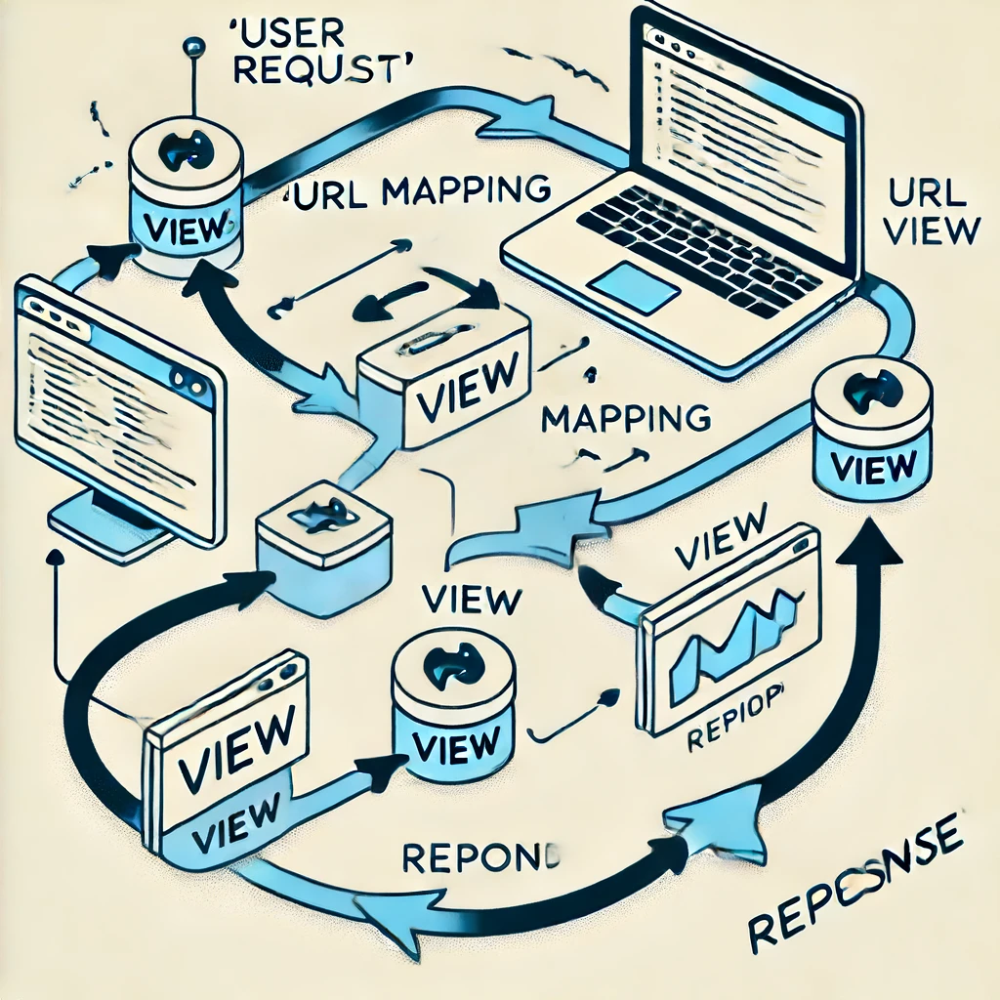

## Django Views and URL Mapping

### What is a View?

In Django, a view is a function or a class that takes a web request and returns a web response. It is responsible for handling the logic of your application and returning the appropriate response based on the request.

### Why is a View Called a Request Handler?

A view is called a request handler because it handles the incoming HTTP request, processes any necessary data (such as querying the database), and then returns an HTTP response. This could be an HTML page, a redirect, a JSON object for an API, etc.

### How Views Work

1. **Request Received:** A user makes a request by accessing a URL in the browser.
2. **URL Routing:** Django's URL routing system maps the requested URL to the appropriate view.
3. **View Processing:** The view processes the request, interacts with the database if needed, and prepares the response.
4. **Response Sent:** The view returns an HTTP response, which Django sends back to the user's browser.

### Graphical Explanation

```
User Request --> URL Mapping --> View --> Response
```



### Creating a View

#### Step 1: Create a View in `store/views.py`
```python
from django.http import HttpResponse

def hello_view(request):
    return HttpResponse("Hello, we are going to learn Django")
```

#### Step 2: Map the View in `store/urls.py`

1. **Create `store/urls.py` if it doesn't exist:**
    ```python
    from django.urls import path
    from .views import hello_view

    urlpatterns = [
        path('hello/', hello_view, name='hello'),
    ]
    ```

2. **Include the `store` URLs in the main `urls.py`:**

    **Modify `project/urls.py`:**
    ```python
    from django.contrib import admin
    from django.urls import path, include

    urlpatterns = [
        path('admin/', admin.site.urls),
        path('store/', include('store.urls')),
    ]
    ```

### How URLs Work

1. **URLconf (URL Configuration):**
    - Django uses a URL configuration (URLconf) to map URL patterns to views.
    - Each URL pattern in `urls.py` points to a specific view that handles the request for that URL.

2. **URL Dispatcher:**
    - When a request comes in, Django's URL dispatcher examines each URL pattern in the `urlpatterns` list from top to bottom and stops at the first pattern that matches the requested URL.

3. **Including Other URLconfs:**
    - You can include other URLconfs to keep your project organized. This is done using the `include()` function.

### Example Explanation

1. **Request Flow:**
    - When a user navigates to `http://yourdomain.com/store/hello/`, Django first looks at the `urlpatterns` in `project/urls.py`.
    - The URL pattern `path('store/', include('store.urls'))` tells Django to include `store/urls.py`.
    - In `store/urls.py`, the pattern `path('hello/', hello_view, name='hello')` matches the URL `/store/hello/` and calls `hello_view`.

2. **View Processing:**
    - The `hello_view` function processes the request and returns an HTTP response with the message "Hello, we are going to learn Django".

3. **Response Sent:**
    - The response is sent back to the user's browser, and they see the message displayed.
