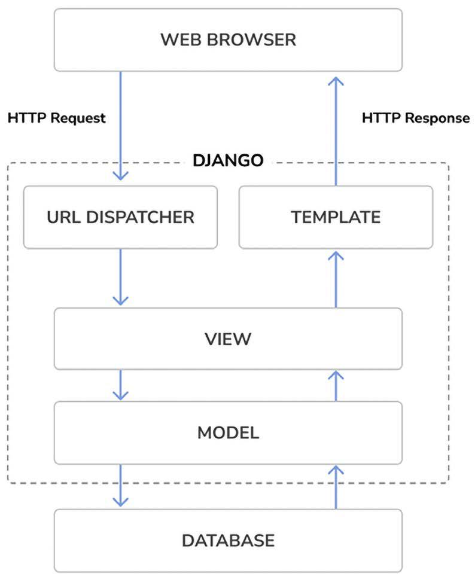

# **Django Overview** 🌐

Django is a framework consisting of a set of components that solve common web development problems. Its components are loosely coupled, meaning they can be managed independently. This separation of responsibilities ensures that:
- The database layer knows nothing about how data is displayed.
- The template system knows nothing about web requests.

### Key Features:
- **DRY Principle**: Django promotes code reusability by following the "Don’t Repeat Yourself" principle.
- **Rapid Development**: It leverages Python’s dynamic capabilities, such as introspection, allowing you to write less code.

Read more about Django’s design philosophies at [Django Design Philosophies](https://docs.djangoproject.com/en/5.0/misc/design-philosophies/).


## Main Framework Components 🔧

Django follows the **MTV (Model-Template-View)** pattern, similar to the well-known **MVC (Model-View-Controller)** pattern. In Django:
- **Model**: Defines the logical data structure and handles data between the database and the view.
- **Template**: The presentation layer that renders everything seen in the browser.
- **View**: Communicates with the model to retrieve data and passes it to the template.

The framework acts as the **controller**, routing requests to the appropriate view based on the URL configuration.


## Django Architecture 🏛️

Django processes requests using the following flow:
1. A web browser requests a page by its URL, which is passed to Django by the web server.
2. Django matches the request URL against its configured URL patterns.
3. The view corresponding to the matched URL pattern is executed.
4. The view interacts with data models to retrieve or manipulate data in the database.
5. The view renders a template (usually HTML) and returns it as an HTTP response.

<div align="center">
    
</div>

Middleware can hook into the request/response cycle for additional processing. Custom middleware will be covered in **upcoming folders**.


## New Features in Django 5 🌟

Django 5 introduces several exciting features while deprecating older functionalities:

### Major Features:
- **Facet Filters in Admin**: Adds facet counts to filters in the admin object list.
- **Simplified Form Templates**: Define field groups with associated templates for streamlined rendering of labels, widgets, help text, and errors.
- **Database-Computed Default Values**: Introduces database-computed defaults.
- **Database-Generated Fields**: Allows creation of database-generated columns using the `GENERATED ALWAYS` SQL syntax.
- **Enhanced Field Choices**: Enables using mappings or callables directly for enumerations.

### Asynchronous Support:
- Adds asynchronous functions to the authentication framework.
- Supports asynchronous signal dispatching.
- Extends asynchronous capabilities to built-in decorators.

### Deprecated Features:
- Drops support for Python 3.8 and 3.9.


## Upgrading to Django 5 🔄

Upgrading from Django 4 to 5 is straightforward, with no drastic changes in the new release. For quick upgrades, use the **django-upgrade** tool:
```bash
django-upgrade <target-version>
```
Find instructions at [django-upgrade](https://github.com/adamchainz/django-upgrade).

For Python syntax upgrades, use **pyupgrade**:
```bash
pyupgrade <file-path>
```
Learn more at [pyupgrade](https://github.com/asottile/pyupgrade).

