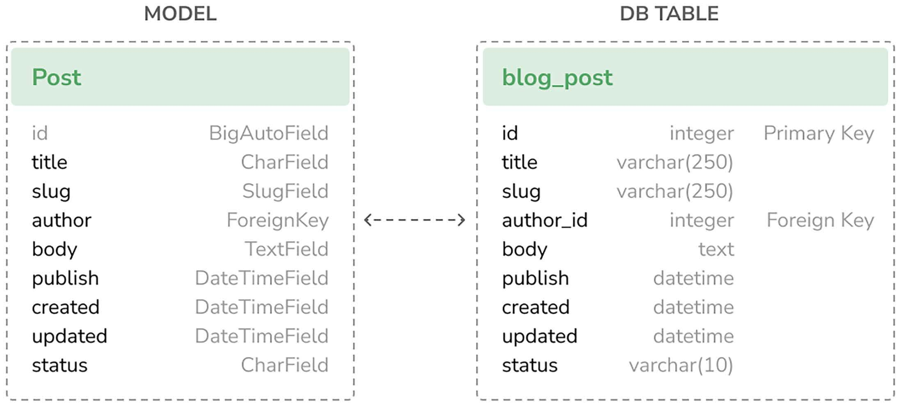
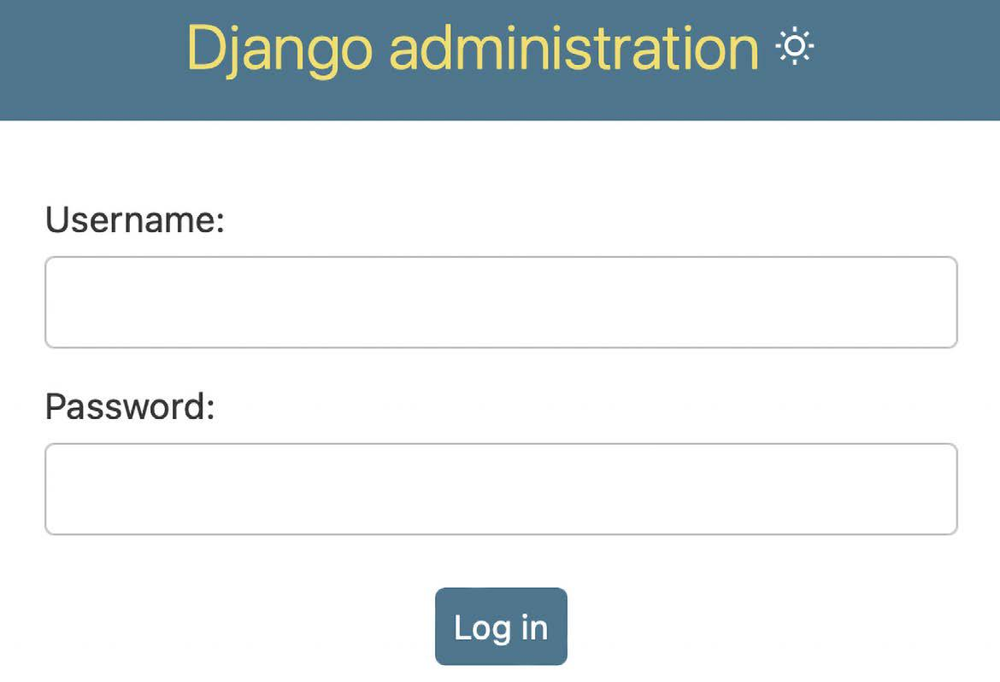
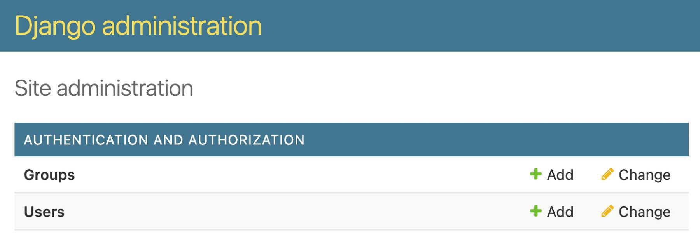

# **Creating Your First Project** 🚀

Your first Django project will be a **blog application**, offering a comprehensive introduction to Django’s capabilities and functionalities. Blogging is an excellent starting point because it covers a wide range of features, including:
- Basic content management 🔄
- Commenting 💬
- Post sharing 🔗
- Search 🔍
- Post recommendations 🔎

The blog project will be developed across the first three chapters of this guide. 📖

## What You'll Build:
- A **list of blog posts** displaying titles, publishing dates, authors, excerpts, and links to the full posts. 🔄
- A **detail view** for each post showing the full content, including the title, publishing date, author, and body. 🖬

<div align="center">
  
</div>

## Setting Up Your Django Project 🔧

To create the initial structure for your Django project, run the following command in your shell:
```bash
django-admin startproject mysite
```

This creates a Django project named `mysite` with the following structure:
```
mysite/
 manage.py
 mysite/
     __init__.py
     asgi.py
     settings.py
     urls.py
     wsgi.py
```

### Project Structure Overview:
- **Outer `mysite/` directory**: The project container. 🏢
- **`manage.py`**: A command-line utility for interacting with your project. (You typically don’t need to edit this file.) 🔀
- **Inner `mysite/` directory**: The Python package containing the following files:
  - **`__init__.py`**: Marks the directory as a Python module. 🌍
  - **`asgi.py`**: Configuration for running the project as an ASGI application with ASGI-compatible web servers. ASGI is the emerging Python standard for asynchronous web servers and applications. 🛠️
  - **`settings.py`**: Contains your project’s settings and default configurations. 🔨
  - **`urls.py`**: Defines URL patterns for your project, mapping each URL to a specific view. 🗺️
  - **`wsgi.py`**: Configuration for running the project as a WSGI application with WSGI-compatible web servers. 🚀

### Important Tips:
- Avoid naming your project after built-in Python or Django modules to prevent conflicts. 🛑

In this chapter, you will:
1. Create the Django project and application for the blog. 🔄
2. Define data models and synchronize them with the database. 📊
3. Set up the Django administration site for managing blog content. 🔧
4. Build views, templates, and URLs. 🔐

<div align="center">

> New Section Starts here

</div>


# **Applying Initial Database Migrations** 📊

Django applications require a database to store data. The **`settings.py`** file contains the database configuration in the `DATABASES` setting. By default, Django uses an SQLite3 database:
- **SQLite** is bundled with Python 3 and ideal for development.
- For production, use databases like PostgreSQL, MySQL, or Oracle.

More details about database configuration can be found [here](https://docs.djangoproject.com/en/5.0/topics/install/#database-installation).

### Key Settings:
- **`INSTALLED_APPS`**: A list in `settings.py` containing default Django applications. This will be discussed further in the **Project Settings** section.
- **Models**: Data models in Django map to database tables. You’ll create custom models in the **Creating the Blog Data Models** section.

### Applying Initial Migrations:
To set up the default tables in the database:
1. Open your shell prompt and navigate to your project directory:
   ```bash
   cd mysite
   ```
2. Run the migration command:
   ```bash
   python manage.py migrate
   ```
3. You’ll see output like:
   ```
   Applying contenttypes.0001_initial... OK
   Applying auth.0001_initial... OK
   ...
   Applying sessions.0001_initial... OK
   ```
   These lines indicate that the default migrations for the applications listed in `INSTALLED_APPS` have been applied.


# Running the Development Server 🚀

Django includes a lightweight web server for development. This server:
- Automatically reloads upon detecting code changes.
- Logs HTTP requests and errors in the console.

### Starting the Server:
1. Run the following command:
   ```bash
   python manage.py runserver
   ```
   Example output:
   ```
   Watching for file changes with StatReloader
   Performing system checks...
   System check identified no issues (0 silenced).
   January 01, 2024 - 10:00:00
   Django version 5.0, using settings 'mysite.settings'
   Starting development server at http://127.0.0.1:8000/
   Quit the server with CONTROL-C.
   ```
<div align="center">
  
</div>


2. Open **http://127.0.0.1:8000/** in your browser to view the default Django welcome page.

3. Each HTTP request will be logged in the console. For example:
   ```
   [01/Jan/2024 10:00:15] "GET / HTTP/1.1" 200 16351
   ```

### Customizing the Server:
You can specify a custom host, port, or settings file:
```bash
python manage.py runserver 127.0.0.1:8001 --settings=mysite.settings
```

### Important Notes:
- The development server is **not suitable for production use**.
- For production, deploy Django using:
  - **WSGI servers**: Apache, Gunicorn, or uWSGI.
  - **ASGI servers**: Daphne or Uvicorn.

Learn more about deploying Django in production [here](https://docs.djangoproject.com/en/5.0/howto/deployment/wsgi/).

With the development server running, you’re now ready to build and test your Django application! 🌐

<div align="center">

> New Section Starts here

</div>


# **Project Settings** ⚙️

Let’s explore the **`settings.py`** file to understand the project configuration. This file includes numerous settings that control Django’s behavior. For a complete list of settings and their default values, visit [Django Settings Documentation](https://docs.djangoproject.com/en/5.0/ref/settings/).

### Key Settings Overview:

#### **`DEBUG`**
- **Type**: Boolean
- **Description**: Enables or disables debug mode.
  - **`True`**: Displays detailed error pages when uncaught exceptions occur.
  - **`False`**: Required in production to avoid exposing sensitive data.
- **Important**: Never deploy a site with **`DEBUG=True`** in production.

#### **`ALLOWED_HOSTS`**
- **Type**: List
- **Description**: Specifies the domains/hosts allowed to serve the Django site.
  - Ignored when **`DEBUG=True`** or during tests.
  - Must include your domain/host in production with **`DEBUG=False`**.

#### **`INSTALLED_APPS`**
- **Type**: List
- **Description**: Specifies the active applications for this site.
- **Default Apps**:
  - **`django.contrib.admin`**: Administration site.
  - **`django.contrib.auth`**: Authentication framework.
  - **`django.contrib.contenttypes`**: Content type handling.
  - **`django.contrib.sessions`**: Session management.
  - **`django.contrib.messages`**: Messaging framework.
  - **`django.contrib.staticfiles`**: Static file management (CSS, JavaScript, images).
- **Tip**: For multiple environments, create separate settings files for each configuration.

#### **`MIDDLEWARE`**
- **Type**: List
- **Description**: Specifies middleware to be executed during requests and responses.

#### **`ROOT_URLCONF`**
- **Type**: String
- **Description**: Indicates the Python module where the root URL patterns are defined.

#### **`DATABASES`**
- **Type**: Dictionary
- **Description**: Contains settings for all databases used in the project.
  - The default configuration uses **SQLite3**.

#### **`LANGUAGE_CODE`**
- **Type**: String
- **Description**: Defines the default language for the site.

#### **`USE_TZ`**
- **Type**: Boolean
- **Description**: Activates or deactivates timezone support.
  - Default is **`True`** for projects created with the **`startproject`** command.


If you don’t understand all these settings right now, don’t worry! You’ll learn more about each of them in the upcoming chapters. 😊

<div align="center">

> New Section Starts here

</div>


# **Projects and Applications** 🗂️

In Django, the terms **project** and **application** are fundamental:
- A **project** refers to a Django installation with its settings.
- An **application** is a collection of models, views, templates, and URLs that provide specific functionalities. Applications are reusable across multiple projects.

Think of a project as your website, which may contain multiple applications like a blog, wiki, or forum.


## Django Project/Application Structure 🔨

Let’s visualize the structure of a Django project and its applications:

- **Project**: A container for settings and configurations.
- **Application**: Modular units providing functionalities, interacting with the framework.

<div align="center">
  
</div>

## Creating an Application 🚀

Let’s create our first Django application for a blog. Run the following command from the project’s root directory:
```bash
python manage.py startapp blog
```

This creates the following structure:
```
blog/
├── __init__.py
├── admin.py
├── apps.py
├── migrations/
│   └── __init__.py
├── models.py
├── tests.py
└── views.py
```

### File Descriptions:
- **`__init__.py`**: Marks the directory as a Python module.
- **`admin.py`**: Used to register models for inclusion in the Django admin site (optional).
- **`apps.py`**: Contains the main configuration for the application.
- **`migrations/`**: Directory for database migrations, tracking changes to models and syncing with the database.
  - **`__init__.py`**: An empty file to treat the directory as a module.
- **`models.py`**: Defines the data models for the application. While all Django applications require this file, it can be left empty.
- **`tests.py`**: Contains tests for your application.
- **`views.py`**: Defines the application logic. Each view processes an HTTP request and returns a response.

<div align="center">

> New Section Starts here

</div>


# **Creating the Blog Data Models** 📝

In Django, a **model** is a Python class that represents a database table. Models are the blueprint for your data and provide a practical API to interact with the database.

Each model:

- Subclasses `django.db.models.Model`.
- Maps to a single database table.
- Has attributes that represent database fields.

When you define a model, Django automatically creates database tables through migrations.


## Creating the Post Model 📂

Let’s define a `Post` model for storing blog posts. Add the following lines to the `models.py` file of the blog application:

```python
from django.db import models

class Post(models.Model):
    title = models.CharField(max_length=250)
    slug = models.SlugField(max_length=250)
    body = models.TextField()

    def __str__(self):
        return self.title
```

### Field Descriptions:

- **`title`**: A `CharField` that translates to a `VARCHAR` column in the database, used for the post title.
- **`slug`**: A `SlugField` that translates to a `VARCHAR` column, containing short, URL-friendly labels (e.g., `django-reinhardt-legend-jazz`). This will be used to create SEO-friendly URLs.
- **`body`**: A `TextField` that translates to a `TEXT` column, used for the main content of the post.

### The `__str__` Method:

The `__str__` method returns a human-readable representation of the object. Django uses this method in places like the administration site to display object names.


## Database Table Correspondence 🔧

<div align="center">
  
</div>

### Primary Key:

By default, Django adds an **auto-incrementing primary key** field to each model. The default type is `BigAutoField`, a 64-bit integer.

- You can explicitly define a primary key by setting `primary_key=True` on a field.

<div align="center">

> New Section Starts here

</div>


# **Adding DateTime Fields** ⏰

Let’s enhance the `Post` model by adding datetime fields. Each blog post will have:
- A publication date and time.
- The creation and last modification timestamps (to be added later).

### Updating the `Post` Model:
Edit the `models.py` file of the blog application to include the new `publish` field:

```python
from django.db import models
from django.utils import timezone

class Post(models.Model):
    title = models.CharField(max_length=250)
    slug = models.SlugField(max_length=250)
    body = models.TextField()
    publish = models.DateTimeField(default=timezone.now)  # datetime field

    def __str__(self):
        return self.title
```

### New Field Details:
- **`publish`**:
  - **Type**: `DateTimeField`
  - **SQL Type**: `DATETIME`
  - **Purpose**: Stores the publication date and time of the post.
  - **Default Value**: Uses `timezone.now`, which provides the current datetime in a timezone-aware format.

### Why Use `timezone.now`?
- `timezone.now` is a timezone-aware alternative to the standard `datetime.now`.
- It ensures consistent datetime values across different time zones.


This addition enables you to manage publication dates for blog posts. In the next steps, we’ll add fields for creation and modification timestamps to further track post history! 🚀

<div align="center">

> New Section Starts here

</div>

# **Another Method for Timezone Defaults** 🕐

Django 5 introduces a new way to define default values for model fields using **database-computed default values**. This allows you to utilize underlying database functions to generate default values.


## Using Database-Computed Default Values:

Here is an example of using the database server’s current date and time as the default for the `publish` field:

```python
from django.db import models
from django.db.models.functions import Now

class Post(models.Model):
    # ...
    publish = models.DateTimeField(db_default=Now())  # change
```

### Key Differences:
- **`db_default`**:
  - Utilizes the database’s native functions to generate default values.
  - In this case, `Now()` calls the database’s `NOW()` function for the current datetime.
- **Comparison to `default`**:
  - `default=timezone.now`: Uses Python’s `timezone.now` to generate the datetime.
  - `db_default=Now()`: Relies on the database’s `NOW()` function.

### Advantages of `db_default`:
- Offloads computation to the database server.
- Ensures consistent defaults across multiple application instances.

### Returning to Python Defaults:
Here’s the previous version of the field, which uses `default=timezone.now`:

```python
class Post(models.Model):
    # ...
    publish = models.DateTimeField(default=timezone.now)  # change
```

Both approaches are valid, and the choice depends on your specific project requirements! 🚀

<div align="center">

> New Section Starts here

</div>


# **Auto_now_add and Auto_now Fields** ⏰

To enhance the `Post` model, we can use `auto_now_add` and `auto_now` fields to automatically track the creation and modification times of posts.

## Updated Post Model:
Edit the `models.py` file of the blog application to include the following:

```python
from django.db import models
from django.utils import timezone

class Post(models.Model):
    title = models.CharField(max_length=250)
    slug = models.SlugField(max_length=250)
    body = models.TextField()
    publish = models.DateTimeField(default=timezone.now)
    created = models.DateTimeField(auto_now_add=True)  # Field added
    updated = models.DateTimeField(auto_now=True)      # Another field added

    def __str__(self):
        return self.title
```

## New Field Details:
- **`created`**: 📅
  - **Type**: `DateTimeField`
  - **Purpose**: Stores the date and time when the post was created.
  - **Attribute**: `auto_now_add=True` automatically sets the field value at the time of object creation.

- **`updated`**: 🔄
  - **Type**: `DateTimeField`
  - **Purpose**: Stores the last date and time when the post was updated.
  - **Attribute**: `auto_now=True` automatically updates the field value every time the object is saved.

## Benefits of Using `auto_now_add` and `auto_now`:
- ✅ Simplifies tracking of creation and modification timestamps.
- ✅ Reduces manual handling of datetime fields during object creation and updates.

Utilizing these fields is a best practice for monitoring changes and ensuring accurate timestamps for your objects! 🚀

<div align="center">

> New Section Starts here

</div>


# **Defining a Default Sort Order** 🔄

Blog posts are typically presented in reverse chronological order, displaying the newest posts first. To achieve this, we define a default ordering for our `Post` model. This default ordering is applied when retrieving objects from the database unless a specific order is indicated in the query.


## Updated Post Model:
Edit the `models.py` file of the blog application as follows:

```python
from django.db import models
from django.utils import timezone

class Post(models.Model):
    title = models.CharField(max_length=250)
    slug = models.SlugField(max_length=250)
    body = models.TextField()
    publish = models.DateTimeField(default=timezone.now)
    created = models.DateTimeField(auto_now_add=True)
    updated = models.DateTimeField(auto_now=True)

    class Meta:  # new class meta
        ordering = ['-publish']  # add default ordering

    def __str__(self):
        return self.title
```


## Explanation:
- **Meta Class**:
  - Provides metadata for the model.
  - **`ordering`** attribute specifies the default sorting order.

- **Default Ordering**:
  - `['-publish']`: Sorts posts by the `publish` field in descending order (newest posts first).
  - This ordering applies by default for database queries unless overridden.

<div align="center">

> New Section Starts here

</div>

# **Adding a Database Index** ✨

Defining a database index for the `publish` field can significantly improve performance for queries that filter or order results by this field. Since the `publish` field is used for default ordering, adding an index will optimize these operations. ✨✨✨

## Updated Post Model: ✨
Edit the `models.py` file of the blog application to include the following:

```python
from django.db import models
from django.utils import timezone

class Post(models.Model):
    title = models.CharField(max_length=250)
    slug = models.SlugField(max_length=250)
    body = models.TextField()
    publish = models.DateTimeField(default=timezone.now)
    created = models.DateTimeField(auto_now_add=True)
    updated = models.DateTimeField(auto_now=True)

    class Meta:
        ordering = ['-publish']
        indexes = [  # index attribute added
            models.Index(fields=['-publish']),
        ]

    def __str__(self):
        return self.title
```

## Explanation: ✨
- **`indexes` Attribute**: 🗂️
  - Added to the `Meta` class of the model.
  - Defines database indexes for one or more fields.

- **Index on `publish` Field**: 🔍
  - Specifies a descending order index (`-publish`).
  - Optimizes queries for filtering or ordering results by the `publish` field. ✨✨✨

## Important Note: ✨
- **MySQL Limitation**: ❗
  - MySQL does not support descending indexes.
  - If MySQL is used, the descending index will be created as a normal (ascending) index.

By adding this index, queries on the `publish` field become faster and more efficient, particularly for large datasets! 🚀

<div align="center">

> New Section Starts here

</div>

# **Activating the Application** 🚀✨

To enable the blog application in the project, we need to activate it so that Django can keep track of the application and create database tables for its models. ✨✨✨

---

## Steps to Activate the Application:
Edit the `settings.py` file and add `blog.apps.BlogConfig` to the `INSTALLED_APPS` setting. It should look like this:

```python
INSTALLED_APPS = [
    'django.contrib.admin',
    'django.contrib.auth',
    'django.contrib.contenttypes',
    'django.contrib.sessions',
    'django.contrib.messages',
    'django.contrib.staticfiles',
    'blog.apps.BlogConfig',  # Add application Blog Name here
]
```

---

## Explanation: ✨✨✨
- **`BlogConfig` Class**:
  - This is the application configuration class for the blog.
  - By adding it to `INSTALLED_APPS`, Django recognizes that the blog application is active for this project.

- **Effect of Activation**:
  - Django can now load the blog application models.
  - Database tables for the blog models will be created during migrations.

By activating the blog application, you integrate it into your Django project and enable its functionalities! 🚀✨✨✨

<div align="center">

> New Section Starts here

</div>

> 
# **Adding a Status Field** 📝✨
A common functionality for blogs is to save posts as drafts until they are ready for publication. To achieve this, we will add a `status` field to our model, allowing us to manage the status of blog posts. ✨✨✨

---

## Updated Post Model:
Edit the `models.py` file of the blog application as follows:

```python
from django.db import models
from django.utils import timezone

class Post(models.Model):
    class Status(models.TextChoices):  # Choices Class
        DRAFT = 'DF', 'Draft'         # Draft
        PUBLISHED = 'PB', 'Published' # Published

    title = models.CharField(max_length=250)
    slug = models.SlugField(max_length=250)
    body = models.TextField()
    publish = models.DateTimeField(default=timezone.now)
    created = models.DateTimeField(auto_now_add=True)
    updated = models.DateTimeField(auto_now=True)
    status = models.CharField(  # New status field
        max_length=2,
        choices=Status.choices,
        default=Status.DRAFT
    )

    class Meta:
        ordering = ['-publish']
        indexes = [
            models.Index(fields=['-publish']),
        ]

    def __str__(self):
        return self.title
```

---

## Detailed Explanation: ✨✨✨

### `Status` Class:
- **Purpose**: Encapsulates the available post statuses, making the code cleaner and more maintainable.
- **Subclassed from**: `models.TextChoices` (Django’s specialized class for defining enumerated choices).
- **Defined Choices**:
  - **DRAFT**: Represents posts that are saved as drafts. Value: `'DF'`, Label: `'Draft'`.
  - **PUBLISHED**: Represents posts that are ready for public view. Value: `'PB'`, Label: `'Published'`.
- **Why Use `TextChoices`?**:
  - Provides human-readable labels (`labels`) and machine-readable values (`values`).
  - Simplifies referencing choices, e.g., `Post.Status.DRAFT`.

### `status` Field:
- **Type**: `CharField`.
- **Purpose**: Stores the post’s current status, e.g., draft or published.
- **Attributes**:
  - **`choices`**: Restricts the field to the defined choices in `Status.choices`.
  - **`default`**: Automatically assigns the `DRAFT` status when creating a new post.

---

## How to Access Enumeration Details: ✨✨✨
Django’s enumeration types provide a convenient way to access choices and their properties:
- **Choices**: Retrieve all available choices with `Post.Status.choices`. Example output:
  ```python
  [('DF', 'Draft'), ('PB', 'Published')]
  ```
- **Names**: Retrieve the names of the choices with `Post.Status.names`. Example output:
  ```python
  ['DRAFT', 'PUBLISHED']
  ```
- **Labels**: Retrieve the human-readable labels with `Post.Status.labels`. Example output:
  ```python
  ['Draft', 'Published']
  ```
- **Values**: Retrieve the machine-readable values with `Post.Status.values`. Example output:
  ```python
  ['DF', 'PB']
  ```

---

## Best Practices: ✨✨✨
- **Encapsulation**: Always define choices inside the model class to keep the codebase clean and centralized.
- **Reusability**: Use `Post.Status.DRAFT` or `Post.Status.PUBLISHED` wherever you need to reference the post statuses in your project.
- **Default Value**: Define a default value (`DRAFT`) to avoid null values for the status field.

<div align="center">

> New Section Starts here

</div>

# **Interacting with Status Choices** 🛠️✨

Django’s enumeration types provide a structured way to interact with choices for fields like `status`. Here’s how you can explore and use the `Status` choices in the Python shell. ✨✨✨

---

## Steps to Interact with Status Choices:

### 1. Open the Python Shell:
Run the following command in your shell prompt:
```bash
python manage.py shell
```

### 2. Import the Post Model:
Type the following line:
```python
>>> from blog.models import Post
```

### 3. View Enum Choices:
To see the value-label pairs of the `Status` choices, type:
```python
>>> Post.Status.choices
```
Output:
```python
[('DF', 'Draft'), ('PB', 'Published')]
```

### 4. View Human-Readable Labels:
To get the human-readable names of the enum members, type:
```python
>>> Post.Status.labels
```
Output:
```python
['Draft', 'Published']
```

### 5. View Enum Values:
To retrieve the values stored in the database for the `status` field, type:
```python
>>> Post.Status.values
```
Output:
```python
['DF', 'PB']
```

### 6. View Enum Names:
To retrieve the names of the choices, type:
```python
>>> Post.Status.names
```
Output:
```python
['DRAFT', 'PUBLISHED']
```

### 7. Access Specific Enum Members:
To access a specific enumeration member, use:
```python
>>> Post.Status.PUBLISHED
```

You can also retrieve its `name` and `value` properties:
```python
>>> Post.Status.PUBLISHED.name
'PUBLISHED'

>>> Post.Status.PUBLISHED.value
'PB'
```

---

## Explanation: ✨✨✨
- **Choices**: Provides value-label pairs for all defined statuses.
- **Labels**: Retrieves human-readable names for each status.
- **Values**: Lists the machine-readable values stored in the database.
- **Names**: Retrieves the names of the enum members for programmatic usage.
- **Member Access**: Allows direct referencing of specific statuses like `Post.Status.PUBLISHED`.

<div align="center">

> New Section Starts here

</div>

# **Adding a Many-to-One Relationship** 🔗✨

Blog posts are always written by an author. To represent this relationship, we will create a **many-to-one relationship** between users and posts. Django’s authentication framework, located in the `django.contrib.auth` package, provides a default `User` model that we will use for this relationship. ✨✨✨

---

## Updated Post Model:
Edit the `models.py` file of the blog application to include the following:

```python
from django.conf import settings  # imported setting
from django.db import models
from django.utils import timezone

class Post(models.Model):
    class Status(models.TextChoices):
        DRAFT = 'DF', 'Draft'
        PUBLISHED = 'PB', 'Published'

    title = models.CharField(max_length=250)
    slug = models.SlugField(max_length=250)
    author = models.ForeignKey(  # adding many to one relationship
        settings.AUTH_USER_MODEL,
        on_delete=models.CASCADE,
        related_name='blog_posts'
    )
    body = models.TextField()
    publish = models.DateTimeField(default=timezone.now)
    created = models.DateTimeField(auto_now_add=True)
    updated = models.DateTimeField(auto_now=True)
    status = models.CharField(
        max_length=2,
        choices=Status.choices,
        default=Status.DRAFT
    )

    class Meta:
        ordering = ['-publish']
        indexes = [
            models.Index(fields=['-publish']),
        ]

    def __str__(self):
        return self.title
```

---

## Explanation: ✨✨✨

### Author Field:
- **Type**: `ForeignKey`
- **Relationship**: Represents a many-to-one relationship between `User` and `Post`.
  - A **user** can write multiple posts.
  - A **post** is written by a single user.
- **Attributes**:
  - **`settings.AUTH_USER_MODEL`**: Refers to the default user model, which is `auth.User` by default.
  - **`on_delete=models.CASCADE`**:
    - Specifies that when a user is deleted, all related posts will also be deleted.
    - This behavior aligns with the SQL `CASCADE` standard.
    - Explore other options for `on_delete` at [Django ForeignKey on_delete](https://docs.djangoproject.com/en/5.0/ref/models/fields/#django.db.models.ForeignKey.on_delete).
  - **`related_name='blog_posts'`**:
    - Allows reverse relationships from `User` to `Post`.
    - Example: Access all posts by a user using `user.blog_posts.all()`.

---

## Why Use ForeignKey? 🛠️
- **Simplifies Relationships**: Automatically creates a foreign key column in the database linking to the primary key of the related model.
- **Efficient Data Access**: Enables seamless querying of related objects.

---

## Resources for Further Learning: 🌐
- **All Field Types**: Explore all available field types at [Django Model Fields](https://docs.djangoproject.com/en/5.0/ref/models/fields/).
- **Reverse Relationships**: Learn more about reverse relationships and `related_name` usage in Django documentation.


<div align="center">

> New Section Starts here

</div>

# **Creating and Applying Migrations** 🔄✨

Now that we have defined the `Post` model, the next step is to create the corresponding database table. Django's migration system helps track model changes and propagate them into the database. ✨✨✨

---

## Overview of Migrations:
- The `migrate` command applies migrations for all applications listed in `INSTALLED_APPS`.
- Migrations synchronize the database with the current models and existing migrations.

---

## Steps to Create and Apply Migrations:

### 1. Create Initial Migration:
Run the following command from your project’s root directory:
```bash
python manage.py makemigrations blog
```

Expected output:
```bash
Migrations for 'blog':
  blog/migrations/0001_initial.py
    - Create model Post
    - Create index blog_post_publish_bb7600_idx on field(s) -publish of model post
```

- Django creates the `0001_initial.py` file inside the `migrations/` directory of the blog application.
- This file contains:
  - SQL statements to create the database table for the `Post` model.
  - The definition of the database index for the `publish` field.

### 2. Inspect SQL for the Migration:
To view the SQL code for the migration without executing it, run:
```bash
python manage.py sqlmigrate blog 0001
```

Example output (for SQLite):
```sql
BEGIN;
--
-- Create model Post
--
CREATE TABLE "blog_post" (
    "id" integer NOT NULL PRIMARY KEY AUTOINCREMENT,
    "title" varchar(250) NOT NULL,
    "slug" varchar(250) NOT NULL,
    "body" text NOT NULL,
    "publish" datetime NOT NULL,
    "created" datetime NOT NULL,
    "updated" datetime NOT NULL,
    "status" varchar(10) NOT NULL,
    "author_id" integer NOT NULL REFERENCES "auth_user" ("id") DEFERRABLE INITIALLY DEFERRED);
--
-- Create blog_post_publish_bb7600_idx on field(s) -publish of model post
--
CREATE INDEX "blog_post_publish_bb7600_idx" ON "blog_post" ("publish" DESC);
CREATE INDEX "blog_post_slug_b95473f2" ON "blog_post" ("slug");
CREATE INDEX "blog_post_author_id_dd7a8485" ON "blog_post" ("author_id");
COMMIT;
```

- Table name: `blog_post` (generated by combining the application name and the lowercase name of the model).
- You can specify a custom table name in the `Meta` class using the `db_table` attribute.

---

## Key Details of the Migration: ✨✨✨
- **Primary Key**:
  - Django creates an auto-incrementing `id` column as the default primary key.
  - You can override this by specifying `primary_key=True` on another field.

- **Indexes Created**:
  1. **Explicit Index**: Descending index on the `publish` field (defined in the `Meta` class).
  2. **SlugField Index**: Automatically created for the `slug` field.
  3. **ForeignKey Index**: Automatically created for the `author_id` field.

- **Auto-Generated ID**:
  - Default `id` column is an integer that increments automatically.
  - Corresponds to the `id` field automatically added to the model.

## **Comparing the Post Model and Database Table** 🔄✨

The **Post model** and its corresponding database table `blog_post` are directly linked. Each model field corresponds to a column in the database table. Figure 1.6 illustrates this relationship:

<div align="center">
  
</div>

---

## Syncing the Database with the New Model:
After defining the `Post` model, the next step is to synchronize the database with it. Follow these steps:

### 1. Apply Existing Migrations:
Run the following command in your shell prompt:
```bash
python manage.py migrate
```

Expected output:
```bash
Applying blog.0001_initial... OK
```

- This applies all migrations for applications listed in `INSTALLED_APPS`, including the `blog` application.
- After applying the migrations, the database reflects the current state of the models.

---

## Making Future Model Changes:
- **Edit Models**:
  - Add, remove, or modify fields in the `models.py` file.
  - Add new models if required.

- **Create a New Migration**:
  Run the following command:
  ```bash
  python manage.py makemigrations
  ```
  - This generates a migration file capturing the changes.

- **Apply the New Migration**:
  Synchronize the database with the updated models by running:
  ```bash
  python manage.py migrate
  ```

<div align="center">

> New Section Starts here

</div>

# **Creating an Administration Site for Models** 🛠️✨

Now that the `Post` model is synchronized with the database, we can set up a simple administration site to manage blog posts. Django comes with a built-in administration interface that dynamically generates a production-ready interface for editing content based on the model metadata. ✨✨✨

---

## Overview of Django Admin:
- Provides an easy-to-use interface for managing database records.
- Configurable to customize how models are displayed and edited.
- Built dynamically by reading model metadata.

The `django.contrib.admin` application is already included in the `INSTALLED_APPS` setting, so no additional setup is required.

---

## Creating a Superuser:
To manage the administration site, you need to create a superuser with the highest permissions.

### Steps:
1. Run the following command:
   ```bash
   python manage.py createsuperuser
   ```

2. Follow the prompts to set up your superuser account:
   ```
   Username (leave blank to use 'admin'): admin
   Email address: admin@admin.com
   Password: ********
   Password (again): ********
   ```

3. You should see the following success message:
   ```
   Superuser created successfully.
   ```

---

## Accessing the Django Administration Site:

### Steps:
1. Start the development server:
   ```bash
   python manage.py runserver
   ```

2. Open the following URL in your browser:
   ```
   http://127.0.0.1:8000/admin/
   ```

3. Log in using the credentials of the superuser you created earlier.

4. After logging in, you will see the administration site index page, which looks similar to the following:

<div align="center">
  

  **Figure 1.7**: The Django administration site login screen.

</div>

---

<div align="center">
  

  **Figure 1.8**: The administration site index page

</div>

---

## Features of the Admin Interface:
- The **Group** and **User** models are part of Django’s authentication framework (`django.contrib.auth`).
- Click on **Users** to view the superuser account you created earlier.

<div align="center">

> New Section Starts here

</div>