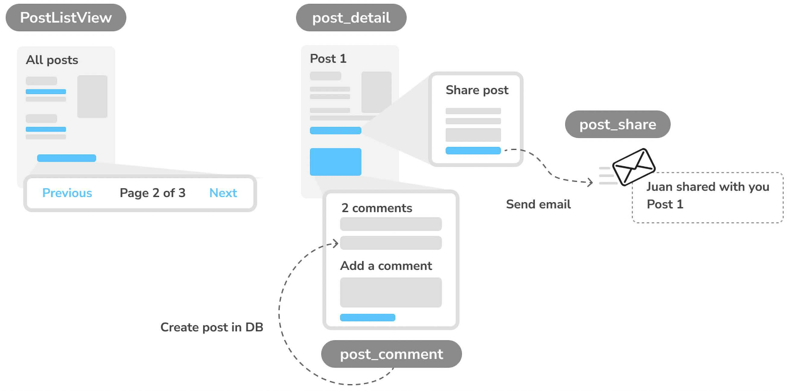

# **Enhancing Your Blog and Adding Social Features** 🚀✨

In the previous section, we built a **simple blog application** using **Django views, templates, and URLs**. Now, we will **enhance** our blog by adding **modern blogging features** that are common in popular blogging platforms. 📖💡

---

## **What You Will Learn in This Section** 🛠️📌

- **Using Canonical URLs for Models** 🌍
- **Creating SEO-Friendly URLs for Posts** 🔍
- **Adding Pagination to the Post List View** 📄
- **Building Class-Based Views** 🏗️
- **Sending Emails with Django** 📧
- **Using Django Forms to Share Posts via Email** 🔗
- **Adding Comments to Posts Using Model-Based Forms** 💬

<div align="center">

# `New Section Functional Overview`

</div>

# **Functional Overview of Enhancements** 🚀✨

In this section we will expand our **Django blog application** by adding **new functionalities** that enhance user interaction and navigation. The **diagram below illustrates** the key features that will be implemented. 📖💡

<div align="center">
  

  **Figure 2.1**: Diagram of functionalities built in this section.

</div>

---

## **What We Will Build in This Chapter** 🛠️📌

### **1️⃣ Pagination for Post List View** 📄
- We will implement **pagination** to split the post list into multiple pages.
- This will improve **performance and user experience** when browsing blog posts.

### **2️⃣ Class-Based Views** 🏗️
- We will refactor the existing **post_list view** into a **class-based view**.
- Class-based views provide a more **structured and reusable** approach compared to function-based views.
- The new view will be called **PostListView**.

### **3️⃣ Sharing Posts via Email** 📧
- We will create the **post_share view** to allow users to **share posts via email**.
- Django’s **forms and SMTP (Simple Mail Transfer Protocol)** will be used to send recommendations.
- Users will be able to send **post links** to their friends directly from the blog.

### **4️⃣ Adding a Comment System** 💬
- We will build a **Comment model** to store comments for blog posts.
- A **post_comment view** will be implemented to allow users to leave comments.
- Django’s **model-based forms** will be used to handle user input.


<div align="center">

# `New Section Using Canonical URLs for Models`

</div>

# **Using Canonical URLs for Models** 🌍✨

A website may have **multiple pages displaying the same content**. In our blog application, each post's **initial content** is displayed on both the **post list page** and the **post detail page**. To **identify a preferred URL** for a resource, we use **canonical URLs**.

A **canonical URL** is the **main representative URL** for specific content. Even though posts might be displayed in different sections of the site, there should be **one primary URL** that acts as the **definitive** reference for that post. 🏷️

---

## **Why Canonical URLs Matter?** 🔍
- Prevents **duplicate content issues** in search engines.
- Ensures **better SEO ranking** by defining a single, authoritative URL.
- Helps users and crawlers **navigate efficiently**.

---

## **Implementing Canonical URLs in Django** 🛠️
Django allows us to implement the **`get_absolute_url()`** method in our models. This method **returns the canonical URL** for an object, ensuring that each post has a single, primary URL reference.

We will **build the canonical URL** using the `post_detail` URL pattern of the application. Django provides **URL resolver functions** to dynamically generate URLs. For this, we use the **`reverse()`** function from `django.urls`.

### **Editing `models.py` to Add Canonical URLs** 📝
Modify the `models.py` file of the blog application to:
✅ **Import the `reverse()` function**.
✅ **Add the `get_absolute_url()` method to the `Post` model**.

```python
from django.conf import settings
from django.db import models
from django.urls import reverse  # ✅ Import reverse
from django.utils import timezone

class PublishedManager(models.Manager):
    def get_queryset(self):
        return super().get_queryset().filter(status=Post.Status.PUBLISHED)

class Post(models.Model):
    # ... (existing fields)
    
    class Meta:
        ordering = ['-publish']
        indexes = [
            models.Index(fields=['-publish']),
        ]
    
    def __str__(self):
        return self.title

    def get_absolute_url(self):  # ✅ Define the canonical URL
        return reverse(
            'blog:post_detail',  # ✅ Uses post_detail from blog namespace
            args=[self.id]  # ✅ Passes the post ID as an argument
        )
```

---

## **Understanding the `reverse()` Function 🔄**
Django’s `reverse()` function **dynamically generates URLs** based on the **URL name** defined in `urls.py`. 

📌 **Key Points:**
- **`'blog:post_detail'`** refers to the `post_detail` URL inside the **blog namespace**.
- The **post ID (`self.id`)** is passed as an argument using `args=[self.id]`.
- This ensures that **every post has a unique, SEO-friendly URL**.

📌 **Example Usage:**
```python
post = Post.objects.get(id=5)
print(post.get_absolute_url())  # Output: /blog/5/
```

---

## **Where is `post_detail` Defined? 📌**
The `post_detail` URL is defined in `urls.py`:
```python
urlpatterns = [
    path('<int:id>/', views.post_detail, name='post_detail'),
]
```

### **How URLs Are Built** 🏗️
| URL Namespace | URL Name | Example Output |
|--------------|---------|---------------|
| `blog`       | `post_detail` | `/blog/5/` |

Since the **blog namespace** is defined when including `blog.urls` in the project’s `urls.py`, the resulting URL reference **can be used globally across the project**.

<div align="center">

# `New Section Updating Post Detail URLs`

</div>

# **Updating Post Detail URLs in Templates** 🌐✨

Now that we have implemented **canonical URLs** using the `get_absolute_url()` method, we need to **update our templates** to use this method instead of hardcoding the URL with ``. 🎯

This ensures that our blog posts always reference the **canonical URL dynamically**, making our project **more maintainable and structured**. 🏗️

---

## **Updating the Template** 📝

### **Modify `blog/post/list.html`**
Edit the `blog/post/list.html` file and replace the existing post detail link:

❌ **Old Code:**
```html
<a href="">
```
✅ **New Code (Using `get_absolute_url()`):**
```html
<a href="{{ post.get_absolute_url }}">  added here 
```

### **Updated `blog/post/list.html` File:**
```html

My Blog

 <h1>My Blog</h1>
 
 <h2>
 <a href="{{ post.get_absolute_url }}">  absolute url 
 {{ post.title }}
 </a>
 </h2>
 <p class="date">
 Published {{ post.publish }} by {{ post.author }}
 </p>
 {{ post.body|truncatewords:30|linebreaks }}
 

```

---

## **Testing the Changes 🛠️**
To ensure everything works correctly, **start the Django development server** by running the following command:

```bash
python manage.py runserver
```

### **Verify in the Browser** 🖥️
- Open your web browser and go to: 
  **[http://127.0.0.1:8000/blog/](http://127.0.0.1:8000/blog/)**
- Click on any **blog post title**.
- The links should now be **correctly built using `get_absolute_url()`**.


<div align="center">

# `New Section Starts here`

</div>


