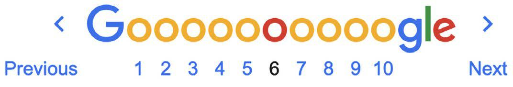
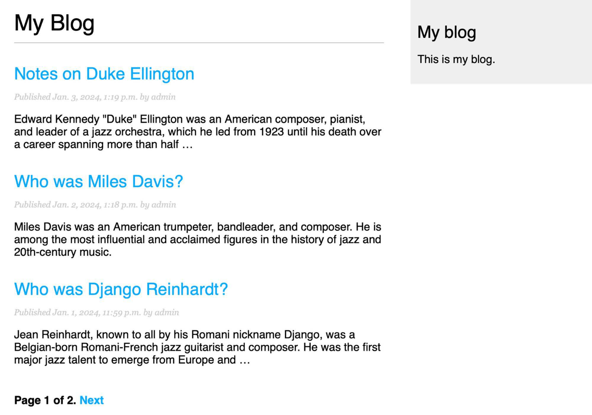
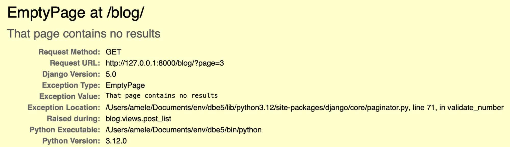
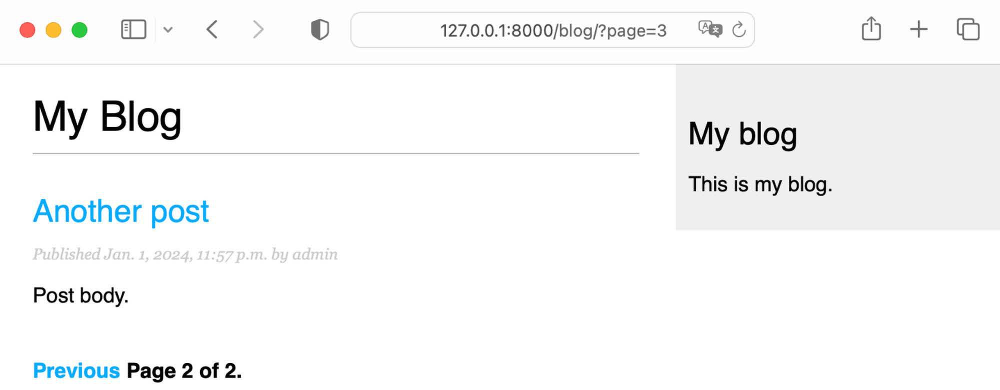
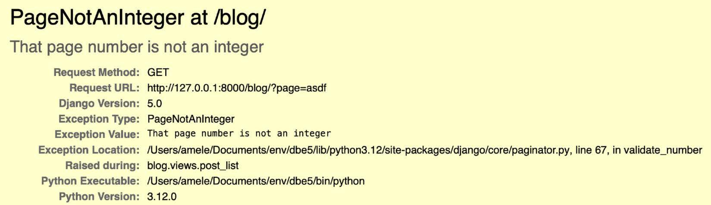
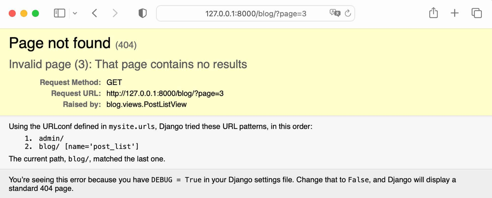
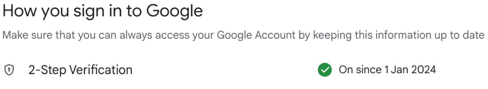
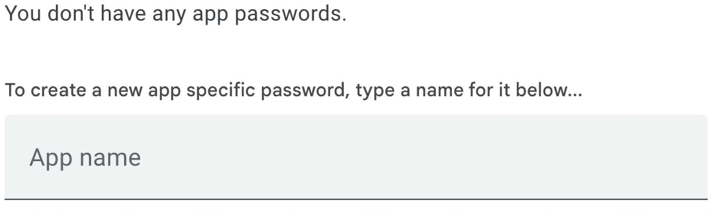
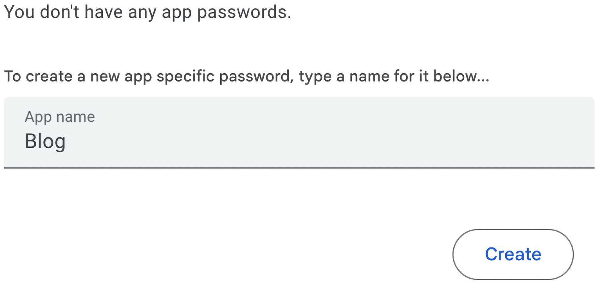
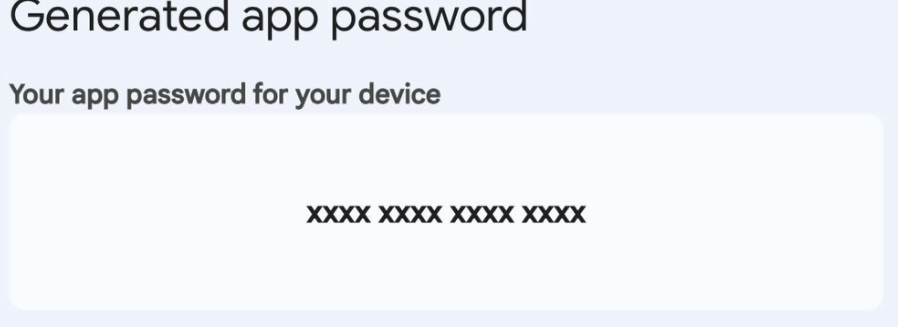

# **Enhancing Your Blog and Adding Social Features** 🚀✨

In the previous section, we built a **simple blog application** using **Django views, templates, and URLs**. Now, we will **enhance** our blog by adding **modern blogging features** that are common in popular blogging platforms. 📖💡

---

## **What You Will Learn in This Section** 🛠️📌

- **Using Canonical URLs for Models** 🌍
- **Creating SEO-Friendly URLs for Posts** 🔍
- **Adding Pagination to the Post List View** 📄
- **Building Class-Based Views** 🏗️
- **Sending Emails with Django** 📧
- **Using Django Forms to Share Posts via Email** 🔗
- **Adding Comments to Posts Using Model-Based Forms** 💬

<div align="center">

# `New Section Functional Overview`

</div>

# **Functional Overview of Enhancements** 🚀✨

In this section we will expand our **Django blog application** by adding **new functionalities** that enhance user interaction and navigation. The **diagram below illustrates** the key features that will be implemented. 📖💡

<div align="center">
  

  **Figure 2.1**: Diagram of functionalities built in this section.

</div>

---

## **What We Will Build in This Chapter** 🛠️📌

### **1️⃣ Pagination for Post List View** 📄
- We will implement **pagination** to split the post list into multiple pages.
- This will improve **performance and user experience** when browsing blog posts.

### **2️⃣ Class-Based Views** 🏗️
- We will refactor the existing **post_list view** into a **class-based view**.
- Class-based views provide a more **structured and reusable** approach compared to function-based views.
- The new view will be called **PostListView**.

### **3️⃣ Sharing Posts via Email** 📧
- We will create the **post_share view** to allow users to **share posts via email**.
- Django’s **forms and SMTP (Simple Mail Transfer Protocol)** will be used to send recommendations.
- Users will be able to send **post links** to their friends directly from the blog.

### **4️⃣ Adding a Comment System** 💬
- We will build a **Comment model** to store comments for blog posts.
- A **post_comment view** will be implemented to allow users to leave comments.
- Django’s **model-based forms** will be used to handle user input.


<div align="center">

# `New Section Using Canonical URLs for Models`

</div>

# **Using Canonical URLs for Models** 🌍✨

A website may have **multiple pages displaying the same content**. In our blog application, each post's **initial content** is displayed on both the **post list page** and the **post detail page**. To **identify a preferred URL** for a resource, we use **canonical URLs**.

A **canonical URL** is the **main representative URL** for specific content. Even though posts might be displayed in different sections of the site, there should be **one primary URL** that acts as the **definitive** reference for that post. 🏷️

---

## **Why Canonical URLs Matter?** 🔍
- Prevents **duplicate content issues** in search engines.
- Ensures **better SEO ranking** by defining a single, authoritative URL.
- Helps users and crawlers **navigate efficiently**.

---

## **Implementing Canonical URLs in Django** 🛠️
Django allows us to implement the **`get_absolute_url()`** method in our models. This method **returns the canonical URL** for an object, ensuring that each post has a single, primary URL reference.

We will **build the canonical URL** using the `post_detail` URL pattern of the application. Django provides **URL resolver functions** to dynamically generate URLs. For this, we use the **`reverse()`** function from `django.urls`.

### **Editing `models.py` to Add Canonical URLs** 📝
Modify the `models.py` file of the blog application to:
✅ **Import the `reverse()` function**.
✅ **Add the `get_absolute_url()` method to the `Post` model**.

```python
from django.conf import settings
from django.db import models
from django.urls import reverse  # ✅ Import reverse
from django.utils import timezone

class PublishedManager(models.Manager):
    def get_queryset(self):
        return super().get_queryset().filter(status=Post.Status.PUBLISHED)

class Post(models.Model):
    # ... (existing fields)
    
    class Meta:
        ordering = ['-publish']
        indexes = [
            models.Index(fields=['-publish']),
        ]
    
    def __str__(self):
        return self.title

    def get_absolute_url(self):  # ✅ Define the canonical URL
        return reverse(
            'blog:post_detail',  # ✅ Uses post_detail from blog namespace
            args=[self.id]  # ✅ Passes the post ID as an argument
        )
```

---

## **Understanding the `reverse()` Function 🔄**
Django’s `reverse()` function **dynamically generates URLs** based on the **URL name** defined in `urls.py`. 

📌 **Key Points:**
- **`'blog:post_detail'`** refers to the `post_detail` URL inside the **blog namespace**.
- The **post ID (`self.id`)** is passed as an argument using `args=[self.id]`.
- This ensures that **every post has a unique, SEO-friendly URL**.

📌 **Example Usage:**
```python
post = Post.objects.get(id=5)
print(post.get_absolute_url())  # Output: /blog/5/
```

---

## **Where is `post_detail` Defined? 📌**
The `post_detail` URL is defined in `urls.py`:
```python
urlpatterns = [
    path('<int:id>/', views.post_detail, name='post_detail'),
]
```

### **How URLs Are Built** 🏗️
| URL Namespace | URL Name | Example Output |
|--------------|---------|---------------|
| `blog`       | `post_detail` | `/blog/5/` |

Since the **blog namespace** is defined when including `blog.urls` in the project’s `urls.py`, the resulting URL reference **can be used globally across the project**.

<div align="center">

# `New Section Updating Post Detail URLs`

</div>

# **Updating Post Detail URLs in Templates** 🌐✨

Now that we have implemented **canonical URLs** using the `get_absolute_url()` method, we need to **update our templates** to use this method instead of hardcoding the URL with ``. 🎯

This ensures that our blog posts always reference the **canonical URL dynamically**, making our project **more maintainable and structured**. 🏗️

---

## **Updating the Template** 📝

### **Modify `blog/post/list.html`**
Edit the `blog/post/list.html` file and replace the existing post detail link:

❌ **Old Code:**
```html
<a href="">
```
✅ **New Code (Using `get_absolute_url()`):**
```html
<a href="{{ post.get_absolute_url }}">  added here 
```

### **Updated `blog/post/list.html` File:**
```html

My Blog

 <h1>My Blog</h1>
 
 <h2>
 <a href="{{ post.get_absolute_url }}">  absolute url 
 {{ post.title }}
 </a>
 </h2>
 <p class="date">
 Published {{ post.publish }} by {{ post.author }}
 </p>
 {{ post.body|truncatewords:30|linebreaks }}
 

```

---

## **Testing the Changes 🛠️**
To ensure everything works correctly, **start the Django development server** by running the following command:

```bash
python manage.py runserver
```

### **Verify in the Browser** 🖥️
- Open your web browser and go to: 
  **[http://127.0.0.1:8000/blog/](http://127.0.0.1:8000/blog/)**
- Click on any **blog post title**.
- The links should now be **correctly built using `get_absolute_url()`**.


<div align="center">

# `New Section Creating SEO-Friendly URLs`

</div>


# **Creating SEO-Friendly URLs for Posts** 🔍✨

The current **canonical URL** for a blog post detail view looks like:

```plaintext
/blog/1/
```

This format is **not SEO-friendly** because it lacks meaningful keywords that search engines use for indexing. To **improve search engine rankings**, we will modify the **URL structure** to include the **publish date** and **slug**.

For example, a new **SEO-friendly URL** will look like:

```plaintext
/blog/2025/1/1/python-deep-dive/
```

This new format will make **URLs more informative** and **search engine-friendly**, as they include both the **title** and **date of publication**.

---

## **Ensuring Unique Slugs for Each Post** 🔄

To **retrieve posts** using a combination of **publish date** and **slug**, we need to ensure that **no post** in the database has the **same slug and publish date** as another post.

We will enforce this **uniqueness constraint** by modifying the `Post` model to ensure that slugs are unique for a given publication date.

### **Editing ********`models.py`******** to Enforce Unique Slugs** 🛠️

Modify the `Post` model in `models.py` to include the **`unique_for_date`** constraint for the `slug` field.

```python
class Post(models.Model):
    # ... (existing fields)
    
    slug = models.SlugField(
        max_length=250,
        unique_for_date='publish'  # ✅ Ensure slugs are unique per publication date
    )
    
    # ... (other fields and methods)
```

### **What Does ********`unique_for_date`******** Do? 🤔**

✅ Ensures that **no two posts** can have the **same slug on the same publish date**.
✅ Prevents **duplicate posts** in the database.
✅ Works at the **Django model level**, not at the **database level**.
✅ Applies uniqueness check **only to the date**, ignoring the time portion of `DateTimeField`.

Now, Django will **automatically prevent duplicate slugs** for posts published on the same date. 📆✨

---

## **Applying Model Changes with Migrations** 📜

Since we have **modified the model**, we need to **create migrations**. However, note that `unique_for_date` is **not enforced at the database level**, so no actual database modification is needed.

### **Step 1: Create the Migration** ⚙️

Run the following command in the shell prompt:

```bash
python manage.py makemigrations blog
```

**Expected Output:**

```plaintext
Migrations for 'blog':
  blog/migrations/0002_alter_post_slug.py
  - Alter field slug on post
```

Django has generated the **0002\_alter\_post\_slug.py** file inside the **migrations directory**.

### **Step 2: Apply the Migration** ✅

To apply the migration, run:

```bash
python manage.py migrate
```

**Expected Output:**

```plaintext
Applying blog.0002_alter_post_slug... OK
```

Even though **no actual database change occurs**, Django **tracks model changes** through migrations to ensure consistency.

<div align="center">

# `New Section SEO-Friendly URLs`

</div>

# **Modifying the URL Patterns for SEO-Friendly URLs** 🌍✨

To make our **blog post URLs SEO-friendly**, we need to modify the **post detail URL pattern** so that it includes **the publication date and slug** instead of just the post ID. This will make our URLs **more readable, structured, and optimized for search engines**. 🔍📈

For example, instead of:

```plaintext
/blog/1/
```

We will now have:

```plaintext
/blog/2024/1/27/python-deep-dive/
```

This will help search engines and users understand the **context** of the post just by looking at the URL. 🚀

---

## **Updating the URL Patterns** 🛠️

We need to **modify** the `urls.py` file inside the `blog` application.

### **Old Code:** ❌

```python
path('<int:id>/', views.post_detail, name='post_detail'),
```

### **New Code (SEO-Friendly URLs):** ✅

```python
path(
    '<int:year>/<int:month>/<int:day>/<slug:post>/',  # ✅ Updated URL pattern
    views.post_detail,
    name='post_detail'
),
```

### **Updated ****************`urls.py`**************** File:** 📌

```python
from django.urls import path
from . import views

app_name = 'blog'

urlpatterns = [
    # Post views
    path('', views.post_list, name='post_list'),
    path(
        '<int:year>/<int:month>/<int:day>/<slug:post>/',  # ✅ New SEO-friendly pattern
        views.post_detail,
        name='post_detail'
    ),
]
```

---

## **Understanding the New URL Pattern** 📖

The new **post detail URL pattern** takes the following parameters:

- **`year`** 🗓️ → Requires an **integer** (`int`) to specify the **year** of publication.
- **`month`** 📆 → Requires an **integer** (`int`) to specify the **month** of publication.
- **`day`** 🕒 → Requires an **integer** (`int`) to specify the **day** of publication.
- **`post`** 🔖 → Requires a **slug** (`slug`) which contains only **letters, numbers, underscores, or hyphens**.

### **Django Path Converters Used** 🔄

| Path Converter | Description                                        |
| -------------- | -------------------------------------------------- |
| `int`          | Matches an integer value (e.g., `2025`, `1`, `27`) |
| `slug`         | Matches a slug (e.g., `python-deep-dive`)  |

To learn more about **path converters in Django**, visit:
🔗 [Django Path Converters Documentation](https://docs.djangoproject.com/en/5.0/topics/http/urls/#path-converters)

<div align="center">

# `New Section post_detail View to Match SEO-Friendly URLs`

</div>

# **Modifying the `post_detail` View to Match SEO-Friendly URLs** 🛠️✨

To ensure that our **post_detail view** matches the **new SEO-friendly URL structure**, we need to update its parameters. The view should now accept **year, month, day, and post (slug)** to correctly retrieve the **corresponding blog post**. 📆🔍

---

## **Updating the `post_detail` View** 📝
Edit the `views.py` file inside the **blog application** and update the `post_detail` view as follows:

### **Old Code (Before SEO-Friendly URLs)** ❌
```python
def post_detail(request, id):
    post = get_object_or_404(Post, id=id, status=Post.Status.PUBLISHED)
    return render(request, 'blog/post/detail.html', {'post': post})
```

### **New Code (After Updating to SEO-Friendly URLs)** ✅
```python
from django.shortcuts import get_object_or_404, render
from .models import Post

def post_detail(request, year, month, day, post):  # ✅ Updated parameters
    post = get_object_or_404(
        Post,
        status=Post.Status.PUBLISHED,
        slug=post,  # ✅ Match post slug
        publish__year=year,  # ✅ Match year of publication
        publish__month=month,  # ✅ Match month of publication
        publish__day=day  # ✅ Match day of publication
    )
    return render(
        request,
        'blog/post/detail.html',
        {'post': post}
    )
```

---

## **Understanding the Changes in `post_detail`** 🧐

- **✅ Added `year, month, day, and post` as parameters**: 
  - These match the **new URL structure** to fetch the correct post.
- **✅ Used `slug=post`**: 
  - Instead of fetching by `id`, we now use the **slug field**.
- **✅ Filtered posts by `publish__year`, `publish__month`, and `publish__day`**: 
  - Ensures that posts are retrieved based on their **exact publication date**.
- **✅ Only retrieves posts with `status=Post.Status.PUBLISHED`**: 
  - This prevents fetching drafts or unpublished posts.

---

## **How `get_object_or_404` Works in This Context** 🔍🛠️

The function `get_object_or_404()` is a **Django shortcut** that attempts to retrieve an object from the database using the given parameters. If the object does **not** exist, Django **automatically raises a 404 error** (`Http404` exception), returning an HTTP 404 response.

### **Breaking Down the Parameters Inside `get_object_or_404()`** 🧐
```python
post = get_object_or_404(
    Post,  # ✅ Model to query
    status=Post.Status.PUBLISHED,  # ✅ Filter posts that are published only
    slug=post,  # ✅ Match the post's slug
    publish__year=year,  # ✅ Match the exact year of publication
    publish__month=month,  # ✅ Match the exact month of publication
    publish__day=day  # ✅ Match the exact day of publication
)
```
### **How It Works Step by Step** 📌
1️⃣ **Queries the `Post` model** to fetch a post matching the given filters.
2️⃣ **Filters by `status=Post.Status.PUBLISHED`** to ensure only published posts are retrieved.
3️⃣ **Filters by `slug=post`** to match the requested slug.
4️⃣ **Filters by `publish__year`, `publish__month`, and `publish__day`**:
   - Ensures the retrieved post has the exact **date of publication** as specified in the URL.
5️⃣ **If a post exists that meets all these conditions**, it is returned.
6️⃣ **If no post is found**, Django **automatically raises an HTTP 404 error** (instead of returning `None` or causing an error later in the view).

### **Why Use `get_object_or_404()` Instead of `get()`?** 🤔
✅ **Avoids writing manual error handling**
✅ **Automatically raises a proper 404 response**
✅ **Reduces unnecessary try/except blocks**
✅ **Enhances user experience by properly handling missing content**

---

## **How Does This Work? 🤔**
1️⃣ **User Requests a Blog Post**
   - Example URL: `/blog/2024/1/1/who-was-django-reinhardt/`

2️⃣ **Django Matches the URL to `post_detail` View**
   - Extracts **year, month, day, and slug** from the URL.

3️⃣ **Django Fetches the Post from the Database**
   - Looks for a **published post** that matches the given **date and slug**.

4️⃣ **Renders the `blog/post/detail.html` Template**
   - Displays the requested **blog post details**.


<div align="center">

# `New Section Modifying the Canonical URL`

</div>

# **Modifying the Canonical URL for Posts** 🌍✨
To fully align with the new **SEO-friendly URL structure**, we need to update the `get_absolute_url()` method in our **Post model**. This ensures that the canonical URL of each post now includes the **publication date** (year, month, and day) along with the **slug**. 📆🔗

---

## **Updating the `get_absolute_url()` Method** 📝
Edit the `models.py` file inside the **blog application** and modify the `get_absolute_url()` method as follows:

### **Old Code (Before SEO-Friendly URLs)** ❌
```python
def get_absolute_url(self):
    return reverse('blog:post_detail', args=[self.id])
```

### **New Code (After Updating to SEO-Friendly URLs)** ✅
```python
from django.urls import reverse

class Post(models.Model):
    # ... (other model fields)
    
    def get_absolute_url(self):  # ✅ Updated canonical URL method
        return reverse(
            'blog:post_detail',
            args=[
                self.publish.year,  # ✅ Year of publication
                self.publish.month,  # ✅ Month of publication
                self.publish.day,  # ✅ Day of publication
                self.slug  # ✅ Unique slug for the post
            ]
        )
```

---

## **Understanding the Changes in `get_absolute_url()`** 🧐

- **✅ Uses `self.publish.year`, `self.publish.month`, and `self.publish.day`**: 
  - Ensures URLs include the **exact publication date**.
- **✅ Uses `self.slug`**:
  - Replaces the use of `id` with a **user-friendly slug**.
- **✅ Generates URLs that match the new `post_detail` URL pattern**:
  - This ensures that **all references** to post URLs are dynamically built.

---

## **Starting the Development Server & Testing the Changes** 🚀
After modifying the `models.py` file, start the **Django development server** by running:
```sh
python manage.py runserver
```

Now, open your browser and visit:
```sh
http://127.0.0.1:8000/blog/
```
Click on any **post title**, and it should direct you to a detail page with the new **SEO-friendly URL format**. 🎯


<div align="center">
  

  **Figure 2.2**:  The page for the post’s detail view

</div>

## **Expected URL Format After Changes** 🔍
The URL structure for posts should now look like:
```sh
/blog/2024/1/1/who-was-django-reinhardt/
```
Instead of using `id`, we are now using **publish date + slug** to generate **SEO-friendly, human-readable URLs**. This is beneficial for **search engine optimization (SEO) and user readability**.

<div align="center">

# `New Section Adding Pagination`

</div>

# **Implementing Pagination in Django**📄✨

When your blog accumulates **a large number of posts**, displaying all of them on **a single page** can be inefficient. Instead, it's best to **split** the post list across multiple pages with **pagination**. This approach significantly enhances **performance** and **user experience**. 🚀

---

## **Understanding Pagination 📌**
Pagination is a technique that divides **large datasets** into smaller chunks, displaying only a **subset of items per page**. This allows users to navigate through multiple pages instead of loading all content at once.

### **Example: Pagination in Search Engines 🔍**
A well-known example of pagination is **Google Search**, where search results are divided into multiple pages. Users can navigate between pages using **next/previous buttons** or by selecting a specific page number.

<div align="center">
  

  **Figure 2.3**:  Google pagination links for search result pages

</div>

---

## **Django’s Built-in Pagination Class 🛠️**
Django provides a **built-in pagination system** that makes implementing pagination seamless. With Django’s pagination class, you can:
- ✅ Define the **number of posts** to display per page.
- ✅ Retrieve the **correct posts** for each page request.
- ✅ Generate **pagination controls** for easy navigation.

---

## **Why Use Pagination? 🤔**
- 🚀 **Performance Optimization:** Loading only a subset of posts reduces **page load times**.
- 🎯 **User-Friendly Navigation:** Users can **easily switch pages** instead of endless scrolling.
- 🔍 **Better SEO:** Search engines can **index** pages efficiently.

<div align="center">

# `New Section Pagination to the Post List View`

</div>

# **Adding Pagination to the Post List View** 📄🔄✨

---

## **Updating the ****`post_list`**** View for Pagination** 🛠️

To implement pagination, we will use Django's built-in `Paginator` class to divide posts into multiple pages.

### **Edit the ****`views.py`**** file** 📄

Modify the `post_list` view as follows:

```python
from django.core.paginator import Paginator  # ✅ Import Paginator class
from django.shortcuts import get_object_or_404, render
from .models import Post

def post_list(request):
    post_list = Post.published.all()
    
    # ✅ Pagination with 3 posts per page
    paginator = Paginator(post_list, 3)
    
    # ✅ Get page number from request, default to 1 if not provided
    page_number = request.GET.get('page', 1)
    
    # ✅ Retrieve the corresponding page of posts
    posts = paginator.page(page_number)
    
    return render(
        request,
        'blog/post/list.html',
        {'posts': posts}
    )
```

---

## **Understanding the Changes** 🔍📌

### **1️⃣ Instantiating the ****`Paginator`**** Class**

```python
paginator = Paginator(post_list, 3)
```

- We **instantiate the ****`Paginator`**** class** with the full list of published posts.
- The second argument (`3`) specifies the **number of posts per page**.

### **2️⃣ Retrieving the Requested Page Number**

```python
page_number = request.GET.get('page', 1)
```

- We use `request.GET.get('page', 1)` to retrieve the **current page number** from the URL query parameters.
- If no page number is provided, it defaults to **1**, ensuring that the **first page is loaded by default**.

### **3️⃣ Fetching the Posts for the Current Page**

```python
posts = paginator.page(page_number)
```

- We call `paginator.page(page_number)` to **retrieve only the posts belonging to the requested page**.
- This method returns a **`Page`**** object**, containing paginated data.

### **4️⃣ Passing Paginated Posts to the Template**

```python
return render(request, 'blog/post/list.html', {'posts': posts})
```

- The `posts` object (which contains only a subset of posts for the current page) is passed to the template.

---

## **How Does This Work? 🤔**

🔹 When a user visits `/blog/`, the first three posts are displayed.
🔹 When they visit `/blog/?page=2`, the next three posts are displayed.
🔹 If they enter an invalid page number, Django raises an error


<div align="center">

# `New Section Pagination Template`

</div>

#  **Creating a Pagination Template** 📌

## 📖 Introduction

We will create a **pagination template** that can be reused for any object pagination on our website. 📝

---

## 📂 Setting Up the Pagination Template

1. Navigate to the **templates/** directory of your project.
2. Create a new file and name it **pagination.html**.
3. Add the following **HTML** code to the file:

```html
<div class="pagination">
    <span class="step-links">
        
            <a href="?page={{ page.previous_page_number }}">Previous</a>
        
        <span class="current">
            Page {{ page.number }} of {{ page.paginator.num_pages }}.
        </span>
        
            <a href="?page={{ page.next_page_number }}">Next</a>
        
    </span>
</div>
```

### 📌 Explanation of the Code

✅ **`<div class="pagination">`**: A wrapper `div` to contain the pagination links.</br>
✅ **`<span class="step-links">`**: A `span` element that holds the navigation links.</br>
✅ **``**: Checks if there is a previous page and, if so, displays a **Previous** button.</br>
✅ **`<a href="?page={{ page.previous_page_number }}">Previous</a>`**: Creates a hyperlink to navigate to the previous page.</br>
✅ **`<span class="current"> Page {{ page.number }} of {{ page.paginator.num_pages }}. </span>`**: Displays the **current page number** and the **total number of pages**.</br>
✅ **``**: Checks if there is a next page and, if so, displays a **Next** button.</br>
✅ **`<a href="?page={{ page.next_page_number }}">Next</a>`**: Creates a hyperlink to navigate to the next page.</br>

This **generic pagination template** is designed to work with a **Page object** in the context and dynamically render navigation links based on the current page state. 🛠️

---

## 🏗️ Integrating Pagination into the Blog List Template

To include the pagination template in our **blog post list page**, follow these steps:

1. Open the **blog/post/list.html** template.
2. Include the **pagination.html** file at the bottom of the ``.

Modify the file as follows:

```html

My Blog

    <h1>My Blog</h1>
    
        <h2>
            <a href="{{ post.get_absolute_url }}">
                {{ post.title }}
            </a>
        </h2>
        <p class="date">
            Published {{ post.publish }} by {{ post.author }}
        </p>
        {{ post.body|truncatewords:30|linebreaks }}
    

      ✅  include here 

```

### 📌 Explanation of the Code

✅ **``**: Inherits the base template.</br>
✅ **`My Blog`**: Sets the page title.</br>
✅ **Loop through posts** using `` to display each blog post.</br>
✅ **``**: Includes the **pagination.html** file and passes the `posts` Page object as `page`.</br>

### 🔄 How Pagination Works

- The `` tag **loads the pagination template** and renders it **within the current template context**.
- We use `` to pass the **posts** variable (which is a Page object) to the pagination template.
- This method makes the **pagination template reusable** for any type of object. 🔄

---

## 🚀 Running the Development Server

To test our pagination, we need to start the **Django development server**. Run the following command in your terminal:

```bash
python manage.py runserver
```

### 🌐 Viewing the Blog Posts

1. Open your **Django Admin Panel** to create blog posts:

   - URL: [http://127.0.0.1:8000/admin/blog/post/](http://127.0.0.1:8000/admin/blog/post/)
   - Create **four** different posts.
   - Set the **status to Published** for each post.

2. Open the **blog post list page** in your browser:

   - URL: [http://127.0.0.1:8000/blog/](http://127.0.0.1:8000/blog/)
   - You should see **three posts per page** in **reverse chronological order**.
   - The **pagination links** will appear at the bottom of the post list.

<div align="center">
  

  **Figure 2.4**: The post list page including pagination

</div>

If you click on Next, you will see the last post. The URL for the second page contains the ?page=2 GET
parameter. This parameter is used by the view to load the requested page of results using the paginator.

<div align="center">
  

  **Figure 2.5**: The second page of results

</div>

<div align="center">

# `New Section Handling Pagination Errors `

</div>

# **Handling Pagination Errors in Django** 🛠️📄

## Understanding Pagination Errors ⚠️

When working with Django's `Paginator`, you might encounter errors if a user:

- Requests a page number that **does not exist**. ❌
- Provides a **non-numeric value** as the page number. 🔢

For example, opening the following URL:

```
http://127.0.0.1:8000/blog/?page=3
```

If **page 3** does not exist, Django throws an `EmptyPage` exception. To prevent this, we need to **handle pagination errors** properly. ✅

<div align="center">
  

  **Figure 2.6**: The EmptyPage error page

</div>

## Implementing Error Handling in Views 🛠️

To handle pagination errors gracefully, follow these steps:

### Step 1: Modify `views.py` 📄

Edit the `views.py` file in your **blog application** to include error handling.

```python
from django.core.paginator import Paginator, EmptyPage  # Import EmptyPage
from django.shortcuts import render
from .models import Post

def post_list(request):
    post_list = Post.published.all()  # Retrieve all published posts
    
    # Pagination: Display 3 posts per page
    paginator = Paginator(post_list, 3)
    page_number = request.GET.get('page', 1)  # Get page number from URL (default: 1)
    
    try:
        posts = paginator.page(page_number)  # Fetch requested page
    except EmptyPage:
        # If requested page is out of range, return the last page
        posts = paginator.page(paginator.num_pages)
    
    return render(request, 'blog/post/list.html', {'posts': posts})
```

### Explanation of the Code 📌

1. **Importing Necessary Modules** 🏗️

   - `EmptyPage`: Catches errors when the requested page is **out of range**.

2. **Handling Pagination Errors with Try-Except** 🛠️

   - `paginator.page(page_number)`: Fetches the requested page.
   - `except EmptyPage`: If the **requested page is out of range**, fetch the **last available page** instead.
   - `paginator.num_pages`: Provides the total number of pages (i.e., last page number).

## Testing the Implementation ✅

Revisit the URL after implementing error handling:

```
http://127.0.0.1:8000/blog/?page=3
```

- If page **3 exists**, it will be displayed. 📖
- If page **3 does not exist**, the last page of results will be shown instead. 🔄

<div align="center">
  

  **Figure 2.7**: The last page of results

</div>

<div align="center">

# `New Section Handling Non-Integer Page`

</div>

# **Handling Non-Integer Page Numbers** 🔢🚀

When implementing pagination in Django, we must handle cases where users provide **invalid page numbers** (such as text instead of integers). If an invalid page parameter is passed, Django's `Paginator` raises a `PageNotAnInteger` exception. This guide covers how to handle such errors properly. 🛠️

## Problem: Non-Integer Page Number ❌

Consider the following URL:
```
http://127.0.0.1:8000/blog/?page=asdf
```
Since **page numbers should be integers**, Django throws a `PageNotAnInteger` exception when attempting to retrieve the page **'asdf'**. We need to handle this exception and ensure our pagination remains functional. ✅

<div align="center">
  

  **Figure 2.8**: The PageNotAnInteger error page

</div>

## Implementing Error Handling in Views 🛠️

### Step 1: Modify `views.py` 📄
Edit your `views.py` file to include error handling for non-integer page numbers.

```python
from django.shortcuts import get_object_or_404, render
from django.core.paginator import EmptyPage, Paginator, PageNotAnInteger  # Import PageNotAnInteger
from .models import Post

def post_list(request):
    post_list = Post.published.all()  # Retrieve all published posts
    
    # Pagination: Display 3 posts per page
    paginator = Paginator(post_list, 3)
    page_number = request.GET.get('page')
    
    try:
        posts = paginator.page(page_number)  # Fetch requested page
    except PageNotAnInteger:  # Handle non-integer page numbers
        # If page_number is not an integer, return the first page
        posts = paginator.page(1)
    except EmptyPage:  # Handle out-of-range pages
        # If requested page is out of range, return the last page
        posts = paginator.page(paginator.num_pages)
    
    return render(request, 'blog/post/list.html', {'posts': posts})
```

### Explanation of the Code 📌
1. **Importing Required Modules** 🏗️
   - `PageNotAnInteger`: Catches errors when the **page number is not an integer**.
  
2. **Handling Different Pagination Errors** ⚠️
   - `except PageNotAnInteger:` If the user provides **a non-integer page number**, return **the first page**.
   - `except EmptyPage:` If the requested page is **out of range**, return **the last available page**.

## Testing the Implementation ✅

Revisit the following URLs after implementing error handling:

- **Valid Page**: `http://127.0.0.1:8000/blog/?page=2` → Displays **Page 2**. 📖
- **Invalid Page (Text)**: `http://127.0.0.1:8000/blog/?page=asdf` → Redirects to **Page 1**. 🔄
- **Out of Range Page**: `http://127.0.0.1:8000/blog/?page=100` → Redirects to **Last Page**. 📌


<div align="center">

# `New Section Class-Based Viewse`

</div>

# **Class-Based Views in Django** 🏗️🎯

## Why Use Class-Based Views? 🤔

Class-based views (CBVs) offer several advantages over function-based views (FBVs), making them useful in specific scenarios. Here are some key benefits of using class-based views:

✅ **Organized Code**: CBVs allow separating HTTP methods like `GET`, `POST`, or `PUT` into distinct methods instead of using conditional statements inside a single function.

✅ **Code Reusability**: With **multiple inheritance**, you can create reusable view classes, also known as **mixins**, to extend functionality efficiently.

## Implementing a Class-Based View to List Posts 📝

To understand class-based views, let's create a `PostListView` that is equivalent to the `post_list` function-based view. We will utilize Django's **generic ListView**, which allows listing any type of object with minimal code.

### Steps to Create a Class-Based List View 🚀

1️⃣ Open the `views.py` file of your **blog application**.


2️⃣ Add the following **CBV implementation**:

```python
from django.views.generic import ListView

class PostListView(ListView):
    """
    Alternative post list view
    """
    queryset = Post.published.all()  # Custom QuerySet to filter published posts
    context_object_name = 'posts'  # Context variable name to be used in the template
    paginate_by = 3  # Pagination: 3 posts per page
    template_name = 'blog/post/list.html'  # Custom template for rendering
```

## Explanation of `PostListView` Attributes 🧐📌

1️⃣ **Inherits from ListView**:

- The `PostListView` class is a subclass of Django’s built-in `ListView`.
- It simplifies the process of displaying lists of objects.

2️⃣ **QuerySet (****`queryset`****)**:

- We define `queryset = Post.published.all()` to retrieve only published posts.
- Alternatively, we could use `model = Post`, which would automatically fetch all posts (`Post.objects.all()`).

3️⃣ **Context Object Name (****`context_object_name`****)**:

- We set `context_object_name = 'posts'` so that the retrieved posts will be available in the template under the variable name `posts`.
- If this attribute is not specified, Django assigns the default name `object_list`.

4️⃣ **Pagination (****`paginate_by`****)**:

- We define `paginate_by = 3`, which means **only 3 posts** will be displayed per page.
- This helps in optimizing page load times and enhances user experience.

5️⃣ **Template (****`template_name`****)**:

- We explicitly define `template_name = 'blog/post/list.html'`, instructing Django to render this view using the specified template.
- If not provided, Django defaults to `blog/post_list.html`.

<div align="center">

# `New Section Updating URLs and Templates`

</div>

# **Updating URLs and Templates for CBVs** 🚀

## Editing `urls.py` to Use `PostListView` 📌

In this step, we will update the `urls.py` file of the **blog application** to replace the function-based `post_list` view with a class-based view (`PostListView`).

### Steps to Modify `urls.py` 📝

1️⃣ **Comment out the previous function-based view (********`post_list`********).**

2️⃣ **Add a new URL pattern using the ********`PostListView`******** class.**

3️⃣ **Ensure that the pagination continues to work correctly.**

### Updated `urls.py` Code:

```python
from django.urls import path
from . import views

urlpatterns = [
    # Post views
    # path('', views.post_list, name='post_list'),  # Old function-based view (commented out)
    path('', views.PostListView.as_view(), name='post_list'),  # Class-Based View
    
    path(
        '<int:year>/<int:month>/<int:day>/<slug:post>/',
        views.post_detail,
        name='post_detail'
    ),
]
```

### Explanation of Changes 🧐

✅ **`post_list`**\*\* commented out\*\*:

- The function-based view `post_list` is now **disabled** by commenting it out.

✅ **Using \*\*\*\*****`PostListView.as_view()`**:

- Instead of `views.post_list`, we now use `views.PostListView.as_view()`, which invokes the class-based view.
- The `.as_view()` method is required to convert the class into a view function.

✅ **Existing ********`post_detail`******** URL pattern remains unchanged**:

- The `post_detail` URL pattern is still used to display individual blog posts.

---

## Updating the `post/list.html` Template 📝

Since we are now using `ListView`, Django automatically provides a pagination object named `page_obj`instead of the previously used page variable. We need to update the **pagination template** accordingly.

### Updated `post/list.html` Template:

```django


My Blog


    <h1>My Blog</h1>
    
        <h2>
            <a href="{{ post.get_absolute_url }}">
                {{ post.title }}
            </a>
        </h2>
        <p class="date">
            Published {{ post.publish }} by {{ post.author }}
        </p>
        {{ post.body|truncatewords:30|linebreaks }}
    
    
      page_obj 

```

### Explanation of Template Changes 📌

✅ **Using ********`page_obj`******** for pagination**:

- Django’s `ListView` provides pagination through the `page_obj` variable.
- We modify `` to ensure pagination continues working correctly.

✅ **Keeping the structure unchanged**:

- The loop remains the same (``), displaying post titles, publication dates, authors, and content previews.

✅ **Using ********`truncatewords`******** and \*\*\*\*****`linebreaks`**:

- The body of each post is truncated to 30 words for a clean display.

---

## Testing the Implementation 🖥️✅

1️⃣ Run your Django server:

```sh
python manage.py runserver
```

2️⃣ Open your browser and visit:

```
http://127.0.0.1:8000/blog/
```

3️⃣ Verify that:

- Blog posts are listed as expected.
- Pagination links appear at the bottom of the page.
- Clicking pagination links loads the next set of posts correctly.

# Exception Handling in Django Class-Based Views 🚀

## Handling Exceptions in ListView 🛠️

Django’s **ListView** provides built-in exception handling, making it more robust when handling pagination errors and invalid page requests.

### What Happens When an Invalid Page is Requested? ❌

If a user:

- Tries to load a **page that is out of range** (e.g., requesting page 100 when there are only 10 pages), or
- Passes a **non-integer value** in the `page` parameter (e.g., `?page=abc` instead of `?page=2`),

Django’s `PostListView` automatically returns an **HTTP 404 (Page Not Found) response**.

### Example Behavior 🌍

If a request is made to an invalid page, the response will return:

<div align="center">
  

  **Figure 2.10**: HTTP 404 Page not found respon

</div>

### How is Exception Handling Provided? 🤔

- The **ListView** class in Django provides built-in exception handling.
- When an invalid page is accessed, `ListView` triggers a **404 error** response **automatically**.
- No additional code is needed to handle out-of-range or invalid page values manually.

This makes class-based views **more efficient** and reduces the need for custom error-handling logic. 🚀

---

## Learning More About Class-Based Views 📖

This is just an **introductory example** of how **exception handling** works in class-based views. As you progress, you will learn more advanced use cases and customization techniques.

✔️ **More advanced exception handling** 🔄
✔️ **Customizing class-based views** 🏗️
✔️ **Using mixins and decorators for flexibility** 🎛️

### Official Django Documentation 📚

For an in-depth introduction to **class-based views**, visit:
🔗 [Django Class-Based Views Documentation](https://docs.djangoproject.com/en/5.0/topics/class-based-views/intro/)

<div align="center">

# `New Section Recommending Posts by Email`

</div>

# **Recommending Posts by Email** 📩

## Overview 🚀

We will implement a feature that allows users to **share blog posts via email**. This will enhance the user experience by making it easier for readers to recommend posts to others. By implementing this, you will learn how to:

✔️ **Create forms in Django** 📝\
✔️ **Handle data submission in views** 📥\
✔️ **Send emails with Django** ✉️

This feature adds a **personal touch** to your blog, increasing engagement and interaction. 🎉

---

## Planning the Email Recommendation Feature 🏗️

Before diving into implementation, let’s think about how we will structure this feature using Django’s **views, URLs, and templates**. The feature will require:

### Steps to Implement:

### 1️⃣ **Create a Form for User Input** 📝

Users will need to provide the following details:

- **Their Name**
- **Their Email Address**
- **The Recipient’s Email Address**
- **Optional Comments**

### 2️⃣ **Create a View to Handle Data and Send Email** 🖥️

- The `views.py` file will contain a new **view** that:
  - **Validates the form data**.
  - **Sends an email** with the post recommendation.
  - **Renders a response confirming that the email was sent**.

### 3️⃣ **Define a URL Pattern for the New View** 🌍

- Add a **new route** in `urls.py` that will map to the post-sharing view.

### 4️⃣ **Create a Template for the Email Form** 🎨

- A new **HTML template** will be designed to display the email-sharing form.

<div align="center">

# `New Section Forms`

</div>

# **Creating Forms with Django** 📝

## Introduction 🚀

Django provides a **built-in forms framework** that makes it easy to create and manage forms. With Django’s forms framework, you can:

✅ **Define form fields** and specify how they are displayed 🖋️\
✅ **Validate input data** automatically ✅\
✅ **Render forms in HTML easily** 🎨\
✅ **Handle submitted form data efficiently** 📥

Django’s forms framework is **flexible and powerful**, allowing you to create **custom forms** for data collection and user interaction.

---

## Base Classes for Django Forms 🏗️

Django provides two base classes for building forms:

1️⃣ **Form**:

- Used to create **standard forms** by manually defining form fields and their validations.

2️⃣ **ModelForm**:

- Extends `Form`, allowing forms to be **tied to Django model instances**.
- Can **automatically generate form fields** based on model attributes.
- Useful for creating and editing model instances with minimal code.

---

## Creating a Form to Share Posts via Email ✉️

We will create a form to allow users to **share blog posts via email**. The form will include fields for:

- **Sender’s name** 🧑
- **Sender’s email** 📧
- **Recipient’s email** 📩
- **Optional comments** 💬

### 📌 Steps to Implement:

1️⃣ Create a `forms.py` file inside the **blog application**.

2️⃣ Define the `EmailPostForm` class.

3️⃣ Use Django's **built-in field types** for validation and rendering.

### 📝 `forms.py` Code Implementation:

```python
from django import forms

class EmailPostForm(forms.Form):
    name = forms.CharField(max_length=25)
    email = forms.EmailField()
    to = forms.EmailField()
    comments = forms.CharField(
        required=False,
        widget=forms.Textarea
    )
```

---

## Understanding the `EmailPostForm` Class 📚

The `EmailPostForm` class inherits from Django’s **Form** class. It contains the following fields:

### 🔹 `name` Field

- Type: `CharField`
- Maximum Length: `25`
- Purpose: Stores the **name of the sender**.
- HTML Representation: `<input type="text">`

### 🔹 `email` Field

- Type: `EmailField`
- Purpose: Stores the **email address of the sender**.
- Validation: Ensures a **valid email format**.
- HTML Representation: `<input type="email">`

### 🔹 `to` Field

- Type: `EmailField`
- Purpose: Stores the **email address of the recipient**.
- Validation: Ensures a **valid email format**.
- HTML Representation: `<input type="email">`

### 🔹 `comments` Field

- Type: `CharField`
- Purpose: Allows the sender to include **optional comments**.
- Required: **False** (Optional field)
- Custom Widget: `Textarea` (Renders as `<textarea>` instead of `<input>`)

---

## Customizing Form Fields 🎨

Each field type has a **default widget** that determines how it is rendered in HTML. For example:

- **CharField** → `<input type="text">`
- **EmailField** → `<input type="email">`
- **Textarea Widget** (used for `comments`) → `<textarea>`

To override the default widget, we use the **`widget`**\*\* attribute\*\*:

```python
comments = forms.CharField(
    required=False,
    widget=forms.Textarea
)
```

This ensures that the `comments` field is displayed as a **multi-line text box** instead of a single-line input field.

---

## Field Validation in Django Forms ✅

Django **automatically validates form fields** based on their type. For example:

- **EmailField** ensures valid email addresses are entered.
- **CharField** allows setting a **maximum length** (e.g., `max_length=25` for the `name` field).
- **Optional fields** (like `comments`) can be made non-mandatory using `required=False`.

If a user submits invalid data, Django will \*\*raise a \*\***`forms.ValidationError`** and prevent form submission.

---

## Organizing Forms in a Django Project 📂

Django forms **can be placed anywhere**, but the convention is to store them inside a `forms.py` file within each application directory.

**Example Project Structure:**

```
mysite/
│── blog/
│   │── forms.py  # Forms are stored here
│   │── models.py
│   │── views.py
│   │── urls.py
│   │── templates/
```

This keeps the **forms modular and organized** within the Django application.

---

## More Form Field Types in Django 🔍

Django provides **many more form field types**, including:

| Field Type     | Description                      |
| -------------- | -------------------------------- |
| `IntegerField` | Accepts only integers.           |
| `BooleanField` | Stores `True` or `False` values. |
| `DateField`    | Stores date values.              |
| `ChoiceField`  | Provides a dropdown selection.   |
| `FileField`    | Allows users to upload files.    |

For a full list of field types, refer to:\
🔗 [Django Forms Field Reference](https://docs.djangoproject.com/en/5.0/ref/forms/fields/)

<div align="center">

# `New Section forms in views`

</div>

# **Handling Forms in Views** 📝

## Introduction 🚀

After defining the **form** for recommending posts via email, we need to create a **view** that:

✅ **Creates an instance of the form** 📄  
✅ **Handles form submissions** 📥  
✅ **Validates user input** 🔍  
✅ **Processes and cleans form data** 🧼  

This guide will walk through the **implementation of the `post_share` view** and explain how Django handles form submissions effectively.

---

## Implementing the `post_share` View 📌

### 1️⃣ Adding the View in `views.py`

Edit the `views.py` file of the **blog application** and add the following code:

```python
from django.shortcuts import render, get_object_or_404
from .forms import EmailPostForm
from .models import Post

def post_share(request, post_id):
    # Retrieve post by id
    post = get_object_or_404(
        Post,
        id=post_id,
        status=Post.Status.PUBLISHED
    )
    
    if request.method == 'POST':
        # Form was submitted
        form = EmailPostForm(request.POST)
        if form.is_valid():
            # Form fields passed validation
            cd = form.cleaned_data
            # ... send email functionality will be added later
    else:
        form = EmailPostForm()
    
    return render(
        request,
        'blog/post/share.html',
        {'post': post, 'form': form}
    )
```

---

## Understanding the `post_share` View 🧐

### 1️⃣ **Retrieving the Blog Post** 📰

- The `post_share` view takes **two parameters**:
  - `request` → The **HTTP request object**.
  - `post_id` → The **ID of the post to be shared**.
- We use **`get_object_or_404()`** to retrieve the published post by its ID:

```python
post = get_object_or_404(
    Post,
    id=post_id,
    status=Post.Status.PUBLISHED
)
```
This ensures that:
- If the post **exists**, it is retrieved.
- If the post **does not exist**, Django automatically returns a **404 (Page Not Found) error**.

---

### 2️⃣ **Handling GET and POST Requests** 🌍

Django differentiates **GET** and **POST** requests to determine whether the form is being displayed or submitted:

#### 🟢 **Handling a GET Request** (Displaying the Form)
When the page is **loaded for the first time**, the view receives a **GET request**. In this case:
- A new **empty** `EmailPostForm` instance is created:

```python
form = EmailPostForm()
```
- The empty form is rendered in the **blog/post/share.html** template.

#### 🔴 **Handling a POST Request** (Processing the Form)
When the user **submits the form**, the request method will be **POST**:

```python
if request.method == 'POST':
    form = EmailPostForm(request.POST)
```
- A new form instance is created with the **submitted data** (`request.POST`).
- The form’s `is_valid()` method is used to **validate the data**.

---

### 3️⃣ **Validating and Cleaning Form Data** ✅

Once the form is submitted, **validation is performed**:

```python
if form.is_valid():
    cd = form.cleaned_data
```

#### **How Validation Works:**
- **`is_valid()`** checks if all fields contain **valid data**.
- If **any field contains invalid data**, `is_valid()` returns `False`, and the form is **re-rendered with errors**.
- If all data is **valid**, `cleaned_data` retrieves **validated and cleaned input** in a dictionary format.

Example of `cleaned_data`:
```python
{
    'name': 'John Doe',
    'email': 'johndoe@example.com',
    'to': 'friend@example.com',
    'comments': 'Check out this blog post!'
}
```

#### **What Happens If Data is Invalid?** ❌
If validation **fails**:
- The form is **re-rendered**.
- **Errors** are displayed in the template.
- Only valid fields are included in `cleaned_data`.

To display **validation errors** in the template, we use:
```django
{{ form.errors }}
```

---

## How the View Handles Form Submission Process 🔄

| Step | Action |
|------|--------|
| **1️⃣ Page is loaded (GET request)** | The view creates an **empty form** and renders the template. |
| **2️⃣ User fills and submits the form (POST request)** | The form is created using `request.POST` data. |
| **3️⃣ Form validation occurs** | `is_valid()` checks for errors and cleans the data. |
| **4️⃣ If invalid data is submitted** | The form is re-rendered with errors. |
| **5️⃣ If data is valid** | `cleaned_data` is retrieved, and the next step (sending email) is prepared. |

<div align="center">

# `New Section Sending Emails`

</div>

# **Sending Emails with Django** ✉️

## Introduction 🚀

Django provides **a simple and flexible way** to send emails using **SMTP servers**. You can either:

- Use a **local SMTP server** 🏠
- Access an **external SMTP server** (e.g., **Gmail, Outlook, or any email service provider**) 🌍

This guide will walk you through **configuring SMTP settings, securing credentials, and using environment variables** to send emails safely. 🔒

---

## SMTP Configuration in Django ⚙️

To enable email functionality, you need to define **SMTP settings** in your Django project’s `settings.py` file. Below are the key SMTP configurations:

```python
EMAIL_HOST = 'smtp.gmail.com'  # SMTP server host (default: 'localhost')
EMAIL_PORT = 587  # SMTP port (default: 25)
EMAIL_HOST_USER = 'your-email@gmail.com'  # Your SMTP username (email)
EMAIL_HOST_PASSWORD = 'your-email-password'  # Your SMTP password
EMAIL_USE_TLS = True  # Use Transport Layer Security (TLS)
EMAIL_USE_SSL = False  # Use Secure Sockets Layer (SSL)
DEFAULT_FROM_EMAIL = 'your-email@gmail.com'  # Default sender email
```

### Explanation of SMTP Settings 📌

| Setting                   | Description                                                               |
| ------------------------- | ------------------------------------------------------------------------- |
| **`EMAIL_HOST`**          | Specifies the SMTP **server host** (e.g., `smtp.gmail.com`).              |
| **`EMAIL_PORT`**          | Defines the **SMTP port** (587 for TLS, 465 for SSL, default: 25).        |
| **`EMAIL_HOST_USER`**     | The **username/email** used to send emails.                               |
| **`EMAIL_HOST_PASSWORD`** | The **password** for SMTP authentication.                                 |
| **`EMAIL_USE_TLS`**       | Enables **TLS encryption** for secure email sending.                      |
| **`EMAIL_USE_SSL`**       | Uses **SSL encryption** (set `True` for implicit TLS, `False` otherwise). |
| **`DEFAULT_FROM_EMAIL`**  | The **default sender email** for outgoing messages.                       |

🔹 **TLS vs SSL?**

- **TLS (Transport Layer Security)**: Recommended for most SMTP servers. Uses **port 587**.
- **SSL (Secure Sockets Layer)**: Required for some older email servers. Uses **port 465**.

---

## Using Environment Variables for SMTP Credentials 🔐

### Why Use Environment Variables? 🤔

Instead of **hardcoding sensitive information** (like email credentials) in `settings.py`, we should store them **securely using environment variables**. This helps:

✅ **Enhance Security**: Prevents accidental exposure of sensitive credentials. 🔒\
✅ **Increase Flexibility**: Allows the **same codebase** to work across different environments (development, testing, production). 🔄\
✅ **Improve Maintainability**: Changing credentials won’t require **modifying code**. 📌

### How to Implement Environment Variables in Django? 🏗️

To manage environment variables efficiently, we use **`python-decouple`**, a lightweight library.

### Step 1️⃣: Install `python-decouple`

Run the following command:

```sh

pip install python-decouple
```

### Step 2️⃣: Create a `.env` File

Inside your **Django project root directory**, create a **`.env`** file and add your email credentials:

```env
EMAIL_HOST_USER=your-email@gmail.com
EMAIL_HOST_PASSWORD=your-secure-password
DEFAULT_FROM_EMAIL=your-email@gmail.com
```

If you have a Gmail account, replace your_account@gmail.com with your Gmail account. The EMAIL_
HOST_PASSWORD variable has no value yet, we will add it later. The DEFAULT_FROM_EMAIL variable will
be used to specify the default sender for our emails. If you don’t have a Gmail account, you can use
the SMTP credentials for your email service provider.</br>
If you are using a git repository for your code, make sure to include .env in the .gitignore file of
your repository. By doing so, you ensure that credentials are excluded from the repository

<div align="center">

# `New Section Configuring Email`

</div>

# **Configuring Email in Django with SMTP** 📧

## Introduction 🚀

To enable email functionality in Django, you need to configure **SMTP settings** in the `settings.py` file. Django provides flexible options to send emails securely using SMTP servers such as **Gmail, SendGrid, or Amazon SES**.

This guide explains:

- How to **configure SMTP settings in Django**.
- **Using environment variables** to store sensitive email credentials.
- Setting up **Gmail SMTP with App Passwords**.
- Using **django-anymail** for third-party email providers.
- **Testing emails using the Django console backend**.

---

## Editing `settings.py` to Configure Email 📌

Edit your `settings.py` file and add the following configuration:

```python
from decouple import config

# Email server configuration
EMAIL_HOST = 'smtp.gmail.com'  # SMTP server (Gmail example)
EMAIL_HOST_USER = config('EMAIL_HOST_USER')  # Load email username from environment variables
EMAIL_HOST_PASSWORD = config('EMAIL_HOST_PASSWORD')  # Load email password from environment variables
EMAIL_PORT = 587  # SMTP port for TLS
EMAIL_USE_TLS = True  # Enable Transport Layer Security (TLS)
DEFAULT_FROM_EMAIL = config('DEFAULT_FROM_EMAIL')  # Default sender email
```

### Explanation of SMTP Configuration 🧐

| Setting                   | Description                                                      |
| ------------------------- | ---------------------------------------------------------------- |
| **`EMAIL_HOST`**          | The SMTP server address (e.g., `smtp.gmail.com` for Gmail).      |
| **`EMAIL_PORT`**          | The SMTP port (587 for TLS, 465 for SSL).                        |
| **`EMAIL_USE_TLS`**       | Enables TLS encryption for secure email transmission.            |
| **`EMAIL_HOST_USER`**     | The email address used to send messages.                         |
| **`EMAIL_HOST_PASSWORD`** | The password (or **App Password**) used for SMTP authentication. |
| **`DEFAULT_FROM_EMAIL`**  | The default sender email displayed in outgoing messages.         |

---

## Storing SMTP Credentials Securely 🔐

Instead of hardcoding sensitive information in `settings.py`, store them in **environment variables**. This prevents accidental exposure and enhances security.

### 1️⃣ Add the Credentials to `.env` File

Create (or update) your **`.env`**** file** inside your Django project root:

```env
EMAIL_HOST_USER=your_account@gmail.com
EMAIL_HOST_PASSWORD=xxxxxxxxxxxxxxxx  # Use App Password here
DEFAULT_FROM_EMAIL=My Blog <your_account@gmail.com>
```

### 2️⃣ Load Credentials in `settings.py`

Ensure Django reads these credentials using `python-decouple`:

```python
from decouple import config

EMAIL_HOST_USER = config('EMAIL_HOST_USER')
EMAIL_HOST_PASSWORD = config('EMAIL_HOST_PASSWORD')
DEFAULT_FROM_EMAIL = config('DEFAULT_FROM_EMAIL')
```

This ensures that sensitive email credentials **are not exposed in your codebase**. 🔒

---

## Using Gmail SMTP with App Passwords 🔑

Google requires **App Passwords** to allow less secure apps (like Django) to send emails via Gmail.

### 🔹 **Step 1: Enable 2-Step Verification**

- Open: [Google Security Settings](https://myaccount.google.com/security)
- Enable **2-Step Verification**.

<div align="center">
  

  **Figure 2.11**: The sign in to Google page for Google accounts

</div>


### 🔹 **Step 2: Generate an App Password**

- Open: [Google App Passwords](https://myaccount.google.com/apppasswords)

<div align="center">
  

  **Figure 2.12**: Form to generate a new Google app password

</div>

- Select **Mail** as the app.
- Select **Other (Custom Name)** and enter `Blog`.

<div align="center">
  

  **Figure 2.13**: Form to generate a new Google app password

</div>

- Click **Create**, and **copy the generated 16-character password**.

<div align="center">
  

  **Figure 2.14**: Generated Google app password

</div>

### 🔹 **Step 3: Update ****`.env`**** File**

Replace `xxxxxxxxxxxxxxxx` with your **newly generated App Password**:

```env
EMAIL_HOST_PASSWORD=your_app_password_here
```

🔹 **Important Notes:**

- If you cannot access **App Passwords**, ensure **2-Step Verification is enabled**.
- Organization or Google Workspace accounts may **restrict App Password usage**.
- Learn more: [Google Support](https://support.google.com/accounts/answer/185833)

---

## Testing Emails Without an SMTP Server 🧪

If you don’t want to send real emails during development, **Django provides a console email backend**. This backend writes emails to the console instead of sending them.

Add this setting to `settings.py`:

```python
EMAIL_BACKEND = 'django.core.mail.backends.console.EmailBackend'
```

🔹 **How It Works:**

- Instead of sending emails, Django will print them in the **terminal/console**.
- Ideal for **testing email templates and functionality** without an actual SMTP server.


<div align="center">

# `New Section Email with Shell`

</div>

# **Sending Emails with Django in the Python Shell** ✉️

## Introduction 🚀

Django provides a built-in method for sending emails using the \`\` function from `django.core.mail`. You can test email functionality directly in the **Python shell** before integrating it into your project.

This guide explains how to:

✅ Open the **Django shell** to send test emails.\
✅ Use \`\` to send an email.\
✅ Troubleshoot **certificate verification errors**.

---

## Opening the Django Shell 🖥️

To start the **Python shell**, run the following command in your system terminal:

```sh
python manage.py shell
```

This will launch an interactive Python environment where you can execute Django-related commands.

---

## Sending a Test Email 📧

Once inside the Django shell, execute the following code to send an email:

```python
from django.core.mail import send_mail

send_mail(
    'Django mail',  # Email subject
    'This e-mail was sent with Django.',  # Email body/message
    'your_account@gmail.com',  # Sender email
    ['your_account@gmail.com'],  # Recipient list (can be multiple)
    fail_silently=False  # Raise an error if the email fails
)
```

### Explanation of `send_mail()` Parameters 🧐

| Parameter                             | Description                                                         |
| ------------------------------------- | ------------------------------------------------------------------- |
| `'Django mail'`                       | The **subject** of the email.                                       |
| `'This e-mail was sent with Django.'` | The **message body** of the email.                                  |
| `'your_account@gmail.com'`            | The **sender’s email**.                                             |
| `['your_account@gmail.com']`          | A **list of recipients** (one or more email addresses).             |
| `fail_silently=False`                 | If set to `False`, Django **raises an exception** if sending fails. |

---

## Checking the Output ✅

If the function executes successfully, it should return:

```python
1
```

A return value of `1` means **one email was sent successfully**.

💡 **Tip:** Check your inbox to confirm that the email has been received. It should look like this:

> **Subject:** Django mail\
> **Message:** This e-mail was sent with Django.

---

## Troubleshooting SSL Certificate Errors ❌🔍

If you encounter the following error:

```sh
ssl.SSLCertVerificationError: CERTIFICATE_VERIFY_FAILED
```

### 🔹 Solution: Install or Update `certifi`

Run the following command to install the `certifi` package, which includes updated SSL certificates:

```sh
pip install --upgrade certifi
```

### 🔹 Solution for macOS Users 🍏

On **macOS**, you may need to allow Python to access root certificates by running:

```sh
/Applications/Python\ 3.12/Install\ Certificates.command
```

This ensures that Python can verify SSL certificates when connecting to SMTP servers.

<div align="center">

# `New Section Email with views`

</div>

# **Sending Emails in Django Views** ✉️

## Introduction 🚀

We will now integrate **email functionality** into the `post_share` view in Django. This allows users to **recommend blog posts via email** by submitting a form.

This guide covers:
- **Updating the `post_share` view** to send emails.
- **Building an absolute URL for the post**.
- **Formatting the email subject and message dynamically**.
- **Displaying a confirmation message** after email submission.

---

## Editing the `post_share` View 🖥️

Modify the `post_share` view in the `views.py` file of your blog application as follows:

```python
from django.core.mail import send_mail  # Import send_mail
from django.shortcuts import render, get_object_or_404
from .models import Post
from .forms import EmailPostForm

def post_share(request, post_id):
    # Retrieve post by ID
    post = get_object_or_404(
        Post,
        id=post_id,
        status=Post.Status.PUBLISHED
    )
    
    sent = False  # Default: Email not sent
    
    if request.method == 'POST':
        form = EmailPostForm(request.POST)
        if form.is_valid():
            cd = form.cleaned_data  # Get cleaned data from form
            
            # Build absolute URL of the post
            post_url = request.build_absolute_uri(
                post.get_absolute_url()
            )
            
            # Construct email subject
            subject = (
                f"{cd['name']} ({cd['email']}) "
                f"recommends you read {post.title}"
            )
            
            # Construct email message body
            message = (
                f"Read {post.title} at {post_url}\n\n"
                f"{cd['name']}\'s comments: {cd['comments']}"
            )
            
            # Send the email
            send_mail(
                subject=subject,
                message=message,
                from_email=None,  # Uses DEFAULT_FROM_EMAIL
                recipient_list=[cd['to']]
            )
            
            sent = True  # Email was sent successfully
    else:
        form = EmailPostForm()
    
    return render(
        request,
        'blog/post/share.html',
        {
            'post': post,
            'form': form,
            'sent': sent  # Send status
        }
    )
```

---

## 1️⃣ Understanding the `post_share` View 🧐

###  Building the Absolute URL 🌍

- The post’s **absolute URL** is needed for the email.
- We use `get_absolute_url()` and `request.build_absolute_uri()` to create the full URL.

```python
post_url = request.build_absolute_uri(
    post.get_absolute_url()
)
```

---

### 2️⃣ Constructing the Email Subject 📌

- The **subject** is dynamically generated using the sender’s name and the post title.

```python
subject = (
    f"{cd['name']} ({cd['email']}) "
    f"recommends you read {post.title}"
)
```

---

### 3️⃣ Constructing the Email Message ✉️

- The **message body** contains the post title, link, and sender’s comments.

```python
message = (
    f"Read {post.title} at {post_url}\n\n"
    f"{cd['name']}\'s comments: {cd['comments']}"
)
```

---

### 4️⃣ Sending the Email 📩

- The **`send_mail()`** function sends the email.
- `from_email=None` ensures that Django uses `DEFAULT_FROM_EMAIL`.
- The recipient's email is retrieved from the **form input**.

```python
send_mail(
    subject=subject,
    message=message,
    from_email=None,  # Uses DEFAULT_FROM_EMAIL
    recipient_list=[cd['to']]
)
```

---

### 5️⃣ Displaying a Success Message ✅

- The `sent` variable is initially set to **False**.
- If the email is **successfully sent**, `sent = True`.
- The template will use this variable to **display a success message**.

```python
sent = True  # Email was successfully sent
```

<div align="center">

# `New Section Starts here`

</div>


