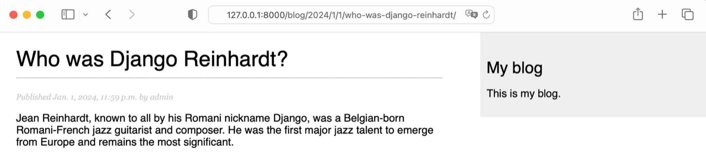

# **Enhancing Your Blog and Adding Social Features** 🚀✨

In the previous section, we built a **simple blog application** using **Django views, templates, and URLs**. Now, we will **enhance** our blog by adding **modern blogging features** that are common in popular blogging platforms. 📖💡

---

## **What You Will Learn in This Section** 🛠️📌

- **Using Canonical URLs for Models** 🌍
- **Creating SEO-Friendly URLs for Posts** 🔍
- **Adding Pagination to the Post List View** 📄
- **Building Class-Based Views** 🏗️
- **Sending Emails with Django** 📧
- **Using Django Forms to Share Posts via Email** 🔗
- **Adding Comments to Posts Using Model-Based Forms** 💬

<div align="center">

# `New Section Functional Overview`

</div>

# **Functional Overview of Enhancements** 🚀✨

In this section we will expand our **Django blog application** by adding **new functionalities** that enhance user interaction and navigation. The **diagram below illustrates** the key features that will be implemented. 📖💡

<div align="center">
  

  **Figure 2.1**: Diagram of functionalities built in this section.

</div>

---

## **What We Will Build in This Chapter** 🛠️📌

### **1️⃣ Pagination for Post List View** 📄
- We will implement **pagination** to split the post list into multiple pages.
- This will improve **performance and user experience** when browsing blog posts.

### **2️⃣ Class-Based Views** 🏗️
- We will refactor the existing **post_list view** into a **class-based view**.
- Class-based views provide a more **structured and reusable** approach compared to function-based views.
- The new view will be called **PostListView**.

### **3️⃣ Sharing Posts via Email** 📧
- We will create the **post_share view** to allow users to **share posts via email**.
- Django’s **forms and SMTP (Simple Mail Transfer Protocol)** will be used to send recommendations.
- Users will be able to send **post links** to their friends directly from the blog.

### **4️⃣ Adding a Comment System** 💬
- We will build a **Comment model** to store comments for blog posts.
- A **post_comment view** will be implemented to allow users to leave comments.
- Django’s **model-based forms** will be used to handle user input.


<div align="center">

# `New Section Using Canonical URLs for Models`

</div>

# **Using Canonical URLs for Models** 🌍✨

A website may have **multiple pages displaying the same content**. In our blog application, each post's **initial content** is displayed on both the **post list page** and the **post detail page**. To **identify a preferred URL** for a resource, we use **canonical URLs**.

A **canonical URL** is the **main representative URL** for specific content. Even though posts might be displayed in different sections of the site, there should be **one primary URL** that acts as the **definitive** reference for that post. 🏷️

---

## **Why Canonical URLs Matter?** 🔍
- Prevents **duplicate content issues** in search engines.
- Ensures **better SEO ranking** by defining a single, authoritative URL.
- Helps users and crawlers **navigate efficiently**.

---

## **Implementing Canonical URLs in Django** 🛠️
Django allows us to implement the **`get_absolute_url()`** method in our models. This method **returns the canonical URL** for an object, ensuring that each post has a single, primary URL reference.

We will **build the canonical URL** using the `post_detail` URL pattern of the application. Django provides **URL resolver functions** to dynamically generate URLs. For this, we use the **`reverse()`** function from `django.urls`.

### **Editing `models.py` to Add Canonical URLs** 📝
Modify the `models.py` file of the blog application to:
✅ **Import the `reverse()` function**.
✅ **Add the `get_absolute_url()` method to the `Post` model**.

```python
from django.conf import settings
from django.db import models
from django.urls import reverse  # ✅ Import reverse
from django.utils import timezone

class PublishedManager(models.Manager):
    def get_queryset(self):
        return super().get_queryset().filter(status=Post.Status.PUBLISHED)

class Post(models.Model):
    # ... (existing fields)
    
    class Meta:
        ordering = ['-publish']
        indexes = [
            models.Index(fields=['-publish']),
        ]
    
    def __str__(self):
        return self.title

    def get_absolute_url(self):  # ✅ Define the canonical URL
        return reverse(
            'blog:post_detail',  # ✅ Uses post_detail from blog namespace
            args=[self.id]  # ✅ Passes the post ID as an argument
        )
```

---

## **Understanding the `reverse()` Function 🔄**
Django’s `reverse()` function **dynamically generates URLs** based on the **URL name** defined in `urls.py`. 

📌 **Key Points:**
- **`'blog:post_detail'`** refers to the `post_detail` URL inside the **blog namespace**.
- The **post ID (`self.id`)** is passed as an argument using `args=[self.id]`.
- This ensures that **every post has a unique, SEO-friendly URL**.

📌 **Example Usage:**
```python
post = Post.objects.get(id=5)
print(post.get_absolute_url())  # Output: /blog/5/
```

---

## **Where is `post_detail` Defined? 📌**
The `post_detail` URL is defined in `urls.py`:
```python
urlpatterns = [
    path('<int:id>/', views.post_detail, name='post_detail'),
]
```

### **How URLs Are Built** 🏗️
| URL Namespace | URL Name | Example Output |
|--------------|---------|---------------|
| `blog`       | `post_detail` | `/blog/5/` |

Since the **blog namespace** is defined when including `blog.urls` in the project’s `urls.py`, the resulting URL reference **can be used globally across the project**.

<div align="center">

# `New Section Updating Post Detail URLs`

</div>

# **Updating Post Detail URLs in Templates** 🌐✨

Now that we have implemented **canonical URLs** using the `get_absolute_url()` method, we need to **update our templates** to use this method instead of hardcoding the URL with ``. 🎯

This ensures that our blog posts always reference the **canonical URL dynamically**, making our project **more maintainable and structured**. 🏗️

---

## **Updating the Template** 📝

### **Modify `blog/post/list.html`**
Edit the `blog/post/list.html` file and replace the existing post detail link:

❌ **Old Code:**
```html
<a href="">
```
✅ **New Code (Using `get_absolute_url()`):**
```html
<a href="{{ post.get_absolute_url }}">  added here 
```

### **Updated `blog/post/list.html` File:**
```html

My Blog

 <h1>My Blog</h1>
 
 <h2>
 <a href="{{ post.get_absolute_url }}">  absolute url 
 {{ post.title }}
 </a>
 </h2>
 <p class="date">
 Published {{ post.publish }} by {{ post.author }}
 </p>
 {{ post.body|truncatewords:30|linebreaks }}
 

```

---

## **Testing the Changes 🛠️**
To ensure everything works correctly, **start the Django development server** by running the following command:

```bash
python manage.py runserver
```

### **Verify in the Browser** 🖥️
- Open your web browser and go to: 
  **[http://127.0.0.1:8000/blog/](http://127.0.0.1:8000/blog/)**
- Click on any **blog post title**.
- The links should now be **correctly built using `get_absolute_url()`**.


<div align="center">

# `New Section Creating SEO-Friendly URLs`

</div>


# **Creating SEO-Friendly URLs for Posts** 🔍✨

The current **canonical URL** for a blog post detail view looks like:

```plaintext
/blog/1/
```

This format is **not SEO-friendly** because it lacks meaningful keywords that search engines use for indexing. To **improve search engine rankings**, we will modify the **URL structure** to include the **publish date** and **slug**.

For example, a new **SEO-friendly URL** will look like:

```plaintext
/blog/2025/1/1/python-deep-dive/
```

This new format will make **URLs more informative** and **search engine-friendly**, as they include both the **title** and **date of publication**.

---

## **Ensuring Unique Slugs for Each Post** 🔄

To **retrieve posts** using a combination of **publish date** and **slug**, we need to ensure that **no post** in the database has the **same slug and publish date** as another post.

We will enforce this **uniqueness constraint** by modifying the `Post` model to ensure that slugs are unique for a given publication date.

### **Editing ********`models.py`******** to Enforce Unique Slugs** 🛠️

Modify the `Post` model in `models.py` to include the **`unique_for_date`** constraint for the `slug` field.

```python
class Post(models.Model):
    # ... (existing fields)
    
    slug = models.SlugField(
        max_length=250,
        unique_for_date='publish'  # ✅ Ensure slugs are unique per publication date
    )
    
    # ... (other fields and methods)
```

### **What Does ********`unique_for_date`******** Do? 🤔**

✅ Ensures that **no two posts** can have the **same slug on the same publish date**.
✅ Prevents **duplicate posts** in the database.
✅ Works at the **Django model level**, not at the **database level**.
✅ Applies uniqueness check **only to the date**, ignoring the time portion of `DateTimeField`.

Now, Django will **automatically prevent duplicate slugs** for posts published on the same date. 📆✨

---

## **Applying Model Changes with Migrations** 📜

Since we have **modified the model**, we need to **create migrations**. However, note that `unique_for_date` is **not enforced at the database level**, so no actual database modification is needed.

### **Step 1: Create the Migration** ⚙️

Run the following command in the shell prompt:

```bash
python manage.py makemigrations blog
```

**Expected Output:**

```plaintext
Migrations for 'blog':
  blog/migrations/0002_alter_post_slug.py
  - Alter field slug on post
```

Django has generated the **0002\_alter\_post\_slug.py** file inside the **migrations directory**.

### **Step 2: Apply the Migration** ✅

To apply the migration, run:

```bash
python manage.py migrate
```

**Expected Output:**

```plaintext
Applying blog.0002_alter_post_slug... OK
```

Even though **no actual database change occurs**, Django **tracks model changes** through migrations to ensure consistency.

<div align="center">

# `New Section SEO-Friendly URLs`

</div>

# **Modifying the URL Patterns for SEO-Friendly URLs** 🌍✨

To make our **blog post URLs SEO-friendly**, we need to modify the **post detail URL pattern** so that it includes **the publication date and slug** instead of just the post ID. This will make our URLs **more readable, structured, and optimized for search engines**. 🔍📈

For example, instead of:

```plaintext
/blog/1/
```

We will now have:

```plaintext
/blog/2024/1/27/python-deep-dive/
```

This will help search engines and users understand the **context** of the post just by looking at the URL. 🚀

---

## **Updating the URL Patterns** 🛠️

We need to **modify** the `urls.py` file inside the `blog` application.

### **Old Code:** ❌

```python
path('<int:id>/', views.post_detail, name='post_detail'),
```

### **New Code (SEO-Friendly URLs):** ✅

```python
path(
    '<int:year>/<int:month>/<int:day>/<slug:post>/',  # ✅ Updated URL pattern
    views.post_detail,
    name='post_detail'
),
```

### **Updated ****************`urls.py`**************** File:** 📌

```python
from django.urls import path
from . import views

app_name = 'blog'

urlpatterns = [
    # Post views
    path('', views.post_list, name='post_list'),
    path(
        '<int:year>/<int:month>/<int:day>/<slug:post>/',  # ✅ New SEO-friendly pattern
        views.post_detail,
        name='post_detail'
    ),
]
```

---

## **Understanding the New URL Pattern** 📖

The new **post detail URL pattern** takes the following parameters:

- **`year`** 🗓️ → Requires an **integer** (`int`) to specify the **year** of publication.
- **`month`** 📆 → Requires an **integer** (`int`) to specify the **month** of publication.
- **`day`** 🕒 → Requires an **integer** (`int`) to specify the **day** of publication.
- **`post`** 🔖 → Requires a **slug** (`slug`) which contains only **letters, numbers, underscores, or hyphens**.

### **Django Path Converters Used** 🔄

| Path Converter | Description                                        |
| -------------- | -------------------------------------------------- |
| `int`          | Matches an integer value (e.g., `2025`, `1`, `27`) |
| `slug`         | Matches a slug (e.g., `python-deep-dive`)  |

To learn more about **path converters in Django**, visit:
🔗 [Django Path Converters Documentation](https://docs.djangoproject.com/en/5.0/topics/http/urls/#path-converters)

<div align="center">

# `New Section post_detail View to Match SEO-Friendly URLs`

</div>

# **Modifying the `post_detail` View to Match SEO-Friendly URLs** 🛠️✨

To ensure that our **post_detail view** matches the **new SEO-friendly URL structure**, we need to update its parameters. The view should now accept **year, month, day, and post (slug)** to correctly retrieve the **corresponding blog post**. 📆🔍

---

## **Updating the `post_detail` View** 📝
Edit the `views.py` file inside the **blog application** and update the `post_detail` view as follows:

### **Old Code (Before SEO-Friendly URLs)** ❌
```python
def post_detail(request, id):
    post = get_object_or_404(Post, id=id, status=Post.Status.PUBLISHED)
    return render(request, 'blog/post/detail.html', {'post': post})
```

### **New Code (After Updating to SEO-Friendly URLs)** ✅
```python
from django.shortcuts import get_object_or_404, render
from .models import Post

def post_detail(request, year, month, day, post):  # ✅ Updated parameters
    post = get_object_or_404(
        Post,
        status=Post.Status.PUBLISHED,
        slug=post,  # ✅ Match post slug
        publish__year=year,  # ✅ Match year of publication
        publish__month=month,  # ✅ Match month of publication
        publish__day=day  # ✅ Match day of publication
    )
    return render(
        request,
        'blog/post/detail.html',
        {'post': post}
    )
```

---

## **Understanding the Changes in `post_detail`** 🧐

- **✅ Added `year, month, day, and post` as parameters**: 
  - These match the **new URL structure** to fetch the correct post.
- **✅ Used `slug=post`**: 
  - Instead of fetching by `id`, we now use the **slug field**.
- **✅ Filtered posts by `publish__year`, `publish__month`, and `publish__day`**: 
  - Ensures that posts are retrieved based on their **exact publication date**.
- **✅ Only retrieves posts with `status=Post.Status.PUBLISHED`**: 
  - This prevents fetching drafts or unpublished posts.

---

## **How `get_object_or_404` Works in This Context** 🔍🛠️

The function `get_object_or_404()` is a **Django shortcut** that attempts to retrieve an object from the database using the given parameters. If the object does **not** exist, Django **automatically raises a 404 error** (`Http404` exception), returning an HTTP 404 response.

### **Breaking Down the Parameters Inside `get_object_or_404()`** 🧐
```python
post = get_object_or_404(
    Post,  # ✅ Model to query
    status=Post.Status.PUBLISHED,  # ✅ Filter posts that are published only
    slug=post,  # ✅ Match the post's slug
    publish__year=year,  # ✅ Match the exact year of publication
    publish__month=month,  # ✅ Match the exact month of publication
    publish__day=day  # ✅ Match the exact day of publication
)
```
### **How It Works Step by Step** 📌
1️⃣ **Queries the `Post` model** to fetch a post matching the given filters.
2️⃣ **Filters by `status=Post.Status.PUBLISHED`** to ensure only published posts are retrieved.
3️⃣ **Filters by `slug=post`** to match the requested slug.
4️⃣ **Filters by `publish__year`, `publish__month`, and `publish__day`**:
   - Ensures the retrieved post has the exact **date of publication** as specified in the URL.
5️⃣ **If a post exists that meets all these conditions**, it is returned.
6️⃣ **If no post is found**, Django **automatically raises an HTTP 404 error** (instead of returning `None` or causing an error later in the view).

### **Why Use `get_object_or_404()` Instead of `get()`?** 🤔
✅ **Avoids writing manual error handling**
✅ **Automatically raises a proper 404 response**
✅ **Reduces unnecessary try/except blocks**
✅ **Enhances user experience by properly handling missing content**

---

## **How Does This Work? 🤔**
1️⃣ **User Requests a Blog Post**
   - Example URL: `/blog/2024/1/1/who-was-django-reinhardt/`

2️⃣ **Django Matches the URL to `post_detail` View**
   - Extracts **year, month, day, and slug** from the URL.

3️⃣ **Django Fetches the Post from the Database**
   - Looks for a **published post** that matches the given **date and slug**.

4️⃣ **Renders the `blog/post/detail.html` Template**
   - Displays the requested **blog post details**.


<div align="center">

# `New Section Modifying the Canonical URL`

</div>

# **Modifying the Canonical URL for Posts** 🌍✨
To fully align with the new **SEO-friendly URL structure**, we need to update the `get_absolute_url()` method in our **Post model**. This ensures that the canonical URL of each post now includes the **publication date** (year, month, and day) along with the **slug**. 📆🔗

---

## **Updating the `get_absolute_url()` Method** 📝
Edit the `models.py` file inside the **blog application** and modify the `get_absolute_url()` method as follows:

### **Old Code (Before SEO-Friendly URLs)** ❌
```python
def get_absolute_url(self):
    return reverse('blog:post_detail', args=[self.id])
```

### **New Code (After Updating to SEO-Friendly URLs)** ✅
```python
from django.urls import reverse

class Post(models.Model):
    # ... (other model fields)
    
    def get_absolute_url(self):  # ✅ Updated canonical URL method
        return reverse(
            'blog:post_detail',
            args=[
                self.publish.year,  # ✅ Year of publication
                self.publish.month,  # ✅ Month of publication
                self.publish.day,  # ✅ Day of publication
                self.slug  # ✅ Unique slug for the post
            ]
        )
```

---

## **Understanding the Changes in `get_absolute_url()`** 🧐

- **✅ Uses `self.publish.year`, `self.publish.month`, and `self.publish.day`**: 
  - Ensures URLs include the **exact publication date**.
- **✅ Uses `self.slug`**:
  - Replaces the use of `id` with a **user-friendly slug**.
- **✅ Generates URLs that match the new `post_detail` URL pattern**:
  - This ensures that **all references** to post URLs are dynamically built.

---

## **Starting the Development Server & Testing the Changes** 🚀
After modifying the `models.py` file, start the **Django development server** by running:
```sh
python manage.py runserver
```

Now, open your browser and visit:
```sh
http://127.0.0.1:8000/blog/
```
Click on any **post title**, and it should direct you to a detail page with the new **SEO-friendly URL format**. 🎯


<div align="center">
  

  **Figure 2.2**:  The page for the post’s detail view

</div>

## **Expected URL Format After Changes** 🔍
The URL structure for posts should now look like:
```sh
/blog/2024/1/1/who-was-django-reinhardt/
```
Instead of using `id`, we are now using **publish date + slug** to generate **SEO-friendly, human-readable URLs**. This is beneficial for **search engine optimization (SEO) and user readability**.

<div align="center">

# `New Section Adding Pagination`

</div>

# **Adding Pagination** 📄✨

As your blog grows and accumulates **tens or even hundreds of posts**, displaying all posts on a **single page** can become inefficient. Instead, you can **split the list of posts** across multiple pages with **pagination**. This feature enhances **user experience** by making navigation more manageable and improves **page load times**. 🚀

---

## **Why Use Pagination? 🤔**

- ✅ Improves **website performance** by loading a limited number of posts per page.
- ✅ Enhances **user experience** with structured navigation.
- ✅ Optimizes **SEO** by reducing excessive content on a single page.

---

## **How Django Handles Pagination 📌**

Django provides a **built-in pagination class** that simplifies managing paginated data. With this class, you can:

- **Define** how many objects (posts) should be displayed **per page**.
- **Retrieve** only the posts that correspond to the **requested page**.
- **Generate** pagination controls for **easy navigation** between pages.


<div align="center">

# `New Section Starts here`

</div>


