#  **Extending Your Blog Application** 🏆

In the previous section, we covered the basics of **forms** and how to create a **comment system**. Additionally, we explored how to **send emails with Django**. 🚀

Now, in this section, we will **extend your blog application** by adding some exciting and popular features commonly found in blogging platforms. These include **tagging, post recommendations, RSS feeds, and full-text search**. Through this, you will learn about new Django components and functionalities while implementing these enhancements. 🏗️✨

## 🏆 Topics Covered

This section will cover the following important topics:

✅ **Implementing Tagging using** \`\` 🏷️

✅ **Retrieving Posts by Similarity** 🔗

✅ **Creating Custom Template Tags and Filters** to display latest and most commented posts 🛠️

✅ **Adding a Sitemap to the Site** for better SEO 🌍

✅ **Creating Feeds for Blog Posts** using RSS 📡

✅ **Installing PostgreSQL** as a powerful database engine 🛢️

✅ **Using Fixtures** to dump and load database data ⚡


✅ **Implementing a Full-Text Search Engine** with Django and PostgreSQL 🔎

<div align="center">

# `New Section Functional Overvie`

</div>


# 🔍 **Functional Overview**

## 📌 Overview

This section focuses on enhancing your blog application by implementing **tags, filters, custom template tags, sitemaps, RSS feeds, and a full-text search engine**. 🏗️✨

<div align="center">
  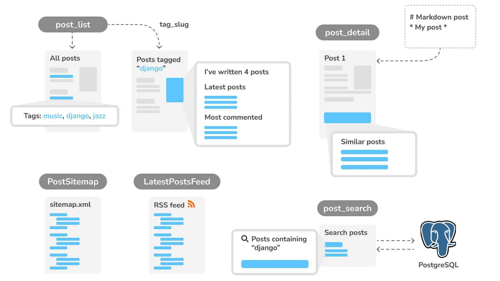

  **Figure 3.1**: Diagram of functionalities built-

</div>

### 📊 Functionalities to be Built

The following features will be developed in this section:

### 🏷️ Tagging System

- Implement **tags** for blog posts.
- Extend the **post\_list view** to filter posts based on tags.
- Retrieve **similar posts** in the **post\_detail view** using common tags.

### 🛠️ Custom Template Tags

- Create a **sidebar** displaying:
  - Total number of posts 📊
  - Latest published posts 📰
  - Most commented posts 💬

### ✍️ Markdown Support

- Enable **Markdown syntax** for writing posts.
- Convert Markdown content to **HTML** dynamically.

### 🌍 Sitemap Generation

- Implement a **sitemap** using the `PostSitemap` class.

### 📡 RSS Feeds

- Create an **RSS feed** for the latest posts using the `LatestPostsFeed` class.

### 🔎 Full-Text Search

- Develop a **search engine** with the `post_search` view.
- Utilize **PostgreSQL full-text search** capabilities for better search results.

<div align="center">

# `New Section Implementing Tagging`

</div>

#  **Implementing Tagging with `django-taggit`** 🏷️

## 📌 Overview
Tagging is an essential feature in blogging platforms as it allows for **categorization of content** in a flexible, **non-hierarchical** manner. Instead of using a rigid category structure, you can use **simple keywords** to label your posts, making it easier for users to **filter and find** relevant content. In this section, we will integrate **django-taggit**, a **widely-used** third-party Django package, into our blog to effectively manage tagging functionalities. 🚀

## 🛠️ Installing `django-taggit`
To integrate tagging into our blog application, we need to install `django-taggit`, which is a **reusable Django app** designed for easy tagging of any Django model.

Run the following command to install the package:
```bash
python -m pip install django-taggit==5.0.1
```

After installing, Django needs to be informed that we are using this package. To do so, open the `settings.py` file and **add `taggit`** to the `INSTALLED_APPS` list:

```python
INSTALLED_APPS = [
    'django.contrib.admin',  # Django Admin Panel
    'django.contrib.auth',  # User Authentication
    'django.contrib.contenttypes',  # Content Type Framework
    'django.contrib.sessions',  # Session Management
    'django.contrib.messages',  # Message Framework
    'django.contrib.staticfiles',  # Static Files
    'taggit',  # Django Taggit for tagging functionality
    'blog.apps.BlogConfig',  # Our blog application
]
```

💡 **Pro Tip:** It is a good practice to keep Django’s built-in packages at the top, third-party packages (like `taggit`) in the middle, and local apps (like `blog`) at the end of `INSTALLED_APPS`. This keeps your settings file well-organized and readable.

## 📂 Adding Tagging Functionality to the Post Model
The next step is to modify the `models.py` file inside the **blog** application to add tagging capabilities. We do this by importing `TaggableManager` and adding it to the `Post` model.

```python
from taggit.managers import TaggableManager

class Post(models.Model):
    # Existing fields like title, body, etc.
    tags = TaggableManager()  # Enables tagging functionality
```

### 🔹 What is `TaggableManager`?
`TaggableManager` is a **special manager** provided by `django-taggit` that allows us to:
- **Add tags** to a post
- **Retrieve tags** from a post
- **Remove tags** from a post

With just a single line of code, we have now **enabled tagging** on our blog posts! 🎉

## 🔍 Understanding `django-taggit` Data Models
`django-taggit` internally uses two models to manage tagging functionality:

### 🏷️ **Tag Model**
- Stores all **unique tags** used in the system.
- Contains `name` and `slug` fields to define each tag uniquely.

### 🔗 **TaggedItem Model**
- Stores the **relationship** between tags and objects.
- Contains:
  - `ForeignKey` to **Tag** 🔗 (each tag can be associated with multiple objects)
  - `ForeignKey` to **ContentType** 🏷️ (allows tagging of different models, not just posts)
  - `IntegerField` to store the related `object_id`

💡 **The combination of `content_type` and `object_id` enables a generic relationship between `Tag` and any model, making `django-taggit` highly flexible!**

<div align="center">
  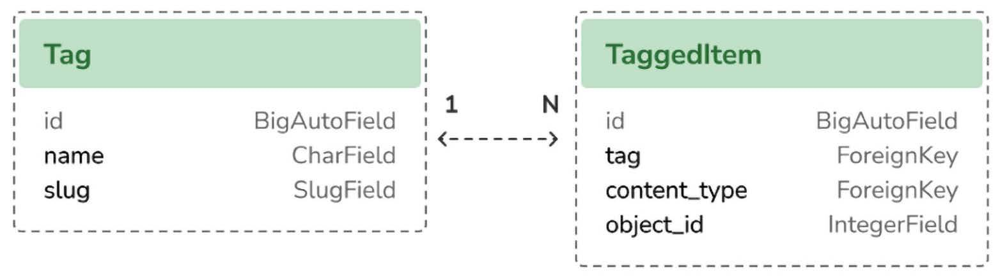

  **Figure 3.2**: Tag models of django-taggit

</div>

## 📌 Creating Database Migrations
Since we modified our **Post model**, we need to create and apply **database migrations** to reflect these changes.

Run the following command to generate the migrations:
```bash
python manage.py makemigrations blog
```

Expected output:
```
Migrations for 'blog':
  blog/migrations/0004_post_tags.py
    - Add field tags to post
```

Next, apply the migrations to the database:
```bash
python manage.py migrate
```

Expected output:
```
Applying taggit.0001_initial... OK
Applying taggit.0002_auto_20150616_2121... OK
Applying taggit.0003_taggeditem_add_unique_index... OK
Applying taggit.0004_alter_taggeditem_content_type_alter_taggeditem_tag... OK
Applying taggit.0005_auto_20220424_2025... OK
Applying blog.0004_post_tags... OK
```

<div align="center">

# `New Section Accessing Shell`

</div>

# 🏷️ **Using the Tags Manager in Django**

## 📌 Overview
In this section, we will explore how to **use the tags manager** provided by `django-taggit` to add, retrieve, and remove tags dynamically in a Django application. 🎯

## 🚀 Accessing the Django Shell
To interact with your Django models and apply tag operations, open the **Django shell** by running the following command:
```bash
python manage.py shell
```
This command launches an interactive environment where you can execute Python code related to your Django project.

## 📂 Retrieving a Post Object
Once inside the shell, retrieve a post object (with an ID of `1` in this example):
```python
from blog.models import Post
post = Post.objects.get(id=1)
```
This fetches the post from the database, allowing us to manipulate its tags.

## 🏷️ Adding Tags to a Post
To add **multiple tags** to the retrieved post, use the `add` method of the `tags` manager:
```python
post.tags.add('music', 'jazz', 'django')
```
This assigns the **tags: 'music', 'jazz', and 'django'** to the post.

To confirm the tags were successfully added, retrieve them using:
```python
post.tags.all()
```
Expected output:
```
<QuerySet [<Tag: jazz>, <Tag: music>, <Tag: django>]>
```
This confirms that the post has been tagged correctly. ✅

## ❌ Removing a Tag from a Post
To remove a specific tag, such as `'django'`, use the `remove` method:
```python
post.tags.remove('django')
```
To verify the change, retrieve the updated tag list:
```python
post.tags.all()
```
Expected output:
```
<QuerySet [<Tag: jazz>, <Tag: music>]>
```
This confirms that the **'django'** tag has been successfully removed. 🔥

## 🌍 Running the Development Server
To view and manage tags via the Django admin panel, start the development server:
```bash
python manage.py runserver
```
Now, open the **Django admin interface** by visiting:
```
http://127.0.0.1:8000/admin/taggit/tag/
```
This will display the **list of tags** managed by `django-taggit`.

### 🖥️ Viewing and Editing Tags in Django Admin
#### 🔹 **Tag List View**
You will see a **list of all available tags**. Click on any tag (e.g., `jazz`) to edit it.

<div align="center">
  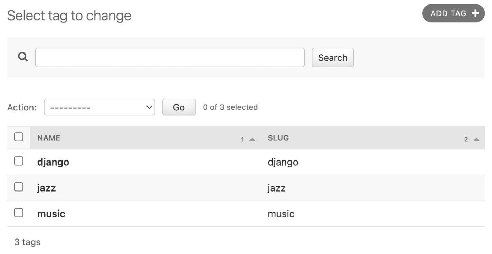

  **Figure 3.3**: The tag change list view on the Django administration site

</div>

#### 🔹 **Editing a Tag**
- The tag details will appear, showing:
  - **Tag Name** (e.g., `jazz`)
  - **Slug** (e.g., `jazz`)
  - **Tagged Items** (posts associated with this tag)
- You can modify or delete the tag as needed.

<div align="center">
  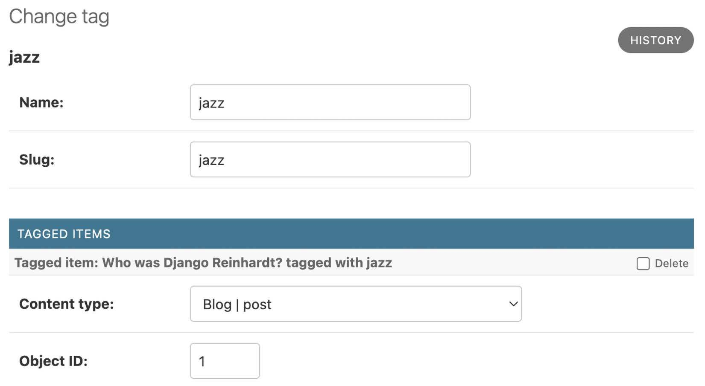

  **Figure 3.4**: The tag edit view on the Django administration site

</div>

### 📌 Editing Tags for a Specific Post
Navigate to:
```
http://127.0.0.1:8000/admin/blog/post/1/change/
```
<div align="center">
  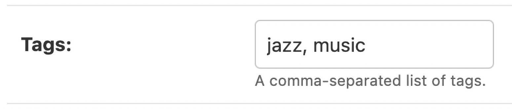

  **Figure 3.5**: The related Tags field of a Post objec

</div>


<div align="center">

# `New Section Displaying tags`

</div>

#  **Displaying Tags in Blog Posts** 🏷️

## 📌 Overview
To enhance the functionality of your blog, you need to **display tags** for each post. Tags allow readers to explore related content easily. In this section, we will modify the **blog post list template** to display the associated tags dynamically. 🚀

## 🖥️ Editing the `post/list.html` Template
Open the `blog/post/list.html` template and modify it to include **tag display functionality**:

```html


My Blog


    <h1>My Blog</h1>
    
    <h2>
        <a href="{{ post.get_absolute_url }}">
            {{ post.title }}
        </a>
    </h2>
    <p class="tags">Tags: {{ post.tags.all|join:", " }}</p> <!-- Add tags here -->
    <p class="date">
        Published {{ post.publish }} by {{ post.author }}
    </p>
    {{ post.body|truncatewords:30|linebreaks }}
    
    

```

### 🔍 How This Works
- The **`post.tags.all`** retrieves all tags associated with a post.
- The **`join:", "`** The join template filter works analogously to Python’s string join() method. You can concatenate a list of items into one string, using a specific character or string to separate each item.
- Example:
  ```python
  ['music', 'jazz', 'piano'] → 'music, jazz, piano'
  ```
- This ensures that the **tags are displayed neatly under each post title**. 🎯

## 🌍 Viewing Tags in the Browser
After saving the changes, start your Django development server:
```bash
python manage.py runserver
```
Then, open the following URL in your browser:
```
http://127.0.0.1:8000/blog/
```
You should now see the **list of tags under each post title**.

<div align="center">
  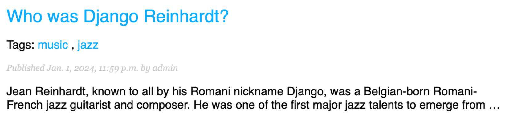

  **Figure 3.6**: The Post list item, including related tags

</div>

<div align="center">

# `New Section enhancing post_list with tag`

</div>

# 📌 **Enhancing the `post_list` View with Tag Filtering in Django**

## 📝 Overview
In this update, we modify the `post_list` view in Django to **filter posts by a tag** using the `django-taggit` package. This enhancement allows users to filter blog posts based on specific tags. 🏷️📌

## 🔧 Implementation
We modify the `views.py` file in our **blog application** as follows:

### ✍️ Updated `views.py`
```python
from django.core.paginator import Paginator, PageNotAnInteger, EmptyPage
from django.shortcuts import render, get_object_or_404
from taggit.models import Tag  # ✅ Import the Tag model from django-taggit
from .models import Post  # ✅ Import the Post model


def post_list(request, tag_slug=None):  # ✅ Add an optional 'tag_slug' parameter
    post_list = Post.published.all()  # ✅ Retrieve all published posts
    tag = None  # ✅ Initialize 'tag' as None

    if tag_slug:  # ✅ If 'tag_slug' is provided in the URL
        tag = get_object_or_404(Tag, slug=tag_slug)  # ✅ Retrieve the corresponding Tag object
        post_list = post_list.filter(tags__in=[tag])  # ✅ Filter posts containing the specified tag

    # 📌 Pagination: Display 3 posts per page
    paginator = Paginator(post_list, 3)
    page_number = request.GET.get('page', 1)  # ✅ Get the requested page number
    try:
        posts = paginator.page(page_number)  # ✅ Fetch the requested page
    except PageNotAnInteger:
        posts = paginator.page(1)  # ✅ If page number is not an integer, display the first page
    except EmptyPage:
        posts = paginator.page(paginator.num_pages)  # ✅ If page number exceeds range, display the last page

    return render(
        request,
        'blog/post/list.html',
        {
            'posts': posts,  # ✅ Pass the paginated posts
            'tag': tag  # ✅ Pass the selected tag
        }
    )
```

---

## 🎯 **How It Works**

### 1️⃣ Accepting an Optional `tag_slug` Parameter
- The function now accepts an **optional parameter `tag_slug`**, which defaults to `None`.
- This **parameter is passed via the URL** when filtering posts by tag.

### 2️⃣ Retrieving All Published Posts
- Initially, **all published posts** are retrieved using:
  ```python
  post_list = Post.published.all()
  ```

### 3️⃣ Filtering Posts Based on the Provided Tag
- If `tag_slug` is provided:
  - The **corresponding `Tag` object** is fetched using:
    ```python
    tag = get_object_or_404(Tag, slug=tag_slug)
    ```
  - Posts are then **filtered** using Django’s Many-to-Many field lookup:
    ```python
    post_list = post_list.filter(tags__in=[tag])
    ```
- This ensures that **only posts containing the specified tag** are displayed.

## 🔍 **Understanding Many-to-Many Relationships**

- The **`Post` model has a Many-to-Many relationship** with the `Tag` model.
- A **single post** can have **multiple tags**, and a **single tag** can be linked to **multiple posts**.
- When filtering, we use:
  ```python
  post_list.filter(tags__in=[tag])
  ```
  - This ensures that **only posts associated with the specified tag** are retrieved.
- More details on **Many-to-Many relationships** can be found in Django's official documentation: 📖 [Django Many-to-Many Relationships](https://docs.djangoproject.com/en/5.0/topics/db/examples/many_to_many/)

---

</div>

<div align="center">

# `New Section update urls`

</div>

# 📌 **Updating `urls.py` to Support Tag-Based Filtering in Django**

## 📝 Overview
In this update, we modify the `urls.py` file in our **blog application** to:
1. **Comment out the class-based view (`PostListView`)** and use the `post_list` function-based view instead.
2. **Add a new URL pattern** that allows filtering posts by tags.

This ensures better control over how posts are displayed and filtered based on tags. 🏷️✨

## 🔧 Updated `urls.py`

```python
from django.urls import path  # ✅ Import path for URL routing
from . import views  # ✅ Import views from the current app

app_name = 'blog'  # ✅ Define app namespace

urlpatterns = [
    # 📌 Post listing views
    path('', views.post_list, name='post_list'),  # ✅ Use function-based view for listing posts
    
    # path('', views.PostListView.as_view(), name='post_list'),  # ❌ Commented-out class-based view
    
    # 📌 New URL pattern for filtering posts by tag
    path(
        'tag/<slug:tag_slug>/', views.post_list, name='post_list_by_tag'
    ),  # ✅ Allows filtering posts based on tag
    
    # 📌 URL pattern for displaying a single post
    path(
        '<int:year>/<int:month>/<int:day>/<slug:post>/',
        views.post_detail,
        name='post_detail'
    ),
    
    # 📌 URL pattern for sharing a post
    path('<int:post_id>/share/', views.post_share, name='post_share'),
    
    # 📌 URL pattern for adding a comment to a post
    path('<int:post_id>/comment/', views.post_comment, name='post_comment'),
]
```

---

## 🎯 **Key Changes and Explanations**

### 1️⃣ **Switching from Class-Based View to Function-Based View**
- We **commented out** the existing **class-based view (`PostListView`)**:
  ```python
  # path('', views.PostListView.as_view(), name='post_list'),
  ```
- Instead, we are now using the **function-based view (`post_list`)**:
  ```python
  path('', views.post_list, name='post_list'),
  ```
- This allows us to **modify the view logic more easily** and integrate tag filtering efficiently.

### 2️⃣ **Adding Tag-Based Filtering to the URL Patterns**
- We introduce a new **URL pattern**:
  ```python
  path(
      'tag/<slug:tag_slug>/', views.post_list, name='post_list_by_tag'
  ),
  ```
- This pattern:
  - **Calls the same `post_list` view** but with an optional `tag_slug` parameter.
  - Allows posts to be **filtered based on tags**.

### 3️⃣ **Using the `slug` Path Converter** 🏷️
- The `slug` converter ensures:
  - The **tag slug** is matched as a lowercase string.
  - It can contain **ASCII letters, numbers, hyphens (`-`), and underscores (`_`)**.


<div align="center">

# `New Section blog/post/list.html`

</div>

# 📌 **Updating `blog/post/list.html` to Support Tag-Based Filtering and Pagination**

## 📝 Overview
In this update, we modify the `blog/post/list.html` template to:
1. **Display posts with optional tag filtering.** 🏷️
2. **Include pagination correctly using the `posts` object.** 📄
3. **Improve user experience by displaying the selected tag.** 🖥️

This ensures that users can navigate posts efficiently and filter content based on tags.

---

## 🔧 Updated `blog/post/list.html`

```html


My Blog 


    <h1>My Blog</h1>
    
      <!-- ✅ Display selected tag if filtering by one -->
        <h2>Posts tagged with "{{ tag.name }}"</h2>
    
    
     
        <h2>
            <a href="{{ post.get_absolute_url }}">
                {{ post.title }} ->
            </a>
        </h2>
        
        <p class="tags">Tags: {{ post.tags.all|join:", " }}</p> >
        <p class="date">
            Published {{ post.publish }} by {{ post.author }}
        </p>
        
        {{ post.body|truncatewords:30|linebreaks }} 
    
    
      <!-- ✅ Correct pagination usage -->

```

---

## 🎯 **Key Changes and Explanations**

### 1️⃣ **Displaying the Filtered Tag (If Applied)** 🏷️ 
- If a user is **filtering by a specific tag**, this line:
  ```html
  
      <h2>Posts tagged with "{{ tag.name }}"</h2>
  
  ```
  ensures that the **selected tag name appears above the post list**.

### 2️⃣ **Implementing Proper Pagination** 📄
- The pagination template is **now correctly included**:
  ```html
  
  ```
- This ensures that **users can navigate through multiple pages of posts easily.**

# 📌 **Updating `blog/post/list.html` to Improve Tag Display**

## 📝 Overview

In this update, we modify the `blog/post/list.html` template to:

1. **Display tags as clickable links** for filtering posts by tag. 🏷️
2. **Format tags with proper separators (commas).**
3. **Ensure smooth navigation between posts and their associated tags.**

This improves the **user experience** by making tags interactive and enabling quick filtering. 🚀

---

## 🔧 Updated `blog/post/list.html`

```html


My Blog 


    <h1>My Blog</h1>
    
     
        <h2>Posts tagged with "{{ tag.name }}"</h2>
    
    
    
        <h2>
            <a href="{{ post.get_absolute_url }}">
                {{ post.title }} 
            </a>
        </h2>
        
        <p class="tags">Tags:
              <!-- ✅ Loop through each tag -->
                <a href="">
                    {{ tag.name }}
                </a>,   <!-- ✅ Add comma separator if not last tag -->
            
        </p>
        
        <p class="date">
            Published {{ post.publish }} by {{ post.author }}
        </p>
        
        {{ post.body|truncatewords:30|linebreaks }} 
    
    
     

```

---

## 🎯 **Detailed Explanations of Changes**

### 1️⃣ **Making Tags Clickable 🏷️**

- Tags are now **clickable links**, allowing users to filter posts based on a specific tag.
- We loop through all tags associated with a post:
  ```html
  
  ```
- Each tag is wrapped inside an `<a>` tag, which generates a clickable link:
  ```html
  <a href="">
      {{ tag.name }}
  </a>
  ```
- The **`url`**\*\* template tag\*\* generates the correct URL for filtering posts by tag using the **`tag.slug`** value.

### 2️⃣ **Using the Correct URL Pattern for Filtering** 🔗

- The URL pattern:
  ```html
  
  ```
  - Uses **Django’s ************`url`************ template tag** to dynamically generate the URL.
  - Matches the `post_list_by_tag` **URL pattern** defined in `urls.py`.
  - Passes the **tag’s slug** as a parameter, allowing the view to filter posts correctly.

### 3️⃣ **Formatting Tags with Commas for Readability** 📌

- Tags within a post are now **separated by commas** for better readability:
  ```html
  , 
  ```
  - This ensures that **only tags before the last one** have a comma separator.
  - It prevents unnecessary commas at the end of the tag list.


<div align="center">

# `New Section Retrieving Posts by Similarity`

</div>

# **Retrieving Posts by Similarity** 📌

Now that we have implemented **tagging** for blog posts, we can unlock several interesting functionalities with tags. 🏷️ Tags help categorize posts in a **non-hierarchical** manner, meaning that posts about similar topics will naturally have common tags. 🔄

## 🌟 Purpose
We will build a functionality that **displays similar posts** based on the number of shared tags. This means that when a user reads a post, we can suggest other related posts to enhance engagement and discovery. 📚✨

## 🛠️ Steps to Retrieve Similar Posts
To find and recommend similar posts for a given post, follow these steps:

1. **Retrieve all tags** associated with the current post. 🏷️
2. **Find all posts** that share **any** of these tags. 📌
3. **Exclude the current post** from the results to avoid self-recommendations. 🚫
4. **Sort the results** based on the number of shared tags (more shared tags = higher relevance). 📊
5. **Handle ties**: If multiple posts have the same number of shared tags, recommend the **most recent** post first. 🕒
6. **Limit the results** to the number of posts you want to recommend. 🎯

<div align="center">

# `New Section Similarity-Based Post Suggestions`

</div>

# **Implementing Similarity-Based Post Suggestions in Django** 📝

In this section, we will modify the **post_detail** view to incorporate similarity-based post suggestions using Django's **QuerySet**. This allows us to recommend posts based on shared tags, enhancing user engagement and navigation. 🚀

## 📌 Steps to Implement Similar Posts Retrieval
These steps are translated into a **complex QuerySet** to find similar posts. Follow the instructions below to integrate this feature:

### 1️⃣ Import Required Function
Open the **views.py** file of your blog application and add the following import at the top:

```python
from django.db.models import Count
```

The `Count` function is an **aggregation function** in Django ORM that allows us to perform aggregated counts of tags.

### 2️⃣ Aggregation Functions in `django.db.models`
Django provides the following aggregation functions:
- **Avg**: The mean value
- **Max**: The maximum value
- **Min**: The minimum value
- **Count**: The total number of objects

### 3️⃣ Modify the `post_detail` View
Now, edit the **post_detail** view in `views.py` and add the following lines:

```python
def post_detail(request, year, month, day, post):
    post = get_object_or_404(
        Post,
        status=Post.Status.PUBLISHED,
        slug=post,
        publish__year=year,
        publish__month=month,
        publish__day=day
    )
    comments = post.comments.filter(active=True)
    form = CommentForm()
    
    # List of similar posts
    post_tags_ids = post.tags.values_list('id', flat=True)
    similar_posts = Post.published.filter(
        tags__in=post_tags_ids
    ).exclude(id=post.id)
    
    similar_posts = similar_posts.annotate(
        same_tags=Count('tags')
    ).order_by('-same_tags', '-publish')[:4]
    
    return render(
        request,
        'blog/post/detail.html',
        {
            'post': post,
            'comments': comments,
            'form': form,
            'similar_posts': similar_posts  # Similar posts dictionary
        }
    )
```

## 🔍 Explanation of the Code

1️⃣ **Retrieve Tag IDs:** The `values_list()` QuerySet extracts a **list of IDs** for the current post's tags. Using `flat=True`, we get a list like `[1, 2, 3, ...]` instead of tuples like `[(1,), (2,), (3,) ...]`.

2️⃣ **Filter Similar Posts:** We fetch all posts **containing any of these tags**, excluding the **current post**.

3️⃣ **Count Shared Tags:** Using the `Count` function, we **generate a calculated field** `same_tags` that represents the number of shared tags.

4️⃣ **Sort Posts by Relevance:** The results are sorted by **the number of shared tags (descending order)** and **publication date** (most recent posts appear first if tags are shared equally). The query is **limited to 4 posts**.

5️⃣ **Pass to Template Context:** The `similar_posts` object is added to the **context dictionary** so that the template can display the recommendations.

<div align="center">

# `New Section Starts here`

</div>

# Updating the Blog Post Template for Similar Post Suggestions 📝

In this section, we will edit the **blog/post/detail.html** template to include a **list of similar posts** and improve the comment section. This will enhance user engagement by suggesting relevant posts and displaying comments in an organized manner. 🚀

## 📌 Steps to Update the Template

Follow these steps to modify your **blog post detail page** and display similar post suggestions.

### 1️⃣ Open `blog/post/detail.html` and Add the Following Code

```django

{{ post.title }}


    <h1>{{ post.title }}</h1>
    <p class="date">
        Published {{ post.publish }} by {{ post.author }}
    </p>
    {{ post.body|linebreaks }}
    
    <p>
        <a href="">
            Share this post
        </a>
    </p>
    
    <h2>Similar posts</h2>    <!--  Similar Post Start here -->
     <!-- Loop similar posts -->
        <p>
            <a href="{{ post.get_absolute_url }}">{{ post.title }}</a>
        </p>
    
        <p>There are no similar posts yet.</p>
    
    
    <!-- End of Similar Posts Section -->

    
        <h2>
            {{ total_comments }} comment{{ total_comments|pluralize }}
        </h2>
    
    
    
        <div class="comment">
            <p class="info">
                Comment {{ forloop.counter }} by {{ comment.name }}
                {{ comment.created }}
            </p>
            {{ comment.body|linebreaks }}
        </div>
    
        <p>There are no comments yet.</p>
    
    
    

```

## 🔍 Explanation of the Code

1️⃣ Add Similar Posts Section:

- A new `<h2>` section is introduced to display similar posts.
- A loop iterates over `similar_posts` to display links to them.
- If no similar posts exist, a fallback message **"There are no similar posts yet."** is displayed.

The post detail page should look like this:

<div align="center">
  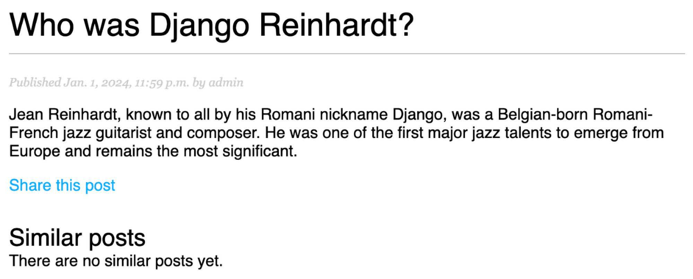

  **Figure 3.8**: The post detail page, including a list of similar posts

</div>

Open http://127.0.0.1:8000/admin/blog/post/ in your browser, edit a post that has no tags, and
add the music and jazz tags, as follows:

<div align="center">
  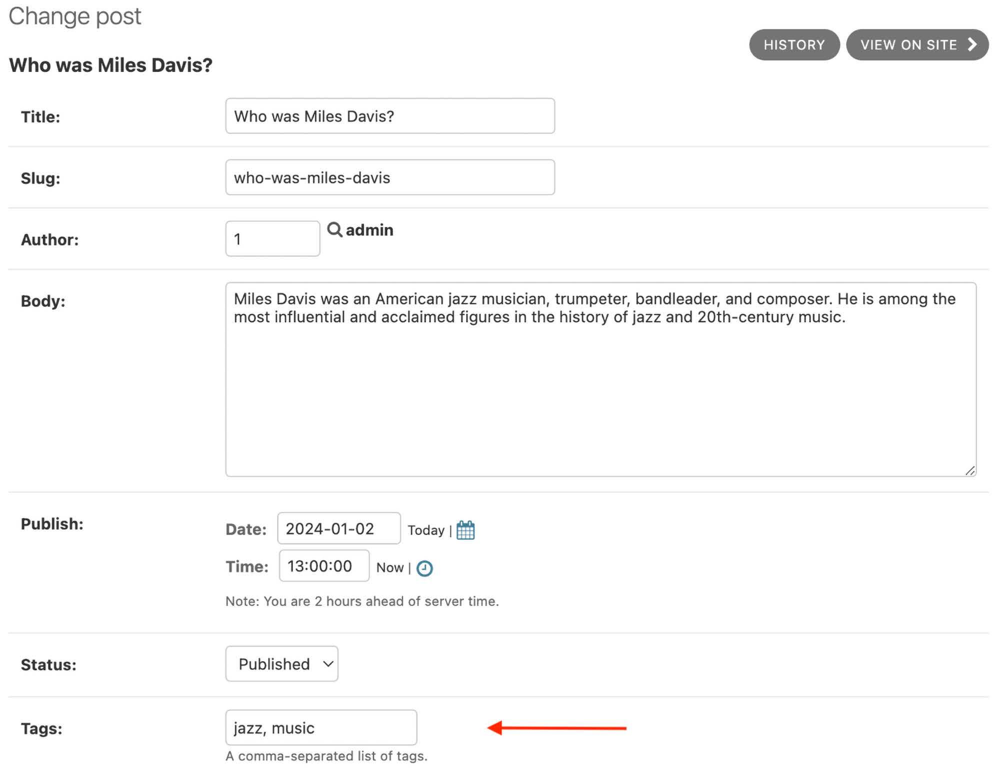

  **Figure 3.9**: Adding the “jazz” and “music” tags to a post

</div>

Edit another post and add the jazz tag, as follows:

<div align="center">
  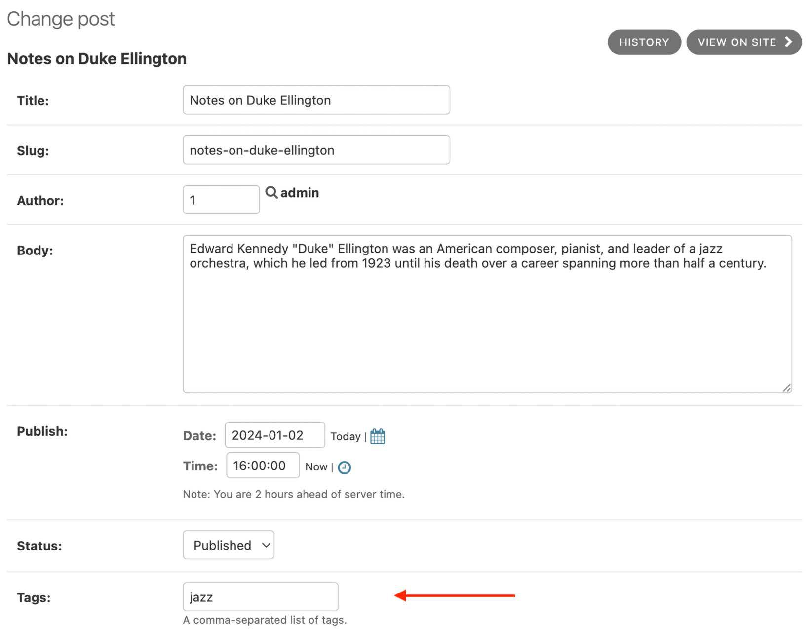

  **Figure 3.10**: Adding the “jazz” tag to a post

</div>

The post detail page for the first post should now look like this:

<div align="center">
  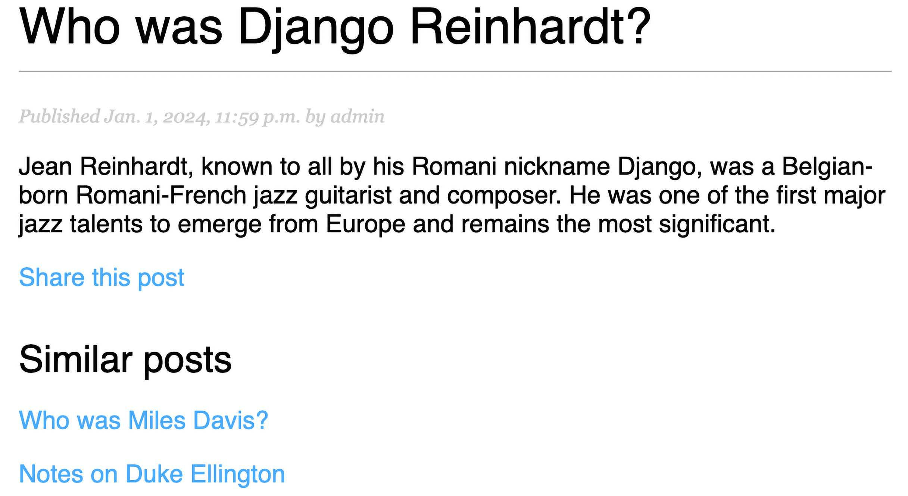

  **Figure 3.11**: The post detail page, including a list of similar posts

</div>

The posts recommended in the Similar posts section of the page appear in descending order based
on the number of shared tags with the original post.
We are now able to successfully recommend similar posts to readers. django-taggit also includes a
similar_objects() manager that you can use to retrieve objects by shared tags. You can take a look
at all django-taggit managers at [django-taggit](https://django-taggit.readthedocs.io/en/latest/api.html).
You can also add the list of tags to your post detail template in the same way as you did in the `blog/post/list.html` template.

<div align="center">

# `New Section Custom Template Tags and Filters`

</div>

# **Creating Custom Template Tags and Filters**🛠️

Django provides a variety of **built-in template tags**, such as `` and ``. These tags help in structuring and rendering templates efficiently. You might have already encountered some of these tags while working on section **(Building a Blog Application)** and **(Enhancing Your Blog with Advanced Features)**. 📖

For a complete reference of Django's **built-in template tags and filters**, visit the official Django documentation: 🔗 [Django Built-in Template Tags and Filters](https://docs.djangoproject.com/en/5.0/ref/templates/builtins/)

## Why Create Custom Template Tags? 🤔

Django also allows developers to **create their own custom template tags** to add specific functionalities that are **not covered by Django's default template tags**.

### Benefits of Custom Template Tags 🚀

- **Reusability**: Use the same logic across multiple templates.
- **Efficiency**: Perform **server-side processing** within templates.
- **Improved Readability**: Simplifies complex logic in templates.

## Example Use Case 📌

Imagine you want to display a list of **the latest blog posts** in the sidebar. Since this should be **available across all templates**, a **custom template tag** can help.

# Implementing Custom Template Tags in Django 🚀

Django provides built-in helper functions that allow you to easily create **custom template tags**. These tags enhance the functionality of Django templates by enabling the use of dynamic data.

## 🔹 Available Template Tag Helpers
Django offers the following helper functions:

- **`simple_tag`**: Processes the given data and returns a string.
- **`inclusion_tag`**: Processes the given data and returns a rendered template.

📌 **Note:** All template tags must reside inside a Django application.

---

## 📂 **Setting Up the Template Tags Directory**
To create custom template tags, follow these steps inside your **blog** application:

1. Navigate to your blog app directory.
2. Create a new directory called **`templatetags`**.
3. Add an empty `__init__.py` file inside `templatetags`.
4. Create a new Python file inside `templatetags` and name it **`blog_tags.py`**.

The directory structure should look like this:

```
blog/
 ├── __init__.py
 ├── models.py
 ├── ...
 ├── templatetags/
 │   ├── __init__.py
 │   ├── blog_tags.py
```

📌 **Important:** The filename of your template tag module is crucial as it will be used to load the tags in templates.

---

## 🛠 Creating a Simple Template Tag
Let's create a simple tag that retrieves the total number of published posts on the blog.

### 1️⃣ Define the Template Tag
Edit the `templatetags/blog_tags.py` file and add the following code:

```python
from django import template
from ..models import Post

register = template.Library()

@register.simple_tag
def total_posts():
    return Post.published.count()
```

### 🔍 Understanding the Code
- We define a `register` variable as an instance of `template.Library()`. This is required to register our template tags.
- We create a function `total_posts()` that returns the total number of published posts.
- The `@register.simple_tag` decorator registers the function as a Django template tag.
- The function name (`total_posts`) is used as the tag name inside templates.

📌 **Custom Naming:** You can register the tag with a different name using:
```python
@register.simple_tag(name='my_tag')
```

---

## 🔄 Restart Django Server
After adding a new template tag, **restart the Django development server** to apply the changes:
```bash
python manage.py runserver
```

---

## 🔗 Loading the Custom Template Tag in Templates
Before using a custom template tag, **load it in the template** using ``.

### 1️⃣ Load the Template Tag
Edit `blog/templates/base.html` and add `` at the top:

```html
 <!-- Load here -->
<!DOCTYPE html>
<html>
<head>
    <title></title>
    <link href="" rel="stylesheet">
</head>
<body>
    <div id="content">
        
        
    </div>
    <div id="sidebar">
        <h2>My Blog</h2>
        <p>
            This is my blog.<br>
            I've written  posts so far. <!-- Used here -->
        </p>
    </div>
</body>
</html>
```

📌 **Key Steps:**
- Load the `blog_tags` module using ``.
- Use `` inside the template to display the total number of posts.

---

## 🎯 Verifying the Output
1. Open your Django project in the browser:
   ```
   http://127.0.0.1:8000/blog/
   ```
2. The sidebar should now display the total number of published blog posts.

<div align="center">
  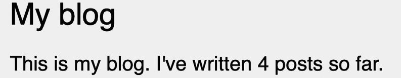

  **Figure 3.12**: The total posts published included in the sidebar

</div>

If you see the following error message, it’s very likely you didn’t restart the development server:

<div align="center">
  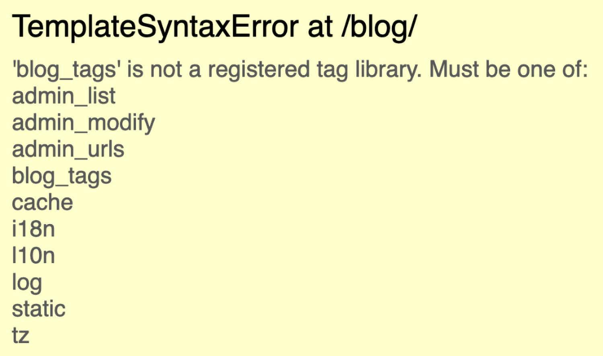

  **Figure 3.13**: The error message when a template tag library is not registered

</div>

# 📌 **Creating an Inclusion Template Tag**

## 📝 Overview
We will create a **Django template tag** that displays the latest posts in the blog's sidebar. This tag will be implemented as an **inclusion tag**, which means it will render a template with **context variables** returned by the template tag function.

---

## 🏗️ Step 1: Creating the Template Tag Function

📌 **Edit the `templatetags/blog_tags.py` file and add the following code:**

```python
from django import template
from ..models import Post

register = template.Library()

#..

@register.inclusion_tag('blog/post/latest_posts.html')
def show_latest_posts(count=5):
    latest_posts = Post.published.order_by('-publish')[:count]
    return {'latest_posts': latest_posts}
```

### 🔍 Explanation:
- The `@register.inclusion_tag` decorator registers the function as an **inclusion tag**.
- The function renders the template **blog/post/latest_posts.html** with the returned context.
- The `count` parameter (default **5**) allows specifying the number of latest posts to display.
- The query `Post.published.order_by('-publish')[:count]` retrieves the latest published posts.
- The function returns a **dictionary**, as required by inclusion tags, which will be used as the template context.
- The template tag can now be used as `` in templates to display the latest three posts.

---

## 🏗️ Step 2: Creating the Template for Latest Posts

📌 **Create a new file `blog/post/latest_posts.html` and add the following code:**

```html
<ul>
    
    <li>
        <a href="{{ post.get_absolute_url }}">{{ post.title }}</a>
    </li>
    
</ul>
```

### 🔍 Explanation:
- The **`latest_posts` variable** is passed to the template from the template tag function.
- An **unordered list (`<ul>`)** is used to display each post title as a clickable link.
- The `` loop iterates through the returned posts.
- `{{ post.get_absolute_url }}` generates the link to the post.

---

## 🏗️ Step 3: Adding the Template Tag to the Base Template

📌 **Edit the `blog/base.html` file and add the following lines in the sidebar:**

```html


<!DOCTYPE html>
<html>
<head>
    <title></title>
    <link href="" rel="stylesheet">
</head>
<body>
    <div id="content">
        
        
    </div>
    <div id="sidebar">
        <h2>My blog</h2>
        <p>
            This is my blog.<br>
            I've written  posts so far.
        </p>
        <h3>Latest posts</h3>  <!-- Added heading for latest posts -->
          <!-- Render latest posts here -->
    </div>
</body>
</html>
```

### 🔍 Explanation:
- The `` **loads the custom template tags** defined in `blog_tags.py`.
- The `<h3>` heading **introduces the latest posts section** in the sidebar.
- `` calls the template tag, **passing `3` as the number of posts to display**.
- The inclusion tag renders the `latest_posts.html` **inside the sidebar**, displaying the latest blog posts dynamically.

The template tag is called, passing the number of posts to display, and the template is rendered in
place with the given context.

Next, return to your browser and refresh the page. The sidebar should now look like this:

<div align="center">
  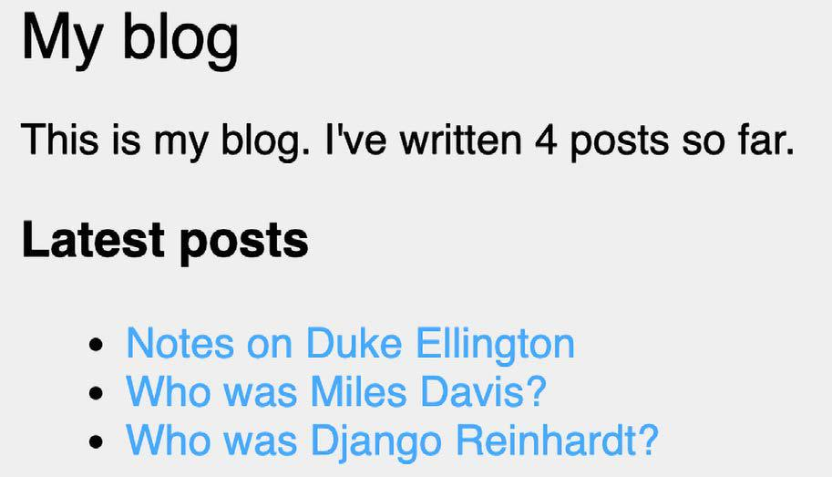

  **Figure 3.14**: The blog sidebar, including the latest published posts

</div>

# 📌 **Creating a Template Tag That Returns a QuerySe**t

## 📝 Overview
In this section, we will create a **Django template tag** that returns a **QuerySet** instead of rendering output directly. The QuerySet will contain the **most commented posts**, and we will store the result in a **variable** for later use in the template.

---

## 🏗️ Step 1: Creating the Template Tag Function

📌 **Edit the `templatetags/blog_tags.py` file and add the following import and template tag:**

```python
from django.db.models import Count
from django import template
from ..models import Post

register = template.Library()

@register.simple_tag
def get_most_commented_posts(count=5):
    return Post.published.annotate(
        total_comments=Count('comments')
    ).order_by('-total_comments')[:count]
```

### 🔍 Explanation:
- The `@register.simple_tag` decorator registers the function as a **simple template tag**.
- `annotate(total_comments=Count('comments'))` adds an **aggregated field** that counts comments for each post.
- The QuerySet is **ordered** by the `total_comments` field in **descending order**.
- The `count` parameter (default **5**) determines the **number of results** returned.
- Unlike **inclusion tags**, this tag **does not render a template** but instead **returns data**.

🛠 **Django also provides other aggregation functions:** `Avg`, `Max`, `Min`, and `Sum`. You can read more about them [here](https://docs.djangoproject.com/en/5.0/topics/db/aggregation/).

---

## 🏗️ Step 2: Adding the Template Tag to the Sidebar

📌 **Edit the `blog/base.html` file and add the following lines:**

```html


<!DOCTYPE html>
<html>
<head>
    <title></title>
    <link href="" rel="stylesheet">
</head>
<body>
    <div id="content">
        
        
    </div>
    <div id="sidebar">
        <h2>My blog</h2>
        <p>
            This is my blog.<br>
            I've written  posts so far.
        </p>
        <h3>Latest posts</h3>
        
        
        <h3>Most commented posts</h3> <!-- Added heading for most commented posts -->
         <!-- Store result in a variable -->
        <ul> <!-- Unordered list for displaying posts -->
             <!-- Loop through retrieved posts -->
            <li>
                <a href="{{ post.get_absolute_url }}">{{ post.title }}</a>
            </li>
            
        </ul>
    </div>
</body>
</html>
```

### 🔍 Explanation:
- `` **stores the result** of the tag into a variable `most_commented_posts`.
- A **`<h3>` heading** is added to **highlight** the most commented posts.
- The **`for` loop** iterates over `most_commented_posts` to **display the post titles** as clickable links.
- This setup ensures that the **most commented posts are dynamically displayed** in the sidebar.

Now open your browser and refresh the page to see the final result. It should look like the following:
<div align="center">
  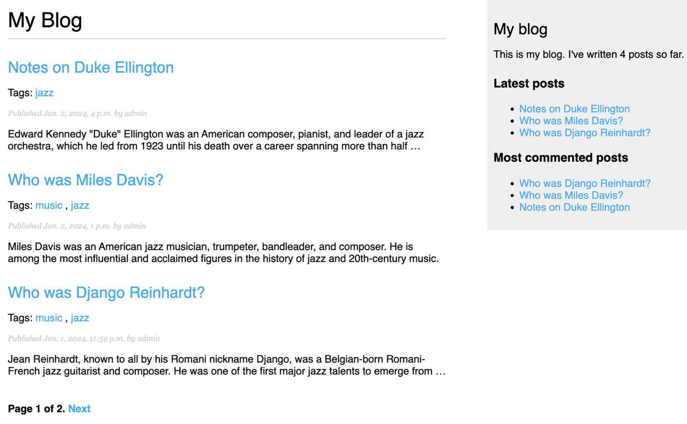

  **Figure 3.15**: The post list view, including the complete sidebar with the latest and most commented
posts

</div>

# 🎨 **Implementing Custom Template Filters**

## 📝 Overview
Django provides a variety of **built-in template filters** that allow you to manipulate variables directly in templates. These filters are essentially **Python functions** that take one or two parameters:

- **The value of the variable** the filter is applied to.
- **An optional argument** (if required by the filter).

Filters return a **processed value** that can be displayed or further manipulated by additional filters.

---

## 🔹 Syntax of Template Filters

- A **basic filter** is applied using the following syntax:
  
  ```django
  {{ variable|my_filter }}
  ```
  
- Filters with arguments use the syntax:
  
  ```django
  {{ variable|my_filter:"foo" }}
  ```
  
- **Multiple filters** can be chained together:
  
  ```django
  {{ variable|filter1|filter2 }}
  ```
  Each filter is applied sequentially to the output of the previous one.

---

## 🔹 Example: Using Built-in Filters

### **1️⃣ Capitalizing the First Letter**
```django
{{ value|capfirst }}
```
📌 If `value = "django"`, the output will be:
```
Django
```

### **2️⃣ Converting to Lowercase**
```django
{{ value|lower }}
```
📌 If `value = "HELLO WORLD"`, the output will be:
```
hello world
```

### **3️⃣ Applying Multiple Filters**
```django
{{ value|capfirst|lower }}
```
📌 If `value = "DJANGO FRAMEWORK"`, the output will be:
```
django framework
```

Django offers **many built-in template filters** that help with text manipulation, formatting, and data transformation. You can explore the complete list of filters in the Django documentation:
🔗 [Django’s Built-in Template Filters](https://docs.djangoproject.com/en/5.0/ref/templates/builtins/#built-in-filter-reference)

# 📝 **Creating a Template Filter to Support Markdown Syntax**

## 🎯 Overview

Markdown is a **lightweight plain-text formatting syntax** that allows users to write formatted content easily, which is then converted into **HTML**. In this guide, we will **create a custom Django template filter** that enables Markdown support for blog posts. This allows non-technical contributors to write posts without needing to learn HTML.

---

## 🔧 Step 1: Installing the Markdown Library

Before implementing the template filter, install the **Python Markdown module** using the following command:

```sh
python -m pip install markdown==3.6
```

This will ensure that Markdown syntax is properly converted into **HTML**.

---

## 🏗️ Step 2: Creating the Custom Template Filter

📌 **Edit the ************`templatetags/blog_tags.py`************ file and add the following code:**

```python
import markdown
from django.utils.safestring import mark_safe

#..

@register.filter(name='markdown')
def markdown_format(text):
    return mark_safe(markdown.markdown(text))
```

### 🔍 Explanation:

- The `@register.filter(name='markdown')` registers `markdown_format` as a **template filter**.
- The function **converts Markdown text into HTML** using `markdown.markdown(text)`.
- The `mark_safe()` function ensures the **HTML output is not escaped** by Django’s template engine.
- **To prevent naming conflicts**, the function is named `markdown_format`, but the filter itself is called `markdown` in templates.

---

## 🎨 Step 3: Using the Markdown Filter in Templates

Once the custom filter is registered, you can use it in Django templates like this:

```django
{{ post.body|markdown }}
```

📌 This will **convert the Markdown content** in `post.body` into properly formatted HTML.

---

## 🔐 Security Considerations

🔴 **Django escapes all HTML content by default** to prevent security vulnerabilities, such as XSS (Cross-Site Scripting).

✅ **mark\_safe() is used to allow safe HTML rendering**. However, be cautious:

- **Only use ************`mark_safe`************ on content you trust** (e.g., staff-generated content).
- **Do not apply ************`mark_safe`************ to user-submitted content** to avoid potential security risks.


# 📝 **Enhancing Templates with Markdown Support**

## 🎯 Overview
In this guide, we will modify our Django templates to support **Markdown formatting**. This will allow blog posts to be written in **Markdown syntax** while being automatically converted into **HTML** when rendered in templates.

---

## 🏗️ Step 1: Updating `blog/post/detail.html`

📌 **Modify the `blog/post/detail.html` template and add the following code:**

```django

  <!-- Load template tag -->
{{ post.title }}

<h1>{{ post.title }}</h1>
<p class="date">
    Published {{ post.publish }} by {{ post.author }}
</p>
{{ post.body|markdown }} <!-- Markdown Filter -->
<p>
    <a href="">
        Share this post
    </a>
</p>
<h2>Similar posts</h2>

    <p>
        <a href="{{ post.get_absolute_url }}">{{ post.title }}</a>
    </p>

    There are no similar posts yet.


    <h2>
        {{ total_comments }} comment{{ total_comments|pluralize }}
    </h2>


    <div class="comment">
        <p class="info">
            Comment {{ forloop.counter }} by {{ comment.name }}
            {{ comment.created }}
        </p>
        {{ comment.body|linebreaks }}
    </div>

    <p>There are no comments yet.</p>



```

### 🔍 Explanation:
- The **`markdown` filter** is now applied to `{{ post.body }}`, replacing `linebreaks`.
- This allows Markdown content to be transformed into **HTML**.
- Markdown formatting, such as **bold text**, *italic text*, lists, and links, will now be rendered correctly in the template.

💡 **Pro Tip:** Storing text in **Markdown format** in the database is a **secure strategy**, as it reduces the risk of injecting malicious HTML while maintaining text formatting.

---

## 🏗️ Step 2: Updating `blog/post/list.html`

📌 **Modify the `blog/post/list.html` template and add the following:**

```django

 <!-- Load template tag -->
My Blog

<h1>My Blog</h1>

    <h2>Posts tagged with "{{ tag.name }}"</h2>


    <h2>
        <a href="{{ post.get_absolute_url }}">
            {{ post.title }}
        </a>
    </h2>
    <p class="tags">
        Tags:
        
            <a href="">
                {{ tag.name }}
            </a>
            , 
        
    </p>
    <p class="date">
        Published {{ post.publish }} by {{ post.author }}
    </p>
    {{ post.body|markdown|truncatewords_html:30 }}  <!-- Add markdown filter -->



```

### 🔍 Explanation:
- The **`markdown` filter** is applied to `post.body`.
- The **`truncatewords` filter** is replaced with **`truncatewords_html`**.
- `truncatewords_html` ensures that HTML tags remain properly closed when truncating content.

---

## 📝 Step 3: Creating a Markdown-formatted Blog Post

To test the Markdown support, open the Django admin panel and **create a new post** at:

🔗 **http://127.0.0.1:8000/admin/blog/post/add/**

<div align="center">
  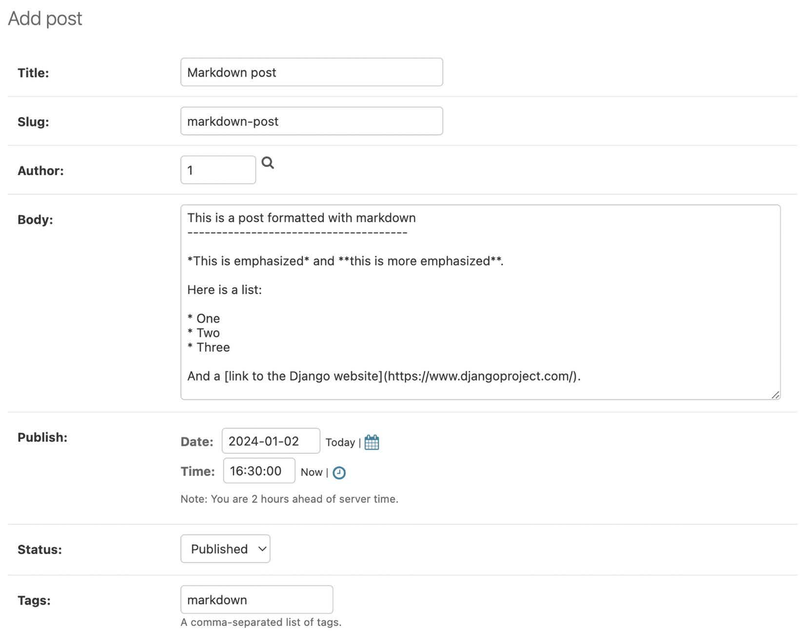

  **Figure 3.16**: The post with Markdown content rendered as HTML

</div>

📌 **Example Markdown Content:**

```
This is a post formatted with markdown
--------------------------------------
*This is emphasized* and **this is more emphasized**.

Here is a list:
* One
* Two
* Three

And a [link to the Django website](https://www.djangoproject.com/).
```
Open http://127.0.0.1:8000/blog/ in your browser and take a look at how the new post is rendered.
You should see the following output:

<div align="center">
  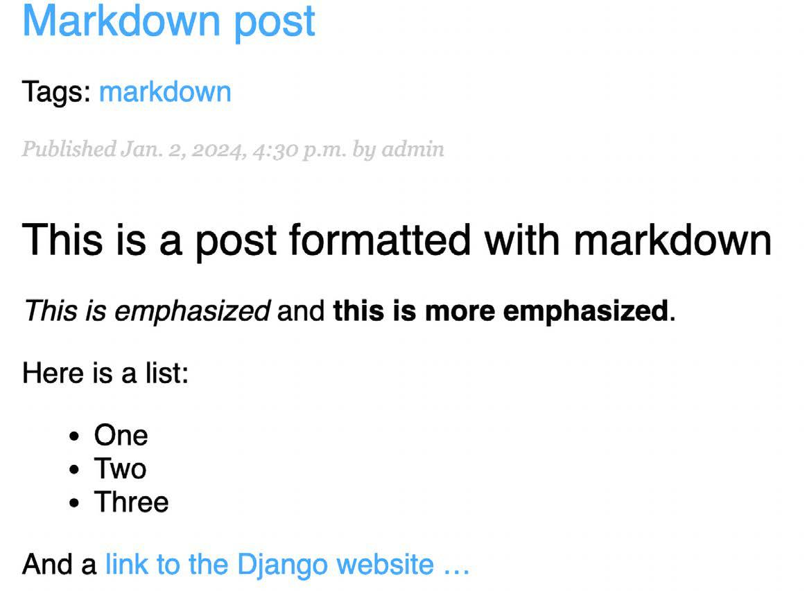

  **Figure 3.17**: The post with Markdown content rendered as HTML

</div>

As you can see in Figure 3.17, custom template filters are very useful for customizing formatting. You
can find more information about custom filters at [Filters](https://docs.djangoproject.com/en/5.0/howto/custom-template-tags/#writing-custom-template-filters).

### 🔍 Expected Output (Rendered HTML):

```html
<h2>This is a post formatted with markdown</h2>
<p><em>This is emphasized</em> and <strong>this is more emphasized</strong>.</p>
<ul>
    <li>One</li>
    <li>Two</li>
    <li>Three</li>
</ul>
<p>And a <a href="https://www.djangoproject.com/">link to the Django website</a>.</p>
```


<div align="center">

# `New Section Site Map`

</div>

#  **Adding a Sitemap to Your Django Site** 📌

Django provides a **sitemap framework** that dynamically generates sitemaps for your website. A **sitemap** is an XML file that helps search engines index the pages of your website by indicating their relevance and update frequency. Using a sitemap improves your site's visibility in search engine rankings by making content more accessible to crawlers. 🚀

## ✅ Prerequisites
The Django **sitemap framework** relies on `django.contrib.sites`, which allows you to associate objects with specific websites running on your project. This is particularly useful for managing multiple sites with a single Django project.

## 🔧 Installing and Configuring the Sitemap Framework
To set up the sitemap framework, we need to **activate both the sites and sitemap applications** in our Django project. We will build a sitemap for a **blog**, including links to all published posts.

### 1️⃣ Update `settings.py`
Edit the `settings.py` file and add `django.contrib.sites` and `django.contrib.sitemaps` to the `INSTALLED_APPS` list. Also, define a new setting for the **Site ID**:

```python
# settings.py
SITE_ID = 1  # Define site ID

INSTALLED_APPS = [
    'django.contrib.admin',
    'django.contrib.auth',
    'django.contrib.contenttypes',
    'django.contrib.sessions',
    'django.contrib.messages',
    'django.contrib.sites',  # Activate sites
    'django.contrib.sitemaps',  # Activate sitemaps
    'django.contrib.staticfiles',
    'taggit',
    'blog.apps.BlogConfig',
]
```

### 2️⃣ Apply Database Migrations
After updating `settings.py`, run the following command to **create the necessary database tables**:

```sh
python manage.py migrate
```

### ✅ Expected Output
After running the migration command, you should see output similar to the following:

```sh
Applying sites.0001_initial... OK
Applying sites.0002_alter_domain_unique... OK
```

Now, the **sites application** is successfully synchronized with your database. 🎉

# 🗺️ **Creating a Sitemap for Your Django Blog**

To generate a sitemap for your blog, follow these steps to create and configure a **sitemaps.py** file. This will help search engines efficiently index your website and improve SEO performance. 🚀

## 📂 Step 1: Create the `sitemaps.py` File
Inside your **blog application directory**, create a new file named `sitemaps.py`. Open the file and add the following code:

```python
from django.contrib.sitemaps import Sitemap
from .models import Post

class PostSitemap(Sitemap):
    changefreq = 'weekly'  # Defines how frequently the posts change
    priority = 0.9  # Sets the priority of posts in search engine indexing

    def items(self):
        return Post.published.all()  # Retrieves all published posts

    def lastmod(self, obj):
        return obj.updated  # Returns the last modified date of each post
```

## 🔍 Explanation of `PostSitemap`
We have created a **custom sitemap** by inheriting the `Sitemap` class from `django.contrib.sitemaps`. Here's how it works:

### 📌 `changefreq = 'weekly'`
- This attribute indicates how often the content on the page is expected to change.
- In this case, it is set to `'weekly'`, meaning search engines should check the page every week for updates.
- Other possible values include `'always'`, `'hourly'`, `'daily'`, `'monthly'`, `'yearly'`, and `'never'`.

### 📌 `priority = 0.9`
- This attribute assigns a priority score (between `0.0` and `1.0`) to indicate the importance of a page in comparison to other pages on the site.
- A value of `0.9` means that post pages are highly relevant and should be indexed more frequently.

### 📌 `items()` Method
- This method returns a **QuerySet** of objects to be included in the sitemap.
- In our case, `Post.published.all()` retrieves all **published blog posts**.
- Ensure that your `Post` model has a **published manager** to filter published posts.

### 📌 `lastmod(obj)` Method
- This method returns the **last modified date** of each object.
- It helps search engines determine if the content has changed since the last crawl.
- Here, `obj.updated` refers to the `updated` field in the `Post` model, which tracks the last update time of a blog post.

## 🔗 How Django Retrieves URLs
By default, Django calls the **`get_absolute_url()`** method on each object to retrieve its **canonical URL**. This means:
- If your model has a `get_absolute_url()` method, Django will use it to generate the URLs automatically.
- This method should be implemented in the `Post` model to ensure correct URL resolution.

## 🌍 Customizing URL Locations
If you want to **manually specify** the URL for each object instead of using `get_absolute_url()`, you can override the `location()` method in your sitemap class. Example:

```python
class PostSitemap(Sitemap):
    def location(self, obj):
        return f'/blog/{obj.slug}/'  # Manually defining the URL pattern
```

## 📖 Further Reference
For a complete guide on Django's sitemap framework, visit the **official documentation**:
🔗 [Django Sitemap Reference](https://docs.djangoproject.com/en/5.0/ref/contrib/sitemaps/)


# 🗺️ **Configuring the Sitemap in Django**

To enable a sitemap for your Django project, you need to edit the **main `urls.py`** file and define the appropriate configurations. This allows search engines to access a structured list of URLs from your website for better indexing and visibility. 🚀

---

## 📂 Step 1: Update `urls.py`
Edit the **main `urls.py`** file of your `mysite` project and add the sitemap functionality by modifying it as follows:

```python
from django.contrib import admin
from django.contrib.sitemaps.views import sitemap  # Import sitemap view
from django.urls import include, path
from blog.sitemaps import PostSitemap  # Import PostSitemap

# Define sitemaps dictionary
sitemaps = {
    'posts': PostSitemap,
}

urlpatterns = [
    path('admin/', admin.site.urls),
    path('blog/', include('blog.urls', namespace='blog')),
    path(
        'sitemap.xml',
        sitemap,
        {'sitemaps': sitemaps},
        name='django.contrib.sitemaps.views.sitemap'
    )  # New sitemap path
]
```

### 🔍 Detailed Explanation
- **Importing Dependencies**:
  - `sitemap` from `django.contrib.sitemaps.views` is required to render the sitemap XML.
  - `PostSitemap` from `blog.sitemaps` is the custom sitemap class that defines how the sitemap is structured.
- **Defining the `sitemaps` Dictionary**:
  - This dictionary stores all available sitemaps for the project.
  - You can add multiple sitemaps here if different models need to be indexed.
- **Defining the URL Pattern for the Sitemap**:
  - The `sitemap.xml` path is mapped to Django’s built-in sitemap view.
  - The `sitemaps` dictionary is passed as a parameter, ensuring dynamic sitemap generation.
  - This setup ensures that accessing `/sitemap.xml` returns an XML file listing all published posts dynamically.

---

## 🚀 Step 2: Running the Development Server
Once the sitemap is configured, restart the Django development server:

```sh
python manage.py runserver
```

Now, open your browser and visit:

🔗 [http://127.0.0.1:8000/sitemap.xml](http://127.0.0.1:8000/sitemap.xml)

You should see an XML file containing URLs for all published blog posts. 🎉

<div align="center">
  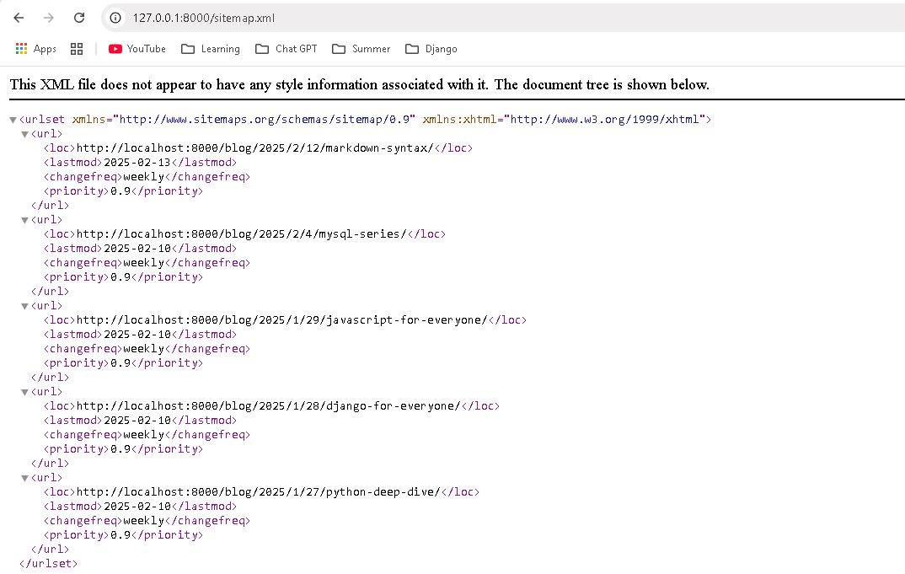
</div>


---

## 🌐 Understanding Sitemap Attributes
### 📌 `lastmod` Attribute
- This represents the last modification date of a post.
- It is set in the `PostSitemap` class using the `updated` field from the `Post` model.
- Search engines use this information to determine whether a page has been updated since their last crawl.

### 📌 `changefreq` & `priority` Attributes
- `changefreq`: Specifies how often a post changes (e.g., `'weekly'`).
- `priority`: Indicates the importance of the page, with a maximum value of `1`.
- These attributes help search engines decide how often to revisit pages.

### 📌 Default Domain in Sitemap
- By default, URLs in the sitemap use `example.com`, which comes from Django’s **Sites framework**.
- If the default domain is not changed, search engines might not properly index the URLs.

---

## 🔧 Step 3: Configuring the Sites Framework
Since Django’s **Sites framework** is used to generate absolute URLs, we need to configure it properly.

### 🛠️ Steps to Configure Sites Framework
1️⃣ Open the **admin panel** by visiting:
   - 🔗 [http://127.0.0.1:8000/admin/sites/site/](http://127.0.0.1:8000/admin/sites/site/)

<div align="center">
  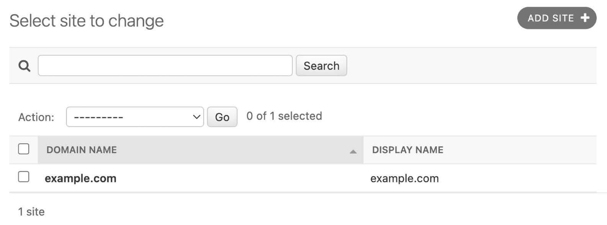

  **Figure 3.18**: The Django administration list view for the Site model of the site’s framework

</div>


2️⃣ In the **Sites framework admin panel**, update the **domain name**:
   - Change it from `example.com` to `localhost:8000` for local development.
   - This ensures correct URL generation for your local environment.
   - Click **Save** to apply changes.

3️⃣ Open `/sitemap.xml` again:
   - 🔗 [http://127.0.0.1:8000/sitemap.xml](http://127.0.0.1:8000/sitemap.xml)
   - URLs should now be formatted correctly (e.g., `http://localhost:8000/blog/2024/1/22/markdown-post/`).

---

## 🌍 Deploying to Production
In a **production environment**, you need to ensure that:
- The **Sites framework** domain is updated to your actual website domain.
- The sitemap generates URLs based on the correct production domain.
- Visit `/sitemap.xml` and verify that URLs are formatted correctly with your website's domain.

For more details, check the official Django documentation on **Sites framework**:
🔗 [Django Sites Framework Reference](https://docs.djangoproject.com/en/5.0/ref/contrib/sites/)


<div align="center">

# `New Section Feeds For Blog Posts`

</div>

# 📡 **Creating Feeds for Blog Posts in Django**

Django provides a **built-in syndication feed framework** that allows you to dynamically generate **RSS or Atom feeds** for your blog posts. This feature works similarly to sitemaps, helping users stay updated with your latest content. 🚀

## 📌 What is a Web Feed?

A **web feed** is an XML-based format that delivers **recently updated content** to users who subscribe to it. Users can access these updates using a **feed aggregator**—a software tool designed to read feeds and notify users of new content.

---

## 📂 Step 1: Create the `feeds.py` File

To set up the feed system in Django, follow these steps:

1️⃣ Inside your **blog application directory**, create a new file named `feeds.py`.

2️⃣ Open the file and add the following code:

```python
import markdown
from django.contrib.syndication.views import Feed
from django.template.defaultfilters import truncatewords_html
from django.urls import reverse_lazy
from .models import Post

class LatestPostsFeed(Feed):
    title = 'My blog'  # Feed title
    link = reverse_lazy('blog:post_list')  # URL to the blog post list
    description = 'New posts of my blog.'  # Feed description

    def items(self):
        return Post.published.all()[:5]  # Retrieve the last 5 published posts

    def item_title(self, item):
        return item.title  # Return the title of each post

    def item_description(self, item):
        return truncatewords_html(markdown.markdown(item.body), 30)  # Convert Markdown to HTML and truncate

    def item_pubdate(self, item):
        return item.publish  # Return the publication date
```

---

## 🔍 Understanding the Code

### 1️⃣ Subclassing `Feed`

- The **`LatestPostsFeed`** class extends Django’s `Feed` class from `django.contrib.syndication.views`.
- This allows us to **define a custom feed** with specific attributes and methods.

### 2️⃣ Defining Feed Attributes

- **`title`** → Specifies the title of the feed, appearing as `<title>` in RSS.
- **`link`** → Uses `reverse_lazy()` to dynamically generate the **URL for the feed**, linking to the blog post list.
- **`description`** → Provides a short description for the feed.

### 3️⃣ `reverse_lazy()` vs `reverse()`

- The `reverse()` method **generates URLs by their name** (and optional parameters).
- `reverse_lazy()` is a **lazy-evaluated version** of `reverse()`, allowing URL reversal **before** the project’s URL configuration is fully loaded.
- This is useful when **defining class attributes** like `link`.

### 4️⃣ `items()` Method

- Retrieves **the last five published blog posts** (`Post.published.all()[:5]`).
- The returned objects will be **included in the feed**.

### 5️⃣ `item_title()`, `item_description()`, and `item_pubdate()` Methods

- These methods receive \*\*each object from \*\***`items()`**return:
  - **Title** → `item_title()` extracts the post title.
  - **Description** → `item_description()`:
    - Uses `markdown.markdown()` to **convert Markdown content** into HTML.
    - Applies `truncatewords_html()` to **limit descriptions to 30 words**, preventing unclosed HTML tags.
  - **Publication Date** → `item_pubdate()` returns the post’s publish date.

---

## 🌍 Why Use Feeds?

✅ **User Convenience** → Users can subscribe to your blog and receive automatic updates.
✅ **SEO Benefits** → Feeds help search engines **discover new content faster**.
✅ **Better Engagement** → Readers stay informed without manually visiting your site.

For more details, visit Django’s **official feed framework documentation**:
🔗 [Django Syndication Framework](https://docs.djangoproject.com/en/5.0/ref/contrib/syndication/)


# 📡 **Adding an RSS Feed to Your Django Blog**

To enable an RSS feed for your blog, you need to modify the **`blog/urls.py`** file and define a new URL pattern for the feed. This will allow users to subscribe to the blog’s latest posts via an RSS feed reader. 🚀

---

## 📂 Step 1: Update `urls.py`
Edit your **`blog/urls.py`** file to include the feed URL pattern:

```python
from django.urls import path
from . import views
from .feeds import LatestPostsFeed  # Import LatestPostsFeed

app_name = 'blog'
urlpatterns = [
    # Post views
    path('', views.post_list, name='post_list'),
    # path('', views.PostListView.as_view(), name='post_list'),
    path('tag/<slug:tag_slug>/', views.post_list, name='post_list_by_tag'),
    path('<int:year>/<int:month>/<int:day>/<slug:post>/', views.post_detail, name='post_detail'),
    path('<int:post_id>/share/', views.post_share, name='post_share'),
    path('<int:post_id>/comment/', views.post_comment, name='post_comment'),
    path('feed/', LatestPostsFeed(), name='post_feed'),  # Add feed path
]
```

---

## 🔍 Understanding the Code
### 📌 Importing the `LatestPostsFeed` Class
- The `LatestPostsFeed` class is **imported from `feeds.py`**, where we previously defined it.
- This class generates the **RSS feed** for our latest blog posts.

### 📌 Adding the Feed URL Pattern
- The line `path('feed/', LatestPostsFeed(), name='post_feed')` **maps the RSS feed** to the `/blog/feed/` endpoint.
- Users can now access the feed by navigating to:
  - 🔗 [http://127.0.0.1:8000/blog/feed/](http://127.0.0.1:8000/blog/feed/)

---

## 🚀 Step 2: Testing the RSS Feed
After updating `urls.py`, start your Django development server:

```sh
python manage.py runserver
```

Then, open your browser and visit:

🔗 [http://127.0.0.1:8000/blog/feed/](http://127.0.0.1:8000/blog/feed/)

You should now see an **RSS feed in XML format** containing the last five blog posts:

```xml
<rss xmlns:atom="http://www.w3.org/2005/Atom" version="2.0">
 <channel>
   <title>My blog</title>
   <link>http://localhost:8000/blog/</link>
   <description>New posts of my blog.</description>
   <atom:link href="http://localhost:8000/blog/feed/" rel="self"/>
   <language>en-us</language>
   <lastBuildDate>Tue, 02 Jan 2024 16:30:00 +0000</lastBuildDate>
   <item>
     <title>Markdown post</title>
     <link>http://localhost:8000/blog/2024/1/2/markdown-post/</link>
     <description>This is a post formatted with ...</description>
     <guid>http://localhost:8000/blog/2024/1/2/markdown-post/</guid>
   </item>
   ...
 </channel>
</rss>
```

### 🔍 Browser Behavior
- **Chrome** → Displays raw XML code.
- **Safari** → Prompts to install an RSS feed reader.

---

## 🌍 Step 3: Using an RSS Feed Reader
To view the feed in a more **user-friendly interface**, install an **RSS feed reader**. We recommend **Fluent Reader**, a cross-platform RSS reader.

### 🛠️ Installing Fluent Reader
1️⃣ Download Fluent Reader from GitHub:
   - 🔗 [Fluent Reader Releases](https://github.com/yang991178/fluent-reader/releases)
   - Available for **Linux, macOS, and Windows**.

2️⃣ Install and open Fluent Reader.

<div align="center">
  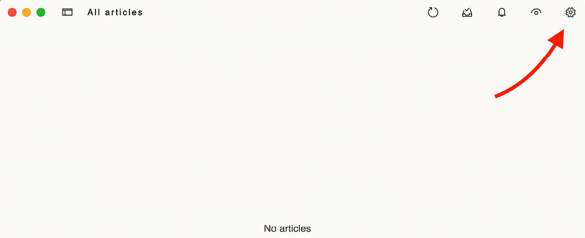

  **Figure 3.20**: Fluent Reader with no RSS feed sources

</div>

3️⃣ Click on the **Settings Icon** in the top-right corner and add a new RSS feed source:

<div align="center">
  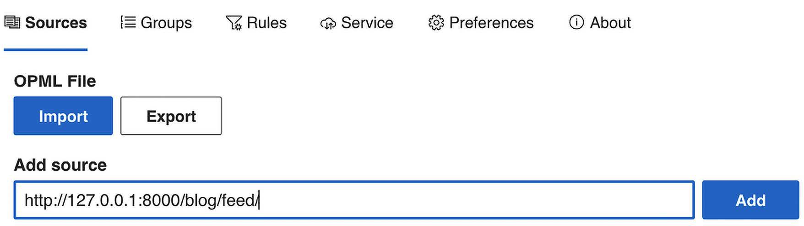

  **Figure 3.21**: Adding an RSS feed in Fluent Reader

</div>

4️⃣ Enter the **feed URL**:
   - 🔗 [http://127.0.0.1:8000/blog/feed/](http://127.0.0.1:8000/blog/feed/)
   - Click the **Add** button.

<div align="center">
  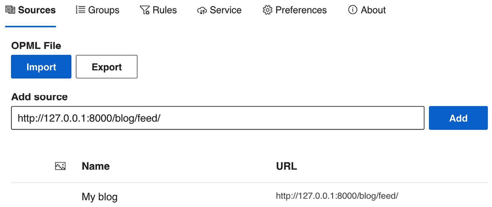

  **Figure 3.22**: RSS feed sources in Fluent Reader

</div>

5️⃣ Your blog feed will now appear in Fluent Reader! 🎉

<div align="center">
  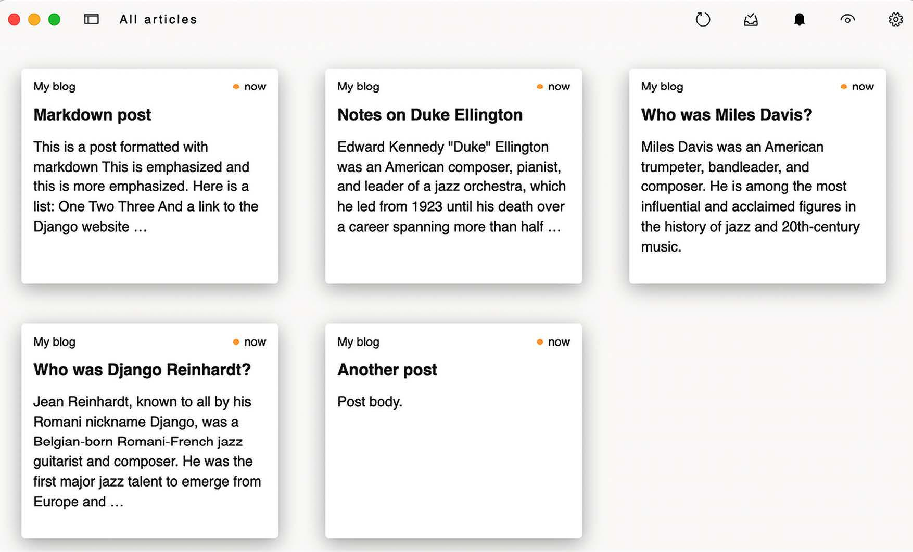

  **Figure 3.23**: : RSS feed of the blog in Fluent Reader

</div>

---

Click on a post to see a description:

<div align="center">
  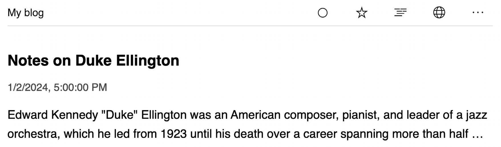

  **Figure 3.24**: The post description in Fluent Reader

</div>

Click on the third icon in the top-right corner of the window to load the full content of the post page:

<div align="center">
  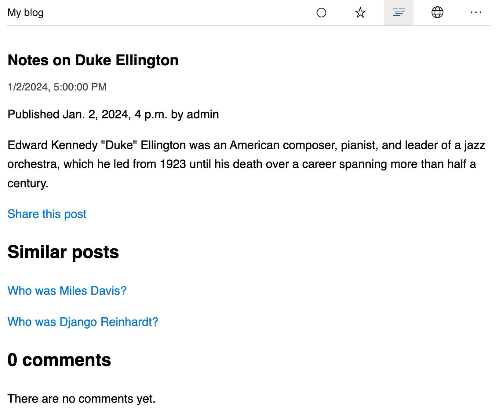

  **Figure 3.25**: The full content of a post in Fluent Reader

</div>

# 📡 Adding an RSS Feed Subscription Link to Your Blog Sidebar

To make it easier for users to subscribe to your blog’s **RSS feed**, you need to add a **subscription link** in the blog’s sidebar. This allows visitors to quickly access and subscribe to your content updates. 🚀

---

## 📂 Step 1: Modify the `base.html` Template

Edit the **`blog/base.html`** template and insert the following **RSS feed link** inside the sidebar:

```html


<!DOCTYPE html>
<html>

<head>
    <title></title>
    <link href="" rel="stylesheet">
</head>
<body>
    <div id="content">
        
        
    </div>
    <div id="sidebar">
        <h2>My blog</h2>
        <p>
            This is my blog.<br>
            I've written  posts so far.
        </p>
        <p>
            <a href=""> <!-- Adding RSS Feed Link -->
                📡 Subscribe to my RSS feed
            </a>
        </p>
        
        <h3>Latest posts</h3>
        
        
        <h3>Most commented posts</h3>
        
        <ul>
            
            <li>
                <a href="{{ post.get_absolute_url }}">{{ post.title }}</a>
            </li>
            
        </ul>
    </div>
</body>
</html>
```

---

## 🔍 Understanding the Code

### 📌 Adding the RSS Feed Subscription Link

- The `<a>` tag inside the sidebar provides a **clickable link** for users to subscribe to the **RSS feed**.
- `` dynamically generates the **URL to the RSS feed**.
- The 📡 emoji makes the link **visually appealing**.
- Adding an RSS feed link makes it easier for users to subscribe and **stay updated**.

---

## 🚀 Step 2: Testing the RSS Subscription Link

After modifying `base.html`, restart your Django server:

```sh
python manage.py runserver
```

Now, **open your browser** and navigate to:

🔗 [http://127.0.0.1:8000/blog/](http://127.0.0.1:8000/blog/)

You should see the **new RSS feed subscription link** in the sidebar. Clicking on it will direct users to the **RSS feed page**.

<div align="center">
  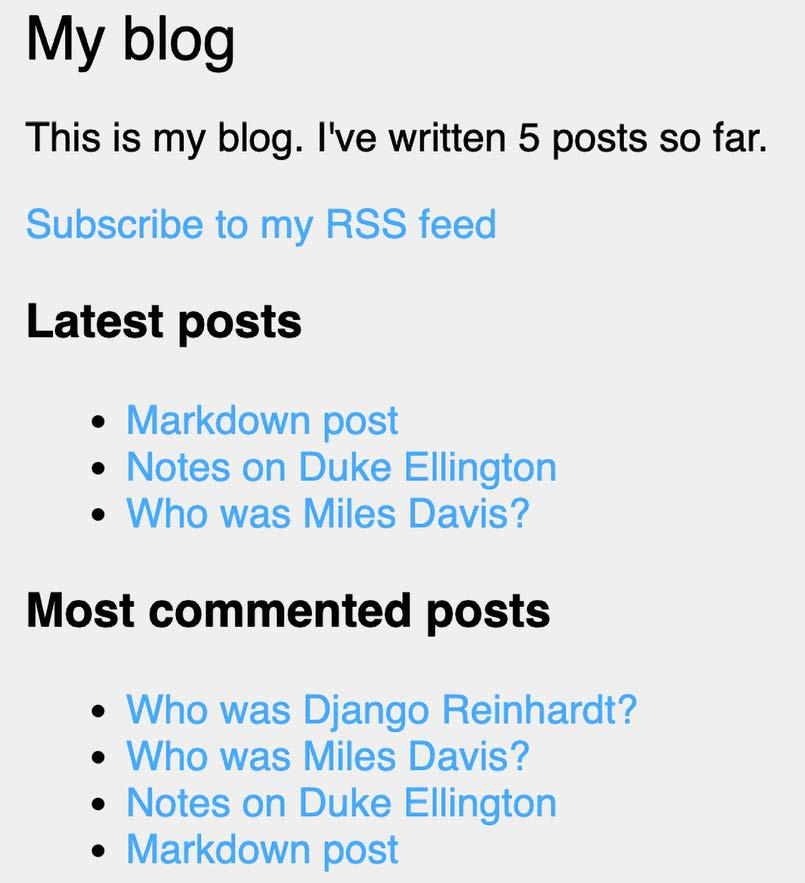

  **Figure 3.26**: The RSS feed subscription link added to the sidebar

</div>


---

## 🌍 Step 3: Viewing the Feed

1️⃣ Click on the **"Subscribe to my RSS feed"** link in the sidebar.

2️⃣ Your browser will display **raw XML data** similar to:

```xml
<rss xmlns:atom="http://www.w3.org/2005/Atom" version="2.0">
 <channel>
   <title>My blog</title>
   <link>http://localhost:8000/blog/</link>
   <description>New posts of my blog.</description>
   <atom:link href="http://localhost:8000/blog/feed/" rel="self"/>
   <language>en-us</language>
   <lastBuildDate>Tue, 02 Jan 2024 16:30:00 +0000</lastBuildDate>
   <item>
     <title>Markdown post</title>
     <link>http://localhost:8000/blog/2024/1/2/markdown-post/</link>
     <description>This is a post formatted with ...</description>
     <guid>http://localhost:8000/blog/2024/1/2/markdown-post/</guid>
   </item>
   ...
 </channel>
</rss>
```

### 🔍 Browser Behavior

- **Google Chrome** → Displays raw XML.
- **Safari** → Prompts to install an RSS reader.

To view the feed in a **user-friendly format**, install an RSS reader like **Fluent Reader**.

<div align="center">

# `New Section Full-Text Search`

</div>

# 🔍 **Adding Full-Text Search to Your Django Blog**

Searching for data in a database is a **common requirement** for web applications. While Django’s ORM allows for simple searches using filters like `contains` and `icontains`, **complex queries** require a more advanced approach. In this section, we will enhance our blog by implementing **full-text search** using PostgreSQL. 

---

## 📌 Basic Searching with Django ORM

Django’s ORM provides **basic filtering options** using the `contains` filter. For example, to find posts that contain the word `framework` in their body:

```python
from blog.models import Post

Post.objects.filter(body__contains='framework')
```

- `contains` → Performs a **case-sensitive** match.
- `icontains` → Performs a **case-insensitive** match.
- These methods work well for **small datasets**, but they are **not efficient** for complex searches.

---

## 🌍 Why Use Full-Text Search?

When dealing with **large text data**, basic filtering is **not sufficient**. Full-text search provides:

✅ **Advanced search capabilities** – Retrieves results by **similarity** rather than exact matches.

✅ **Ranking & weighting** – Assigns importance to search terms based on **relevance**.

✅ **Performance optimization** – Efficiently processes large text fields.

✅ **Better accuracy** – Matches words based on **meaning** rather than character sequences.

---

## &#x20;PostgreSQL and Full-Text Search 🚀

Django provides **full-text search** capabilities through **PostgreSQL**, which is far more powerful than SQLite for handling text-based queries.

🔹 **Why PostgreSQL?**

- It supports **full-text search** natively.
- Offers **ranking-based search**.
- Optimized for handling **large datasets**.

🔹 **PostgreSQL’s Full-Text Search Features:**

- Tokenization & normalization
- Stop-word filtering (removing unnecessary words like "the", "and")
- Stemming (reducing words to their base form, e.g., "running" → "run")

### 🔗 Official PostgreSQL Full-Text Search Documentation

You can explore PostgreSQL’s full-text search capabilities in detail:
🔗 [PostgreSQL Full-Text Search](https://www.postgresql.org/docs/16/textsearch.html)

---

## ⚠️ SQLite vs PostgreSQL

**SQLite** is lightweight and ideal for **development**, but it lacks proper full-text search support.
For **production environments**, PostgreSQL is recommended.

🔹 **Limitations of SQLite**:

- Does **not** support full-text search out of the box.
- Lacks built-in ranking and relevancy features.

🔹 **Why Migrate to PostgreSQL?**

- **Better text search performance**.
- **Supports Django’s full-text search features** via `django.contrib.postgres`.

# 🐳 Installing PostgreSQL with Docker

PostgreSQL provides a **Docker image** that makes it **easy to deploy a PostgreSQL server** with a **standard configuration**. In this guide, we will install **Docker**, set up a PostgreSQL container, and configure it for use with Django. 🚀

---

## 📦 **Installing Docker**

**Docker** is an open-source **containerization platform** that simplifies building, running, managing, and distributing applications.

### ✅ Steps to Install Docker

1️⃣ Visit the **official Docker website**:

- 🔗 [Get Docker](https://docs.docker.com/get-docker/)

- 2️⃣ Download and install Docker for **Linux, macOS, or Windows**.

- 3️⃣ The installation includes:

  - **Docker Desktop** (GUI management tool)
  - **Docker CLI** (Command-line interface tools)

- 4️⃣ Verify Docker installation by running:

```sh
docker --version
```

---

## 🛠 Installing PostgreSQL with Docker

Once Docker is installed, you can **pull and run** a PostgreSQL instance.

### 1️⃣ **Pull the PostgreSQL Docker Image**

Run the following command to download the **PostgreSQL 16.2 image**:

```sh
docker pull postgres:16.2
```

- This downloads the **official PostgreSQL image**.
- Find more details about the image at:
  - 🔗 [PostgreSQL Docker Hub](https://hub.docker.com/_/postgres)
  - 🔗 [PostgreSQL Download](https://www.postgresql.org/download/)

### 2️⃣ **Start a PostgreSQL Container**

Run the following command to start a PostgreSQL instance:

```sh
docker run --name=blog_db \
    -e POSTGRES_DB=blog \
    -e POSTGRES_USER=blog \
    -e POSTGRES_PASSWORD=xxxxx \
    -p 5432:5432 \
    -d postgres:16.2
```

🔹 **Explanation of Parameters:**

| Option                       | Description                                          |
| ---------------------------- | ---------------------------------------------------- |
| `--name=blog_db`             | Assigns a **name** to the container (blog\_db)       |
| `-e POSTGRES_DB=blog`        | Defines the **database name** (blog)                 |
| `-e POSTGRES_USER=blog`      | Sets the **database username** (blog)                |
| `-e POSTGRES_PASSWORD=xxxxx` | Sets the **database password** (**replace xxxxx**)   |
| `-p 5432:5432`               | Maps **PostgreSQL port (5432)** to the host machine  |
| `-d`                         | Runs the container in **detached mode** (background) |

🔹 **Important Notes:**

- **Changing the password** → Replace `xxxxx` with your **desired password**.
- **Persisting Data** → By default, **container data is temporary**. Later, we’ll discuss **how to persist it**.

---

## 🖥 Managing PostgreSQL with Docker Desktop

If you are using **Docker Desktop**, follow these steps:

1️⃣ Open **Docker Desktop**.

2️⃣ Look for the **blog\_db container** in the **Containers tab**.

3️⃣ You should see its status as **Running**.

<div align="center">
  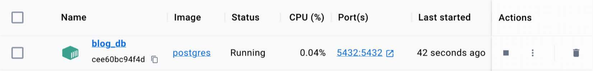

  **Figure 3.27**: PostgreSQL instance running in Docker Desktop

</div>


4️⃣ Under **Actions**, you can:

- **Start/Stop** the container
- **Restart the service**
- **Delete the container** (⚠ Warning: This **deletes all data**!)

---

## 🔗 Installing PostgreSQL Adapter for Python

To allow Django to communicate with PostgreSQL, install the **`psycopg`** adapter:

```sh
python -m pip install psycopg2-binary
```

🔹 `psycopg` is the **official PostgreSQL adapter** for Python.

---


# 📦 **Dumping the Existing Data in Django**

Before switching the database in your Django project from **SQLite** to **PostgreSQL**, we need to **dump the existing data**. This involves exporting data from SQLite, changing the database settings, and then **importing the data into the new database**.

Django provides a simple way to **load and dump data** using **fixtures**. These are files containing serialized data in **JSON, XML, or YAML format**.

---

## 📌 Understanding the `dumpdata` Command

The `dumpdata` command allows you to **export data** from the database in a structured format, including:

✅ **Model Information** – Structure of models and fields.

✅ **Serialized Data** – Preserves relationships between objects.

✅ **Multiple Formats** – Supports JSON (default), XML, and YAML.


✅ **Selective Export** – Can target specific apps or models.

---

## 🔹 Dumping All Data from the Database

To export all database data **in JSON format**, run the following command:

```sh
python manage.py dumpdata --indent=2 --output=mysite_data.json
```

🔹 **Explanation of Parameters:**

| Parameter                   | Description                                          |
| --------------------------- | ---------------------------------------------------- |
| `dumpdata`                  | Dumps all data from the database.                    |
| `--indent=2`                | Formats JSON output with 2-space indentation.        |
| `--output=mysite_data.json` | Saves the data to a file instead of standard output. |

This command creates a file named **`mysite_data.json`**, containing **all database records** in a structured JSON format.

---

## 🎯 Filtering Data by App or Model

You can limit the export to specific **apps** or **models**:

### 🔹 Exporting Data from a Single App

```sh
python manage.py dumpdata blog --indent=2 --output=blog_data.json
```

➡️ This will export **only the data** from the `blog` application.

### 🔹 Exporting Data from a Specific Model

```sh
python manage.py dumpdata blog.Post --indent=2 --output=post_data.json
```

➡️ This will export **only the ************`Post`************ model** from the `blog` app.

---

## 🛠 Handling Encoding Errors

If you encounter **UTF-8 encoding issues**, run the command with Python’s UTF-8 mode enabled:

```sh
python -Xutf8 manage.py dumpdata --indent=2 --output=mysite_data.json
```
This ensures proper encoding for non-ASCII characters, avoiding **Unicode errors**

# 🔄 **Switching the Database in Your Django Project**

To enhance performance and support **full-text search** and **scalability**, we will switch our Django project from **SQLite** to **PostgreSQL**. This guide will walk you through **configuring PostgreSQL**, **migrating data**, and **ensuring a seamless transition**. 🚀

---

## 📌 Step 1: Update Database Configuration

Modify the `DATABASES` setting in your `settings.py` file to use PostgreSQL. We will **load credentials from environment variables** using `python-decouple`.

```python
DATABASES = {
    'default': {
        'ENGINE': 'django.db.backends.postgresql',  # Use PostgreSQL database backend
        'NAME': config('DB_NAME'),  # Load database name from environment variables
        'USER': config('DB_USER'),  # Load database user
        'PASSWORD': config('DB_PASSWORD'),  # Load database password
        'HOST': config('DB_HOST'),  # Load database host
         }
}
```

### 🔹 Why Use `python-decouple`?

- Keeps **sensitive credentials** out of the code.
- Makes environment-specific **configuration easier**.

Install `python-decouple` if you haven’t already:

```sh
pip install python-decouple
```

---

## 🛠 Step 2: Configure Environment Variables

Edit the **`.env`** file in your project root and add the following database credentials:

```ini
EMAIL_HOST_USER=your_account@gmail.com
EMAIL_HOST_PASSWORD=xxxxxxxxxxxx
DEFAULT_FROM_EMAIL=My Blog <your_account@gmail.com>

DB_NAME=blog  # PostgreSQL database name
DB_USER=blog  # PostgreSQL username
DB_PASSWORD=xxxxx  # PostgreSQL password (replace xxxxx with your actual password)
DB_HOST=localhost  # Database host
```

🔹 **Important Notes:**

- Ensure **`.env`** is added to **`.gitignore`** to prevent exposing credentials.
- Use **strong passwords** for security.

---

## 🚀 Step 3: Apply Database Migrations

After updating the database configuration, run the following command to **apply all migrations** to PostgreSQL:

```sh
python manage.py migrate
```

### ✅ Expected Output

You should see a series of migration applications, confirming that PostgreSQL is **now in sync** with your Django models:

```sh
Operations to perform:
  Apply all migrations: admin, auth, blog, contenttypes, sessions, sites, taggit
Running migrations:
  Applying contenttypes.0001_initial... OK
  Applying auth.0001_initial... OK
  Applying admin.0001_initial... OK
  Applying blog.0001_initial... OK
  Applying sessions.0001_initial... OK
  Applying sites.0001_initial... OK
```

At this point, your **PostgreSQL database is fully set up and synchronized**. 🎉

# 🔄 **Loading Data into the New PostgreSQL Database**

Now that we have successfully switched our **Django project to PostgreSQL**, the next step is to **load the previously exported data** back into the new database. 🚀

---

## 📌 Step 1: Load Data Fixtures
We will use the **`loaddata`** command to import the JSON fixture file (`mysite_data.json`) that we created earlier.

### ✅ Run the following command: iif you any error than follow this [Fix Error](./error.md)
```sh
python manage.py loaddata mysite_data.json
```

### 🔹 Expected Output:
```sh
Installed 104 object(s) from 1 fixture(s)
```
- The exact number of objects installed may **differ** depending on the number of **users, posts, comments**, and other database objects.
- If you encounter **errors**, ensure that **all migrations** have been applied using `python manage.py migrate`.

---

## 🛠 Step 2: Start the Django Development Server
After loading the data, restart your Django project by running:

```sh
python manage.py runserver
```

This starts the development server, allowing us to verify that the data has been successfully imported.

---

## 🔍 Step 3: Verify Data in the Django Admin Panel

Open your browser and navigate to the **Django Admin Panel**:

🔗 [http://127.0.0.1:8000/admin/blog/post/](http://127.0.0.1:8000/admin/blog/post/)

You should see **all your posts** successfully loaded into the new PostgreSQL database. 🎉

<div align="center">
  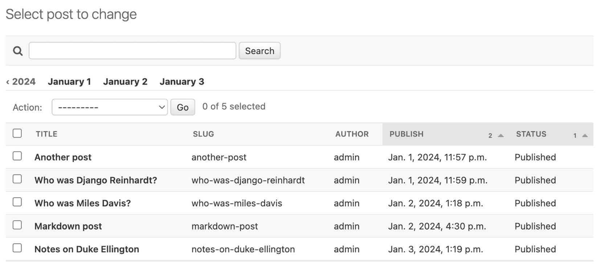

  **Figure 3.28**: The list of posts on the administration site

</div>

<div align="center">

# `New Section Simple Search and Searching against Multiple Fields`

</div>

# 🔍 **Implementing Simple Search and multiple search** ✨🔎💡

With **PostgreSQL** enabled in our Django project, we can now build a **powerful search engine** using **PostgreSQL’s full-text search capabilities**. This guide will cover **basic search lookups**, including searching **single fields**, **multiple fields**, and best practices for optimizing performance. 🚀📊🔍

---

## 📌 Step 1: Enable `django.contrib.postgres` ⚙️🔧🛠️

First, modify your `settings.py` file and add `django.contrib.postgres` to the **INSTALLED\_APPS** list:

```python
INSTALLED_APPS = [
    'django.contrib.admin',
    'django.contrib.auth',
    'django.contrib.contenttypes',
    'django.contrib.sessions',
    'django.contrib.messages',
    'django.contrib.sites',
    'django.contrib.sitemaps',
    'django.contrib.staticfiles',
    'django.contrib.postgres',  # PostgreSQL full-text search
    'taggit',
    'blog.apps.BlogConfig',
]
```

Adding **`django.contrib.postgres`** enables **PostgreSQL-specific functionality**, including full-text search tools. 📑📂⚡

---

## 🔹 Step 2: Performing a Basic Search Lookup 🔍

Once PostgreSQL is set up, open the **Django shell**:

```sh
python manage.py shell
```

Now, perform a **basic search** against a **single field** (e.g., `title`) using the `search` lookup:

```python
from blog.models import Post

Post.objects.filter(title__search='django')
```

### ✅ Expected Output: 🎯📜✅

```sh
<QuerySet [<Post: Who was Django Reinhardt?>]>
```

🔹 This query creates a **search vector** for the `title` field and finds matches containing the word **"django"**. 🧩🔠📚

---

## 🔍 Step 3: Searching Against Multiple Fields 📂🔎🖋️

For **more advanced search functionality**, search against **multiple fields** (e.g., `title` and `body`) using `SearchVector`.

Run the following command in the **Django shell**:

```python
from django.contrib.postgres.search import SearchVector
from blog.models import Post

Post.objects.annotate(
    search=SearchVector('title', 'body'),
).filter(search='django')
```

### ✅ Expected Output: 🎯📜✅

```sh
<QuerySet [<Post: Markdown post>, <Post: Who was Django Reinhardt?>]>
```

🔹 This query matches results in **both** `title` and `body` fields. 📖📝💡

---

## ⚡️ Performance Considerations for Full-Text Search📈

🔹 **Full-text search is resource-intensive**. If searching large datasets (hundreds of rows or more), **optimize queries** using **functional indexes**. 🔎📊🛠️

🔹 **Create a Functional Index** 📌🔍⚡
To improve performance, define a **SearchVectorField** in your models:

```python
from django.contrib.postgres.search import SearchVectorField
from django.db import models

class Post(models.Model):
    #..
    search_vector = SearchVectorField()
```

For more details, visit Django’s official documentation:
🔗 [Django Full-Text Search Performance Guide](https://docs.djangoproject.com/en/5.0/ref/contrib/postgres/search/#performance) 📑🔗


# 🔍 **Building a Search View in Django**

To enhance user experience, we will create a **custom search view** to allow users to search for blog posts. This involves creating a **search form**, modifying the **views.py** file, and utilizing **PostgreSQL full-text search** capabilities. 🚀

---

## 📌 Step 1: Creating the Search Form

First, we need a **search form** that allows users to input their queries. Edit the `forms.py` file in the **blog application** and add the following code:

```python
from django import forms

class SearchForm(forms.Form):
    query = forms.CharField()
```

### 🔹 Explanation:

- **`forms.Form`** → Defines a basic form.
- **`query = forms.CharField()`** → Creates a text input field where users can enter search terms.
- The `query` field will be used in our **search logic** later.

---

## 🔹 Step 2: Implementing the Search View

Edit the `views.py` file in the **blog application** and add the following search view:

```python
from django.shortcuts import render
from django.contrib.postgres.search import SearchVector # SearchVector
from .forms import CommentForm, EmailPostForm, SearchForm # SearchForm

# ...

def post_search(request):
    form = SearchForm()
    query = None
    results = []
    
    if 'query' in request.GET:  # Check if search is submitted
        form = SearchForm(request.GET)
        if form.is_valid():  # Validate form input
            query = form.cleaned_data['query']
            results = (
                Post.published.annotate(
                    search=SearchVector('title', 'body'),  # Search across title and body
                ).filter(search=query)
            )
    
    return render(
        request,
        'blog/post/search.html',
        {
            'form': form,
            'query': query,
            'results': results
        }
    )
```

---

## 🔍 Step 3: Understanding the Search Logic

### ✅ **Form Initialization**

- **`form = SearchForm()`** → Creates an empty search form.
- **`query = None`** → Stores the user input (default is `None`).
- **`results = []`** → Holds search results (default is an empty list).

### ✅ **Handling User Input**

- \*\*Checking if ****`query`**** exists in \*\***`request.GET`**

  - Ensures the search form has been submitted.
  - Uses `GET` instead of `POST` to **allow URL sharing** with search parameters.

- **Validating the form**

  - **`form.is_valid()`** checks if the input is correct.
  - **`query = form.cleaned_data['query']`** extracts the sanitized search term.

### ✅ **Executing the Search Query**

- **Using ********************************`SearchVector`******************************** to search across multiple fields**
  - `SearchVector('title', 'body')` enables searching in both the `title` and `body` fields.
  - **Filtering** → `.filter(search=query)` finds posts that match the search term.

### ✅ **Rendering the Search Results**

- The search results are passed to `search.html` for display.
- The `query` is included in the context to show what the user searched for.

# 🖥️ **Creating a Search Template in Django**

To allow users to view search results, we need to **create a template** that will display both the **search form** and the **results** dynamically. This template will be used to render the search page where users can enter queries and see matching posts. 🚀

---

## 📌 Step 1: Create the Template File

Navigate to the **`templates/blog/post/`** directory and create a new file named **`search.html`**.

Add the following code to **`search.html`**:

```html
  
  

Search  

  
      
        <h1>Posts containing "{{ query }}"</h1>  
        <h3>  
              
                Found {{ total_results }} result{{ total_results|pluralize }}  
              
        </h3>  
        
          
            <h4>  
                <a href="{{ post.get_absolute_url }}">  
                    {{ post.title }}  
                </a>  
            </h4>  
            {{ post.body|markdown|truncatewords_html:12 }}  
          
            <p>There are no results for your query.</p>  
          
        
        <p><a href="">Search again</a></p>  
      
        <h1>Search for posts</h1>  
        <form method="get">  
            {{ form.as_p }}  
            <input type="submit" value="Search">  
        </form>  
      
  
```

---

## 🔍 Step 2: Understanding the Code

### ✅ **Extending the Base Template**

```html
  
```

- This ensures that the search template **inherits the layout** from `base.html`.
- The search page will have the same **header, footer, and styles** as the rest of the blog.

### ✅ **Setting the Page Title**

```html
Search  
```

- This defines the **title** of the search page.
- The title will be **displayed in the browser tab**.

### ✅ **Checking if a Search Query Exists**

```html
  
```

- If the user has submitted a search, we display the results.
- Otherwise, we show the **search form**.

### ✅ **Displaying Search Results**

```html
<h1>Posts containing "{{ query }}"</h1>  
<h3>  
      
        Found {{ total_results }} result{{ total_results|pluralize }}  
      
</h3>  
```

- Displays the **search term** entered by the user.
- Counts and displays the **number of matching results**.
- The `pluralize` filter ensures correct **grammar** (e.g., "1 result" vs. "2 results").

### ✅ **Looping Through Matching Posts**

```html
  
    <h4>  
        <a href="{{ post.get_absolute_url }}">  
            {{ post.title }}  
        </a>  
    </h4>  
    {{ post.body|markdown|truncatewords_html:12 }}  
  
    <p>There are no results for your query.</p>  
  
```

- \*\*Iterates through \*\***`results`** (posts matching the search query).
- Displays each **post title** as a clickable link.
- Shows a **shortened version** of the post content using:
  - `markdown` → Converts Markdown content to **HTML**.
  - `truncatewords_html:12` → Displays only **12 words** for preview.
- If no results exist, it shows: `There are no results for your query.`

### ✅ **Adding a Search Again Link**

```html
<p><a href="">Search again</a></p>  
```

- Allows users to **perform another search** easily.

### ✅ **Displaying the Search Form**

```html
<h1>Search for posts</h1>  
<form method="get">  
    {{ form.as_p }}  
    <input type="submit" value="Search">  
</form>  
```

- Shows the **search input field** if no query has been submitted.
- The form uses **`method="get"`** to:
  - Keep search queries **visible in the URL**.
  - Allow users to **share search results**.
- `{{ form.as_p }}` ensures the **form fields are properly styled**.

---

# 🌐 **Adding a Search URL Pattern in Django**

The final step in integrating search functionality into your Django blog is to **update the URL patterns** to include a search endpoint. This will allow users to access the search form and retrieve relevant blog posts. 🚀

---

## 📌 Step 1: Modify `urls.py`

Edit the `urls.py` file inside the **blog application** and add the following URL pattern:

```python
from django.urls import path
from . import views
from .feeds import LatestPostsFeed

urlpatterns = [
    # Post views
    path('', views.post_list, name='post_list'),
    # path('', views.PostListView.as_view(), name='post_list'),
    path('tag/<slug:tag_slug>/', views.post_list, name='post_list_by_tag'),
    path('<int:year>/<int:month>/<int:day>/<slug:post>/', views.post_detail, name='post_detail'),
    path('<int:post_id>/share/', views.post_share, name='post_share'),
    path('<int:post_id>/comment/', views.post_comment, name='post_comment'),
    path('feed/', LatestPostsFeed(), name='post_feed'),
    path('search/', views.post_search, name='post_search'),  # 🔍 Search URL
]
```

---

## 🔍 Step 2: Understanding the Code

### ✅ **Adding the Search URL Pattern**

```python
path('search/', views.post_search, name='post_search'),  # 🔍 Search URL
```

- This URL pattern maps the **search page** to the `post_search` view.
- The **name parameter (********`post_search`********\*\*\*\*\*\*\*\*\*\*\*\*)** allows us to reference this URL dynamically in templates.
- This means users can visit:\
  🔗 [http://127.0.0.1:8000/blog/searc](http://127.0.0.1:8000/blog/search/)h

---

## 🛠 Step 3: Testing the Search Functionality

After modifying `urls.py`, restart the Django development server:

```sh
python manage.py runserver
```

Now, **open your browser** and visit:

🔗 [http://127.0.0.1:8000/blog/search/](http://127.0.0.1:8000/blog/search/)

<div align="center">
  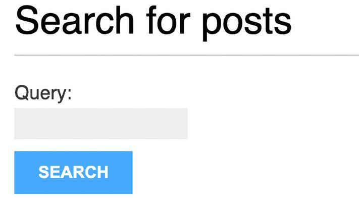

  **Figure 3.29**: The form with the query field to search for posts

</div>


You should see the **search form**, ready to accept user queries.

---

## 🔎 Step 4: Performing a Search

1️⃣ **Enter a search query** (e.g., "jazz").\
2️⃣ Click the **SEARCH** button.\
3️⃣ View the **search results** dynamically listed on the page.
<div align="center">
  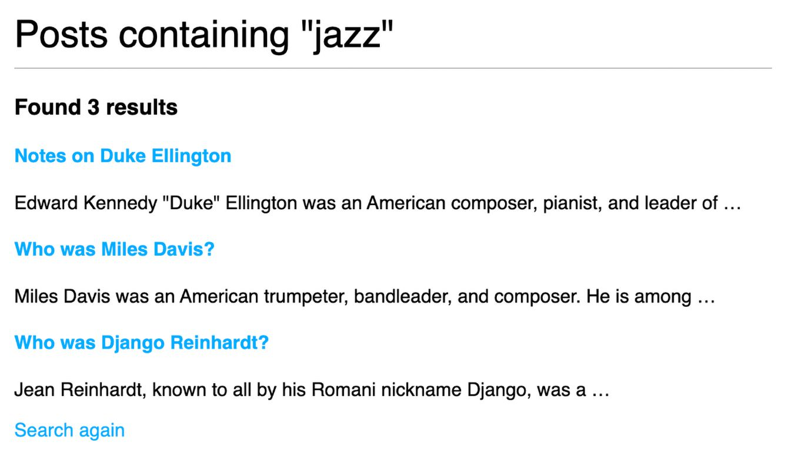

  **Figure 3.30**: Search results for the term “jazz”

</div>

If **matching posts** are found, they will be displayed with **links** to their full content. If no results are found, the message:

> "There are no results for your query."
> will appear.
