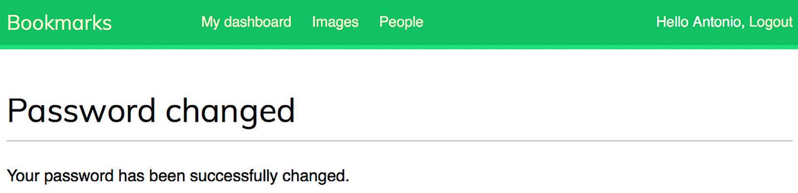

# 🔐 **Developing User Account Functionalities in Django**

In this section, we will **build user account functionalities** to create a **social website**. Users will be able to **register, manage their accounts, and authenticate securely**. Later, we will extend these features to include **social interactions**, such as **image sharing, bookmarking, following users, and liking images**. 🚀

---

## 📌 Features Covered in This section

### ✅ **User Authentication & Management**

We will implement user authentication using **Django’s built-in authentication framework** to handle:

- **User login/logout**
- **Password management (change/reset)**
- **Session handling for authentication**

### ✅ **User Registration**

- Create a **user registration view** that allows new users to sign up.
- Validate user inputs and store user credentials securely.

### ✅ **Profile Editing**

- Extend the default **Django User model** with a **custom profile model**.
- Allow users to update **profile information**, such as name, bio, and profile picture.

### ✅ **Social Features (Coming Soon!)**

- **Image Sharing** → Users can **bookmark and share images** from the internet.
- **User Interactions** → Users can **follow other users** and **like/unlike shared images**.
- **Activity Feed** → Users will see **updates from followed users**.

### ✅ **Handling Media Files**

- Configure the **project to upload and store media files**, such as profile pictures and shared images


<div align="center">

# `New Section Functional Overview`

</div>

<div align="center">
  

  **Figure 4.1**: Diagram of functionalities built in this section

</div>

<div align="center">

# `New Section Setting Django Project`

</div>

# **Setting Up a Django Project** 🚀

In this section, we will **initialize a new Django project**, create a user authentication application, and configure Django to use **MySQL** instead of the default SQLite database. We will also **store sensitive database credentials in an environment file (**`.env`**)** for enhanced security. 🔐

---

## 📌 Step 1: Create a New Django Project

Run the following command in your terminal to **create a new Django project**:

```sh
django-admin startproject bookmarks .
```

### ✅ Explanation:

- **`django-admin startproject bookmarks .`** → Creates a new Django project named `bookmarks`.
- The `.` at the end ensures that the project files are placed in the **current directory**, instead of creating a separate subdirectory.

### 📂 Initial Project Structure:

After running the command, your project folder will contain:

```
├── bookmarks/
│   ├── __init__.py
│   ├── settings.py
│   ├── urls.py
│   ├── asgi.py
│   ├── wsgi.py
├── manage.py
```

---

## 📌 Step 2: Install Required Packages

To use MySQL as our database and load environment variables securely, install the required packages:

```sh
pip install pymysql python-decouple
```

- **`pymysql`** → Enables Django to connect to MySQL.
- **`python-decouple`** → Helps manage sensitive credentials using a `.env` file.

---

## 📌 Step 3: Configure MySQL Database in `settings.py`

First, create a **`.env`** file in your project root and add the following database credentials:

```ini
DB_NAME=social
DB_USER=****
DB_PASSWORD=****
DB_HOST=localhost
DB_PORT=3306
```

Then, modify `settings.py` to load these values securely:

```python
from decouple import config  # Import python-decouple to read .env file

DATABASES = {
    'default': {
        'ENGINE': 'django.db.backends.mysql',  # Use MySQL as the database backend
        'NAME': config('DB_NAME'),  # Load database name from .env
        'USER': config('DB_USER'),  # Load MySQL username from .env
        'PASSWORD': config('DB_PASSWORD'),  # Load MySQL password from .env
        'HOST': config('DB_HOST'),  # Load MySQL host from .env
        'PORT': config('DB_PORT'),  # Load MySQL port from .env
    }
}
```

Next, open the `bookmarks/__init__.py` file and **import \*\*\*\*\*\*\*\*\*\*\*\*\*\*\*\*\*\*\*\*\*\*\*\*****`pymysql`**:

```python
import pymysql
pymysql.install_as_MySQLdb()
```

### ✅ Explanation:

- **`config('DB_NAME')`** → Retrieves the database name from `.env`.
- **`config('DB_USER')`** → Retrieves the MySQL username securely.
- **`config('DB_PASSWORD')`** → Stores the database password outside the codebase.
- **`config('DB_HOST')`** → Retrieves the database server hostname.
- **`config('DB_PORT')`** → Loads the MySQL port dynamically.

🔹 **Ensure your ****************************`.env`**************************** file is added to ****************************`.gitignore`**************************** to prevent exposing credentials in version control.**

Before running migrations, make sure your **MySQL database exists**:

```sh
mysql -u root -p
CREATE DATABASE social;
```

---

## 📌 Step 4: Create a New Application for User Authentication

Next, create a **new application** named `account` that will handle user authentication:

```sh
django-admin startapp account
```

### ✅ Explanation:

- **`startapp account`** → Creates a new Django application named `account`.
- This app will contain **user-related views, models, and templates**.

### 📂 Application Structure:

After running the command, the new app directory will be structured as:

```
account/
├── migrations/
├── __init__.py
├── admin.py
├── apps.py
├── models.py
├── tests.py
├── views.py
```

---

## 📌 Step 5: Register the New App in `settings.py`

Django needs to know about the new app. Open **`settings.py`** and **add it to `INSTALLED_APPS`**:

```python
INSTALLED_APPS = [
    'account.apps.AccountConfig',  # Register the account app
    'django.contrib.admin',
    'django.contrib.auth',
    'django.contrib.contenttypes',
    'django.contrib.sessions',
    'django.contrib.messages',
    'django.contrib.staticfiles',
]
```

### ✅ Explanation:

- **`account.apps.AccountConfig`** → Registers the new `account` application.
- Django **processes apps in the order they appear** in `INSTALLED_APPS`.
- Placing `account` **first** ensures our **custom authentication templates** take priority over the default templates from `django.contrib.admin`.

---

## 📌 Step 6: Apply Migrations to Set Up the MySQL Database

After modifying `INSTALLED_APPS` and configuring MySQL, run the following command to apply **database migrations**:

```sh
python manage.py migrate
```

### ✅ Expected Output:

```sh
Operations to perform:
  Apply all migrations: admin, auth, contenttypes, sessions
Running migrations:
  Applying contenttypes.0001_initial... OK
  Applying auth.0001_initial... OK
  Applying admin.0001_initial... OK
  Applying sessions.0001_initial... OK
```

### ✅ Explanation:

- **Django applies the initial database migrations** to create necessary tables for user authentication, session management, and permissions.
- **Each app in **`INSTALLED_APPS`** is checked**, and its database models are added if necessary.

<div align="center">

# `New Section Authentication Framework`

</div>

# 🔐 **Using the Django Authentication Framework**

Django provides a **built-in authentication framework** that handles **user authentication, sessions, permissions, and user groups**. This system includes views for common user actions such as **logging in, logging out, password changes, and password resets**. 🚀

---

## 📌 Key Features of Django’s Authentication Framework

Django’s authentication system is part of `django.contrib.auth` and is used by various **Django contrib applications**. This framework provides:

- **User authentication** (login/logout)
- **Session management**
- **User permission**s and **group manage*****ment***
- **Pre-built authentication views and forms**

🔹 **Previously Used in the Blog Application**
We used this authentication framework earlier while **building a blog application**, where we created a **superuser** to access the Django **admin panel**.

---

## 📌 Authentication Framework in a New Django Project

When we create a new Django project using:

```sh
django-admin startproject account
```

The authentication framework is **included by default** in `INSTALLED_APPS`.

```python
INSTALLED_APPS = [
    'django.contrib.auth',  # Authentication framework
    'django.contrib.sessions',  # Session management
    'django.contrib.contenttypes',
    'django.contrib.admin',
    'django.contrib.messages',
    'django.contrib.staticfiles',
]
```

Django also includes **two essential middleware classes** in `MIDDLEWARE`:

```python
MIDDLEWARE = [
    'django.middleware.security.SecurityMiddleware',
    'django.contrib.sessions.middleware.SessionMiddleware',  # Handles sessions
    'django.middleware.common.CommonMiddleware',
    'django.middleware.csrf.CsrfViewMiddleware',
    'django.contrib.auth.middleware.AuthenticationMiddleware',  # Associates users with requests
    'django.contrib.messages.middleware.MessageMiddleware',
    'django.middleware.clickjacking.XFrameOptionsMiddleware',
]
```

### ✅ Explanation of Middleware

- **`AuthenticationMiddleware`** → Associates **users with requests** using **sessions**.
- **`SessionMiddleware`** → Manages user **sessions** across multiple requests.
- Middleware executes **globally** during **request and response processing**.

You will encounter **middleware classes** on various occasions throughout development, and you will also learn how to **create custom middleware** later.

---

## 📌 Models in the Authentication Framework

Django’s authentication system includes **pre-built models** in `django.contrib.auth.models`, such as:

### ✅ **User Model**

Django provides a built-in **User model**, which contains essential fields:

```python
from django.contrib.auth.models import User

user = User.objects.create_user(username='john', password='securepassword')
```

| Field        | Description                        |
| ------------ | ---------------------------------- |
| `username`   | Unique username for authentication |
| `password`   | Hashed password stored securely    |
| `email`      | User’s email address               |
| `first_name` | User’s first name                  |
| `last_name`  | User’s last name                   |
| `is_active`  | Determines if the user is active   |

### ✅ **Group Model**

Django provides a **Group model** to categorize users:

```python
from django.contrib.auth.models import Group

admin_group = Group.objects.create(name='Admin')
```

- Groups allow assigning **permissions** to multiple users at once.

### ✅ **Permission Model**

Permissions are used to **restrict access to certain actions**:

```python
from django.contrib.auth.models import Permission

permission = Permission.objects.get(codename='add_user')
```

- Permissions can be assigned to **users** or **groups**.

---

## 📌 Built-in Authentication Views & Forms

Django includes **pre-built authentication views and forms** for:

- **Login/logout**
- **Password reset**
- **User authentication & session management**

You will use these **authentication views and forms** in later sections to build **secure login systems**.

<div align="center">

# `New Section login view`

</div>

# 🔐 **Creating a Login View in Django**

We will use Django's built-in **authentication framework** to allow users to log in to our website. This process involves:

1️⃣ **Displaying a login form** to users. <br>
2️⃣ **Capturing user credentials** (username and password). <br>
3️⃣ **Authenticating the user** against stored database records. <br>
4️⃣ **Verifying if the user is active** before allowing access. <br>
5️⃣ **Logging in the user** and starting an authenticated session. <br>

This guide will walk through implementing a **login form** and **view logic** for authentication. 🚀

---

## 📌 Step 1: Creating the Login Form

First, create a `forms.py` file inside the **account application** directory and define a login form:

```python
from django import forms

class LoginForm(forms.Form):
    username = forms.CharField()
    password = forms.CharField(widget=forms.PasswordInput)
```

### ✅ Explanation:

- **`forms.Form`** → This defines a standard Django form.
- **`username = forms.CharField()`** → Creates a text input field for the username.
- **`password = forms.CharField(widget=forms.PasswordInput)`** → Uses **`PasswordInput`** to hide password characters in the HTML form.

🔹 When rendered in HTML, the password input field will look like this:

```html
<input type="password" name="password">
```

---

# 🔐 Implementing the Login View in views.py

Now that we have created a login form, we need to build a **login view** that processes authentication requests. This view will:

1️⃣ Display the login form for **GET requests**.

2️⃣ Validate user credentials for **POST requests**.

3️⃣ Authenticate users against the **database**.

4️⃣ Log in the user if authentication is successful.

---

## 📌 Step 1: Edit `views.py` to Add the Login View

Modify the `views.py` file inside the `account` application and add the following code:

```python
from django.contrib.auth import authenticate, login
from django.http import HttpResponse
from django.shortcuts import render
from .forms import LoginForm

def user_login(request):
    if request.method == 'POST':
        form = LoginForm(request.POST)
        if form.is_valid():
            cd = form.cleaned_data
            user = authenticate(
                request,
                username=cd['username'],
                password=cd['password']
            )
            if user is not None:
                if user.is_active:
                    login(request, user)
                    return HttpResponse('Authenticated successfully')
                else:
                    return HttpResponse('Disabled account')
            else:
                return HttpResponse('Invalid login')
    else:
        form = LoginForm()
    return render(request, 'account/login.html', {'form': form})
```

---

## 🔍 Step 2: Understanding the Code

### ✅ Handling GET Requests

```python
if request.method == 'POST':
```

- If the **request method is GET**, an **empty login form** is instantiated and rendered in the template.
- The form is then passed to `login.html` so the user can enter credentials.

### ✅ Processing POST Requests

```python
form = LoginForm(request.POST)
if form.is_valid():
```

- The form is instantiated with **submitted user data**.
- **`form.is_valid()`** checks whether the required fields (username & password) are correctly filled.

### ✅ Authenticating Users

```python
user = authenticate(
    request,
    username=cd['username'],
    password=cd['password']
)
```

- **`authenticate()`** checks the **username** and **password** against the database.
- If credentials are **valid**, it returns a **User object**; otherwise, it returns `None`.

### ✅ Checking User Status

```python
if user is not None:
    if user.is_active:
```

- If authentication succeeds, the `is_active` attribute is checked.
- If the **account is disabled**, an `HttpResponse` is returned with the message **Disabled account**.

### ✅ Logging in the User

```python
login(request, user)
return HttpResponse('Authenticated successfully')
```

- If authentication is successful and the user is **active**, `login()` is called.
- This **creates a session** for the user, keeping them logged in.

### ❗ Difference Between `authenticate()` and `login()`

| Method               | Purpose                                                                   |
| -------------------- | ------------------------------------------------------------------------- |
| **`authenticate()`** | Validates user credentials and returns a **User object** if valid.        |
| **`login()`**        | Stores the **authenticated user** in the session, keeping them logged in. |

---

# 🔗 **Setting Up URL Routing**

Now that we have implemented the **login view**, we need to **define URL routes** to access it. This involves:

1️⃣ Creating a **URL configuration** inside the `account` app.

2️⃣ Including `account.urls` in the **main project’s URL patterns**.

3️⃣ Ensuring the login page is accessible via a URL like **`/account/login/`**.

---

## 📌 Step 1: Create `urls.py` in the `account` Application

Inside the `account` application directory, create a new **`urls.py`** file and add the following code:

```python
from django.urls import path
from . import views

urlpatterns = [
    path('login/', views.user_login, name='login'),  # Login URL
]
```

### ✅ Explanation:

- **`path('login/', views.user_login, name='login')`** → Defines a route for the login view.
- **`name='login'`** → Assigns a name to the URL pattern for easy referencing.

Now, visiting **`http://127.0.0.1:8000/account/login/`** will trigger the `user_login` view. 🚀

---

## 📌 Step 2: Include `account.urls` in the Main `urls.py`

Edit the **main ****************`urls.py`**************** file** in the **bookmarks project directory** and modify it as follows:

```python
from django.contrib import admin
from django.urls import path, include  # Import include

urlpatterns = [
    path('admin/', admin.site.urls),
    path('account/', include('account.urls')),  # Include account app
]
```

### ✅ Explanation:

- **`include('account.urls')`** → Includes all URL patterns from the `account` app.
- Now, all routes inside `account.urls.py` will be prefixed with `/account/`.

🔹 Example URLs:

| Feature         | URL               |
| --------------- | ----------------- |
| **Admin Panel** | `/admin/`         |
| **Login Page**  | `/account/login/` |

---

# 🎨 **Creating the Login Template**

To make the login view functional, we need to create a **template** that renders the login form. Since this is our first template, we will also create a **base template (`base.html`**) that can be extended across multiple pages.

---

## 📌 Step 1: Creating Template Directories

Inside the `account` application directory, create the following structure:

```
account/
│── templates/
│   ├── account/
│   │   ├── login.html
│   ├── base.html
```

This structure ensures that Django can find the **login.html** template when rendering the login page.

---

## 📌 Step 2: Creating `base.html`

Edit `base.html` and add the following code:

```html

<!DOCTYPE html>
<html>
<head>
    <title></title>
    <link href="" rel="stylesheet">
</head>
<body>
    <div id="header">
        <span class="logo">Bookmarks</span>
    </div>
    <div id="content">
        
        
    </div>
</body>
</html>
```

### ✅ Explanation:

- **``** → Loads Django's **static files** (CSS, JS, etc.).
- **Defines a `<title>` block** → This allows pages extending `base.html` to customize their title.
- Defines a **``** → Pages extending `base.html` will **inject their content** here.

---

## 📌 Step 3: Creating `login.html`

Edit `account/login.html` and add the following code:

```html

Log-in

    <h1>Log-in</h1>
    <p>Please, use the following form to log in:</p>
    <form method="post">
        {{ form.as_p }}
        
        <p><input type="submit" value="Log in"></p>
    </form>

```

### ✅ Explanation:

- **``** → Inherits from the base template.
- **Renders the form** using `{{ form.as_p }}`.
- Includes **``** → Provides **CSRF protection** for the form.
- **Adds a submit button** to send the login request.

---

## 📌 Step 4: Creating a Superuser

Before logging in, we need at least one user in the database. Run the following command to create a **superuser**:

```sh
python manage.py createsuperuser
```

### ✅ Example Input:

```sh
Username (leave blank to use 'admin'): admin
Email address: admin@admin.com
Password: ********
Password (again): ********
```

### ✅ Expected Output:

```sh
Superuser created successfully.
```

---

## 📌 Step 5: Running the Development Server

Start the Django server using:

```sh
python manage.py runserver
```

Now, open **[http://127.0.0.1:8000/admin/](http://127.0.0.1:8000/admin/)** in your browser and log in with the **superuser credentials**.

<div align="center">
  

  **Figure 4.2**: The Django administration site index page including Users and Groups

</div>

You can also create a **regular user** through the **Django admin panel**:

1. Go to **Users** → **Add User**.

<div align="center">
  

  **Figure 4.3**: The Add user form on the Django administration site

</div>

1. Fill in the username and password.

<div align="center">
  

  **Figure 4.4**: The user editing form on the Django administration site

</div>

2. Click **Save** to create the user.
3. Update the **first name, last name, and email address**.
4. Click **Save** again.


---

## 📌 Step 6: Testing the Login Page

Navigate to **[http://127.0.0.1:8000/account/login/](http://127.0.0.1:8000/account/login/)** in your browser. You should see the **login form rendered**.

<div align="center">
  

  **Figure 4.5**: The user Log-in page

</div>

### ✅ Testing Scenarios:

1️⃣ **Enter invalid credentials** → You should see an **Invalid login** message.

<div align="center">
  

  **Figure 4.6**: The invalid login plain text response

</div>


2️⃣ **Enter valid credentials** → You should see **Authenticated successfully**.

<div align="center">
  

  **Figure 4.7**: The successful authentication plain text response

</div>

<div align="center">

# `New Section Built-in Authentication Views`

</div>

# 🔐 **Using Django’s Built-in Authentication Views**

Django provides **ready-to-use authentication views** in `django.contrib.auth.views` that can save time when building web applications with user authentication. These built-in views handle **user login, logout, password changes, and password resets**. 🚀

---

## 📌 Why Use Django’s Built-in Authentication Views?

Instead of manually creating login and logout views, Django offers **pre-built authentication views** that:

✅ Provide a **secure** authentication system.

✅ Follow **best security practices** (e.g., password hashing, session handling).

✅ Are **customizable** (templates, forms, redirection, etc.).

✅ Save **development time** when building user account functionality.

---

## 📌 Authentication Views in `django.contrib.auth.views`

### 🔑 **Login & Logout Views**

| View             | Purpose                                             |
| ---------------- | --------------------------------------------------- |
| **`LoginView`**  | Handles login form submission and logs in the user. |
| **`LogoutView`** | Logs out the user and clears the session.           |

### 🔐 **Password Change Views**

| View                         | Purpose                                                  |
| ---------------------------- | -------------------------------------------------------- |
| **`PasswordChangeView`**     | Displays a form to allow users to change their password. |
| **`PasswordChangeDoneView`** | Redirects the user after a successful password change.   |

### 🔄 **Password Reset Views**

| View                            | Purpose                                                           |
| ------------------------------- | ----------------------------------------------------------------- |
| **`PasswordResetView`**         | Sends an email with a password reset link.                        |
| **`PasswordResetDoneView`**     | Informs the user that an email has been sent.                     |
| **`PasswordResetConfirmView`**  | Allows users to set a new password after clicking the reset link. |
| **`PasswordResetCompleteView`** | Redirects the user after successfully resetting their password.   |

💡 These views work **out of the box** but can be **customized** (e.g., changing templates, modifying form fields).

---

# 🔐 **Implementing Django’s Built-in Login and Logout Views**

In this section, we will replace our **custom login view** with Django’s **built-in authentication views** and integrate a **logout view**. Using Django’s pre-built views helps maintain security and reduces the need for custom authentication logic.

---

## 📌 Step 1: Updating `urls.py` in the `account` Application

Edit the `urls.py` file inside the `account` application and modify it as follows:

```python
from django.contrib.auth import views as auth_views  # Import Django auth views
from django.urls import path
from . import views

urlpatterns = [
    # Previous custom login URL (commented out)
    # path('login/', views.user_login, name='login'),
    
    # ✅ Using Django's built-in authentication views
    path('login/', auth_views.LoginView.as_view(), name='login'),  # Built-in login view
    path('logout/', auth_views.LogoutView.as_view(), name='logout'),  # Built-in logout view
]
```

### ✅ Explanation:

- **`auth_views.LoginView.as_view()`** → Uses Django’s built-in login view instead of a custom function.
- **`auth_views.LogoutView.as_view()`** → Handles user logout securely.
- The **previous custom login URL is commented out** because Django’s built-in views are more secure and efficient.

---

# &#x20;**Setting Up Authentication Templates 🎨**

To ensure our authentication system works correctly, we need to create **login and logout templates**. Django’s authentication views expect these templates to be inside the **`templates/registration/`** directory by default.

---

## 📌 Step 1: Create the Required Template Directory

Inside the `account` application, create the following directory structure:

```
account/
│── templates/
│   ├── registration/
│   │   ├── login.html
│   │   ├── logged_out.html
```

By default, Django’s authentication views look for templates in `templates/registration/`, so we must store our authentication templates there.

---

## 📌 Step 2: Understanding Template Priority

Django's **`django.contrib.admin`** module includes default authentication templates for the **admin login page**.

Since we want to use **our own authentication templates**, we need to **place the ************************************************************************`account`************************************************************************ app at the top** of the `INSTALLED_APPS` list in `settings.py`:

```python
INSTALLED_APPS = [
    'account.apps.AccountConfig',  # Ensure this is listed first
    'django.contrib.admin',
    'django.contrib.auth',
    'django.contrib.contenttypes',
    'django.contrib.sessions',
    'django.contrib.messages',
    'django.contrib.staticfiles',
]
```

### ✅ Explanation:

- Django loads apps **in the order they appear** in `INSTALLED_APPS`.
- Placing `account` first ensures that **Django uses our authentication templates** instead of the ones from `django.contrib.admin`.

---

## 📌 Step 3: Creating the `login.html` Template

Create `templates/registration/login.html` and add the following code:

```html

Log-in

    <h1>Log-in</h1>
    
        <p>
            Your username and password didn't match.
            Please try again.
        </p>
    
        <p>Please, use the following form to log in:</p>
    
    <div class="login-form">
        <form action="" method="post">
            {{ form.as_p }}
            
            <input type="hidden" name="next" value="{{ next }}" />
            <p><input type="submit" value="Log in"></p>
        </form>
    </div>

```

### ✅ Explanation:

- **``** → Displays an error message if authentication fails.
- **`<form action="" method="post">`** → Submits credentials to Django’s built-in `LoginView`.
- **``** → Adds **CSRF protection** to prevent security attacks.
- **Hidden ** field (**`next`**variable)** → Redirects the user **to a specific page after login**.
  - If the login page is accessed with a URL like `http://127.0.0.1:8000/account/login/?next=/dashboard/`, Django will redirect the user to  upon successful login to `dashboard` page.

---

## 📌 Step 4: Creating the `logged_out.html` Template

Create `templates/registration/logged_out.html` and add the following code:

```html

Logged out

    <h1>Logged out</h1>
    <p>
        You have been successfully logged out.
        You can <a href="">log in again</a>.
    </p>

```

### ✅ Explanation:

- Extends `base.html` the main layout structure.
- **Displays a logout confirmation message**.
- **Includes a login link** → Allows users to log in again easily.

---

## 📌 Step 5: Ensuring Authentication Views Work

With these templates in place, Django’s **LoginView** and **LogoutView** will now function properly. Users can:

1️⃣ Visit `/account/login/` to log in. <br>
2️⃣ Log out at `/account/logout/`, which renders `logged_out.html`. <br>
3️⃣ **Be redirected after login** if a `next` parameter is provided. <br>


---

#  **Django Dashboard View Setup** 📌

## 🚀 Overview

In this guide, we will create a **dashboard view** that will be displayed when users log into their accounts. This will involve editing multiple files, including `views.py`, `urls.py`, `settings.py`, and creating a new template `dashboard.html`.

---

## 📂 Step 1: Editing `views.py`

Edit the `views.py` file of the **account** application and add the following code:

```python
from django.contrib.auth.decorators import login_required
from django.shortcuts import render

@login_required  # Ensures only logged-in users can access this view
def dashboard(request):
    return render(
        request,
        'account/dashboard.html',  # Renders the dashboard template
        {'section': 'dashboard'}   # Context data to highlight the menu section
    )
```

### 📌 Code Explanation:

- **`@login_required`**: This decorator ensures that only authenticated users can access the dashboard.
- **`render(request, 'account/dashboard.html', {'section': 'dashboard'})`**:
  - `request`: The HTTP request object.
  - `'account/dashboard.html'`: The template file to render.
  - `{'section': 'dashboard'}`: A dictionary with context data to highlight the active section in the menu.

If an **unauthenticated user** tries to access this view, they will be redirected to the **login page**. Once they log in, they will be redirected back to the **dashboard**.

---

## 📂 Step 2: Creating `dashboard.html`

Create a new file inside the `templates/account/` directory and name it `dashboard.html`.

```html

Dashboard


    <h1>Dashboard</h1>
    <p>Welcome to your dashboard.</p>

```

### 📌 Code Explanation:

- **``**: Inherits the base template (`base.html`) to maintain consistency.
- **``**: Sets the page title as "Dashboard".
- **``**:
  - Displays an `<h1>` heading: "Dashboard".
  - Displays a `<p>` tag: "Welcome to your dashboard.".

This template ensures that the dashboard page is displayed properly to the authenticated users.

---

## 📂 Step 3: Updating `urls.py`

Edit the `urls.py` file of the **account** application and add the following URL pattern:

```python
from django.urls import path
from django.contrib.auth import views as auth_views
from . import views

urlpatterns = [
    # Previous login URL
    # path('login/', views.user_login, name='login'),
    
    # Login and logout URLs
    path('login/', auth_views.LoginView.as_view(), name='login'),
    path('logout/', auth_views.LogoutView.as_view(), name='logout'),
    
    # New dashboard view
    path('', views.dashboard, name='dashboard'),
]
```

### 📌 Code Explanation:

- **`path('', views.dashboard, name='dashboard')`**:
  - Maps the **dashboard view**on.
  - When users log in, they will be redirected here.

---

## 📂 Step 4: Configuring `settings.py`

Edit the `settings.py` file of the **project** and add the following code:

```python
LOGIN_REDIRECT_URL = 'dashboard'
LOGIN_URL = 'login'
LOGOUT_URL = 'logout'
```

### 📌 Code Explanation:

- **`LOGIN_REDIRECT_URL = 'dashboard'`**:
  - After successful login, users will be redirected to the **dashboard** view.
  - If no `next` parameter is present in the login request, this setting ensures redirection to the dashboard.
- **`LOGIN_URL = 'login'`**:
  - Specifies the **login page** URL.
  - Used by Django’s authentication system.
- **`LOGOUT_URL = 'logout'`**:
  - Specifies the **logout page** URL.
  - Ensures users are redirected properly after logging out.

---

# &#x20;**Django Authentication and Navigation Setup 📌**

## 🚀 Overview

In this guide, we have:

- Added Django's built-in authentication **login and logout views**.
- Created **custom templates** for both views and set up a simple **dashboard view** to redirect users after login.
- Configured **Django settings** to use these authentication URLs by default.

Now, we will modify the `base.html` template to include:

- A **login link** for unauthenticated users.
- A **logout button** and **menu navigation** for authenticated users.

---

## 📂 Step 1: Editing `base.html`

Edit the `templates/base.html` file and add the following code:

```html

<!DOCTYPE html>
<html>
<head>
    <title></title>
    <link href="" rel="stylesheet">
</head>
<body>
    <div id="header">
        <span class="logo">Bookmarks</span>
         <!-- Check if user is logged in -->
        <ul class="menu">
            <li class="selected">
                <a href="">My dashboard</a>
            </li>
            <li class="selected">
                <a href="#">Images</a>
            </li>
            <li class="selected">
                <a href="#">People</a>
            </li>
        </ul>
        

        <span class="user">
            
                Hello {{ request.user.first_name|default:request.user.username }},
                <form action="" method="post">
                    <button type="submit">Logout</button>
                     <!-- Security token required for POST requests -->
                </form>
            
                <a href="">Log-in</a>
            
        </span> <!-- End user section -->
    </div>

    <div id="content">
        
        
    </div>
</body>
</html>
```

### 📌 Code Explanation:

- **``**:
  - Checks if a user is logged in.
  - Displays the **navigation menu** and **logout button** only if authenticated.
- **`<li class="selected">`**:
  - Adds a `selected` CSS class to highlight the active menu item.
- **`{{ request.user.first_name|default:request.user.username }}`**:
  - Displays the user's **first name** if available.
  - If the **first name is empty**, it defaults to displaying the **username**.
- **Logout Mechanism:**
  - Uses a **POST request** because `LogoutView` requires POST.
  - The **CSRF token** (``) is required for security.
- **Login Link:**
  - If the user is not logged in, a **"Log-in"** link is displayed.

---

## 🖥️ Step 2: Testing Authentication Flow

1. Open **[http://127.0.0.1:8000/account/login/](http://127.0.0.1:8000/account/login/)** in the browser.
2. Enter **valid login credentials** and click **Log-in**.
3. You should now see the **Dashboard** page with the menu displayed.

<div align="center">
  

  **Figure 4.8**: The Dashboard page

</div>

1. The **My dashboard** menu item is **highlighted** using CSS.
2. The **user's name** appears on the right side of the header.
3. Click the **Logout** button:
   - You will be redirected to the logout page.
   - The **menu disappears**, and the **Log-in link** is displayed instead.
<div align="center">
  

  **Figure 4.9**: The Logged out page

</div>

`Important Note:`
>If you see the Logged out page of the Django administration site instead of your own Loggedout page, check the INSTALLED_APPS setting of your project and make sure that django.contrib.admin comes after the account application. Both applications contain logged-out templates located in the same relative path. The Django template loader will go through the different applications in the INSTALLED_APPS list and use the first template it finds.
---

<div align="center">

# `New Section Password Change Views`

</div>

# 🔐 **Django Change Password Implementation**

## 🚀 Overview

To allow users to change their password after logging in, we integrate Django's built-in **authentication views**. This guide explains how to set up **password change functionality** in Django by modifying `urls.py`.

---

## 📂 Step 1: Updating `urls.py`

Open the `urls.py` file of the **account** application and add the following URL patterns:

```python
from django.urls import path
from django.contrib.auth import views as auth_views
from . import views

urlpatterns = [
    # path('login/', views.user_login, name='login'),
    path('login/', auth_views.LoginView.as_view(), name='login'),
    path('logout/', auth_views.LogoutView.as_view(), name='logout'),

    # Change password URLs
    path(
        'password-change/',
        auth_views.PasswordChangeView.as_view(),
        name='password_change'
    ),  # View to handle password change
    
    path(
        'password-change/done/',
        auth_views.PasswordChangeDoneView.as_view(),
        name='password_change_done'
    ),  # View to display success message after password change
    
    path('', views.dashboard, name='dashboard'),
]
```

---

## 📌 Code Explanation

### 🔄 Password Change Views:

- **`path('password-change/', auth_views.PasswordChangeView.as_view(), name='password_change')`**:

  - Uses Django’s built-in `PasswordChangeView`.
  - Provides a form for **logged-in users** to change their password.
  - Requires the user to **enter their old password** before setting a new one.
  - Maps to `/account/password-change/`.

- **`path('password-change/done/', auth_views.PasswordChangeDoneView.as_view(), name='password_change_done')`**:

  - Uses Django’s built-in `PasswordChangeDoneView`.
  - Displays a **success message** after a user successfully changes their password.
  - Maps to `/account/password-change/done/`.

---
# 🔐 **Django Password Change Templates**

## 🚀 Overview

To allow users to change their password, we use Django's built-in **PasswordChangeView** and **PasswordChangeDoneView**.

- `PasswordChangeView` handles the password change form.
- `PasswordChangeDoneView` displays a success message after the password is changed.

This guide covers creating the required templates inside the `templates/registration/` directory.

---

## 📂 Step 1: Creating `password_change_form.html`

Create a new file inside the `templates/registration/` directory and name it `password_change_form.html`. Add the following code:

```html

Change your password


    <h1>Change your password</h1>
    <p>Use the form below to change your password.</p>
    
    <form method="post">
        {{ form.as_p }}
        <p><input type="submit" value="Change"></p>
         <!-- Prevents Cross-Site Request Forgery attacks -->
    </form>

```

### 📌 Code Explanation:

- **``**:
  - Inherits the base template for consistency in design.
- **``**:
  - Sets the page title to **"Change your password"**.
- **``**:
  - Displays an `<h1>` header with **"Change your password"**.
  - Includes a `<p>` tag explaining the purpose of the form.
  - Uses **`{{ form.as_p }}`** to render Django’s password change form.
  - Includes an **input button** to submit the form.
  - Uses **``** to protect against CSRF attacks.

---

## 📂 Step 2: Creating `password_change_done.html`

Create another file in the `templates/registration/` directory and name it `password_change_done.html`. Add the following code:

```html

Password changed


    <h1>Password changed</h1>
    <p>Your password has been successfully changed.</p>

```

### 📌 Code Explanation:

- **``**:
  - Ensures the page follows the structure of the base template.
- **``**:
  - Sets the page title to **"Password changed"**.
- **``**:
  - Displays an `<h1>` header with **"Password changed"**.
  - Includes a `<p>` tag with a success message.

---


## 🖥️ Step 3: Testing the Password Change Flow

1. **Open `http://127.0.0.1:8000/account/password-change/` in your browser.**
   - If not logged in, Django redirects you to the login page.

<div align="center">
  

  **Figure 4.10**: The change password form

</div>

1. **Authenticate yourself and access the change password form.**
2. **Fill in your current password and new password, then click CHANGE.**
3. **You will be redirected to `http://127.0.0.1:8000/account/password-change/done/` with a success message.**

<div align="center">
  

  **Figure 4.11**: The successful change password page

</div>

---

# 🔐 **Reset Password Functionality**

## Overview ✨

When users forget their password, they need a secure way to recover access to their account. This feature allows users to initiate a password reset process by submitting their email address. They will receive an email containing a secure link with a unique token, which enables them to create a new password. The following URL configuration leverages Django’s built-in authentication views to manage login, logout, password change, and password reset operations.

## URL Configuration 📑

In the `urls.py` file of the account application, the following URL patterns are defined:

```python
urlpatterns = [
    path('login/', auth_views.LoginView.as_view(), name='login'),
    path('logout/', auth_views.LogoutView.as_view(), name='logout'),
    path(
        'password-change/',
        auth_views.PasswordChangeView.as_view(),
        name='password_change'
    ),
    path(
        'password-change/done/',
        auth_views.PasswordChangeDoneView.as_view(),
        name='password_change_done'
    ),
    # 🔐 Reset Password URLs
    # 📩 Password Reset: Displays a form to request a password reset via email.
    path(
        'password-reset/',
        auth_views.PasswordResetView.as_view(),
        name='password_reset'
    ),
    path(
        'password-reset/done/',
        auth_views.PasswordResetDoneView.as_view(),
        name='password_reset_done'
    ),
    path(
        'password-reset/<uidb64>/<token>/',
        auth_views.PasswordResetConfirmView.as_view(),
        name='password_reset_confirm'
    ),
    path(
        'password-reset/complete/',
        auth_views.PasswordResetCompleteView.as_view(),
        name='password_reset_complete'
    ),
    path('', views.dashboard, name='dashboard'),
]
```

## Detailed Code Explanations 🔍
- **`# reset password urls`**  
  - **📌 Comment:** Indicates that the subsequent URL patterns are related to the password reset process.

- **`path('password-reset/', auth_views.PasswordResetView.as_view(), name='password_reset'),`**  
  - **📩 Function:** Configures the URL `/password-reset/` to display a form where users can request a password reset by entering their email address.
  - **🏷️ Naming:** The URL is named `password_reset` for reference during form submission and redirection.

- **`path('password-reset/done/', auth_views.PasswordResetDoneView.as_view(), name='password_reset_done'),`**  
  - **✉️ Function:** Once the password reset form is submitted, users are redirected to `/password-reset/done/` which confirms that an email has been sent.
  - **🏷️ Naming:** The name `password_reset_done` is used to indicate this state.

- **`path('password-reset/<uidb64>/<token>/', auth_views.PasswordResetConfirmView.as_view(), name='password_reset_confirm'),`**  
  - **🔑 Function:** Handles the URL that users access from the reset email.  
    - **`<uidb64>`:** Represents the user’s ID in base64 encoding.
    - **`<token>`:** A unique token for security verification.
  - **🛡️ Purpose:** The `PasswordResetConfirmView` validates these parameters and presents a form for setting a new password.
  - **🏷️ Naming:** The name `password_reset_confirm` is used for reverse URL lookup.

- **`path('password-reset/complete/', auth_views.PasswordResetCompleteView.as_view(), name='password_reset_complete'),`**  
  - **🎉 Function:** After successfully resetting the password, users are directed to `/password-reset/complete/` where the `PasswordResetCompleteView` confirms the process.
  - **🏷️ Naming:** Named `password_reset_complete` to mark the final step of the reset process.

- **`path('', views.dashboard, name='dashboard'),`**  
  - **🏠 Function:** Maps the root URL of the account application to the `dashboard` view, typically serving as the user's landing page after login or password change.
  - **🏷️ Naming:** The name `dashboard` provides a clear reference for the home view.

---

Below is a professional-style README section for implementing the reset password templates and updating the login page, complete with **beautiful emojis** and **line-by-line code explanations**.

---

# 🔐 **Password Reset Templates**

## Overview ✨
In this section, we create the necessary HTML templates to facilitate the password reset process in a Django application. These templates include forms and messages guiding users through resetting their password. Additionally, we update the existing `login.html` template to include a link to the password reset process.

> **Note**: All templates should reside in the `templates/registration/` directory within your `account` application (or wherever your Django project is configured to look for authentication templates).

---

## 1. `password_reset_form.html` 📄

Create a new file named `password_reset_form.html` in `templates/registration/` and add the following code:

```html

Reset your password

  <h1>Forgotten your password?</h1>
  <p>Enter your e-mail address to obtain a new password.</p>
  <form method="post">
    {{ form.as_p }}
    <p><input type="submit" value="Send e-mail"></p>
    
  </form>

```

### Line-by-Line Explanation 🔍

1. **``**  
   - 🏗️ Inherits the layout from `base.html`, ensuring consistent design (header, footer, etc.).

2. **`Reset your password`**  
   - 🏷️ Sets the title of the page to "Reset your password".

3. **``**  
   - 📦 Begins the main content section where the reset form will be placed.

4. **`<h1>Forgotten your password?</h1>`**  
   - 📝 Heading prompting the user that they are on the “Forgotten password” page.

5. **`<p>Enter your e-mail address to obtain a new password.</p>`**  
   - 💡 Provides instructions to the user about what to do.

6. **`<form method="post">`**  
   - 🚀 Starts an HTML form that sends data via POST to the current URL.

7. **`{{ form.as_p }}`**  
   - 🧩 Renders the Django form in paragraph (`<p>`) tags for each field.

8. **`<p><input type="submit" value="Send e-mail"></p>`**  
   - 🚚 Submit button labeled "Send e-mail" to trigger the password reset request.

9. **``**  
   - 🔒 Includes Django’s CSRF token for security against cross-site request forgery.

10. **`</form>`**  
    - ✅ Closes the form tag.

11. **``**  
    - 🔚 Closes the content block.

---

## 2. `password_reset_email.html` 📧

Create another file named `password_reset_email.html` in the same directory and add the following code:

```html
Someone asked for password reset for email {{ email }}. Follow the link below:
{{ protocol }}://{{ domain }}
Your username, in case you've forgotten: {{ user.get_username }}
```

### Line-by-Line Explanation 🔍

1. **`Someone asked for password reset for email {{ email }}.`**  
   - 📝 Informs the email recipient that a password reset was requested for the specified email.

2. **`Follow the link below:`**  
   - 🚦 Guides the user to follow the link to continue the reset process.

3. **`{{ protocol }}://{{ domain }}`**  
   - 🌐 Constructs the full URL for resetting the password, using:
     - **`{{ protocol }}`**: Either `http` or `https`.
     - **`{{ domain }}`**: The domain of the website (e.g., `127.0.0.1:8000`).
     - **``**: Django template tag to build the link to the `password_reset_confirm` view, passing the unique user ID (base64-encoded) and the reset token.

4. **`Your username, in case you've forgotten: {{ user.get_username }}`**  
   - 📛 Provides the user’s username to help them recall their login credentials.

> **Note**: This template is sent as the body of the reset password email. It’s purely text-based by default, but you can customize it to use HTML formatting if you configure your email backend accordingly.

---

## 3. `password_reset_done.html` ✅

Create another file named `password_reset_done.html` in the same directory:

```html

Reset your password

  <h1>Reset your password</h1>
  <p>We've emailed you instructions for setting your password.</p>
  <p>If you don't receive an email, please make sure you've entered the address
  you registered with.</p>

```

### Line-by-Line Explanation 🔍

1. **``**  
   - 🏗️ Inherits the base layout.

2. **`Reset your password`**  
   - 🏷️ Sets the page title to "Reset your password".

3. **``**  
   - 📦 Starts the main content block.

4. **`<h1>Reset your password</h1>`**  
   - 📝 Heading indicating the action being performed.

5. **`<p>We've emailed you instructions for setting your password.</p>`**  
   - ✉️ Confirms that instructions have been sent to the user’s email.

6. **`<p>If you don't receive an email, please make sure you've entered the address you registered with.</p>`**  
   - ❓ Offers guidance if the user does not receive the reset email.

7. **``**  
   - 🔚 Closes the content block.

---

## 4. `password_reset_confirm.html` 🔑

Create another file named `password_reset_confirm.html`:

```html

Reset your password

  <h1>Reset your password</h1>
  
    <p>Please enter your new password twice:</p>
    <form method="post">
      {{ form.as_p }}
      
      <p><input type="submit" value="Change my password" /></p>
    </form>
  
    <p>The password reset link was invalid, possibly because it has already
    been used. Please request a new password reset.</p>
  

```

### Line-by-Line Explanation 🔍

1. **``**  
   - 🏗️ Uses the base template.

2. **`Reset your password`**  
   - 🏷️ Sets the page title.

3. **``**  
   - 📦 Main content block starts.

4. **`<h1>Reset your password</h1>`**  
   - 📝 Heading clarifying the action.

5. **``**  
   - 🔍 Checks whether the reset link is valid (provided by the `PasswordResetConfirmView`).

6. **`<p>Please enter your new password twice:</p>`**  
   - 📝 Instructs the user to fill out both password fields.

7. **`<form method="post">`**  
   - 🚀 Starts the POST form for submitting the new password.

8. **`{{ form.as_p }}`**  
   - 🧩 Renders the password reset form fields (new password, confirmation).

9. **``**  
   - 🔒 Security token to protect against CSRF attacks.

10. **`<p><input type="submit" value="Change my password" /></p>`**  
    - 🚚 A button to submit the new password.

11. **`</form>`**  
    - ✅ Closes the form.

12. **``**  
    - ❓ If the link is invalid or expired, this block is displayed instead.

13. **`<p>The password reset link was invalid, possibly because it has already been used. Please request a new password reset.</p>`**  
    - ⚠️ Informs the user about the invalid/expired link.

14. **``**  
    - 🔚 Closes the `if` statement.

15. **``**  
    - 🔚 Ends the content block.

---

## 5. `password_reset_complete.html` 🎉

Finally, create `password_reset_complete.html`:

```html

Password reset

  <h1>Password set</h1>
  <p>Your password has been set. You can <a href="">log in
  now</a></p>

```

### Line-by-Line Explanation 🔍

1. **``**  
   - 🏗️ Uses the base layout.

2. **`Password reset`**  
   - 🏷️ Sets the page title to "Password reset".

3. **``**  
   - 📦 Begins the content section.

4. **`<h1>Password set</h1>`**  
   - 📝 Indicates that the new password has been successfully saved.

5. **`<p>Your password has been set. You can <a href="">log in now</a></p>`**  
   - 🚀 Provides a direct link to the login page so the user can immediately log in with their new password.

6. **``**  
   - 🔚 Closes the content block.

---

## 6. Update the `login.html` Template 🚪

Open the existing `registration/login.html` file of your `account` application. Add the lines highlighted by HTML comments (or just follow the instructions below). The template should look like this:

```html

Log-in

  <h1>Log-in</h1>
  
    <p>
      Your username and password didn't match.
      Please try again.
    </p>
  
    <p>Please, use the following form to log-in:</p>
  
  <div class="login-form">
    <form action="" method="post">
      {{ form.as_p }}
      
      <input type="hidden" name="next" value="{{ next }}" />
      <p><input type="submit" value="Log-in"></p>
    </form>
    <p> <!-- Reset Password link -->
      <a href="">
        Forgotten your password?
      </a>
    </p>
  </div>

```

### Line-by-Line Explanation 🔍

1. **``**  
   - 🏗️ Inherits the common layout.

2. **`Log-in`**  
   - 🏷️ Sets the page title to “Log-in”.

3. **``**  
   - 📦 Opens the main content section.

4. **`<h1>Log-in</h1>`**  
   - 📝 Page heading for the login form.

5. **``**  
   - 🔎 Checks if there are any form errors.

6. **`<p>Your username and password didn't match. Please try again.</p>`**  
   - ⚠️ Error message if the credentials are invalid.

7. **``**  
   - ✔️ If no errors, shows a simple instruction message.

8. **`<p>Please, use the following form to log-in:</p>`**  
   - 💬 Instruction for logging in.

9. **`<div class="login-form">`**  
   - 📦 A container for the login form (could be styled with CSS).

10. **`<form action="" method="post">`**  
    - 🚀 POSTs the login credentials to Django’s login view.

11. **`{{ form.as_p }}`**  
    - 🧩 Renders the username and password fields.

12. **``**  
    - 🔒 Protects the form with CSRF token.

13. **`<input type="hidden" name="next" value="{{ next }}" />`**  
    - 🔀 Preserves the next URL if the user was redirected here from another page.

14. **`<p><input type="submit" value="Log-in"></p>`**  
    - 🚪 The button to submit the login form.

15. **`</form>`**  
    - ✅ Closes the login form.

16. **`<p> <!-- Reset Password link -->`**  
    - 📝 Comment indicating this is where the reset password link is placed.

17. **`<a href="">Forgotten your password?</a>`**  
    - 🔗 A link that takes the user to the password reset page if they’ve forgotten their password.

18. **`</p>`**  
    - ✅ Closes the paragraph tag.

19. **`</div>`**  
    - ✅ Closes the login form container.

20. **``**  
    - 🔚 Ends the content block.

---

## 7. Test the Flow in Your Browser 🌐

- Navigate to `http://127.0.0.1:8000/account/login/`.  
- You should now see a **“Forgotten your password?”** link.  
- Clicking on this link will take you to the **Password Reset** page (`password_reset_form.html`), allowing you to enter your email and proceed with the password reset flow.

---