# 🔐 **Developing User Account Functionalities in Django**

In this section, we will **build user account functionalities** to create a **social website**. Users will be able to **register, manage their accounts, and authenticate securely**. Later, we will extend these features to include **social interactions**, such as **image sharing, bookmarking, following users, and liking images**. 🚀

---

## 📌 Features Covered in This section

### ✅ **User Authentication & Management**

We will implement user authentication using **Django’s built-in authentication framework** to handle:

- **User login/logout**
- **Password management (change/reset)**
- **Session handling for authentication**

### ✅ **User Registration**

- Create a **user registration view** that allows new users to sign up.
- Validate user inputs and store user credentials securely.

### ✅ **Profile Editing**

- Extend the default **Django User model** with a **custom profile model**.
- Allow users to update **profile information**, such as name, bio, and profile picture.

### ✅ **Social Features (Coming Soon!)**

- **Image Sharing** → Users can **bookmark and share images** from the internet.
- **User Interactions** → Users can **follow other users** and **like/unlike shared images**.
- **Activity Feed** → Users will see **updates from followed users**.

### ✅ **Handling Media Files**

- Configure the **project to upload and store media files**, such as profile pictures and shared images


<div align="center">

# `New Section Functional Overview`

</div>

<div align="center">
  

  **Figure 4.1**: Diagram of functionalities built in this section

</div>

<div align="center">

# `New Section Setting Django Project`

</div>

# **Setting Up a Django Project** 🚀

In this section, we will **initialize a new Django project**, create a user authentication application, and configure Django to use **MySQL** instead of the default SQLite database. We will also **store sensitive database credentials in an environment file (**`.env`**)** for enhanced security. 🔐

---

## 📌 Step 1: Create a New Django Project

Run the following command in your terminal to **create a new Django project**:

```sh
django-admin startproject bookmarks .
```

### ✅ Explanation:

- **`django-admin startproject bookmarks .`** → Creates a new Django project named `bookmarks`.
- The `.` at the end ensures that the project files are placed in the **current directory**, instead of creating a separate subdirectory.

### 📂 Initial Project Structure:

After running the command, your project folder will contain:

```
├── bookmarks/
│   ├── __init__.py
│   ├── settings.py
│   ├── urls.py
│   ├── asgi.py
│   ├── wsgi.py
├── manage.py
```

---

## 📌 Step 2: Install Required Packages

To use MySQL as our database and load environment variables securely, install the required packages:

```sh
pip install pymysql python-decouple
```

- **`pymysql`** → Enables Django to connect to MySQL.
- **`python-decouple`** → Helps manage sensitive credentials using a `.env` file.

---

## 📌 Step 3: Configure MySQL Database in `settings.py`

First, create a **`.env`** file in your project root and add the following database credentials:

```ini
DB_NAME=social
DB_USER=****
DB_PASSWORD=****
DB_HOST=localhost
DB_PORT=3306
```

Then, modify `settings.py` to load these values securely:

```python
from decouple import config  # Import python-decouple to read .env file

DATABASES = {
    'default': {
        'ENGINE': 'django.db.backends.mysql',  # Use MySQL as the database backend
        'NAME': config('DB_NAME'),  # Load database name from .env
        'USER': config('DB_USER'),  # Load MySQL username from .env
        'PASSWORD': config('DB_PASSWORD'),  # Load MySQL password from .env
        'HOST': config('DB_HOST'),  # Load MySQL host from .env
        'PORT': config('DB_PORT'),  # Load MySQL port from .env
    }
}
```

Next, open the `bookmarks/__init__.py` file and **import \*\*\*\*\*\*\*\*\*\*\*\*\*\*\*\*\*\*\*\*\*\*\*\*****`pymysql`**:

```python
import pymysql
pymysql.install_as_MySQLdb()
```

### ✅ Explanation:

- **`config('DB_NAME')`** → Retrieves the database name from `.env`.
- **`config('DB_USER')`** → Retrieves the MySQL username securely.
- **`config('DB_PASSWORD')`** → Stores the database password outside the codebase.
- **`config('DB_HOST')`** → Retrieves the database server hostname.
- **`config('DB_PORT')`** → Loads the MySQL port dynamically.

🔹 **Ensure your ****************************`.env`**************************** file is added to ****************************`.gitignore`**************************** to prevent exposing credentials in version control.**

Before running migrations, make sure your **MySQL database exists**:

```sh
mysql -u root -p
CREATE DATABASE social;
```

---

## 📌 Step 4: Create a New Application for User Authentication

Next, create a **new application** named `account` that will handle user authentication:

```sh
django-admin startapp account
```

### ✅ Explanation:

- **`startapp account`** → Creates a new Django application named `account`.
- This app will contain **user-related views, models, and templates**.

### 📂 Application Structure:

After running the command, the new app directory will be structured as:

```
account/
├── migrations/
├── __init__.py
├── admin.py
├── apps.py
├── models.py
├── tests.py
├── views.py
```

---

## 📌 Step 5: Register the New App in `settings.py`

Django needs to know about the new app. Open **`settings.py`** and **add it to `INSTALLED_APPS`**:

```python
INSTALLED_APPS = [
    'account.apps.AccountConfig',  # Register the account app
    'django.contrib.admin',
    'django.contrib.auth',
    'django.contrib.contenttypes',
    'django.contrib.sessions',
    'django.contrib.messages',
    'django.contrib.staticfiles',
]
```

### ✅ Explanation:

- **`account.apps.AccountConfig`** → Registers the new `account` application.
- Django **processes apps in the order they appear** in `INSTALLED_APPS`.
- Placing `account` **first** ensures our **custom authentication templates** take priority over the default templates from `django.contrib.admin`.

---

## 📌 Step 6: Apply Migrations to Set Up the MySQL Database

After modifying `INSTALLED_APPS` and configuring MySQL, run the following command to apply **database migrations**:

```sh
python manage.py migrate
```

### ✅ Expected Output:

```sh
Operations to perform:
  Apply all migrations: admin, auth, contenttypes, sessions
Running migrations:
  Applying contenttypes.0001_initial... OK
  Applying auth.0001_initial... OK
  Applying admin.0001_initial... OK
  Applying sessions.0001_initial... OK
```

### ✅ Explanation:

- **Django applies the initial database migrations** to create necessary tables for user authentication, session management, and permissions.
- **Each app in **`INSTALLED_APPS`** is checked**, and its database models are added if necessary.

<div align="center">

# `New Section Authentication Framework`

</div>

# 🔐 **Using the Django Authentication Framework**

Django provides a **built-in authentication framework** that handles **user authentication, sessions, permissions, and user groups**. This system includes views for common user actions such as **logging in, logging out, password changes, and password resets**. 🚀

---

## 📌 Key Features of Django’s Authentication Framework

Django’s authentication system is part of `django.contrib.auth` and is used by various **Django contrib applications**. This framework provides:

- **User authentication** (login/logout)
- **Session management**
- **User permission**s and **group manage*****ment***
- **Pre-built authentication views and forms**

🔹 **Previously Used in the Blog Application**
We used this authentication framework earlier while **building a blog application**, where we created a **superuser** to access the Django **admin panel**.

---

## 📌 Authentication Framework in a New Django Project

When we create a new Django project using:

```sh
django-admin startproject account
```

The authentication framework is **included by default** in `INSTALLED_APPS`.

```python
INSTALLED_APPS = [
    'django.contrib.auth',  # Authentication framework
    'django.contrib.sessions',  # Session management
    'django.contrib.contenttypes',
    'django.contrib.admin',
    'django.contrib.messages',
    'django.contrib.staticfiles',
]
```

Django also includes **two essential middleware classes** in `MIDDLEWARE`:

```python
MIDDLEWARE = [
    'django.middleware.security.SecurityMiddleware',
    'django.contrib.sessions.middleware.SessionMiddleware',  # Handles sessions
    'django.middleware.common.CommonMiddleware',
    'django.middleware.csrf.CsrfViewMiddleware',
    'django.contrib.auth.middleware.AuthenticationMiddleware',  # Associates users with requests
    'django.contrib.messages.middleware.MessageMiddleware',
    'django.middleware.clickjacking.XFrameOptionsMiddleware',
]
```

### ✅ Explanation of Middleware

- **`AuthenticationMiddleware`** → Associates **users with requests** using **sessions**.
- **`SessionMiddleware`** → Manages user **sessions** across multiple requests.
- Middleware executes **globally** during **request and response processing**.

You will encounter **middleware classes** on various occasions throughout development, and you will also learn how to **create custom middleware** later.

---

## 📌 Models in the Authentication Framework

Django’s authentication system includes **pre-built models** in `django.contrib.auth.models`, such as:

### ✅ **User Model**

Django provides a built-in **User model**, which contains essential fields:

```python
from django.contrib.auth.models import User

user = User.objects.create_user(username='john', password='securepassword')
```

| Field        | Description                        |
| ------------ | ---------------------------------- |
| `username`   | Unique username for authentication |
| `password`   | Hashed password stored securely    |
| `email`      | User’s email address               |
| `first_name` | User’s first name                  |
| `last_name`  | User’s last name                   |
| `is_active`  | Determines if the user is active   |

### ✅ **Group Model**

Django provides a **Group model** to categorize users:

```python
from django.contrib.auth.models import Group

admin_group = Group.objects.create(name='Admin')
```

- Groups allow assigning **permissions** to multiple users at once.

### ✅ **Permission Model**

Permissions are used to **restrict access to certain actions**:

```python
from django.contrib.auth.models import Permission

permission = Permission.objects.get(codename='add_user')
```

- Permissions can be assigned to **users** or **groups**.

---

## 📌 Built-in Authentication Views & Forms

Django includes **pre-built authentication views and forms** for:

- **Login/logout**
- **Password reset**
- **User authentication & session management**

You will use these **authentication views and forms** in later sections to build **secure login systems**.

<div align="center">

# `New Section login view`

</div>

# 🔐 **Creating a Login View in Django**

We will use Django's built-in **authentication framework** to allow users to log in to our website. This process involves:

1️⃣ **Displaying a login form** to users. <br>
2️⃣ **Capturing user credentials** (username and password). <br>
3️⃣ **Authenticating the user** against stored database records. <br>
4️⃣ **Verifying if the user is active** before allowing access. <br>
5️⃣ **Logging in the user** and starting an authenticated session. <br>

This guide will walk through implementing a **login form** and **view logic** for authentication. 🚀

---

## 📌 Step 1: Creating the Login Form

First, create a `forms.py` file inside the **account application** directory and define a login form:

```python
from django import forms

class LoginForm(forms.Form):
    username = forms.CharField()
    password = forms.CharField(widget=forms.PasswordInput)
```

### ✅ Explanation:

- **`forms.Form`** → This defines a standard Django form.
- **`username = forms.CharField()`** → Creates a text input field for the username.
- **`password = forms.CharField(widget=forms.PasswordInput)`** → Uses **`PasswordInput`** to hide password characters in the HTML form.

🔹 When rendered in HTML, the password input field will look like this:

```html
<input type="password" name="password">
```

---

# 🔐 Implementing the Login View in views.py

Now that we have created a login form, we need to build a **login view** that processes authentication requests. This view will:

1️⃣ Display the login form for **GET requests**.

2️⃣ Validate user credentials for **POST requests**.

3️⃣ Authenticate users against the **database**.

4️⃣ Log in the user if authentication is successful.

---

## 📌 Step 1: Edit `views.py` to Add the Login View

Modify the `views.py` file inside the `account` application and add the following code:

```python
from django.contrib.auth import authenticate, login
from django.http import HttpResponse
from django.shortcuts import render
from .forms import LoginForm

def user_login(request):
    if request.method == 'POST':
        form = LoginForm(request.POST)
        if form.is_valid():
            cd = form.cleaned_data
            user = authenticate(
                request,
                username=cd['username'],
                password=cd['password']
            )
            if user is not None:
                if user.is_active:
                    login(request, user)
                    return HttpResponse('Authenticated successfully')
                else:
                    return HttpResponse('Disabled account')
            else:
                return HttpResponse('Invalid login')
    else:
        form = LoginForm()
    return render(request, 'account/login.html', {'form': form})
```

---

## 🔍 Step 2: Understanding the Code

### ✅ Handling GET Requests

```python
if request.method == 'POST':
```

- If the **request method is GET**, an **empty login form** is instantiated and rendered in the template.
- The form is then passed to `login.html` so the user can enter credentials.

### ✅ Processing POST Requests

```python
form = LoginForm(request.POST)
if form.is_valid():
```

- The form is instantiated with **submitted user data**.
- **`form.is_valid()`** checks whether the required fields (username & password) are correctly filled.

### ✅ Authenticating Users

```python
user = authenticate(
    request,
    username=cd['username'],
    password=cd['password']
)
```

- **`authenticate()`** checks the **username** and **password** against the database.
- If credentials are **valid**, it returns a **User object**; otherwise, it returns `None`.

### ✅ Checking User Status

```python
if user is not None:
    if user.is_active:
```

- If authentication succeeds, the `is_active` attribute is checked.
- If the **account is disabled**, an `HttpResponse` is returned with the message **Disabled account**.

### ✅ Logging in the User

```python
login(request, user)
return HttpResponse('Authenticated successfully')
```

- If authentication is successful and the user is **active**, `login()` is called.
- This **creates a session** for the user, keeping them logged in.

### ❗ Difference Between `authenticate()` and `login()`

| Method               | Purpose                                                                   |
| -------------------- | ------------------------------------------------------------------------- |
| **`authenticate()`** | Validates user credentials and returns a **User object** if valid.        |
| **`login()`**        | Stores the **authenticated user** in the session, keeping them logged in. |

---

# 🔗 **Setting Up URL Routing**

Now that we have implemented the **login view**, we need to **define URL routes** to access it. This involves:

1️⃣ Creating a **URL configuration** inside the `account` app.

2️⃣ Including `account.urls` in the **main project’s URL patterns**.

3️⃣ Ensuring the login page is accessible via a URL like **`/account/login/`**.

---

## 📌 Step 1: Create `urls.py` in the `account` Application

Inside the `account` application directory, create a new **`urls.py`** file and add the following code:

```python
from django.urls import path
from . import views

urlpatterns = [
    path('login/', views.user_login, name='login'),  # Login URL
]
```

### ✅ Explanation:

- **`path('login/', views.user_login, name='login')`** → Defines a route for the login view.
- **`name='login'`** → Assigns a name to the URL pattern for easy referencing.

Now, visiting **`http://127.0.0.1:8000/account/login/`** will trigger the `user_login` view. 🚀

---

## 📌 Step 2: Include `account.urls` in the Main `urls.py`

Edit the **main ****************`urls.py`**************** file** in the **bookmarks project directory** and modify it as follows:

```python
from django.contrib import admin
from django.urls import path, include  # Import include

urlpatterns = [
    path('admin/', admin.site.urls),
    path('account/', include('account.urls')),  # Include account app
]
```

### ✅ Explanation:

- **`include('account.urls')`** → Includes all URL patterns from the `account` app.
- Now, all routes inside `account.urls.py` will be prefixed with `/account/`.

🔹 Example URLs:

| Feature         | URL               |
| --------------- | ----------------- |
| **Admin Panel** | `/admin/`         |
| **Login Page**  | `/account/login/` |

---

# 🎨 **Creating the Login Template**

To make the login view functional, we need to create a **template** that renders the login form. Since this is our first template, we will also create a **base template (`base.html`**) that can be extended across multiple pages.

---

## 📌 Step 1: Creating Template Directories

Inside the `account` application directory, create the following structure:

```
account/
│── templates/
│   ├── account/
│   │   ├── login.html
│   ├── base.html
```

This structure ensures that Django can find the **login.html** template when rendering the login page.

---

## 📌 Step 2: Creating `base.html`

Edit `base.html` and add the following code:

```html

<!DOCTYPE html>
<html>
<head>
    <title></title>
    <link href="" rel="stylesheet">
</head>
<body>
    <div id="header">
        <span class="logo">Bookmarks</span>
    </div>
    <div id="content">
        
        
    </div>
</body>
</html>
```

### ✅ Explanation:

- **``** → Loads Django's **static files** (CSS, JS, etc.).
- **Defines a `<title>` block** → This allows pages extending `base.html` to customize their title.
- Defines a **``** → Pages extending `base.html` will **inject their content** here.

---

## 📌 Step 3: Creating `login.html`

Edit `account/login.html` and add the following code:

```html

Log-in

    <h1>Log-in</h1>
    <p>Please, use the following form to log in:</p>
    <form method="post">
        {{ form.as_p }}
        
        <p><input type="submit" value="Log in"></p>
    </form>

```

### ✅ Explanation:

- **``** → Inherits from the base template.
- **Renders the form** using `{{ form.as_p }}`.
- Includes **``** → Provides **CSRF protection** for the form.
- **Adds a submit button** to send the login request.

---

## 📌 Step 4: Creating a Superuser

Before logging in, we need at least one user in the database. Run the following command to create a **superuser**:

```sh
python manage.py createsuperuser
```

### ✅ Example Input:

```sh
Username (leave blank to use 'admin'): admin
Email address: admin@admin.com
Password: ********
Password (again): ********
```

### ✅ Expected Output:

```sh
Superuser created successfully.
```

---

## 📌 Step 5: Running the Development Server

Start the Django server using:

```sh
python manage.py runserver
```

Now, open **[http://127.0.0.1:8000/admin/](http://127.0.0.1:8000/admin/)** in your browser and log in with the **superuser credentials**.

<div align="center">
  

  **Figure 4.2**: The Django administration site index page including Users and Groups

</div>

You can also create a **regular user** through the **Django admin panel**:

1. Go to **Users** → **Add User**.

<div align="center">
  

  **Figure 4.3**: The Add user form on the Django administration site

</div>

1. Fill in the username and password.

<div align="center">
  

  **Figure 4.4**: The user editing form on the Django administration site

</div>

2. Click **Save** to create the user.
3. Update the **first name, last name, and email address**.
4. Click **Save** again.


---

## 📌 Step 6: Testing the Login Page

Navigate to **[http://127.0.0.1:8000/account/login/](http://127.0.0.1:8000/account/login/)** in your browser. You should see the **login form rendered**.

<div align="center">
  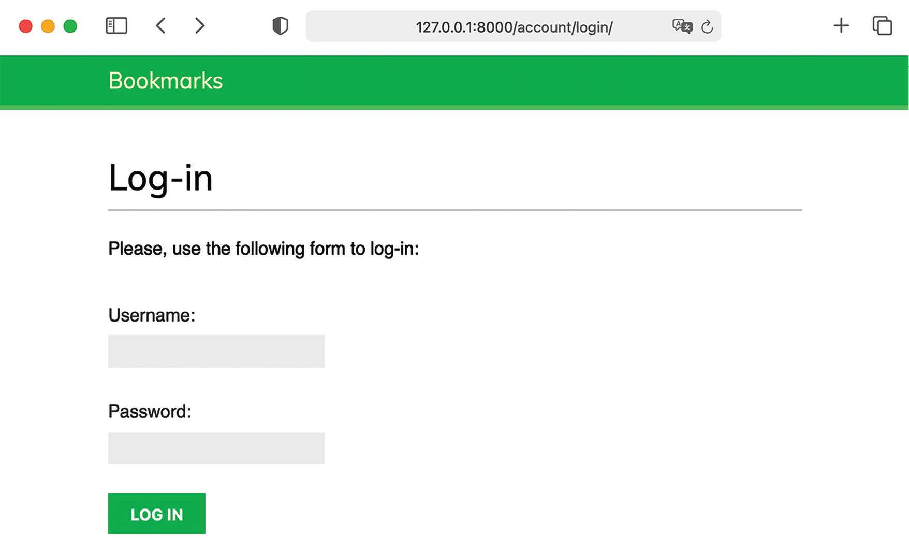

  **Figure 4.5**: The user Log-in page

</div>

### ✅ Testing Scenarios:

1️⃣ **Enter invalid credentials** → You should see an **Invalid login** message.

<div align="center">
  

  **Figure 4.6**: The invalid login plain text response

</div>


2️⃣ **Enter valid credentials** → You should see **Authenticated successfully**.

<div align="center">
  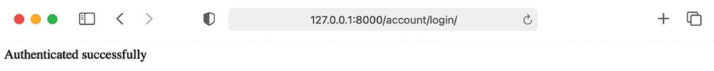

  **Figure 4.7**: The successful authentication plain text response

</div>

<div align="center">

# `New Section Built-in Authentication Views`

</div>

# 🔐 **Using Django’s Built-in Authentication Views**

Django provides **ready-to-use authentication views** in `django.contrib.auth.views` that can save time when building web applications with user authentication. These built-in views handle **user login, logout, password changes, and password resets**. 🚀

---

## 📌 Why Use Django’s Built-in Authentication Views?

Instead of manually creating login and logout views, Django offers **pre-built authentication views** that:

✅ Provide a **secure** authentication system.

✅ Follow **best security practices** (e.g., password hashing, session handling).

✅ Are **customizable** (templates, forms, redirection, etc.).

✅ Save **development time** when building user account functionality.

---

## 📌 Authentication Views in `django.contrib.auth.views`

### 🔑 **Login & Logout Views**

| View             | Purpose                                             |
| ---------------- | --------------------------------------------------- |
| **`LoginView`**  | Handles login form submission and logs in the user. |
| **`LogoutView`** | Logs out the user and clears the session.           |

### 🔐 **Password Change Views**

| View                         | Purpose                                                  |
| ---------------------------- | -------------------------------------------------------- |
| **`PasswordChangeView`**     | Displays a form to allow users to change their password. |
| **`PasswordChangeDoneView`** | Redirects the user after a successful password change.   |

### 🔄 **Password Reset Views**

| View                            | Purpose                                                           |
| ------------------------------- | ----------------------------------------------------------------- |
| **`PasswordResetView`**         | Sends an email with a password reset link.                        |
| **`PasswordResetDoneView`**     | Informs the user that an email has been sent.                     |
| **`PasswordResetConfirmView`**  | Allows users to set a new password after clicking the reset link. |
| **`PasswordResetCompleteView`** | Redirects the user after successfully resetting their password.   |

💡 These views work **out of the box** but can be **customized** (e.g., changing templates, modifying form fields).

---

# 🔐 **Implementing Django’s Built-in Login and Logout Views**

In this section, we will replace our **custom login view** with Django’s **built-in authentication views** and integrate a **logout view**. Using Django’s pre-built views helps maintain security and reduces the need for custom authentication logic.

---

## 📌 Step 1: Updating `urls.py` in the `account` Application

Edit the `urls.py` file inside the `account` application and modify it as follows:

```python
from django.contrib.auth import views as auth_views  # Import Django auth views
from django.urls import path
from . import views

urlpatterns = [
    # Previous custom login URL (commented out)
    # path('login/', views.user_login, name='login'),
    
    # ✅ Using Django's built-in authentication views
    path('login/', auth_views.LoginView.as_view(), name='login'),  # Built-in login view
    path('logout/', auth_views.LogoutView.as_view(), name='logout'),  # Built-in logout view
]
```

### ✅ Explanation:

- **`auth_views.LoginView.as_view()`** → Uses Django’s built-in login view instead of a custom function.
- **`auth_views.LogoutView.as_view()`** → Handles user logout securely.
- The **previous custom login URL is commented out** because Django’s built-in views are more secure and efficient.

---

# &#x20;**Setting Up Authentication Templates 🎨**

To ensure our authentication system works correctly, we need to create **login and logout templates**. Django’s authentication views expect these templates to be inside the **`templates/registration/`** directory by default.

---

## 📌 Step 1: Create the Required Template Directory

Inside the `account` application, create the following directory structure:

```
account/
│── templates/
│   ├── registration/
│   │   ├── login.html
│   │   ├── logged_out.html
```

By default, Django’s authentication views look for templates in `templates/registration/`, so we must store our authentication templates there.

---

## 📌 Step 2: Understanding Template Priority

Django's **`django.contrib.admin`** module includes default authentication templates for the **admin login page**.

Since we want to use **our own authentication templates**, we need to **place the ************************************************************************`account`************************************************************************ app at the top** of the `INSTALLED_APPS` list in `settings.py`:

```python
INSTALLED_APPS = [
    'account.apps.AccountConfig',  # Ensure this is listed first
    'django.contrib.admin',
    'django.contrib.auth',
    'django.contrib.contenttypes',
    'django.contrib.sessions',
    'django.contrib.messages',
    'django.contrib.staticfiles',
]
```

### ✅ Explanation:

- Django loads apps **in the order they appear** in `INSTALLED_APPS`.
- Placing `account` first ensures that **Django uses our authentication templates** instead of the ones from `django.contrib.admin`.

---

## 📌 Step 3: Creating the `login.html` Template

Create `templates/registration/login.html` and add the following code:

```html

Log-in

    <h1>Log-in</h1>
    
        <p>
            Your username and password didn't match.
            Please try again.
        </p>
    
        <p>Please, use the following form to log in:</p>
    
    <div class="login-form">
        <form action="" method="post">
            {{ form.as_p }}
            
            <input type="hidden" name="next" value="{{ next }}" />
            <p><input type="submit" value="Log in"></p>
        </form>
    </div>

```

### ✅ Explanation:

- **``** → Displays an error message if authentication fails.
- **`<form action="" method="post">`** → Submits credentials to Django’s built-in `LoginView`.
- **``** → Adds **CSRF protection** to prevent security attacks.
- **Hidden ** field (**`next`**variable)** → Redirects the user **to a specific page after login**.
  - If the login page is accessed with a URL like `http://127.0.0.1:8000/account/login/?next=/dashboard/`, Django will redirect the user to  upon successful login to `dashboard` page.

---

## 📌 Step 4: Creating the `logged_out.html` Template

Create `templates/registration/logged_out.html` and add the following code:

```html

Logged out

    <h1>Logged out</h1>
    <p>
        You have been successfully logged out.
        You can <a href="">log in again</a>.
    </p>

```

### ✅ Explanation:

- Extends `base.html` the main layout structure.
- **Displays a logout confirmation message**.
- **Includes a login link** → Allows users to log in again easily.

---

## 📌 Step 5: Ensuring Authentication Views Work

With these templates in place, Django’s **LoginView** and **LogoutView** will now function properly. Users can:

1️⃣ Visit `/account/login/` to log in. <br>
2️⃣ Log out at `/account/logout/`, which renders `logged_out.html`. <br>
3️⃣ **Be redirected after login** if a `next` parameter is provided. <br>


---

#  **Django Dashboard View Setup** 📌

## 🚀 Overview

In this guide, we will create a **dashboard view** that will be displayed when users log into their accounts. This will involve editing multiple files, including `views.py`, `urls.py`, `settings.py`, and creating a new template `dashboard.html`.

---

## 📂 Step 1: Editing `views.py`

Edit the `views.py` file of the **account** application and add the following code:

```python
from django.contrib.auth.decorators import login_required
from django.shortcuts import render

@login_required  # Ensures only logged-in users can access this view
def dashboard(request):
    return render(
        request,
        'account/dashboard.html',  # Renders the dashboard template
        {'section': 'dashboard'}   # Context data to highlight the menu section
    )
```

### 📌 Code Explanation:

- **`@login_required`**: This decorator ensures that only authenticated users can access the dashboard.
- **`render(request, 'account/dashboard.html', {'section': 'dashboard'})`**:
  - `request`: The HTTP request object.
  - `'account/dashboard.html'`: The template file to render.
  - `{'section': 'dashboard'}`: A dictionary with context data to highlight the active section in the menu.

If an **unauthenticated user** tries to access this view, they will be redirected to the **login page**. Once they log in, they will be redirected back to the **dashboard**.

---

## 📂 Step 2: Creating `dashboard.html`

Create a new file inside the `templates/account/` directory and name it `dashboard.html`.

```html

Dashboard


    <h1>Dashboard</h1>
    <p>Welcome to your dashboard.</p>

```

### 📌 Code Explanation:

- **``**: Inherits the base template (`base.html`) to maintain consistency.
- **``**: Sets the page title as "Dashboard".
- **``**:
  - Displays an `<h1>` heading: "Dashboard".
  - Displays a `<p>` tag: "Welcome to your dashboard.".

This template ensures that the dashboard page is displayed properly to the authenticated users.

---

## 📂 Step 3: Updating `urls.py`

Edit the `urls.py` file of the **account** application and add the following URL pattern:

```python
from django.urls import path
from django.contrib.auth import views as auth_views
from . import views

urlpatterns = [
    # Previous login URL
    # path('login/', views.user_login, name='login'),
    
    # Login and logout URLs
    path('login/', auth_views.LoginView.as_view(), name='login'),
    path('logout/', auth_views.LogoutView.as_view(), name='logout'),
    
    # New dashboard view
    path('', views.dashboard, name='dashboard'),
]
```

### 📌 Code Explanation:

- **`path('', views.dashboard, name='dashboard')`**:
  - Maps the **dashboard view**on.
  - When users log in, they will be redirected here.

---

## 📂 Step 4: Configuring `settings.py`

Edit the `settings.py` file of the **project** and add the following code:

```python
LOGIN_REDIRECT_URL = 'dashboard'
LOGIN_URL = 'login'
LOGOUT_URL = 'logout'
```

### 📌 Code Explanation:

- **`LOGIN_REDIRECT_URL = 'dashboard'`**:
  - After successful login, users will be redirected to the **dashboard** view.
  - If no `next` parameter is present in the login request, this setting ensures redirection to the dashboard.
- **`LOGIN_URL = 'login'`**:
  - Specifies the **login page** URL.
  - Used by Django’s authentication system.
- **`LOGOUT_URL = 'logout'`**:
  - Specifies the **logout page** URL.
  - Ensures users are redirected properly after logging out.

---

# &#x20;**Django Authentication and Navigation Setup 📌**

## 🚀 Overview

In this guide, we have:

- Added Django's built-in authentication **login and logout views**.
- Created **custom templates** for both views and set up a simple **dashboard view** to redirect users after login.
- Configured **Django settings** to use these authentication URLs by default.

Now, we will modify the `base.html` template to include:

- A **login link** for unauthenticated users.
- A **logout button** and **menu navigation** for authenticated users.

---

## 📂 Step 1: Editing `base.html`

Edit the `templates/base.html` file and add the following code:

```html

<!DOCTYPE html>
<html>
<head>
    <title></title>
    <link href="" rel="stylesheet">
</head>
<body>
    <div id="header">
        <span class="logo">Bookmarks</span>
         <!-- Check if user is logged in -->
        <ul class="menu">
            <li class="selected">
                <a href="">My dashboard</a>
            </li>
            <li class="selected">
                <a href="#">Images</a>
            </li>
            <li class="selected">
                <a href="#">People</a>
            </li>
        </ul>
        

        <span class="user">
            
                Hello {{ request.user.first_name|default:request.user.username }},
                <form action="" method="post">
                    <button type="submit">Logout</button>
                     <!-- Security token required for POST requests -->
                </form>
            
                <a href="">Log-in</a>
            
        </span> <!-- End user section -->
    </div>

    <div id="content">
        
        
    </div>
</body>
</html>
```

### 📌 Code Explanation:

- **``**:
  - Checks if a user is logged in.
  - Displays the **navigation menu** and **logout button** only if authenticated.
- **`<li class="selected">`**:
  - Adds a `selected` CSS class to highlight the active menu item.
- **`{{ request.user.first_name|default:request.user.username }}`**:
  - Displays the user's **first name** if available.
  - If the **first name is empty**, it defaults to displaying the **username**.
- **Logout Mechanism:**
  - Uses a **POST request** because `LogoutView` requires POST.
  - The **CSRF token** (``) is required for security.
- **Login Link:**
  - If the user is not logged in, a **"Log-in"** link is displayed.

---

## 🖥️ Step 2: Testing Authentication Flow

1. Open **[http://127.0.0.1:8000/account/login/](http://127.0.0.1:8000/account/login/)** in the browser.
2. Enter **valid login credentials** and click **Log-in**.
3. You should now see the **Dashboard** page with the menu displayed.

<div align="center">
  

  **Figure 4.8**: The Dashboard page

</div>

1. The **My dashboard** menu item is **highlighted** using CSS.
2. The **user's name** appears on the right side of the header.
3. Click the **Logout** button:
   - You will be redirected to the logout page.
   - The **menu disappears**, and the **Log-in link** is displayed instead.
<div align="center">
  

  **Figure 4.9**: The Logged out page

</div>

`Important Note:`
>If you see the Logged out page of the Django administration site instead of your own Loggedout page, check the INSTALLED_APPS setting of your project and make sure that django.contrib.admin comes after the account application. Both applications contain logged-out templates located in the same relative path. The Django template loader will go through the different applications in the INSTALLED_APPS list and use the first template it finds.
---

<div align="center">

# `New Section Password Change Views`

</div>

# 🔐 **Django Change Password Implementation**

## 🚀 Overview

To allow users to change their password after logging in, we integrate Django's built-in **authentication views**. This guide explains how to set up **password change functionality** in Django by modifying `urls.py`.

---

## 📂 Step 1: Updating `urls.py`

Open the `urls.py` file of the **account** application and add the following URL patterns:

```python
from django.urls import path
from django.contrib.auth import views as auth_views
from . import views

urlpatterns = [
    # path('login/', views.user_login, name='login'),
    path('login/', auth_views.LoginView.as_view(), name='login'),
    path('logout/', auth_views.LogoutView.as_view(), name='logout'),

    # Change password URLs
    path(
        'password-change/',
        auth_views.PasswordChangeView.as_view(),
        name='password_change'
    ),  # View to handle password change
    
    path(
        'password-change/done/',
        auth_views.PasswordChangeDoneView.as_view(),
        name='password_change_done'
    ),  # View to display success message after password change
    
    path('', views.dashboard, name='dashboard'),
]
```

---

## 📌 Code Explanation

### 🔄 Password Change Views:

- **`path('password-change/', auth_views.PasswordChangeView.as_view(), name='password_change')`**:

  - Uses Django’s built-in `PasswordChangeView`.
  - Provides a form for **logged-in users** to change their password.
  - Requires the user to **enter their old password** before setting a new one.
  - Maps to `/account/password-change/`.

- **`path('password-change/done/', auth_views.PasswordChangeDoneView.as_view(), name='password_change_done')`**:

  - Uses Django’s built-in `PasswordChangeDoneView`.
  - Displays a **success message** after a user successfully changes their password.
  - Maps to `/account/password-change/done/`.

---
# 🔐 **Django Password Change Templates**

## 🚀 Overview

To allow users to change their password, we use Django's built-in **PasswordChangeView** and **PasswordChangeDoneView**.

- `PasswordChangeView` handles the password change form.
- `PasswordChangeDoneView` displays a success message after the password is changed.

This guide covers creating the required templates inside the `templates/registration/` directory.

---

## 📂 Step 1: Creating `password_change_form.html`

Create a new file inside the `templates/registration/` directory and name it `password_change_form.html`. Add the following code:

```html

Change your password


    <h1>Change your password</h1>
    <p>Use the form below to change your password.</p>
    
    <form method="post">
        {{ form.as_p }}
        <p><input type="submit" value="Change"></p>
         <!-- Prevents Cross-Site Request Forgery attacks -->
    </form>

```

### 📌 Code Explanation:

- **``**:
  - Inherits the base template for consistency in design.
- **``**:
  - Sets the page title to **"Change your password"**.
- **``**:
  - Displays an `<h1>` header with **"Change your password"**.
  - Includes a `<p>` tag explaining the purpose of the form.
  - Uses **`{{ form.as_p }}`** to render Django’s password change form.
  - Includes an **input button** to submit the form.
  - Uses **``** to protect against CSRF attacks.

---

## 📂 Step 2: Creating `password_change_done.html`

Create another file in the `templates/registration/` directory and name it `password_change_done.html`. Add the following code:

```html

Password changed


    <h1>Password changed</h1>
    <p>Your password has been successfully changed.</p>

```

### 📌 Code Explanation:

- **``**:
  - Ensures the page follows the structure of the base template.
- **``**:
  - Sets the page title to **"Password changed"**.
- **``**:
  - Displays an `<h1>` header with **"Password changed"**.
  - Includes a `<p>` tag with a success message.

---


## 🖥️ Step 3: Testing the Password Change Flow

1. **Open `http://127.0.0.1:8000/account/password-change/` in your browser.**
   - If not logged in, Django redirects you to the login page.

<div align="center">
  

  **Figure 4.10**: The change password form

</div>

1. **Authenticate yourself and access the change password form.**
2. **Fill in your current password and new password, then click CHANGE.**
3. **You will be redirected to `http://127.0.0.1:8000/account/password-change/done/` with a success message.**

<div align="center">
  

  **Figure 4.11**: The successful change password page

</div>

---

# 🔐 **Reset Password Functionality**

## Overview ✨

When users forget their password, they need a secure way to recover access to their account. This feature allows users to initiate a password reset process by submitting their email address. They will receive an email containing a secure link with a unique token, which enables them to create a new password. The following URL configuration leverages Django’s built-in authentication views to manage login, logout, password change, and password reset operations.

## URL Configuration 📑

In the `urls.py` file of the account application, the following URL patterns are defined:

```python
urlpatterns = [
    path('login/', auth_views.LoginView.as_view(), name='login'),
    path('logout/', auth_views.LogoutView.as_view(), name='logout'),
    path(
        'password-change/',
        auth_views.PasswordChangeView.as_view(),
        name='password_change'
    ),
    path(
        'password-change/done/',
        auth_views.PasswordChangeDoneView.as_view(),
        name='password_change_done'
    ),
    # 🔐 Reset Password URLs
    # 📩 Password Reset: Displays a form to request a password reset via email.
    path(
        'password-reset/',
        auth_views.PasswordResetView.as_view(),
        name='password_reset'
    ),
    path(
        'password-reset/done/',
        auth_views.PasswordResetDoneView.as_view(),
        name='password_reset_done'
    ),
    path(
        'password-reset/<uidb64>/<token>/',
        auth_views.PasswordResetConfirmView.as_view(),
        name='password_reset_confirm'
    ),
    path(
        'password-reset/complete/',
        auth_views.PasswordResetCompleteView.as_view(),
        name='password_reset_complete'
    ),
    path('', views.dashboard, name='dashboard'),
]
```

## Detailed Code Explanations 🔍
- **`# reset password urls`**  
  - **📌 Comment:** Indicates that the subsequent URL patterns are related to the password reset process.

- **`path('password-reset/', auth_views.PasswordResetView.as_view(), name='password_reset'),`**  
  - **📩 Function:** Configures the URL `/password-reset/` to display a form where users can request a password reset by entering their email address.
  - **🏷️ Naming:** The URL is named `password_reset` for reference during form submission and redirection.

- **`path('password-reset/done/', auth_views.PasswordResetDoneView.as_view(), name='password_reset_done'),`**  
  - **✉️ Function:** Once the password reset form is submitted, users are redirected to `/password-reset/done/` which confirms that an email has been sent.
  - **🏷️ Naming:** The name `password_reset_done` is used to indicate this state.

- **`path('password-reset/<uidb64>/<token>/', auth_views.PasswordResetConfirmView.as_view(), name='password_reset_confirm'),`**  
  - **🔑 Function:** Handles the URL that users access from the reset email.  
    - **`<uidb64>`:** Represents the user’s ID in base64 encoding.
    - **`<token>`:** A unique token for security verification.
  - **🛡️ Purpose:** The `PasswordResetConfirmView` validates these parameters and presents a form for setting a new password.
  - **🏷️ Naming:** The name `password_reset_confirm` is used for reverse URL lookup.

- **`path('password-reset/complete/', auth_views.PasswordResetCompleteView.as_view(), name='password_reset_complete'),`**  
  - **🎉 Function:** After successfully resetting the password, users are directed to `/password-reset/complete/` where the `PasswordResetCompleteView` confirms the process.
  - **🏷️ Naming:** Named `password_reset_complete` to mark the final step of the reset process.

- **`path('', views.dashboard, name='dashboard'),`**  
  - **🏠 Function:** Maps the root URL of the account application to the `dashboard` view, typically serving as the user's landing page after login or password change.
  - **🏷️ Naming:** The name `dashboard` provides a clear reference for the home view.

---

Below is a professional-style README section for implementing the reset password templates and updating the login page, complete with **beautiful emojis** and **line-by-line code explanations**.

---

# 🔐 **Password Reset Templates**

## Overview ✨
In this section, we create the necessary HTML templates to facilitate the password reset process in a Django application. These templates include forms and messages guiding users through resetting their password. Additionally, we update the existing `login.html` template to include a link to the password reset process.

> **Note**: All templates should reside in the `templates/registration/` directory within your `account` application (or wherever your Django project is configured to look for authentication templates).

---

## 1. `password_reset_form.html` 📄

Create a new file named `password_reset_form.html` in `templates/registration/` and add the following code:

```html

Reset your password

  <h1>Forgotten your password?</h1>
  <p>Enter your e-mail address to obtain a new password.</p>
  <form method="post">
    {{ form.as_p }}
    <p><input type="submit" value="Send e-mail"></p>
    
  </form>

```

### Line-by-Line Explanation 🔍

1. **``**  
   - 🏗️ Inherits the layout from `base.html`, ensuring consistent design (header, footer, etc.).

2. **`Reset your password`**  
   - 🏷️ Sets the title of the page to "Reset your password".

3. **``**  
   - 📦 Begins the main content section where the reset form will be placed.

4. **`<h1>Forgotten your password?</h1>`**  
   - 📝 Heading prompting the user that they are on the “Forgotten password” page.

5. **`<p>Enter your e-mail address to obtain a new password.</p>`**  
   - 💡 Provides instructions to the user about what to do.

6. **`<form method="post">`**  
   - 🚀 Starts an HTML form that sends data via POST to the current URL.

7. **`{{ form.as_p }}`**  
   - 🧩 Renders the Django form in paragraph (`<p>`) tags for each field.

8. **`<p><input type="submit" value="Send e-mail"></p>`**  
   - 🚚 Submit button labeled "Send e-mail" to trigger the password reset request.

9. **``**  
   - 🔒 Includes Django’s CSRF token for security against cross-site request forgery.

10. **`</form>`**  
    - ✅ Closes the form tag.

11. **``**  
    - 🔚 Closes the content block.

---

## 2. `password_reset_email.html` 📧

Create another file named `password_reset_email.html` in the same directory and add the following code:

```html
Someone asked for password reset for email {{ email }}. Follow the link below:
{{ protocol }}://{{ domain }}
Your username, in case you've forgotten: {{ user.get_username }}
```

### Line-by-Line Explanation 🔍

1. **`Someone asked for password reset for email {{ email }}.`**  
   - 📝 Informs the email recipient that a password reset was requested for the specified email.

2. **`Follow the link below:`**  
   - 🚦 Guides the user to follow the link to continue the reset process.

3. **`{{ protocol }}://{{ domain }}`**  
   - 🌐 Constructs the full URL for resetting the password, using:
     - **`{{ protocol }}`**: Either `http` or `https`.
     - **`{{ domain }}`**: The domain of the website (e.g., `127.0.0.1:8000`).
     - **``**: Django template tag to build the link to the `password_reset_confirm` view, passing the unique user ID (base64-encoded) and the reset token.

4. **`Your username, in case you've forgotten: {{ user.get_username }}`**  
   - 📛 Provides the user’s username to help them recall their login credentials.

> **Note**: This template is sent as the body of the reset password email. It’s purely text-based by default, but you can customize it to use HTML formatting if you configure your email backend accordingly.

---

## 3. `password_reset_done.html` ✅

Create another file named `password_reset_done.html` in the same directory:

```html

Reset your password

  <h1>Reset your password</h1>
  <p>We've emailed you instructions for setting your password.</p>
  <p>If you don't receive an email, please make sure you've entered the address
  you registered with.</p>

```

### Line-by-Line Explanation 🔍

1. **``**  
   - 🏗️ Inherits the base layout.

2. **`Reset your password`**  
   - 🏷️ Sets the page title to "Reset your password".

3. **``**  
   - 📦 Starts the main content block.

4. **`<h1>Reset your password</h1>`**  
   - 📝 Heading indicating the action being performed.

5. **`<p>We've emailed you instructions for setting your password.</p>`**  
   - ✉️ Confirms that instructions have been sent to the user’s email.

6. **`<p>If you don't receive an email, please make sure you've entered the address you registered with.</p>`**  
   - ❓ Offers guidance if the user does not receive the reset email.

7. **``**  
   - 🔚 Closes the content block.

---

## 4. `password_reset_confirm.html` 🔑

Create another file named `password_reset_confirm.html`:

```html

Reset your password

  <h1>Reset your password</h1>
  
    <p>Please enter your new password twice:</p>
    <form method="post">
      {{ form.as_p }}
      
      <p><input type="submit" value="Change my password" /></p>
    </form>
  
    <p>The password reset link was invalid, possibly because it has already
    been used. Please request a new password reset.</p>
  

```

### Line-by-Line Explanation 🔍

1. **``**  
   - 🏗️ Uses the base template.

2. **`Reset your password`**  
   - 🏷️ Sets the page title.

3. **``**  
   - 📦 Main content block starts.

4. **`<h1>Reset your password</h1>`**  
   - 📝 Heading clarifying the action.

5. **``**  
   - 🔍 Checks whether the reset link is valid (provided by the `PasswordResetConfirmView`).

6. **`<p>Please enter your new password twice:</p>`**  
   - 📝 Instructs the user to fill out both password fields.

7. **`<form method="post">`**  
   - 🚀 Starts the POST form for submitting the new password.

8. **`{{ form.as_p }}`**  
   - 🧩 Renders the password reset form fields (new password, confirmation).

9. **``**  
   - 🔒 Security token to protect against CSRF attacks.

10. **`<p><input type="submit" value="Change my password" /></p>`**  
    - 🚚 A button to submit the new password.

11. **`</form>`**  
    - ✅ Closes the form.

12. **``**  
    - ❓ If the link is invalid or expired, this block is displayed instead.

13. **`<p>The password reset link was invalid, possibly because it has already been used. Please request a new password reset.</p>`**  
    - ⚠️ Informs the user about the invalid/expired link.

14. **``**  
    - 🔚 Closes the `if` statement.

15. **``**  
    - 🔚 Ends the content block.

---

## 5. `password_reset_complete.html` 🎉

Finally, create `password_reset_complete.html`:

```html

Password reset

  <h1>Password set</h1>
  <p>Your password has been set. You can <a href="">log in
  now</a></p>

```

### Line-by-Line Explanation 🔍

1. **``**  
   - 🏗️ Uses the base layout.

2. **`Password reset`**  
   - 🏷️ Sets the page title to "Password reset".

3. **``**  
   - 📦 Begins the content section.

4. **`<h1>Password set</h1>`**  
   - 📝 Indicates that the new password has been successfully saved.

5. **`<p>Your password has been set. You can <a href="">log in now</a></p>`**  
   - 🚀 Provides a direct link to the login page so the user can immediately log in with their new password.

6. **``**  
   - 🔚 Closes the content block.

---

## 6. Update the `login.html` Template 🚪

Open the existing `registration/login.html` file of your `account` application. Add the lines highlighted by HTML comments (or just follow the instructions below). The template should look like this:

```html

Log-in

  <h1>Log-in</h1>
  
    <p>
      Your username and password didn't match.
      Please try again.
    </p>
  
    <p>Please, use the following form to log-in:</p>
  
  <div class="login-form">
    <form action="" method="post">
      {{ form.as_p }}
      
      <input type="hidden" name="next" value="{{ next }}" />
      <p><input type="submit" value="Log-in"></p>
    </form>
    <p> <!-- Reset Password link -->
      <a href="">
        Forgotten your password?
      </a>
    </p>
  </div>

```

### Line-by-Line Explanation 🔍

1. **``**  
   - 🏗️ Inherits the common layout.

2. **`Log-in`**  
   - 🏷️ Sets the page title to “Log-in”.

3. **``**  
   - 📦 Opens the main content section.

4. **`<h1>Log-in</h1>`**  
   - 📝 Page heading for the login form.

5. **``**  
   - 🔎 Checks if there are any form errors.

6. **`<p>Your username and password didn't match. Please try again.</p>`**  
   - ⚠️ Error message if the credentials are invalid.

7. **``**  
   - ✔️ If no errors, shows a simple instruction message.

8. **`<p>Please, use the following form to log-in:</p>`**  
   - 💬 Instruction for logging in.

9. **`<div class="login-form">`**  
   - 📦 A container for the login form (could be styled with CSS).

10. **`<form action="" method="post">`**  
    - 🚀 POSTs the login credentials to Django’s login view.

11. **`{{ form.as_p }}`**  
    - 🧩 Renders the username and password fields.

12. **``**  
    - 🔒 Protects the form with CSRF token.

13. **`<input type="hidden" name="next" value="{{ next }}" />`**  
    - 🔀 Preserves the next URL if the user was redirected here from another page.

14. **`<p><input type="submit" value="Log-in"></p>`**  
    - 🚪 The button to submit the login form.

15. **`</form>`**  
    - ✅ Closes the login form.

16. **`<p> <!-- Reset Password link -->`**  
    - 📝 Comment indicating this is where the reset password link is placed.

17. **`<a href="">Forgotten your password?</a>`**  
    - 🔗 A link that takes the user to the password reset page if they’ve forgotten their password.

18. **`</p>`**  
    - ✅ Closes the paragraph tag.

19. **`</div>`**  
    - ✅ Closes the login form container.

20. **``**  
    - 🔚 Ends the content block.

---

## 7. Test the Flow in Your Browser 🌐

- Navigate to `http://127.0.0.1:8000/account/login/`.  

<div align="center">
  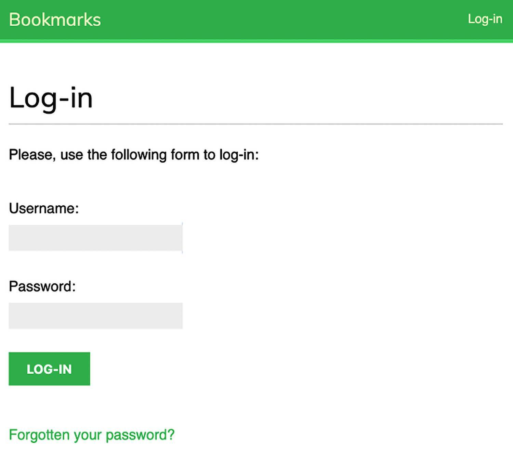

  **Figure 4.12**: The Log-in page, including a link to the reset password page

</div>

- You should now see a **“Forgotten your password?”** link.  
  
<div align="center">
  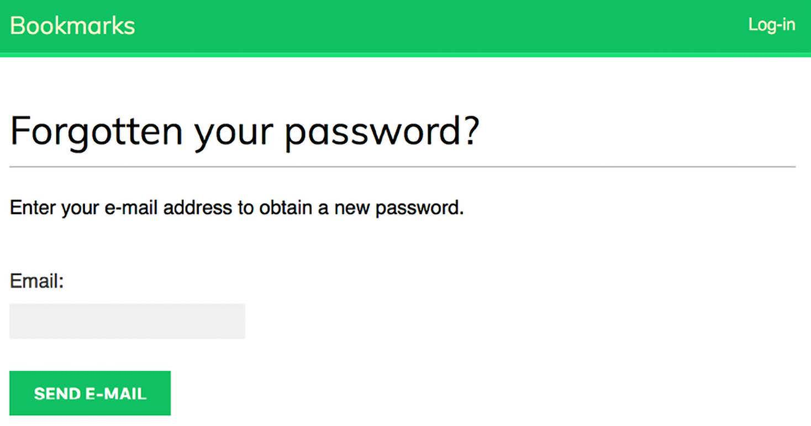

  **Figure 4.13**: The restore password formge

</div>

- Clicking on this link will take you to the **Password Reset** page (`password_reset_form.html`), allowing you to enter your email and proceed with the password reset flow.

---

# 📧 **SMTP Configuration & Authentication URL Patterns**

## Overview ✨

In this segment, we configure Django to send emails through the console (instead of a real SMTP server) for development purposes. This allows us to test the password reset feature without sending real emails. We also demonstrate how to replace custom URL patterns with Django’s built-in authentication URLs for a cleaner setup.

---

## 1. Configure the Email Backend in `settings.py` ⚙️

Edit your project’s `settings.py` file and add the following line:

```python
EMAIL_BACKEND = 'django.core.mail.backends.console.EmailBackend'
```

### Line-by-Line Explanation 🔍

1. **`EMAIL_BACKEND = 'django.core.mail.backends.console.EmailBackend'`**  
   - **🚀 Purpose**: Tells Django to send emails to the console (standard output) rather than using an SMTP server.  
   - **🛠️ Development-Friendly**: This setup is perfect for local testing because you can see all outgoing emails directly in your terminal or command prompt.

> **Note**: In production, you’d replace this setting with your actual SMTP credentials or another email backend.

---

## 2. Testing the Password Reset Flow 🏁

1. **Open the login page**: Navigate to `http://127.0.0.1:8000/account/login/`.  
2. **Click the “Forgotten your password?” link**: This takes you to the password reset page where you can enter an email address for an existing user.  
3. **Submit your email**: Click **SEND E-MAIL** (or similar button).  
<div align="center">
  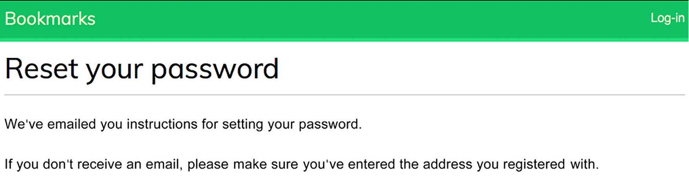

  **Figure 4.14**: The reset password email sent page

</div>
4. **Check the console**: In the shell or terminal where you’re running the development server, you’ll see the generated email message.

Below is an example of what you might see in the console:

```
Content-Type: text/plain; charset="utf-8"
MIME-Version: 1.0
Content-Transfer-Encoding: 7bit
Subject: Password reset on 127.0.0.1:8000
From: webmaster@localhost
To: test@gmail.com
Date: Mon, 10 Jan 2024 19:05:18 -0000
Message-ID: <162896791878.58862.14771487060402279558@MBP-amele.local>

Someone asked for password reset for email test@gmail.com. Follow the link below:
http://127.0.0.1:8000/account/password-reset/MQ/ardx0ub4973cfa2c70d652a190e79054bc479a/
Your username, in case you've forgotten: test
```

### Explanation of the Console Output 🔍

- **Email Headers**: The message shows standard email headers like `Subject`, `From`, `To`, and a timestamped `Message-ID`.  
- **Email Body**: Matches the `password_reset_email.html` template you created. It includes a secure link containing a token to reset the user’s password.

---

## 3. Complete the Password Reset Process ✅

1. **Copy the Password Reset Link**: From the console output, copy the URL, e.g. `http://127.0.0.1:8000/account/password-reset/MQ/ardx0u-b4973cfa2c70d652a190e79054bc479a/`.  
2. **Open the Link in Your Browser**: You’ll be taken to the **password reset confirm** page (rendered by `password_reset_confirm.html`).  

<div align="center">
  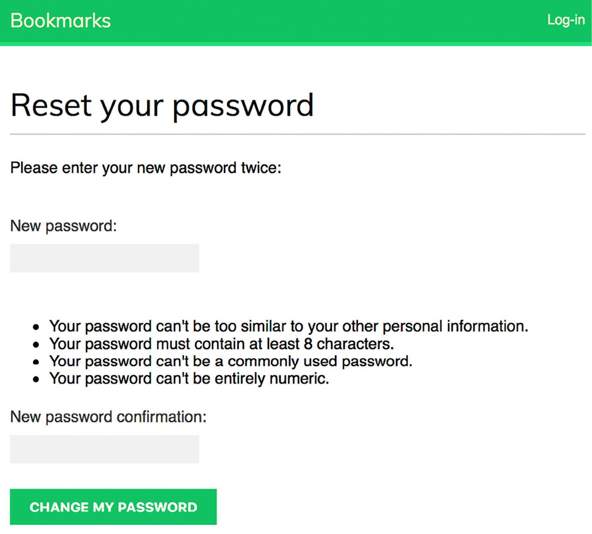

  **Figure 4.15**:  The reset password form

</div>


1. **Enter a New Password**: Fill in the required fields and click **CHANGE MY PASSWORD**.  
<div align="center">
  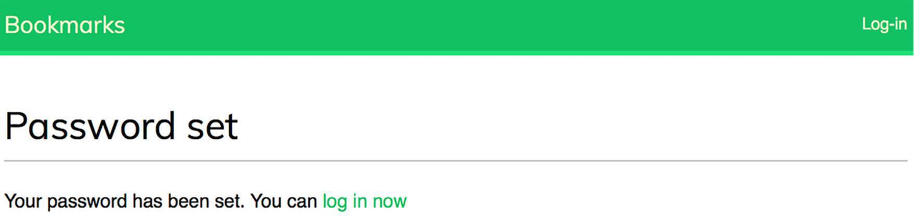

  **Figure 4.16**:  The successful password reset page

</div>

2. **Success Page**: Django saves the new (hashed) password to the database and shows the **password reset complete** page. You can now log in with your new password.

> **One-Time Token**: Each reset token can only be used once. If you try using the same link again, you’ll see a message indicating the token is invalid.

---

## 4. Replacing Custom URL Patterns with Django’s Built-In URLs 🛠️

You have already set up custom URL patterns in your `urls.py` for login, logout, and password management. Django provides equivalent built-in URL patterns via `django.contrib.auth.urls`. This allows you to reduce boilerplate code.

Open your `account/urls.py` file and **comment out** your existing authentication patterns, then **include** Django’s built-in patterns. Here’s an example:

```python
from django.urls import include, path
from django.contrib.auth import views as auth_views
from . import views

urlpatterns = [
    # previous login view
    # path('login/', views.user_login, name='login'),
    # path('login/', auth_views.LoginView.as_view(), name='login'),
    # path('logout/', auth_views.LogoutView.as_view(), name='logout'),

    # change password urls
    # path('password-change/', auth_views.PasswordChangeView.as_view(), name='password_change'),
    # path('password-change/done/', auth_views.PasswordChangeDoneView.as_view(), name='password_change_done'),

    # reset password urls
    # path('password-reset/', auth_views.PasswordResetView.as_view(), name='password_reset'),
    # path('password-reset/done/', auth_views.PasswordResetDoneView.as_view(), name='password_reset_done'),
    # path('password-reset/<uidb64>/<token>/', auth_views.PasswordResetConfirmView.as_view(), name='password_reset_confirm'),
    # path('password-reset/complete/', auth_views.PasswordResetCompleteView.as_view(), name='password_reset_complete'),

    # ✨ Built-in authentication URL patterns
    path('', include('django.contrib.auth.urls')),

    # Dashboard view
    path('', views.dashboard, name='dashboard'),
]
```

### Line-by-Line Explanation 🔍

1. **`from django.urls import include, path`**  
   - 🧩 Imports Django’s URL functions, including `include()` for grouping multiple URL patterns.

2. **`from django.contrib.auth import views as auth_views`**  
   - 🔑 Imports Django’s built-in authentication views under the alias `auth_views`.

3. **`from . import views`**  
   - 🏠 Imports your local `views.py` functions, e.g., `dashboard`.

4. **`urlpatterns = [ ... ]`**  
   - 🚦 Defines the URL patterns for this app.

5. **Commented-out lines** (e.g., `# path('login/', auth_views.LoginView.as_view(), name='login'),`)  
   - 🛑 Temporarily disables your custom authentication patterns to avoid duplication.

6. **`path('', include('django.contrib.auth.urls')),`**  
   - ✨ Replaces your custom auth URLs with Django’s built-in patterns. These include:
     - `/login/` and `/logout/`
     - `/password_change/` and `/password_change/done/`
     - `/password_reset/` and related URLs
   - This approach reduces code duplication and leverages Django’s tested auth functionality.

7. **`path('', views.dashboard, name='dashboard'),`**  
   - 🏠 Keeps the dashboard URL as the default route for your `account` app.

---

<div align="center">

# `New Section Register User Profile`

</div>

# **User Registration** 🚀 

Lets create a  site visitors to register an account and create a user profile. Once registered, users can log in, log out, change their password, and reset their password.

---

## ✨ Overview

- 📝 **User Registration:** Visitors can sign up by entering a username, their real name, and a password.
- 🏆 **User Profiles:** After registering, users will be able to create and manage their profiles.
- 🔄 **Dynamic User Model:** By using Django's `get_user_model()`, our code remains generic and supports custom user models.

---

## 📚 Code Implementation with Detailed Explanations

Below is the implementation in the `forms.py` file inside the `account` application directory. Each line includes an explanation for clarity.

```python
from django import forms                 
from django.contrib.auth import get_user_model

class LoginForm(forms.Form):                
    username = forms.CharField()           
    password = forms.CharField(widget=forms.PasswordInput) 

# 📝 User RegistrationForm for new user sign-up
class UserRegistrationForm(forms.ModelForm):
    password = forms.CharField(
        label='Password',                   
        widget=forms.PasswordInput            
    )
    password2 = forms.CharField(
        label='Repeat password',             
        widget=forms.PasswordInput           
    )
    class Meta:
        model = get_user_model()         
        fields = ['username', 'first_name', 'email']
```

---

## 🔍 Explanation of Key Components

- **🔄 Dynamic User Model Retrieval:**\
  By using `get_user_model()`, our form is compatible with both the default Django User model and any custom user models. This ensures the code remains generic and flexible.\
  👉 *Tip:* Always use `get_user_model()` instead of directly referencing the User model to support future customizations.

- **📌 Field Definitions:**

  - 🏷️ **Username:** Collected using a simple `CharField`.
  - 🔐 **Password & Password2:**\
    These fields ensure that users enter their desired password twice. The use of `PasswordInput` masks the user input for security.
  - 📧 **First Name & Email:**\
    Gathered from the user model, these fields will adhere to the model's built-in validations (e.g., unique username constraint).

- **✅ Validation:**\
  When the form is submitted, Django will automatically validate each field against the rules defined in the user model. For example, if the username is already taken, Django will return a validation error.

- **🎯 Benefits of this Setup:**

  - 🔒 **Security:** Password fields are masked to prevent onlookers from reading them.
  - ⚡ **Flexibility:** The use of dynamic user models means the form can easily adapt if you switch to a custom user model later.
  - 🎉 **User Experience:** The duplicate password field helps reduce errors during registration.

---

## 📖 Additional Resources

For more detailed information on customizing the user model and related best practices, check out the official Django documentation on [customizing authentication](https://docs.djangoproject.com/en/5.0/topics/auth/customizing/#django.contrib.auth.get_user_model) 🔗.🚀


# **Password Validations** 🔐
This document explains the implementation of a custom user registration form in a Django application. The form is designed to allow users to set their password by entering it twice and includes built-in validation to ensure that the two password entries match. This approach improves user experience by catching errors early before attempting to create a new account.

---

## Overview ✨

In the registration form, we have introduced two password fields:

- **password:** The primary field for the user to enter a new password.
- **password2:** A confirmation field that requires the user to re-enter the same password.

A custom method `clean_password2()` is implemented to validate that the passwords entered in both fields are identical. If the two fields do not match, the form raises a validation error. This field-specific validation method is automatically invoked when the form’s `is_valid()` method is called.

---

## Code Explanation

Below is the code snippet from the `forms.py` file within the `account` application
```python
from django import forms
from django.contrib.auth import get_user_model

class UserRegistrationForm(forms.ModelForm):
    password = forms.CharField(
        label='Password',
        widget=forms.PasswordInput
    )
    password2 = forms.CharField(
        label='Repeat password',
        widget=forms.PasswordInput
    )
    class Meta:
        model = get_user_model()
        fields = ['username', 'first_name', 'email']

    # Field-specific validation for the 'password2' field
    def clean_password2(self):
        cd = self.cleaned_data
        if cd['password'] != cd['password2']:
            raise forms.ValidationError("Passwords don't match.")ses
        return cd['password2']
```

---

## Detailed Code

**Field-Specific Validation: `clean_password2`**
   - `def clean_password2(self):`  
     This method is specifically designed to clean and validate the `password2` field.
   - `cd = self.cleaned_data`:  
     Retrieves a dictionary of the cleaned data after the form has been submitted.
   - `if cd['password'] != cd['password2']:`  
     Compares the value entered in the `password` field with the one in the `password2` field.
   - `raise forms.ValidationError("Passwords don't match.")`:  
     If the two values do not match, the method raises a `ValidationError`, which prevents the form from being submitted and displays an error message to the user.
   - `return cd['password2']`:  
     If the passwords match, the method returns the confirmed password. This is the value that will be stored in the cleaned data for further processing.

---

## Additional Notes

- **Form Validation Process:**  
  The `clean_password2()` method is called automatically when `is_valid()` is executed on the form instance. This ensures that the validation error is raised immediately if the two passwords do not match.

- **Field-Specific vs. General Clean Methods:**  
  While Django forms provide a general `clean()` method to validate the entire form, using field-specific methods like `clean_password2()` allows for more granular control. This approach avoids unintentionally overriding other built-in validations (such as unique username checks).

---

#  **Django User Registration & Password Hashing** 🔐

This document explains how Django provides a user registration system using the `UserCreationForm` from `django.contrib.auth.forms` and describes how to create a custom user registration view along with an explanation of Django's password hashing mechanism.

## 📝 Register View Implementation

Edit the `views.py` file of the account application and add the following code. The code creates a new user account by utilizing a custom `UserRegistrationForm` and includes comments to highlight each step:

```python
from django.contrib.auth import authenticate, login
from django.contrib.auth.decorators import login_required
from django.http import HttpResponse
from django.shortcuts import render
from .forms import LoginForm, UserRegistrationForm  # import UserRegistrationForm

# Register View
def register(request):
    if request.method == 'POST':
        user_form = UserRegistrationForm(request.POST)
        if user_form.is_valid():
            # Create a new user object but avoid saving it yet
            new_user = user_form.save(commit=False)
            # Set the chosen password
            new_user.set_password(
                user_form.cleaned_data['password']
            )
            # Save the User object
            new_user.save()
            return render(
                request,
                'account/register_done.html',
                {'new_user': new_user}
            )
    else:
        user_form = UserRegistrationForm()
    return render(
        request,
        'account/register.html',
        {'user_form': user_form}
    )
```

---

## 📋 Explanation of the Register View

- **User Creation**: The view handles both GET and POST requests. When a POST request is made, the view validates the submitted form data using the custom `UserRegistrationForm`.

- **Password Handling**:  
  Instead of saving the raw password entered by the user, the code uses the `set_password()` method of the user model. This method automatically hashes the password before storing it in the database.  
  Django stores passwords in hashed form for enhanced security, preventing clear text storage.

- **Password Hashing Process**:  
  Hashing transforms the given password into a fixed-length value using a mathematical algorithm. This ensures that if the database is compromised, retrieving the original passwords would require a significant amount of computational effort.

---

## 🔒 Django Password Hashing

Django, by default, employs the PBKDF2 algorithm with a SHA256 hash to securely store user passwords. However, Django is versatile and supports checking passwords hashed with various algorithms, including:

- **PBKDF2SHA1**
- **argon2**
- **bcrypt**
- **scrypt**

### ⚙️ Default PASSWORD_HASHERS Setting

The following list defines the default password hashers supported by Django:

```python
PASSWORD_HASHERS = [
    'django.contrib.auth.hashers.PBKDF2PasswordHasher',
    'django.contrib.auth.hashers.PBKDF2SHA1PasswordHasher',
    'django.contrib.auth.hashers.Argon2PasswordHasher',
    'django.contrib.auth.hashers.BCryptSHA256PasswordHasher',
    'django.contrib.auth.hashers.ScryptPasswordHasher',
]
```

Django uses the first hasher in the list (PBKDF2PasswordHasher) to hash all new passwords, while the remaining hashers are available to check existing passwords.

---

## 💡 Important Tip

- **scrypt Hasher**:  
  Introduced in Django 4.0, the `scrypt` hasher is more secure and is recommended over PBKDF2. However, PBKDF2 remains the default because `scrypt` requires OpenSSL 1.1+ and additional memory.

---

# 🔗 Django Account URL Patterns

This section details how to set up URL patterns in the `urls.py` file for the account application. The URL configuration includes Django’s built-in authentication URLs, a dashboard view, and a registration view.


## 🛣️ **URL Configuration**

Edit the `urls.py` file of your account application and add the following URL patterns, with comments highlighting the functionality of each route:

```python
from django.urls import path, include
from . import views

urlpatterns = [)
    path('', include('django.contrib.auth.urls')),
    path('', views.dashboard, name='dashboard'),
    path('register/', views.register, name='register'),  # Register url
]
```

This configuration enables the following:.
- **Registration**: Provides a dedicated URL (`register/`) for user registration, linking to the custom registration view defined in `views.py`.


---
 
#  **Django Account Templates** 🚀

Lets create and set up templates for user registration and update the login page to include a registration link. Each section is detailed with explanations and emojis for clarity.

---

## 📄 Creating the Registration Templatesl

Create a new template file named `register.html` in the `templates/account/` directory. This template extends the base layout and displays a form for new users to create an account.

```html

Create an account

  <h1>Create an account</h1>
  <p>Please, sign up using the following form:</p>
  <form method="post">
    {{ user_form.as_p }}
    
    <p><input type="submit" value="Create my account"></p>
  </form>

```

**Explanation:**  
- The template uses `` to inherit from your base layout.
- The `title` block is overridden to set the page title.
- The `content` block contains a header, a prompt, and a form that displays the registration fields using `{{ user_form.as_p }}`.
- The `` tag ensures the form is secure against Cross-Site Request Forgery attacks.

### 🎉 register_done.html

Create another template file named `register_done.html` in the same directory. This template is shown after a new user account is successfully created.

```html

Welcome

  <h1>Welcome {{ new_user.first_name }}!</h1>
  <p>
    Your account has been successfully created.
    Now you can <a href="">log in</a>.
  </p>

```

**Explanation:**  
- This template also extends the base layout.
- It sets a custom title "Welcome" and greets the new user by their first name.
- It informs the user that their account has been created and provides a link to the login page using Django’s `` template tag.

## 🔍 Verifying the Registration Process

### 🌐 Testing the Registration

1. **Open the Registration Page:**  
   Navigate to [http://127.0.0.1:8000/account/register/](http://127.0.0.1:8000/account/register/) in your browser. You should see the registration form created with `register.html`.


<div align="center">
  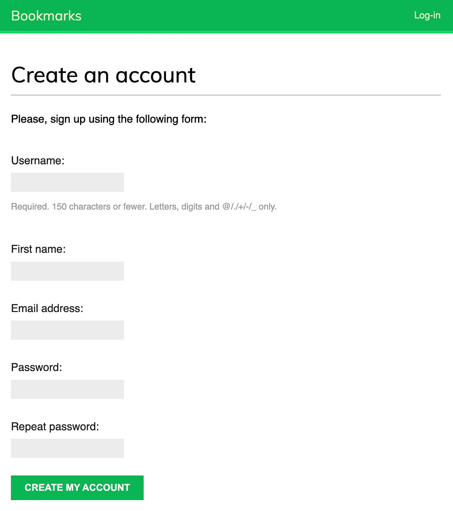

  **Figure 4.17**: The account creation form

</div>

2. **Create a New User:**  
   Fill in the details and click the **Create my account** button. If all fields are valid, the new user is created and you are redirected to the success page (`register_done.html`).

<div align="center">
  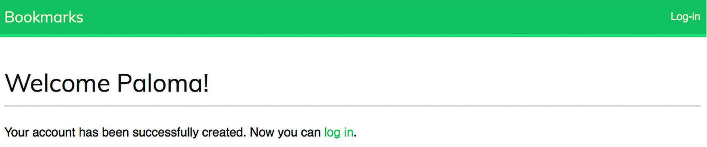

  **Figure 4.18**: The account is successfully created page

</div>

3. **Login Verification:**  
   Click the log in link provided on the success page. Use the username and password you registered with to verify that you can access your newly created account.

## 🔗 Updating the Login Page with a Registration Link

### 🛠️ Modifying registration/login.html

To make it easier for users to register, add a registration link directly on the login page. Edit the `registration/login.html` template.

1. **Locate the Current Login Prompt:**  
   Find the line that reads:
   ```html
   <p>Please, use the following form to log-in:</p>
   ```

2. **Replace with Updated Text and Link:**  
   Update the code to include a registration prompt:
   ```html
   <p>
     Please, use the following form to log-in.
     If you don't have an account <a href="">register here</a>.
   </p>
   ```

3. **Verify the Update:**  
   Open [http://127.0.0.1:8000/account/login/](http://127.0.0.1:8000/account/login/) in your browser. The page should now display the updated prompt with a clickable link to the registration page.

<div align="center">
  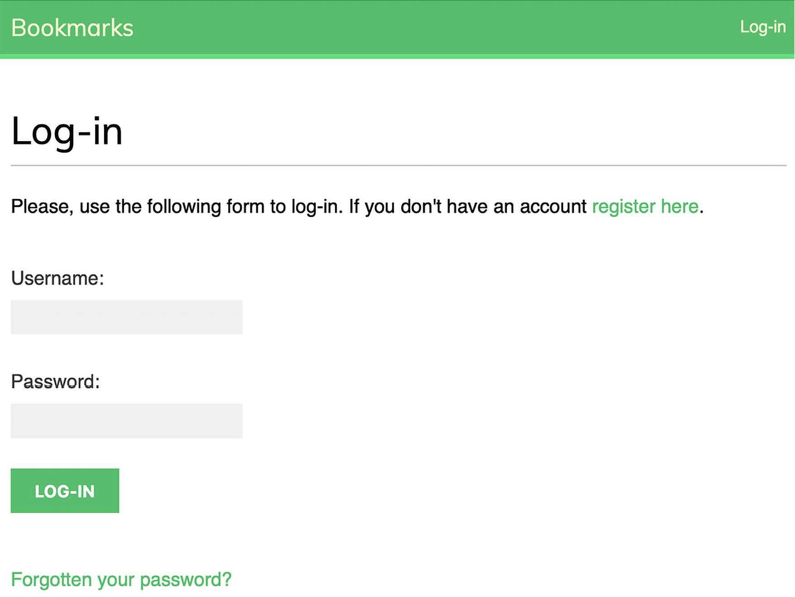

  **Figure 4.19**: The Log-in page including a link to register

</div>

**Explanation:**  
- The updated prompt informs users that if they don't have an account, they can register by clicking the provided link.
- This enhances user navigation and improves overall user experience by making the registration process easily accessible from the login page.


<div align="center">

# `New Section Extending the user model`

</div>

# **Extending the Django User Model with a Profile** 🚀

Django’s built-in user model is versatile and sufficient for many standard use cases. However, it only offers a limited set of predefined fields. If your application requires storing additional information—like a user’s date of birth or profile picture—you can extend the default user model by creating a separate **Profile** model. This approach uses a one-to-one relationship to ensure that each user has a unique profile, while keeping the authentication model uncluttered.

## Code Implementation 💻

Add the following code to your `models.py` file in the account application. The inline comments help explain each part of the implementation:

```python
from django.db import models
from django.conf import settings  # import settings

# add Profile Class
class Profile(models.Model):
    user = models.OneToOneField(
        settings.AUTH_USER_MODEL,
        on_delete=models.CASCADE
    )
    date_of_birth = models.DateField(blank=True, null=True)
    photo = models.ImageField(
        upload_to='users/%Y/%m/%d/',
        blank=True
    )
    
    def __str__(self):
        return f'Profile of {self.user.username}'
```

## Detailed Explanation of the Commented Code 📝

### `from django.conf import settings  # import settings`
- **Purpose:**  
  This line imports the Django settings module.  
- **Why It's Important:**  
  Using `settings.AUTH_USER_MODEL` allows your code to be flexible by referencing the user model defined in your project’s settings. This is crucial when using a custom user model instead of Django’s default `auth.User`, ensuring your code works regardless of the user model's implementation.

### `# add Profile Class`
- **Purpose:**  
  This comment introduces the creation of the **Profile** class.  
- **Why It's Important:**  
  The Profile model is designed to extend the existing user model by storing additional details (like date of birth and a profile photo) without modifying the original user model. This separation of concerns makes the application easier to maintain and scale.

### `user = models.OneToOneField(settings.AUTH_USER_MODEL, on_delete=models.CASCADE)`
- **Purpose:**  
  Establishes a one-to-one relationship between the Profile model and the user model.
- **Why It's Important:**  
  - **One-to-One Relationship:**  
    This type of relationship ensures that every user has a unique profile, and each profile is linked to exactly one user.
  - **Generic Reference:**  
    By using `settings.AUTH_USER_MODEL`, the code can accommodate custom user models.
  - **Cascade Delete:**  
    The `on_delete=models.CASCADE` parameter guarantees that if a user is deleted, their associated profile is automatically removed. This maintains data integrity by preventing orphaned profile records.

### `date_of_birth = models.DateField(blank=True, null=True)`
- **Purpose:**  
  Creates a field to store the user's date of birth.
- **Why It's Important:**  
  - **Optional Field:**  
    The parameters `blank=True` and `null=True` allow this field to be optional. This means that users may choose not to provide their date of birth without causing validation errors.
  - **Data Type:**  
    Using `DateField` ensures that only valid date entries are stored, and it provides useful date-related functionalities such as querying and formatting dates.

### `photo = models.ImageField(upload_to='users/%Y/%m/%d/', blank=True)`
- **Purpose:**  
  Adds an image field to store the user's profile photo.
- **Why It's Important:**  
  - **Image Validation:**  
    `ImageField` not only stores the file path but also validates that the uploaded file is a valid image format.
  - **Dynamic Storage Path:**  
    The `upload_to` parameter specifies a dynamic directory structure based on the current year, month, and day. This organizes uploaded images chronologically, making file management easier.
  - **Optional Field:**  
    The `blank=True` parameter means users aren’t forced to upload a photo during profile creation.

### `def __str__(self): return f'Profile of {self.user.username}'`
- **Purpose:**  
  This method defines the string representation of the Profile instance.
- **Why It's Important:**  
  Providing a clear, human-readable representation for model instances is helpful during debugging and when working in the Django admin. By returning the username, it’s easy to identify which profile belongs to which user.

---

# **Installing Pillow and Serving Media Files** 📷

Django requires the Pillow library to handle image processing with ImageField. Pillow supports multiple image formats and provides robust image processing functionality. To install Pillow, run the following command:

```bash
python -m pip install Pillow==10.3.0
```

In your project's `settings.py`, add these lines to enable Django to manage file uploads and serve media files:

```python
MEDIA_URL = 'media/'
MEDIA_ROOT = BASE_DIR / 'media'
```

- **MEDIA_URL:**  
  This variable sets the base URL used to serve media files uploaded by users. In this case, it is set to `'media/'`, meaning that any media file will be accessed through a URL starting with this path.

- **MEDIA_ROOT:**  
  This variable defines the filesystem path where uploaded media files will be stored. Here, it is set to a directory named `media` inside the project's base directory. Django dynamically builds file paths using this setting to ensure your files remain portable across different environments.

## Configuring URL Patterns to Serve Media Files 🌐

Edit the main `urls.py` file of your bookmarks project as follows. The new lines are commented, and the explanations focus on those comments:

```python
from django.conf import settings  # import settings
from django.conf.urls.static import static  # import static
from django.contrib import admin
from django.urls import path, include

urlpatterns = [
    path('admin/', admin.site.urls),
    path('account/', include('account.urls')),
]

# if settings.DEBUG
if settings.DEBUG:
    urlpatterns += static(
        settings.MEDIA_URL,
        document_root=settings.MEDIA_ROOT
    )
```

## Detailed Explanation of the Commented Code 📝

- **`# import settings`**  
  - **Purpose:**  
    This comment indicates that the code is importing Django's settings module.
  - **Detailed Explanation:**  
    The settings module contains all the configuration settings for your Django project, including custom settings like `MEDIA_URL` and `MEDIA_ROOT`. By importing settings, you allow the URL configuration to access these variables. This is important because it enables dynamic configuration based on the environment—for example, serving media files during development while avoiding this in production.

- **`# import static`**  
  - **Purpose:**  
    This comment highlights the import of the `static` helper function from `django.conf.urls.static`.
  - **Detailed Explanation:**  
    The `static` function is a utility provided by Django that helps in generating URL patterns for serving static or media files. It takes the base URL (in this case, `settings.MEDIA_URL`) and the local directory (specified by `document_root`, here `settings.MEDIA_ROOT`) and maps them so that the development server can serve the media files correctly. This function is particularly useful in development environments, where a dedicated web server for static files is not set up.

- **`# if settings.DEBUG`**  
  - **Purpose:**  
    This comment marks the conditional block that checks whether the project is running in debug mode.
  - **Detailed Explanation:**  
    The `if settings.DEBUG:` statement ensures that the code for serving media files is only executed during development (when `DEBUG` is `True`). In a production environment, `DEBUG` is typically set to `False` for security and performance reasons. Django is not optimized to serve media files in production; instead, a more efficient web server (such as Nginx or Apache) should handle these files. By wrapping the static files configuration in this condition, you prevent accidental use of Django's inefficient static file server in production.

- **`urlpatterns += static(settings.MEDIA_URL, document_root=settings.MEDIA_ROOT)`**  
  - **Purpose:**  
    This line appends additional URL patterns to `urlpatterns` to enable the serving of media files.
  - **Detailed Explanation:**  
    When the `DEBUG` setting is `True`, this line uses the `static()` function to create URL patterns that map requests starting with `settings.MEDIA_URL` to the files located in `settings.MEDIA_ROOT`.  
    - **Dynamic URL Mapping:**  
      The `static()` function dynamically generates the necessary URL patterns so that every media file stored under the `MEDIA_ROOT` directory is accessible via the browser using the `MEDIA_URL` prefix.
    - **Development-Only Use:**  
      This mechanism is intended solely for the development environment. In production, serving media files through Django can lead to performance issues, and it is advisable to use a proper web server or a CDN for this purpose.

---

# **Creating Migrations for the Profile Model & Registering in Admin** 🛠️

After defining the Profile model, you'll need to create the corresponding database table. Follow these steps:

1. **Create the Migration:**  
   Run the following command to generate a migration file for your new Profile model:
   ```bash
   python manage.py makemigrations
   ```
   This command examines your models for any changes and creates a migration file (e.g., `account/migrations/0001_initial.py`) that contains instructions to create the Profile table in the database.

2. **Apply the Migration:**  
   Sync the database schema by running:
   ```bash
   python manage.py migrate
   ```
   You should see an output similar to:
   ```
   Applying account.0001_initial... OK
   ```
   This confirms that the migration has been applied and the database table for the Profile model is now created.

3. **Register the Profile Model in the Admin Site:**  
   Edit the `admin.py` file of your account application to include the following code:
   ```python
   from django.contrib import admin
   from .models import Profile  # import Profile 

   @admin.register(Profile)  # register and create ModelAdmin 
   class ProfileAdmin(admin.ModelAdmin):
       list_display = ['user', 'date_of_birth', 'photo']
       raw_id_fields = ['user']
   ```

---

## Detailed Explanation of the Commented Code 📝💡

- **`# import Profile`**  
  - **Purpose:**  
    This comment indicates that we are importing the Profile model from our local `models.py` file.  
  - **Detailed Explanation:**  
    In Django, you must import any model you want to work with in another file. Here, importing the Profile model allows us to register it with the Django admin site. Without this import, Django wouldn’t recognize the model when attempting to configure it for administration, and you wouldn’t be able to manage Profile objects through the admin interface.

- **`@admin.register(Profile)`**  
  - **Purpose:**  
    This decorator registers the Profile model with the Django admin site and ties it to a custom ModelAdmin class.  
  - **Detailed Explanation:**  
    Instead of using a separate call like `admin.site.register(Profile, ProfileAdmin)`, the decorator simplifies registration by combining it with the definition of the `ProfileAdmin` class. This approach not only registers the model but also immediately allows you to customize the admin interface for the Profile model through the ModelAdmin class that follows. This registration ensures that Profile objects will appear in the Django admin dashboard, allowing administrators to add, modify, and delete profiles.

- **`class ProfileAdmin(admin.ModelAdmin):`**  
  - **Purpose:**  
    This line defines a custom ModelAdmin class that will manage how Profile model instances are displayed and interacted with in the admin site.
  - **Detailed Explanation:**  
    By extending `admin.ModelAdmin`, you can customize various aspects of the admin interface. This includes which fields are shown in the list view, how they are ordered, and even custom search fields or filters. This customization is key for efficiently managing data, especially when dealing with large datasets or complex models.

- **`list_display = ['user', 'date_of_birth', 'photo']`**  
  - **Purpose:**  
    This setting determines which fields are displayed in the list view of Profile entries in the admin dashboard.  
  - **Detailed Explanation:**  
    The list view is the table that displays a summary of all Profile records. By including `'user'`, `'date_of_birth'`, and `'photo'`, administrators can quickly see the key details of each profile without needing to click into each record. This makes it easier to navigate and manage records, as you have immediate access to the most relevant information.

- **`raw_id_fields = ['user']`**  
  - **Purpose:**  
    This option configures the admin interface to use a raw ID widget for the user field.  
  - **Detailed Explanation:**  
    For relationships like the one-to-one field with the user model, the default admin widget might render a dropdown containing every possible user. This can be inefficient and cumbersome if you have a large number of users. By using `raw_id_fields`, Django instead presents a simple input field where you can type the user’s ID, which speeds up the interface and reduces load time. It also makes the admin interface more scalable for projects with many user entries.

4. **Run the Development Server:**  
   Start the Django development server with:
   ```bash
   python manage.py runserver
   ```
   Open your browser and navigate to `http://127.0.0.1:8000/admin/`. You will now see the Profile model listed in the admin interface.

<div align="center">
  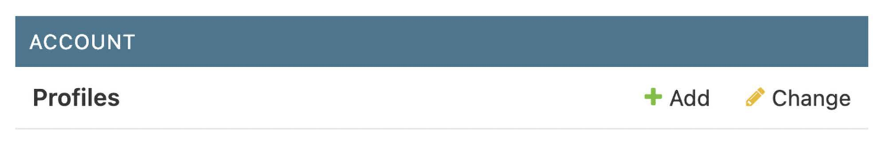

  **Figure 4.20**: The Account block on the administration site index page

</div>

5. **Manually Add Profile Objects:**  
   Click on the "Add" link next to Profiles in the admin panel. This opens a form that allows you to manually create Profile objects for each of the existing users in your database, ensuring that every user has an associated profile.

<div align="center">
  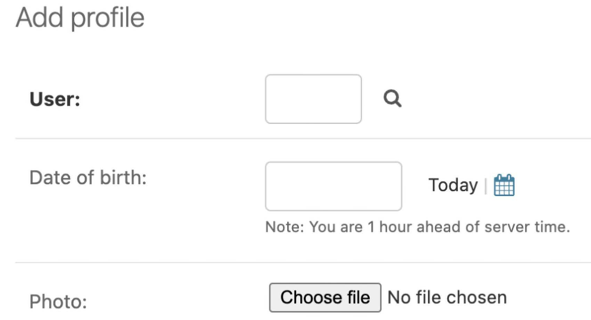

  **Figure 4.21**: The Add profile form

</div>

---

