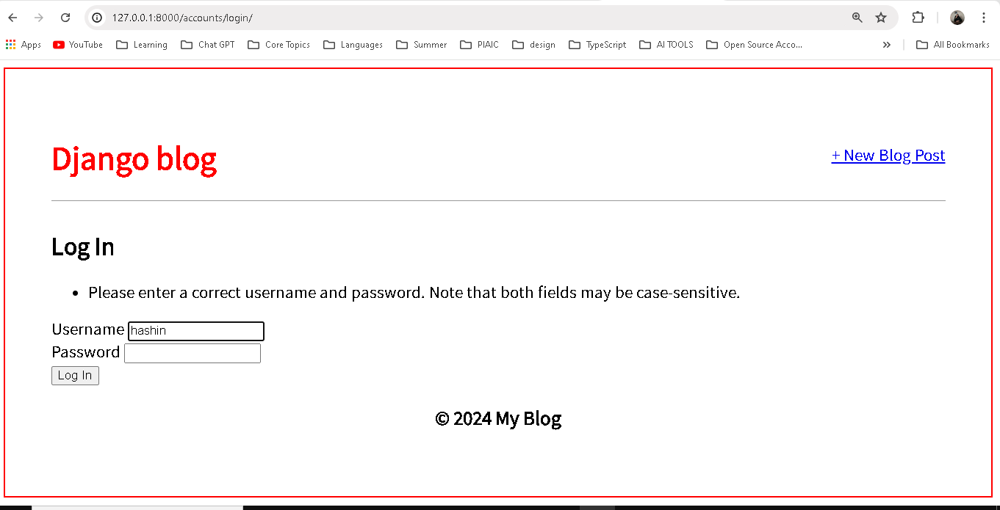
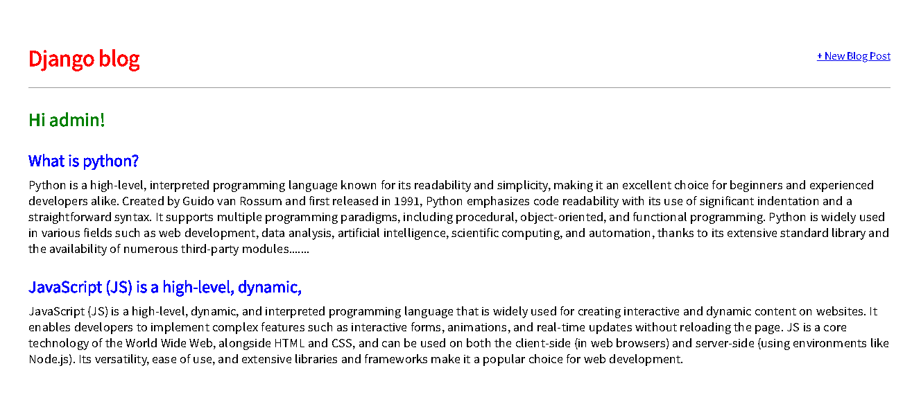
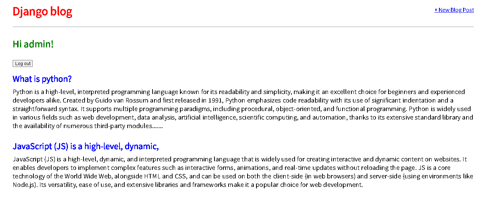
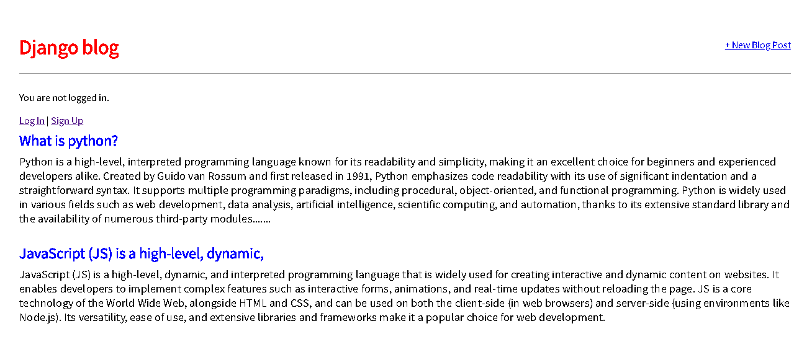
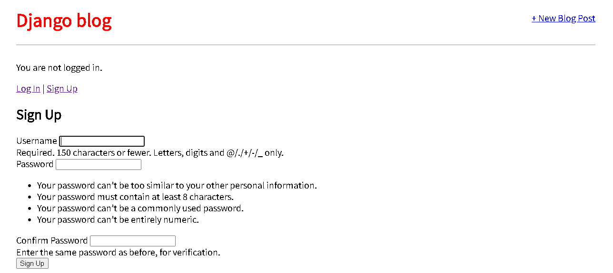
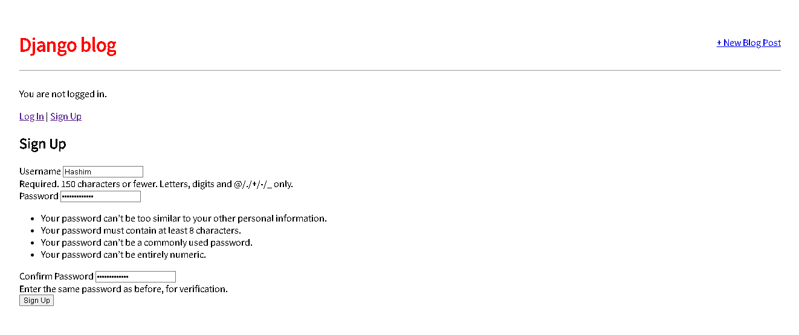

# User Accounts

So far, we’ve built a working blog application with forms, but we’re missing a major piece of most web applications: user authentication.

Implementing proper user authentication is famously hard; there are many security gotchas along the way, so you really don’t want to implement this yourself. Fortunately, Django comes with a powerful, built-in user authentication system that we can use and customize as needed.

Whenever you create a new project, by default Django installs the auth app, which provides us with a User object containing:
- username
- password
- email
- first_name
- last_name

We will use this User object to implement log in, log out, and sign up in our blog application.

## Log In

Django provides us with a default view for a log in page via [LoginView](https://docs.djangoproject.com/en/4.0/topics/auth/default/#django.contrib.auth.views.LoginView). All we need to add are a URL pattern for the auth system, a log in template, and a small update to our `django_project/settings.py` file.

First, update the `django_project/urls.py` file. We’ll place our log in and log out pages at the `accounts/` URL. This is a one-line addition on the next-to-last line.

### Code
```python
# django_project/urls.py
from django.contrib import admin
from django.urls import path, include

urlpatterns = [
    path("admin/", admin.site.urls),
    path("accounts/", include("django.contrib.auth.urls")), # new
    path("", include("blog.urls")),
]
```

As the LoginView documentation notes, by default Django will look within a templates directory called `registration` for a file called `login.html` for a log in form. So we need to create a new directory called `registration` and the requisite file within it. From the command line type `Control+c` to quit our local server. Then create the new directory.

### Shell
```shell
(.venv) > mkdir templates/registration
```

And then with your text editor create a new template file, `templates/registration/login.html`, filled with the following code:

### Code
```html
<!-- templates/registration/login.html -->


<h2>Log In</h2>
<form method="post">
    {{ form.non_field_errors }}
    <div>
        <label for="{{ form.username.id_for_label }}">Username</label>
        {{ form.username }}
        {{ form.username.errors }}
    </div>
    <div>
        <label for="{{ form.password.id_for_label }}">Password</label>
        {{ form.password }}
        {{ form.password.errors }}
    </div>
    <button type="submit">Log In</button>
</form>

```

We’re using HTML `<form></form>` tags and specifying the POST method since we’re sending data to the server (we’d use GET if we were requesting data, such as in a search engine form). We add `` for security concerns, namely to prevent a CSRF Attack. The form’s contents are explicitly rendered with labels, fields, and error messages.

The final step is we need to specify where to redirect the user upon a successful log in. We can set this with the `LOGIN_REDIRECT_URL` setting. At the bottom of the `django_project/settings.py` file add the following:

### Code
```python
# django_project/settings.py
LOGIN_REDIRECT_URL = "home" # new
```

Now the user will be redirected to the 'home' template, which is our homepage. And we’re actually done at this point! If you now start up the Django server again with `python manage.py runserver` and navigate to our log in page at `http://127.0.0.1:8000/accounts/login/`, you’ll see the following:



Upon entering the log in info for our superuser account, we are redirected to the homepage. Notice that we didn’t add any view logic or create a database model because the Django auth system provided both for us automatically. Thanks, Django!

### Updated Homepage

Let’s update our `base.html` template so we display a message to users whether they are logged in or not. We can use the `is_authenticated` attribute for this.

For now, we can simply place this code in a prominent position. Later on, we can style it more appropriately. Update the `base.html` file with new code starting beneath the closing `</header>` tag.

### Code
<!-- templates/base.html -->

<html>
  <head>
    <title>Django blog</title>
    <link
      href="https://fonts.googleapis.com/css?family=Source+Sans+Pro:400"
      rel="stylesheet"
    />
    <link href="" rel="stylesheet" />
  </head>
  <body>
    <div>
      <header>
        <div class="nav-left">
          <h1><a href="">Django blog</a></h1>
        </div>
        <div class="nav-right">
          <a href="">+ New Blog Post</a>
        </div>
      </header>
      
      <p style="font-size: 30px; font-weight: 600; color: green">
        Hi {{ user.username }}!
      </p>
      <form method="post" action="">
        
        <button type="submit">Log out</button>
      </form>
      
      <a href="">Log In</a> |
        
    </div>
  </body>
</html>
```

If the user is logged in, we say hello to them by name; if not, we provide a link to our newly created log in page.



It worked! My superuser name is admin so that’s what I see on the page.

### Log Out Link

We added template page logic for logged out users, but…how do we log out now? We could go into the Admin panel and do it manually, but there’s a better way. Let’s add a log out link instead that redirects to the homepage. Thanks to the Django auth system, this is dead-simple to achieve.

In our `base.html` file add a one-line `` link for logging out just below our user greeting.

### Code
```html
<!-- templates/base.html -->
 
      <p style="font-size: 30px; font-weight: 600; color: green">
        Hi {{ user.username }}!
      </p>
      <form method="post" action="">
        
        <button type="submit">Log out</button>
      </form>
      
      <p>You are not logged in.</p>
      <a href="">Log In</a> |
      <a href="">Sign Up</a>
      
```

That’s all we need to do as the necessary view is provided to us by the Django auth app. We do need to specify where to redirect a user upon log out, though.

Update `django_project/settings.py` to provide a redirect link which is called, appropriately, `LOGOUT_REDIRECT_URL`. We can add it right next to our log in redirect, so the bottom of the file should look as follows:

### Code
```python
# django_project/settings.py
LOGIN_REDIRECT_URL = "home"
LOGOUT_REDIRECT_URL = "home" # new
```

If you refresh the homepage, you’ll see it now has a “log out” link for logged-in users.



And clicking it takes you back to the homepage with a login link.



Go ahead and try logging in and out several times with your user account.

## Sign Up

We need to write our own view for a sign up page to register new users, but Django provides us with a form class, [UserCreationForm](https://docs.djangoproject.com/en/4.0/topics/auth/default/#django.contrib.auth.forms.UserCreationForm), to make things easier. By default, it comes with three fields: `username`, `password1`, and `password2`.

There are many ways to organize your code and URL structure for a robust user authentication system. Stop the local server with `Control+c` and create a dedicated new app, `accounts`, for our sign up page.

### Shell
```shell
python manage.py startapp accounts
```

Add the new app to the `INSTALLED_APPS` setting in our `django_project/settings.py` file.

### Code
```python
# django_project/settings.py
INSTALLED_APPS = [
    "django.contrib.admin",
    "django.contrib.auth",
    "django.contrib.contenttypes",
    "django.contrib.sessions",
    "django.contrib.messages",
    "django.contrib.staticfiles",
    "blog.apps.BlogConfig",
    "accounts", # new
]
```

Next, add a new URL path in `django_project/urls.py` pointing to this new app directly below where we include the built-in auth app.

### Code
```python
# django_project/urls.py
from django.contrib import admin
from django.urls import path, include

urlpatterns = [
    path("admin/", admin.site.urls),
    path("accounts/", include("django.contrib.auth.urls")),
    path("accounts/", include("accounts.urls")), # new
    path("", include("blog.urls")),
]
```

The order of our URLs matters here because Django reads this file top-to-bottom. Therefore, when we request the `/accounts/signup` URL, Django will first look in auth, not find it, and then proceed to the accounts app.

In your text editor, create a file called `accounts/urls.py` and add the following code:

### Code
```python
# accounts/urls.py
from django.urls import path
from .views import SignUpView
urlpatterns = [
    path("signup/", SignUpView.as_view(), name="signup"),
]
```

We’re using a not-yet-created view called `SignupView`, which we already know is class-based since it is capitalized and has the `as_view()` suffix. Its path is just `signup/`, so the overall URL path will be `accounts/signup/`.

Now for the view, which uses the built-in `UserCreationForm` and generic `CreateView`.

### Code
```python
# accounts/views.py
from django.contrib.auth.forms import UserCreationForm
from django.urls import reverse_lazy
from django.views.generic import CreateView

class SignUpView(CreateView):
    form_class = UserCreationForm
    success_url = reverse_lazy("login")
    template_name = "registration/signup.html"
```

We’re subclassing the generic class-based view `CreateView` in our `SignUpView` class. We specify the use of the built-in `UserCreationForm` and the not-yet-created template at `signup.html`. And we use `reverse_lazy` to redirect the user to the log in page upon successful registration.

Why use `reverse_lazy` here instead of `reverse`? The reason is that for all generic class-based views, the URLs are not loaded when the file is imported, so we have to use the lazy form of reverse to load them later when they’re available.

Now in your text editor create the file `signup.html` within the `templates/registration/` directory. Populate it with the code below.

### Code
```html
<!-- templates/registration/signup.html -->
 
<h2>Sign Up</h2>
<form method="post">
   {{ form.non_field_errors }}
  <div>
    <label for="{{ form.username.id_for_label }}">Username</label>
    {{ form.username }}
    <div>{{ form.username.help_text }}</div>
    {{ form.username.errors }}
  </div>
  <div>
    <label for="{{ form.password1.id_for_label }}">Password</label>
    {{ form.password1 }}
    <div>{{ form.password1.help_text }}</div>
    {{ form.password1.errors }}
  </div>
  <div>
    <label for="{{ form.password2.id_for_label }}">Confirm Password</label>
    {{ form.password2 }}
    <div>{{ form.password2.help_text }}</div>
    {{ form.password2.errors }}
  </div>
  <button type="submit">Sign Up</button>
</form>

```

This format is very similar to what we’ve done before. We extend our base template at the top, place our logic between `<form></form>` tags, use the `csrf_token` for security, display the form’s content with labels, fields, and error messages, and include a submit button.

We’re now done! To test it out, start up the local server with the command `python manage.py runserver` and navigate to `http://127.0.0.1:8000/accounts/signup/`.



Notice there is a lot of extra text that Django includes by default. We can customize this using something like the built-in [messages framework](https://docs.djangoproject.com/en/4.0/ref/contrib/messages/) but for now, try out the form.

I’ve created a new user called “Hashim” and upon submission was redirected to the log in page. Then after logging in successfully with my new user and password, I was redirected to the homepage with our personalized “Hi username” greeting.



Our ultimate flow is therefore: Signup -> Login -> Homepage. And of course, we can tweak this however we want. The `SignupView` redirects to login because we set `success_url = reverse_lazy('login')`. The Login page redirects to the homepage because in our `django_project/settings.py` file we set `LOGIN_REDIRECT_URL = 'home'`.

It can seem overwhelming at first to keep track of all the various parts of a Django project. That’s normal. But I promise with time they’ll start to make more sense.

### Sign Up Link

One last improvement we can make is to add a sign-up link to the logged-out homepage. We can’t expect our users to know the correct URL after all! How do we do this? Well, we need to figure out the URL name and then we can pop it into our template. In `accounts/urls.py` we provided it the name of `signup` so that’s all we need to add to our `base.html` template with the `url` template tag just as we’ve done for our other links.

Add the link for “Sign Up” just below the existing link for “Log In” as follows:

### Code
```html
<!-- templates/base.html -->

<p style="font-size: 30px; font-weight: 600; color: green">
  Hi {{ user.username }}!
</p>
<form method="post" action="">
  
  <button type="submit">Log out</button>
</form>

<p>You are not logged in.</p>
<a href="">Log In</a> |
<a href="">Sign Up</a>
  
```

If you refresh the logged-out homepage, the sign-up link is now visible. Much better!


### GitHub

It’s been a while since we made a git commit. Let’s do that and then push a copy of our code onto GitHub. First, check all the new work that we’ve done with `git status`.

### Shell
```shell
git status
```

Then add the new content and enter a commit message.

### Shell
```shell
git add .
git commit -m "forms and user accounts"
```

Create a new repo on GitHub which you can call anything you like. I’ll choose the name `blog`. Therefore, after creating the new repo on the GitHub site, I can type the following two commands. Make sure to replace my username `wsvincent` with your own from GitHub.

### Shell
```shell
git remote add origin https://github.com/HashimThePassionate/blog-user-account
git push -u origin main
```

All done!

## Static Files

Previously, we configured our static files by creating a dedicated `static` folder, pointing `STATICFILES_DIRS` to it in our `django_project/settings.py` file, and adding `` to our `base.html` template. But since Django won’t serve static files in production, we need a few extra steps now.

The first change is to use Django’s `collectstatic` command which compiles all static files throughout the project into a single directory suitable for deployment. Second, we must set the `STATIC_ROOT` configuration, which is the absolute location of these collected files, to a folder called `staticfiles`. And third, we need to set `STATICFILES_STORAGE`, which is the file storage engine used by `collectstatic`.

Here is what the updated `django_project/settings.py` file should look like:

### Code
```python
# django_project/settings.py
STATIC_URL = "/static/"
STATICFILES_DIRS = [BASE_DIR / "static"]
STATIC_ROOT = BASE_DIR / "staticfiles" # new
STATICFILES_STORAGE = "django.contrib.staticfiles.storage.StaticFilesStorage" # new
```

For formatting purposes, the last line is split in two, but it should be one single line in your text editor. Now run the command `python manage.py collectstatic`:

### Shell
```shell
DELL@Hashim MINGW64 ~/Desktop/New folder/blog-user-account (main)
$ python manage.py collectstatic
127 static files copied to 'C:\Users\DELL\Desktop\New folder\blog-user-account\staticfiles'.
```

If you look at your project folder now, you’ll see there’s a new `staticfiles` folder that contains `admin` and `css` folders. The `admin` is the built-in admin’s static files, while the `css` is the one we created. Before each new deployment, the `collectstatic` command must be run to compile them into this `staticfiles` folder used in production. Since this is an easy step to forget, it is often automated in larger projects, though doing so is beyond the scope of our current project.

While there are multiple ways to serve these compiled static files in production, the most common approach–and the one we will use here–is to introduce the [WhiteNoise](http://whitenoise.evans.io/en/stable/) package.

To start, install the latest version using pip:

### Shell
```shell
pipenv  install whitenoise==5.3.0
```

Then in `django_project/settings.py` there are three updates to make:
- add whitenoise to the `INSTALLED_APPS` above the built-in `staticfiles` app
- under `MIDDLEWARE` add a new line for `WhiteNoiseMiddleware`
- change `STATICFILES_STORAGE` to use WhiteNoise

The updated file should look as follows:

### Code
```python
# django_project/settings.py
INSTALLED_APPS = [
    "django.contrib.admin",
    "django.contrib.auth",
    "django.contrib.contenttypes",
    "django.contrib.sessions",
    "django.contrib.messages",
    "whitenoise.runserver_nostatic", # new
    "django.contrib.staticfiles",
    "blog",
    "accounts",
]

MIDDLEWARE = [
    "django.middleware.security.SecurityMiddleware",
    "django.contrib.sessions.middleware.SessionMiddleware",
    "whitenoise.middleware.WhiteNoiseMiddleware", # new
    "django.middleware.common.CommonMiddleware",
    ...
]

STATIC_URL = "/static/"
STATICFILES_DIRS = [BASE_DIR / "static"]
STATIC_ROOT = BASE_DIR / "staticfiles"
STATICFILES_STORAGE = "whitenoise.storage.CompressedManifestStaticFilesStorage" # new
```

The `STATICFILES_STORAGE` config should

 also be one line in your text editor. And since the method has changed, run `collectstatic` one more time to use whitenoise instead:

### Shell
```shell
python manage.py collectstatic
```

There will be a short warning, `This will overwrite existing files! Are you sure you want to do this?` Type “yes” and hit Enter. The collected static files are now regenerated in the same `staticfiles` folder using WhiteNoise.

Static files are quite confusing to newcomers, so as a brief recap here are the steps we’ve executed so far in our Blog site. First, for local development back in section 5, we created a top-level `static` folder and updated `STATICFILES_DIRS` to point to it. In this section, we added configurations for `STATIC_ROOT` and `STATICFILES_STORAGE` before running `collectstatic` for the first time, which compiled all our static files across the entire project into a single `staticfiles` folder. Finally, we installed whitenoise, updated `INSTALLED_APPS`, `MIDDLEWARE`, and `STATICFILES_STORAGE`, and re-ran `collectstatic`.

Most developers, myself included, have trouble remembering all these steps properly and rely on notes as a friendly reminder!

### Heroku Config

Now we come for the third time to deploying a website with Heroku. Our deployment checklist is as follows:
- install Gunicorn
- create a `requirements.txt` file
- update `ALLOWED_HOSTS` in `django_project/settings.py`
- create a `Procfile`
- create a `runtime.txt` file

Ready? Let’s begin. Install Gunicorn as the production web server:

### Shell
```shell
pipenv install gunicorn==20.1.0
```

Output the contents of the current virtual environment to a `requirements.txt` file.

### Shell
```shell
pip freeze > requirements.txt
```

Update the existing `ALLOWED_HOSTS` in `django_project/settings.py`.

### Code
```python
# django_project/settings.py
ALLOWED_HOSTS = [".herokuapp.com", "localhost", "127.0.0.1"] # new
```

And with your text editor, create both a new `Procfile` and `runtime.txt` file in the base directory next to the `manage.py` file.

### `Procfile`
```plaintext
web: gunicorn django_project.wsgi --log-file -
```

### `runtime.txt`
```plaintext
python-3.10.2
```

All set. We can commit our changes and push them up to GitHub.

### Shell
```shell
git status
git add .
git commit -m "Heroku config"
git push -u origin main
```

### Heroku Deployment

To deploy on Heroku, first confirm that you’re logged in to your existing Heroku account.

### Shell
```shell
heroku login
```

Then run the create command, which tells Heroku to make a new container for our app to live in. If you just run `heroku create`, then Heroku will assign you a random name; however, you can specify a custom name, but it must be unique on Heroku. In other words, since I’m picking the name `hashim-blog` you can’t. You need some other combination of letters and numbers.

### Shell
```shell
heroku create hashim-blog
```

Heroku runs Django’s `collectstatic` command automatically, which is why in the previous apps, where we had not configured static files, we told Heroku to disable this step with `heroku config:set DISABLE_COLLECTSTATIC=1`. But since we have configured static files, we’ll happily let this happen now as part of the deployment process.

The final step is to push our code to Heroku and add a web process so the dyno is running.

### Shell
```shell
git push heroku main
heroku ps:scale web=1
```

The URL of your new app will be in the command line output, or you can run `heroku open` to find it.

### SQLite vs PostgreSQL

So far in this book, we have been using the file-based SQLite database preconfigured by Django both locally and in deployment. It is much easier to configure and use than a server-based database. However, this convenience comes at a cost. Notably, Heroku has an ephemeral file system, so any changes to the `db.sqlite3` file in the cloud will be forgotten whenever a new deployment or server restart occurs. On the free tier we are using, server restarts can happen as often as every 24 hours.

That means that if you make changes to the database locally and push them to production, they will remain. However, if you make updates to the live website such as new blog entries or edits, they will not exist for very long. We need a standalone database engine to persist our data in the cloud, which we’ll cover in our next project.

## Conclusion

With a minimal amount of code, we have added log in, log out, and sign up to our Blog website. Under-the-hood, Django has taken care of the many security gotchas that can crop up if you try to create your own user authentication flow from scratch. We properly configured static files for production and deployed our website to Heroku. Good job!

In the next section, we’ll embark on the final major project of the book, a Newspaper site which uses a custom user model, advanced user registration flow, enhanced styling via Bootstrap, and email configuration. It also includes proper permissions and authorizations, environment variables, uses PostgreSQL as the production database, and more security improvements to our deployment process.
