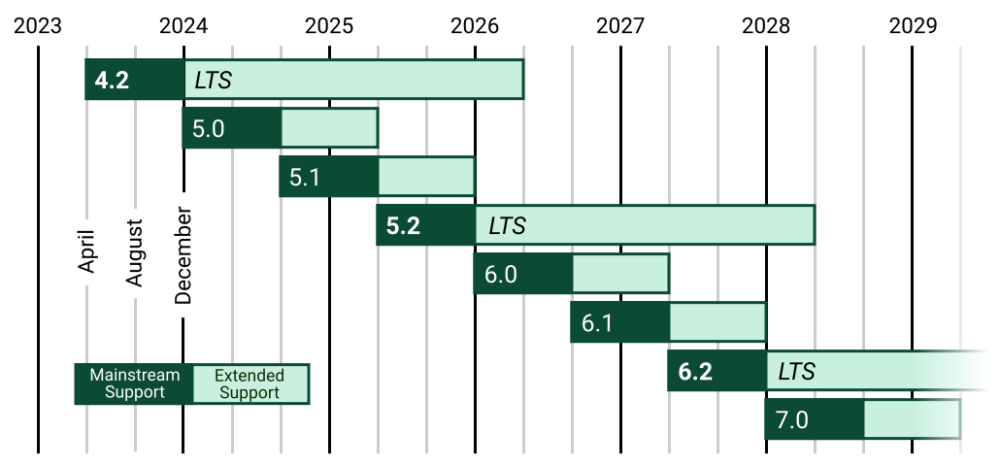

# Why Learn Django?

Django was initially created in the fall of 2003 at the Lawrence Journal-World newspaper and named after the famous jazz guitarist Django Reinhardt; it was released as a free, open-source project in July 2005. That makes it almost twenty years old now, quite mature in software terms, but it has continued to thrive and is arguably more vibrant today than ever before. Each week, double-digit new code submissions are accepted into the framework, monthly security and bugfix releases, and a major new release every eight months. A vast ecosystem of third-party packages provides additional functionality beyond the core framework.

Django is written in the wonderfully readable yet powerful Python programming language, arguably the most popular language in the world today. Python is the default choice in most undergraduate computer science curriculums, the dominant language for data science and artificial intelligence, and widely used in scientific research. Its ease of use and broad applicability make Python suitable for almost any task.

Django inherited Python’s “batteries-included” approach and includes a wide range of built-in features for routine tasks in web development, including:
- **ORM (Object-Relational Mapper):** write Python rather than raw SQL for creating and querying database tables.
- **Authentication:** a full-featured and secure system for user accounts, groups, permissions, and cookie-based user sessions.
- **Templating Engine:** a simple syntax for adding variables and logic to create dynamic HTML.
- **Forms:** a powerful form library that handles rendering and validation.
- **URL Routing:** a clean, elegant URL schema that is easy to maintain and reason about.
- **Admin Interface:** a visual way to interact with all website data, including users and database tables.
- **Internationalization:** multilingual support plus locale-specific formatting of dates, time, numbers, and time zones.
- **Security:** protection against SQL injection, cross-site scripting, cross-site request forgery, clickjacking, and remote code execution.

This approach allows web developers to focus on what makes a web application unique rather than reinventing the wheel every time. Millions of users have already used and tested the necessary code, so you know it will be secure and performant.

In contrast, some web frameworks like Flask adopt a microframework approach of providing only the bare minimum required for a simple webpage. Flask is far more lightweight than Django and allows maximum flexibility; however, this comes at a cost to the developer. Building a simple Flask website requires adding a dozen or more third-party packages, which may or may not be up-to-date, secure, or reliable. The lack of guardrails also means Flask’s project structure varies widely, which makes it difficult to maintain best practices when moving between different projects. Flask is a good choice for a web framework; it just has different strengths and weaknesses compared to a full-featured option like Django.

There is a saying among long-time Django developers, “Come for the framework, stay for the community.” And it is true! Django has an unusually warm and welcoming community for all levels of programmer, represented in annual volunteer-run DjangoCon conferences across multiple continents, an active forum for discussion, and regular meetups in major cities. Unlike other open-source projects run by companies or individuals, Django is organized as a non-profit organization via the Django Software Foundation, whose goal is to promote, support, and advance the web framework. Its Board of Directors is voted on annually by the community.

Millions of programmers have already used Django to build their websites, and millions more turn to it each year because it doesn’t make sense to reinvent the wheel when you can rely on a large community of brilliant developers who have already done the hard work for us.

## Prerequisites

You don’t need previous Python or web development experience to complete this section. Even someone new to programming and web development can follow along and feel the magic of writing web applications from scratch. However, familiarity with basic Python, HTML, and CSS will go a long way toward solidifying your understanding of core concepts. There are references throughout the section whenever Django differs from other web frameworks; the most obvious example is that Django adopts an MVT (Model-View-Template) approach slightly different from the dominant MVC (Model-View-Controller) pattern. We will cover these differences thoroughly once we start writing code.

## What’s New in Django 5

Django 5.0 was released in December 2023 and has official support for Python 3.10, 3.11, and 3.12. It’s important to note that Django’s versioning policy is time-based rather than feature-based. Roughly every eight months, a new feature release occurs, along with monthly bug fixes and security patches as needed. Django also follows the pattern of .0, .1, .2, and then back to .0 for feature releases, meaning you can expect Django 5.1 in August 2024, Django 5.2 in April 2025, Django 6.0 in December 2025, and so on. Django has such a large and active community of contributors that the decision was made years ago to focus on regular rollouts rather than wait for specific features to be completed.

Specific releases (those that end in .2, like Django 5.2 and 6.2) are designated as long-term support (LTS) releases and receive security and data loss fixes applied for a guaranteed period, typically three years. This policy is designed for larger companies struggling to keep up with Django’s rapid release schedule. Still, the best security policy is to be on the latest possible release rather than an LTS version if you can.

So, what’s new in Django 5.0? The most significant change is form field rendering, which is now greatly simplified. Facet filters were added to the admin to allow for easier UI filtering, database-computed default values are now possible, and there is official support for Python 3.10, 3.11, and 3.12. Django has gradually added asynchronous support over the years, and this release adds a new async function to the auth module that controls user authentication. But perhaps the most noticeable change for developers upgrading to the latest edition is that logout links must now be POST rather than GET requests.

Django is a mature web framework that strives to remain stable yet advance alongside the modern web. If you find yourself on a project with an older version of Django, there are detailed instructions for updating to the latest version.

  

### References

- Django Packages: [https://djangopackages.org/](https://djangopackages.org/)
- Flask: [https://flask.palletsprojects.com/en/3.0.x/](https://flask.palletsprojects.com/en/3.0.x/)
- Django Forum: [https://forum.djangoproject.com](https://forum.djangoproject.com)
- Django Software Foundation: [https://www.djangoproject.com/foundation/](https://www.djangoproject.com/foundation/)
- Django Versioning Policy: [https://www.djangoproject.com/download/#supported-versions](https://www.djangoproject.com/download/#supported-versions)
- Updating Django: [https://docs.djangoproject.com/en/stable/howto/upgrade/](https://docs.djangoproject.com/en/stable/howto/upgrade/)
