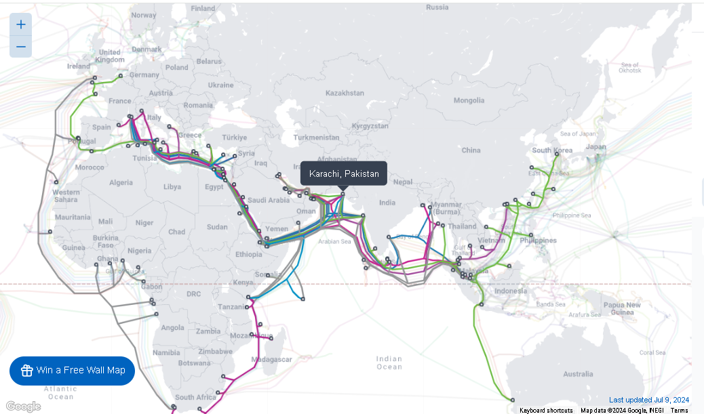
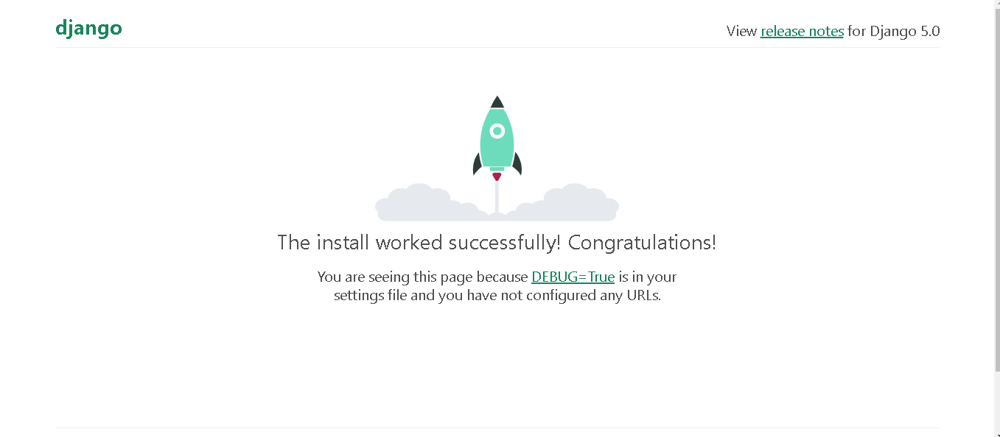
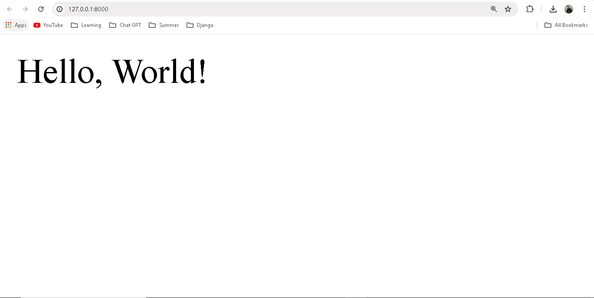

# Hello, World Website

In this section, we will review how websites and web frameworks work, examine Django’s architecture, and build a simple Django website that displays “Hello, World.” We will also examine two fundamental parts of Django, URL mappers, and views, and use Git for the first time. The complete source code for this and all future sections is available online at the official GitHub repo for the section.

## How the Internet Works

You probably use the Internet every day, but unless you are a web developer, you are unlikely to know the full details of what happens when you type an address like https://learndjango.com into your browser and press the return key. Underpinning this user experience is a complex network of communication protocols, web servers, and logic.

Computer science students typically take an entire course devoted to Network Communication, and there are network engineers who focus their careers on this one area. For our purposes as web developers, a general understanding is sufficient to get started, but if you eventually work on high-traffic websites, the details and nuance of network communication increasingly matter.

Underpinning the Internet is a network of connected machines called servers. These are special computers that don’t have a screen, a mouse, or a keyboard and typically live in data centers amongst racks and racks of other servers. In the old days, web developers had to run their own physical servers, but these days, it is far more common to rent space from a large hosting company instead, known colloquially as “the cloud.” One way to visualize this web of connected machines is via the [Submarine Cable Map](https://www.submarinecablemap.com/), an interactive display of the underwater cables connecting continents and countries.


Let’s trace what happens when you try to visit the website, https://learndjango.com. We can simplify it into six steps:

1. You enter a domain name into a browser.
2. The browser looks up the IP address for the domain name via DNS (Domain Name System).
3. The browser establishes a network connection to the web server.
4. The browser sends an HTTP request for the desired resource (e.g., the homepage).
5. The website processes the request (more on this below) and returns an HTTP response.
6. The browser begins rendering the webpage.

HTTP (Hypertext Transfer Protocol) is the set of rules computers use to communicate with one another over the Internet to power websites. It was created by Tim Berners-Lee, the inventor of the World Wide Web, who also created the HTML markup language and the URL system. Once an HTTP request has been received, the web browser sets about rendering the web page using HTML. Any additional resources required for a webpage or additional webpages undergo the same HTTP request and HTTP response cycle until a user leaves the website and the network connection is closed.

When you request a website like learndjango.com, your web browser first asks the DNS (Domain Name System) to translate the domain name into an IP (Internet Protocol) address, a unique numerical identifier computers use to find one another across the Internet. Once the web browser knows the IP address, it establishes a network connection with the server at that IP address containing the contents of the desired website. The browser sends an HTTP request for the desired resource (e.g., the homepage) and the server returns an HTTP response with its contents.

## How Web Frameworks Work

Websites come in two basic categories: static and dynamic. A static website consists of individual HTML documents where if your website has ten pages, you need ten individual HTML documents that can be served. This approach only works for very small sites. Most websites are dynamic, consisting of a database, HTML templates, and an application server that can generate files before sending them to your browser. With a dynamic website, a relatively small amount of code can generate hundreds or even thousands of web pages. Web frameworks like Django are designed for dynamic websites.

In the early days of the World Wide Web, developers had to hand code all the pieces of a dynamic website themselves, which was error-prone, often insecure, and not performant. Web frameworks like Django soon emerged to standardize this process. Web developers realized many tasks were routine and would be better performed and monitored by a community rather than individuals.

At its core, a web framework like Django has three main tasks:

1. Map URLs to view logic for rendering pages.
2. Provide an abstraction layer for interacting with a database.
3. Display HTML-like code via a templating system.

That’s it! While web frameworks are written in different programming languages and have slightly different design philosophies, their overall goal is essentially the same.

## Django Architecture

Now that we have reviewed how websites and web frameworks work let’s examine Django’s architecture. There are four main components to consider: URLs, views, models, and templates. Visually, the Django request and response cycle looks as follows where the solid lines represent required interactions and the dotted lines optional ones.

### Django Architecture

When an HTTP Request comes in from a Web Browser the first part of Django it engages with is the URL Dispatcher (`urls.py` file), which searches through configured URL patterns and stops at the first matching View (`views.py` file). The View assembles the requested data and styling before generating an HTTP Response back to the web browser. Technically, this is all we need. It is possible to have a Django website with just a URL Dispatcher and a View, as we will see later in the section.

It is more common, however, to have two more components involved: Model and Template. For a database-backed website, the View will interact with the Model (`models.py` file), which defines database tables, behaviors, and supports queries from the Database. This data is then sent back to the View, which in most cases then sends it to a Template for rendering. The Template is primarily an HTML file but can be in any text-based format, including XML and JSON. Once the View has all the necessary information, it returns an HTTP Response to the Web Browser.

This Django request/response cycle repeats for each new HTTP Request made by the Web Browser.

### Model-View-Controller vs Model-View-Template

If you have built websites before, you might be familiar with the Model-View-Controller (MVC) pattern used by many web frameworks, including Ruby on Rails, Spring (Java), Laravel (PHP), and ASP.NET (C#). This is a popular way to internally separate an application’s data and logic and display it into separate components that are easier for developers to reason about.

In the traditional MVC pattern, there are three major components:
- **Model**: Manages data and core business logic.
- **View**: Renders data from the model in a particular format.
- **Controller**: Accepts user input and performs application-specific logic.

Django’s approach is sometimes called Model-View-Template (MVT), but is more accurately a 4-part pattern incorporating URL configuration, Model-View-Template-URL (MVTU):
- **Model**: Manages data and core business logic.
- **View**: Describes which data is sent to the user but not its presentation.
- **Template**: Presents the data as HTML with optional CSS, JavaScript, and static assets.
- **URL Configuration**: Regular expression components configured to a View.

The “View” in MVC is analogous to a “Template” in Django, while the “Controller” in MVC is divided into a Django “View” and “URL dispatcher.”

If you are new to web development, the distinction between MVC and MVT will not matter much: this section demonstrates Django’s way of doing things. However, if you are a web developer with previous MVC experience, it can take a little while to shift your thinking to the “Django way,” which is more loosely coupled and allows for easier modifications than the MVC approach.

## Initial Set Up

For our first Django website, we will build a “Hello, World” website as simply as possible. Although most Django websites have a URL dispatcher, views, model, and template, technically, we only need a URL dispatcher and views. That’s what we’ll use here, but subsequent sections will introduce both templates and models.

To begin, open up a new command line shell or use the built-in terminal on VS Code. For the latter, click “Terminal” at the top and then “New Terminal” to bring it up at the bottom of the VS Code interface.

Make sure you are not in an existing virtual environment by checking that nothing is in parentheses before your command line prompt. You can even type deactivate to be entirely sure. Then, navigate to your desktop’s code directory and create a helloworld directory with the following commands.

```sh
# Windows
cd onedrive\desktop\code
mkdir helloworld
cd helloworld

# macOS
cd ~/desktop/code
mkdir helloworld
cd helloworld
```

Create a new virtual environment called `.venv`, activate it, and install Django with Pipenv, as we did in the previous section. We can also install Black now, too.

```sh
# Create and activate virtual environment using Pipenv
pipenv shell

# Install Django and Black
pipenv install django~=5.0.0
pipenv install black
```

Now, we’ll use the Django startproject command to create a new project called django_project. Remember to include the period (.) at the end of the command so that the project is installed in our current directory.

```sh
django-admin startproject django_project .
```

Let’s pause to examine the default project structure Django has provided. You can explore this visually by opening the new directory with your mouse on the desktop. The .venv directory may or may not be initially visible because it is a “hidden file” that is still there and contains information about our virtual environment.

```
django_project/
├── django_project
│ ├── __

init__.py
│ ├── asgi.py
│ ├── settings.py
│ ├── urls.py
│ └── wsgi.py
├── manage.py
```

Django has created a `django_project` directory and a `manage.py` file. Within `django_project`, there are five new files:
- `__init__.py` indicates that the files in the folder are part of a Python package. Without this file, we cannot import files from another directory, which we will do often in Django!
- `asgi.py` configures an optional ASGI (Asynchronous Server Gateway Interface) application.
- `settings.py` controls our Django project’s overall settings.
- `urls.py` tells Django which pages to build in response to a browser or URL request.
- `wsgi.py` configures a WSGI (Web Server Gateway Interface) application, the default setting for Django.

The `manage.py` file is not part of `django_project` but is used to execute various Django management commands, such as running the local web server or creating a new app.

Let’s try out our new project by executing `python manage.py runserver` to launch Django’s built-in web server. This server is suitable for development but not production. We will look deeper at production setups when we deploy websites later in the section.

```sh
python manage.py runserver
```

If you visit [http://127.0.0.1:8000/](http://127.0.0.1:8000/) you should see the following image:



Notice that a `db.sqlite3` file has been created in your project directory since we attempted to connect to SQLite for the first time. At the moment, it is empty.

```
django_project/
├── django_project
│ ├── __init__.py
│ ├── asgi.py
│ ├── settings.py
│ ├── urls.py
│ └── wsgi.py
├── db.sqlite3 # new
├── manage.py
```

## Migrations

On the command line, we still see that warning about 18 unapplied migrations; let’s explore now what is occurring. Migrations are special scripts Django creates automatically to track changes to the database. As a project grows over time, there are often many changes to the Django database models that define the structure of a database and all its tables. The Django migrations framework allows developers to track changes over time and change the database to match the configurations within a specific migrations file.

When you start a new project using the `startproject` command, Django includes several built-in apps (more on what an app is shortly) that make changes to the database, including admin, auth, contenttypes, and sessions. We can apply these changes to the local database using the management command, `migrate`. Type Control + c first to stop the local server.

```sh
python manage.py migrate
```

The `migrate` command applies all available migrations and lists them:

```sh
Operations to perform:
  Apply all migrations: admin, auth, contenttypes, sessions
Running migrations:
  Applying contenttypes.0001_initial... OK
  Applying auth.0001_initial... OK
  Applying admin.0001_initial... OK
  Applying admin.0002_logentry_remove_auto_add... OK
  Applying admin.0003_logentry_add_action_flag_choices... OK
  Applying contenttypes.0002_remove_content_type_name... OK
  Applying auth.0002_alter_permission_name_max_length... OK
  Applying auth.0003_alter_user_email_max_length... OK
  Applying auth.0004_alter_user_username_opts... OK
  Applying auth.0005_alter_user_last_login_null... OK
  Applying auth.0006_require_contenttypes_0002... OK
  Applying auth.0007_alter_validators_add_error_messages... OK
  Applying auth.0008_alter_user_username_max_length... OK
  Applying auth.0009_alter_user_last_name_max_length... OK
  Applying auth.0010_alter_group_name_max_length... OK
  Applying auth.0011_update_proxy_permissions... OK
  Applying auth.0012_alter_user_first_name_max_length... OK
  Applying sessions.0001_initial... OK
```

The `migrate` command applies all available migrations and lists them. The output includes the full name of each app and its migration script. For example, `Applying contenttypes.0001_initial... OK` indicates that migration script `0001_initial` in the `contenttypes` app was run successfully.

Restart the development server, and there will no longer be any warnings.

```sh
python manage.py runserver
```

The `db.sqlite3` file is now populated with built-in tables and data from Django. If you install the free SQLite viewer extension, [SQLite Viewer](https://marketplace.visualstudio.com/items?itemName=qwtel.sqlite-viewer), you can visually inspect them.

We will cover databases in more depth later in the section. At this stage, the important point is that Django uses migration files to control changes to the database, and the `migrate` management command applies them.

## Create An App

A Django project can contain many “apps,” an organizational technique for keeping our code clean and readable. Each app should control an isolated piece of functionality. If you take a look at the `django_project/settings.py` file, there are already six built-in apps Django has provided for us. They are located in the `django.contrib` directory and control functionality for the admin, auth, contenttypes, sessions, messages, and staticfiles. You don’t need to know what each one does at this point.

```python
# django_project/settings.py
INSTALLED_APPS = [
    "django.contrib.admin",
    "django.contrib.auth",
    "django.contrib.contenttypes",
    "django.contrib.sessions",
    "django.contrib.messages",
    "django.contrib.staticfiles",
]
```

Nothing is forcing the app convention–you could write all your code in a single file, if desired–but this convention of separating logic makes it much easier to structure and reason about a Django project. We use apps when we want to add functionality to the Django project. For example, an e-commerce site might have one app for user authentication, another for payments, and a third to power item listing details. How and when you split functionality into apps is very subjective, but a good rule of thumb is that when a single app feels like it’s doing too much, it is time to split features into separate apps, each with a single function.

To create a new app, go to the command line and quit the running server using Control + c. Then, use the `startapp` command followed by our app’s name. In this example, we will use the name “pages.” A best practice in Django is for app names to be plural–pages, payments, etc.–unless doing so does not make sense, such as for a “blog” app.

```sh
python manage.py startapp pages
```

If you look visually at the `django_project` directory, Django has created within it a new `pages` directory containing the following app files:

```
pages/
├── __init__.py
├── admin.py
├── apps.py
├── migrations
│ └── __init__.py
├── models.py
├── tests.py
└── views.py
```

Let’s review what each new `pages` app file does:
- `admin.py` is a configuration file for the built-in Django Admin app.
- `apps.py` is a configuration file for the app itself.
- `migrations/` keeps track of any changes to our `models.py` file so it stays in sync with our database.
- `models.py` is where we define our database models, which Django automatically translates into database tables.
- `tests.py` is for app-specific tests.
- `views.py` is where we handle the request/response logic for our web app.

Even though our new app exists within the Django project, Django doesn’t “know” about it until we explicitly add it to the `django_project/settings.py` file. In your text editor, open the file and scroll down to `INSTALLED_APPS`, where you’ll see six built-in Django apps. Add `pages` at the bottom.

```python
# django_project/settings.py
INSTALLED_APPS = [
    "django.contrib.admin",
    "django.contrib.auth",
    "django.contrib.contenttypes",
    "django.contrib.sessions",
    "django.contrib.messages",
    "django.contrib.staticfiles",
    "pages",  # new
]
```

## Your First View

We’ll create a static page for our first website that outputs the text “Hello, World!” This page does not involve a database or even a template file. Instead, it is a good introduction to how views and URLs work within Django.

A view is a Python function that accepts a Web request and returns a Web response. The response can be the HTML contents of a Web page, a redirect, a 404 error, an image, or almost anything. When a web page is requested, Django automatically creates a `HttpRequest` object that contains metadata about the request. Then Django loads the appropriate view, passing `HttpRequest` as the first parameter to the view function. The view is ultimately responsible for returning an `HttpResponse` object.

In our `pages` app, there is already a file called `views.py`, which comes with the following default text:

```python
# pages/views.py
from django.shortcuts import render

# Create your views here.
```

We will take a proper look at `render` in the next section

, but for now, update the `pages/views.py` file with the following code:

```python
# pages/views.py
from django.http import HttpResponse

def home_page_view(request):
    return HttpResponse("Hello, World!")
```

Let’s step through it line-by-line:
- Import the class `HttpResponse` from the `django.http` module.
- Define a function called `home_page_view`. In Python, it is customary to use snake_case–all lowercase words separated by underscores–for function and variable names.
- The first parameter passed into a view is the `HttpRequest` object. It is a convention to name it `request` for readability, but the order is what matters, not the name, so you could technically call it `req` or any other name and it would still work.
- The view returns an `HttpResponse` object with the string of text “Hello, World!”

All views work this way: first, you define a name for the view, name the `HttpRequest` object (`request` in this case), and then return something. Adding more logic and parameters to views is possible, but the general pattern is the same.

## URL Dispatcher

With our view in place, it is time to configure a related URL. In your text editor, create a new file called `urls.py` within the `pages` app and update it with the following code:

```python
# pages/urls.py
from django.urls import path
from .views import home_page_view

urlpatterns = [
    path("", home_page_view),
]
```

On the top line, we import `path` from Django to power our URL pattern. By referring to the `views.py` file as `.views`, we are telling Django to look within the current directory for a `views.py` file and import the view named `home_page_view`. Note the lack of a leading slash `/` in the path pattern. Django automatically prefixes the leading slash for us.

Our URL pattern here has two parts:
- the route itself, here defined by the empty string, ""
- a reference to the view `home_page_view`

In other words, if the user requests the homepage represented by the empty string, "", Django should use the view called `home_page_view`.

We’re almost done at this point. The last step is to update our `django_project/urls.py` file, the gateway to other URL patterns distinct from each app. This architectural pattern will make more sense as we build increasingly complex web applications later in the section.

Django automatically imports and sets a path for the built-in admin. To include additional URL paths, we import the function `include` from the `django.urls` module, and then set its path. In this case, we again use the empty string, "", and include all URLs contained in the `pages` app.

Here is what the updated code looks like:

```python
# django_project/urls.py
from django.contrib import admin
from django.urls import path, include  # new

urlpatterns = [
    path("admin/", admin.site.urls),
    path("", include("pages.urls")),  # new
]
```

Now, whenever a user visits the homepage, represented by the empty string here, "", Django will look within the `pages` app for matching URL routes.

We have all the code we need. To confirm everything works as expected, restart our Django server:

```sh
python manage.py runserver
```

If you refresh the browser for [http://127.0.0.1:8000/](http://127.0.0.1:8000/), it will now display the text “Hello, World!”



And that’s it! We’ve created a Django project from scratch and had our first interactions with Django’s architecture and typical pattern:
- Creating a project and then an app within it.
- Writing a view.
- Connecting the view to a URL dispatcher.

It is possible to be clever and write a Django “Hello, World” app in fewer lines of code and even in a single file: see the repository [django-microframework](https://github.com/wsvincent/django-microframework) if you’re curious to learn more. But it’s more important to start internalizing typical Django project structure and patterns at this stage.

## Git

In the previous section, we installed the version control system Git. Let’s use it here. The first step is initializing (or adding) Git to our repository. Make sure you’ve stopped the local server with Control + c, then run the command `git init`.

```sh
git init
```

If you type `git status` you’ll see a list of changes since the last Git commit. Since this is our first commit, this list includes the contents of the entire directory.

```sh
git status
```

Note that the virtual environment, `Pipfile.lock`, is included. It is a best practice not to include your virtual environment in Git source control since it may contain secret information such as API keys.

The solution is to create a new file in the project-level directory called `.gitignore`, which tells Git what to ignore. The period at the beginning indicates this is a “hidden” file. The file still exists, but it is a way to communicate to developers that its contents are probably meant for configuration and not source control.

Here is how your project structure should look now:

```
django_project/
├── django_project
│ ├── __init__.py
│ ├── asgi.py
│ ├── settings.py
│ ├── urls.py
│ └── wsgi.py
├── pages
│ ├── __init__.py
│ ├── admin.py
│ ├── apps.py
│ ├── migrations
│ │ └── __init__.py
│ ├── models.py
│ ├── tests.py
│ ├── urls.py
│ └── views.py
├── .gitignore  # new
├── db.sqlite3
├── manage.py
```

In this new `.gitignore` file, add a single line for `.venv`.

```
Pipfile
Pipfile.lock
```

If you run `git status` again, you will see that `Pipfile` and `Pipfile.lock`  is no longer there. It has been “ignored” by Git. In professional projects, a `.gitignore` file is typically quite lengthy. For efficiency and security reasons, there are often quite a few directories and files that should be removed from source control. However, optimization is not relevant to learning projects such as this.

At the same time, we do want a record of packages installed in our virtual environment. The current best practice is to create a `requirements.txt` file with this information. The command `pip freeze` will output the contents of your current virtual environment, and by using the `>` operator, we can do all this in one step: output the contents into a new file called `requirements.txt`. If your server is still running, enter Ctrl + c and Enter to exit before entering this command.

```sh
pip freeze > requirements.txt
```

A new `requirements.txt` file will appear with all our installed packages and their dependencies. If you look inside this file, you’ll see nine packages even though we have installed only two: Django and Black. That’s because Django and Black also depend on other packages. It is often the case that when you install one Python package, you’re also installing multiple dependent packages. Since keeping track of all the packages is difficult, a `requirements.txt` file is critical.

```
asgiref==3.8.1
black==24.4.2
click==8.1.7
colorama==0.4.6
Django==5.0.7
mypy-extensions==1.0.0
packaging==24.1
pathspec==0.12.1
platformdirs==4.2.2
sqlparse==0.5.1
tzdata==2024.1
```

Next, we want to perform our first Git commit to store all the recent changes. Git has a lengthy list of options/flags. For example, to add all recent changes, we can use `git add .`. Then, to commit the changes, we will use a `-m` flag (“message”) to describe what has changed. It is very important to always add a message to your commits since most projects will easily have hundreds, if not thousands, of commits. Adding a descriptive message each time helps debug efforts later since you can search through your commit history.

```sh
git add .
git commit -m "initial commit"
```

## Conclusion

Congratulations! This section covered a lot of material, starting with how the Internet and web frameworks work and progressing on to Django’s architecture. We then built our first Django website while learning about apps, views, URLs, and the internal Django web server. We also worked with Git to track our changes, create a `.gitignore` file, and generate a `requirements.txt` file.

Please continue to the next section, where we’ll build a more complex Django application using templates and more advanced function-based views while also incorporating testing.