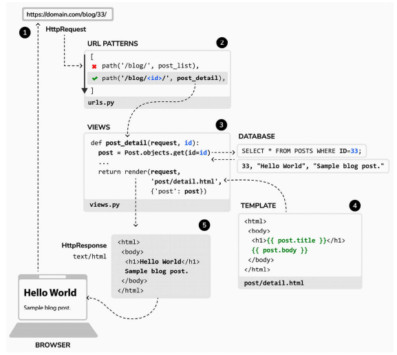

# 📝 **Creating List and Detail Views** ✨

This guide explains how to create **list** and **detail views** for a blog application, including URL patterns, templates, the request/response cycle, and styling with `blog.css`.

---

## 📚 Table of Contents

1. ✨ [What Are Views?](#-what-are-views)  
2. 🛠 [Creating the Post List View](#-creating-the-post-list-view)  
3. 🖋️ [Creating the Post Detail View](#-creating-the-post-detail-view)  
4. 🔗 [Adding URL Patterns](#-adding-url-patterns)  
5. 📝 [Creating Templates](#-creating-templates)  
6. 🎨 [Styling with blog.css](#-styling-with-blogcss)  
7. 🔍 [Request/Response Cycle](#-requestresponse-cycle)  
8. 🌟 [Best Practices](#-best-practices)  

---

## ✨ What Are Views?

In Django, a **view** is a Python function or class-based view (CBV) that takes a **request** and returns a **response**. Views are responsible for:
- Fetching data from the database (using models).
- Passing data to templates.
- Returning an HTTP response (usually HTML).

---

## 🛠 Creating the Post List View

The **post list view** displays a list of published blog posts.

### Implementation

Edit the `views.py` file of your `blog` application and add the following code:

```python
from django.shortcuts import render
from .models import Post

def post_list(request):
    posts = Post.published.all()  # Retrieve all posts with status=PUBLISHED
    return render(
        request, 
        'blog/post/list.html',  # Specify the template
        {'posts': posts}  # Pass the posts as context
    )
```

**Explanation:**
- The `Post.published.all()` retrieves all posts with a `PUBLISHED` status using the custom manager.
- The `render()` function generates the HTML content by combining the data (context) and template.

---

## 🖋️ Creating the Post Detail View

The **post detail view** displays a single blog post based on its ID.

### Implementation

#### Using `get_object_or_404`
```python
from django.shortcuts import get_object_or_404, render

def post_detail(request, id):
    post = get_object_or_404(
        Post,
        id=id,
        status=Post.Status.PUBLISHED  # Ensure the post is published
    )
    return render(
        request, 
        'blog/post/detail.html', 
        {'post': post}
    )
```

**Explanation:**
- The `get_object_or_404()` retrieves a post by its `id` and raises an `Http404` exception if not found.

---

## 🔗 Adding URL Patterns

URL patterns map URLs to views. Inside the `blog` directory:

```python
from django.urls import path
from . import views

app_name = 'blog'  # Namespace
urlpatterns = [
    path('', views.post_list, name='post_list'),
    path('<int:id>/', views.post_detail, name='post_detail'),
]
```

Include these URLs in the project's `urls.py` file:
```python
from django.urls import include, path

urlpatterns = [
    path('admin/', admin.site.urls),
    path('blog/', include('blog.urls', namespace='blog')),  # Include blog URLs
]
```

---

## 📝 Creating Templates

Create the directory structure:
```
blog/
  templates/
    blog/
      base.html
      post/
        list.html
        detail.html
```

### Base Template (`base.html`)

Defines the site's main structure:
```html
<!DOCTYPE html>

<html>
<head>
    <title>Blog</title>
    <link href="" rel="stylesheet">
</head>
<body>
    <div id="content">
        
    </div>
    <div id="sidebar">
        <h2>My Blog</h2>
        <p>Explore insightful posts!</p>
    </div>
</body>
</html>
```

### Post List Template (`list.html`)

Displays a list of posts:
```html


    <h1>My Blog</h1>
    
        <div class="post">
            <h2><a href="">{{ post.title }}</a></h2>
            <p class="date">Published {{ post.publish }} by {{ post.author }}</p>
            <p>{{ post.body|truncatewords:30 }}</p>
        </div>
    

```

### Post Detail Template (`detail.html`)

Displays a single post:
```html


    <div class="post-detail">
        <h1>{{ post.title }}</h1>
        <p class="date">Published {{ post.publish }} by {{ post.author }}</p>
        <div class="post-body">{{ post.body|linebreaks }}</div>
    </div>

```

---

## 🎨 Styling with `blog.css`

Create a `static/css/blog.css` file and add the following styles:

```css
/* General Styles */
body {
    font-family: Arial, sans-serif;
    line-height: 1.6;
    background: #f8f9fa;
    color: #333;
    margin: 0;
    padding: 0;
}

#content {
    width: 75%;
    margin: 20px auto;
    background: #fff;
    padding: 20px;
    box-shadow: 0 0 10px rgba(0, 0, 0, 0.1);
    border-radius: 8px;
}

#sidebar {
    background: #0b57d0;
    color: #fff;
    padding: 15px;
    border-radius: 8px;
}

h1, h2 {
    color: #0b57d0;
}

.post {
    margin-bottom: 20px;
    padding-bottom: 10px;
    border-bottom: 1px solid #ddd;
}

.post h2 a {
    text-decoration: none;
    color: #333;
}

.post h2 a:hover {
    color: #0b57d0;
}

.post .date {
    font-size: 0.9em;
    color: #777;
}

.post-detail h1 {
    font-size: 2.5em;
    margin-bottom: 10px;
}

.post-detail .date {
    font-size: 0.9em;
    color: #888;
}
```

---

## 🔍 Request/Response Cycle

### Diagram in Markdown

<div align="center">

</div>

```plaintext
1. HttpRequest
   └── Browser sends a request to https://domain.com/blog/33/.

2. URL Patterns
   └── Matches `path('<int:id>/', post_detail)` in `urls.py`.

3. Views
   └── Executes `post_detail()` in `views.py`.
       └── Fetches the post from the database: `SELECT * FROM posts WHERE id=33`.

4. Template
   └── Renders `post/detail.html` with the context variable `post`.

5. HttpResponse
   └── Returns the rendered HTML back to the browser.
```

---

## 🌟 Best Practices

1. **Dynamic URLs:**
   - Use `` in templates instead of hardcoding URLs.
   - Example: ``.

2. **Error Handling:**
   - Use `get_object_or_404()` to handle missing objects gracefully.

3. **Template Reusability:**
   - Use a `base.html` template for shared structures (e.g., header, footer).

4. **Responsive Design:**
   - Ensure the blog is mobile-friendly by adding media queries in `blog.css`.

